# 模块 1 - 探索用于数据工程工作负载的计算和存储选项

此模块介绍用于构造 Data Lake 以及优化用于探索、流式处理和批处理工作负载的文件的方法。学生将学习在通过批处理和流式处理转换文件时如何将 Data Lake 整理到数据细化级别。他们将了解如何对其数据集（例如 CSV、JSON 和 Parquet 文件）创建索引，并将这些索引用于潜在的查询和工作负载加速。

在本模块中，学生将能够：

- 将流式处理和批处理与单个管道相结合
- 将 Data Lake 组织成文件转换级别
- 为 Data Lake Storage 创建索引以用于查询和工作负载加速

## 实验室详细信息

- [模块 1 - 探索用于数据工程工作负载的计算和存储选项](#module-1---explore-compute-and-storage-options-for-data-engineering-workloads)
  - [实验室详细信息](#lab-details)
  - [实验室 1 - Delta Lake 体系结构](#lab-1---delta-lake-architecture)
    - [动手实验室准备工作](#before-the-hands-on-lab)
      - [任务 1：创建并配置 Azure Databricks 工作区](#task-1-create-and-configure-the-azure-databricks-workspace)
    - [练习 1：完成实验室笔记本](#exercise-1-complete-the-lab-notebook)
      - [任务 1：克隆 Databricks 存档](#task-1-clone-the-databricks-archive)
      - [任务 2：完成以下笔记本](#task-2-complete-the-following-notebook)
  - [实验室 2 - 在 Synapse Analytics 中使用 Apache Spark](#lab-2---working-with-apache-spark-in-synapse-analytics)
    - [动手实验室准备工作](#before-the-hands-on-lab-1)
      - [任务 1：创建并配置 Azure Synapse Analytics 工作区](#task-1-create-and-configure-the-azure-synapse-analytics-workspace)
      - [任务 2：为本实验室创建并配置其他资源](#task-2-create-and-configure-additional-resources-for-this-lab)
    - [练习 1：使用 Spark 加载数据](#exercise-1-load-and-data-with-spark)
      - [任务 1：使用 Hyperspace 为 Data Lake Storage 创建索引](#task-1-index-the-data-lake-storage-with-hyperspace)
      - [任务 2：通过 MSSparkUtil 库浏览 Data Lake Storage](#task-2-explore-the-data-lake-storage-with-the-mssparkutil-library)
    - [资源](#resources)

## 实验室 1 - Delta Lake 体系结构

在此实验室中，你将使用 Azure Databricks 工作区，并通过使用 Delta Lake 执行批处理作业的结构化流。你需要在 Databricks 笔记本中完成练习。首先，你需要有权访问 Azure Databricks 工作区。如果没有可用的工作区，请按照以下说明进行操作。若有，可跳到页面底部来[克隆 Databricks 存档](#clone-the-databricks-archive)。

### 动手实验室准备工作

> **备注：** 如果**不**使用托管实验室环境，而使用你自己的 Azure 订阅，则仅完成 `Before the hands-on lab` 步骤。否则，请跳转到练习 1。

在分步完成此实验室中的练习时，请确保可访问具有可用群集的 Azure Databricks 工作区。执行以下步骤以配置工作区。

#### 任务 1：创建并配置 Azure Databricks 工作区

**如果不使用托管实验室环境**，请按照[实验室 01 设置说明](https://github.com/solliancenet/microsoft-data-engineering-ilt-deploy/blob/main/setup/01/lab-01-setup.md)手动创建并配置工作区。

### 练习 1：完成实验室笔记本

#### 任务 1：克隆 Databricks 存档

1. 如果当前没有打开 Azure Databricks 工作区：在 Azure 门户中，导航到已部署的 Azure Databricks 工作区并选择 **“启动工作区”**。
1. 在左窗格中，依次选择 **“工作区”** > **“用户”**，然后选择用户名（带房屋图标的条目）。
1. 在显示的窗格中，选择名称旁边的箭头，然后选择 **“导入”**。

  

1. 在 **“导入笔记本”** 对话框中，选择 URL 并粘贴以下 URL：

 ```
  https://github.com/solliancenet/microsoft-learning-paths-databricks-notebooks/blob/master/data-engineering/DBC/11-Delta-Lake-Architecture.dbc?raw=true
 ```

1. 选择 **“导入”**。
1. 选择显示的 **11-Delta-Lake-Architecture** 文件夹。

#### 任务 2：完成以下笔记本

打开 **1-Delta-Architecture** 笔记本。确保将群集附加到笔记本上，然后按照说明在笔记本中运行单元格。

在笔记本中，你将了解如何将流式处理和批处理与单个管道相结合。

> 完成笔记本后，返回到此屏幕，并前往下一个实验室。

## 实验室 2 - 在 Synapse Analytics 中使用 Apache Spark

此实验室将演示如何在 Azure Synapse Analytics 中使用 Apache Spark。你将了解如何使用链接服务将 Azure Synapse Analytics 工作区连接到 Azure 数据资源管理器工作区，然后使用 Spark 笔记本从其中一个数据库加载数据。此外，还将学习如何使用 Hyperspace 和 MSSparkUtil 等库，以优化使用 Spark 笔记本中的 Data Lake Storage 帐户的体验。除了数据资源管理器和 Data Lake Storage，数据扩充过程还将使用来自 SQL 池的历史数据。最后，你将学习如何将扩充的数据发布回 Data Lake，并通过 SQL 内置池和 Power BI 使用它。

完成本实验室后，你将理解在 Azure Synapse Analytics 工作区中使用 Spark 的端到端数据扩充过程的主要步骤。

### 动手实验室准备工作

> **备注：** 如果**不**使用托管实验室环境，而使用你自己的 Azure 订阅，则仅完成 `Before the hands-on lab` 步骤。否则，请跳转到练习 1。

在分步完成此实验室中的练习之前，请确保你已正确配置了 Azure Synapse Analytics 工作区。执行以下步骤以配置工作区。

#### 任务 1：创建并配置 Azure Synapse Analytics 工作区

>**备注**
>
>如果在运行该存储库中提供的另一个实验室时已经创建并配置了 Synapse Analytics 工作区，则不得再次执行此任务，并且可以继续执行下一个任务。实验室设计为共享 Synapse Analytics 工作区，因此只需要创建一次该工作区。

**如果不使用托管实验室环境**，请按照[部署 Azure Synapse Analytics 工作区](https://github.com/solliancenet/microsoft-data-engineering-ilt-deploy/blob/main/setup/01/asa-workspace-deploy.md)中的说明创建并配置工作区。

#### 任务 2：为本实验室创建并配置其他资源

**如果未使用托管实验室环境**，请按照[为实验室 02 部署资源](https://github.com/solliancenet/microsoft-data-engineering-ilt-deploy/blob/main/setup/01/lab-02-deploy.md)中的说明，为本实验室部署其他资源。部署完成后，便可以继续本实验室中的练习。

### 练习 1：使用 Spark 加载数据

#### 任务 1：使用 Hyperspace 为 Data Lake Storage 创建索引

从 Azure Data Lake Gen 2 加载数据时，搜索数据是最消耗资源的操作之一。[Hyperspace](https://github.com/microsoft/hyperspace) 为 Apache Spark 用户引入了在其数据集（如 CSV、JSON 和 Parquet）上创建索引的能力，并将它们用于潜在的查询和工作负载加速。

通过 Hyperspace 可以对从持久数据文件扫描的记录创建索引。成功创建后，对应于索引的条目将添加到 Hyperspace 的元数据中。Apache Spark 的优化器稍后会在查询处理期间使用此元数据来查找并使用正确的索引。如果基础数据发生变化，可以刷新现有索引以捕获该数据。

此外，用户可以使用 Hyperspace 在运行查询之前将他们的原始计划与更新之后依赖索引的计划进行比较。

1. 打开 Synapse Studio (<https://web.azuresynapse.net/>)。

2. 选择 **“开发”** 中心。

    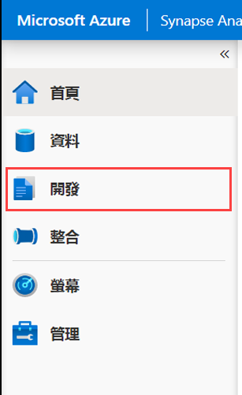

3. 依次选择 **“+”** 和 **“笔记本”**，以创建新的 Synapse 笔记本。

    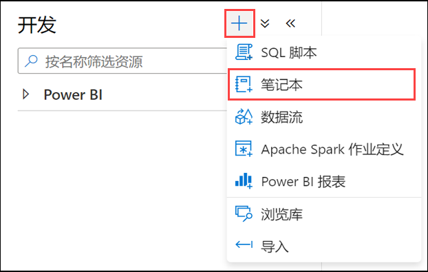

4. 输入 **Hyperspace** 作为笔记本名称 **(1)**， 然后选择上方的 **“属性”** 按钮 **(2)**， 以隐藏属性窗格。

    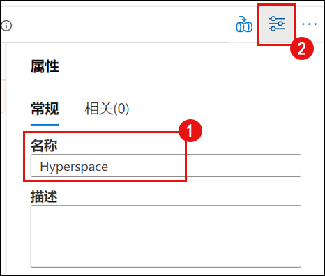

5. 将笔记本附加到 Spark 群集，并确将保语言设置为 **PySpark (Python)**。

    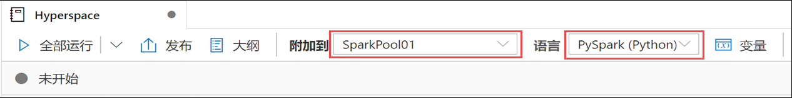

6. 将以下代码添加到笔记本中的新单元格：

    ```python
    from hyperspace import *  
    from com.microsoft.hyperspace import *
    from com.microsoft.hyperspace.index import *

    # 禁用 BroadcastHashJoin，则 Spark 将使用标准 SortMergeJoin。目前，Hyperspace 索引利用 SortMergeJoin 来加速查询。
    spark.conf.set("spark.sql.autoBroadcastJoinThreshold", -1)

    # 将下面的值替换为 Synapse 工作区的 ADLS Gen2 主帐户的名称
    datalake = 'REPLACE_WITH_YOUR_DATALAKE_NAME'

    dfSales = spark.read.parquet("abfss://wwi-02@" + datalake + ".dfs.core.windows.net/sale-small/Year=2019/Quarter=Q4/Month=12/*/*.parquet")
    dfSales.show(10)

    dfCustomers = spark.read.load("abfss://wwi-02@" + datalake + ".dfs.core.windows.net/data-generators/generator-customer-clean.csv", format="csv", header=True)
    dfCustomers.show(10)

    # 创建 Hyperspace 实例
    hyperspace = Hyperspace(spark)
    ```

    将 `REPLACE_WITH_YOUR_DATALAKE_NAME` 值替换为 Synapse 工作区的 ADLS Gen2 主帐户的名称。要找到它，请执行以下步骤：

    1. 导航到 **“数据”** 中心。

        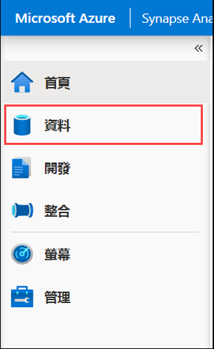

    2. 选择 **“链接”** 选项卡 **(1)**， 展开 Azure Data Lake Storage Gen2 组，然后记下工作区名称旁边的主要 ADLS Gen2 名称 **(2)**。

        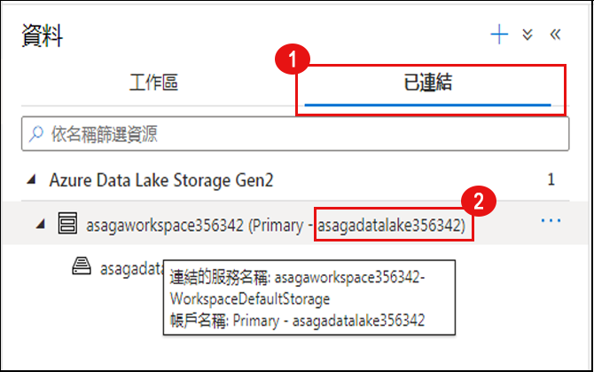

7. 运行新单元格。它将使用来自 Data Lake 的数据加载两个 DataFrame，并初始化 Hyperspace。

    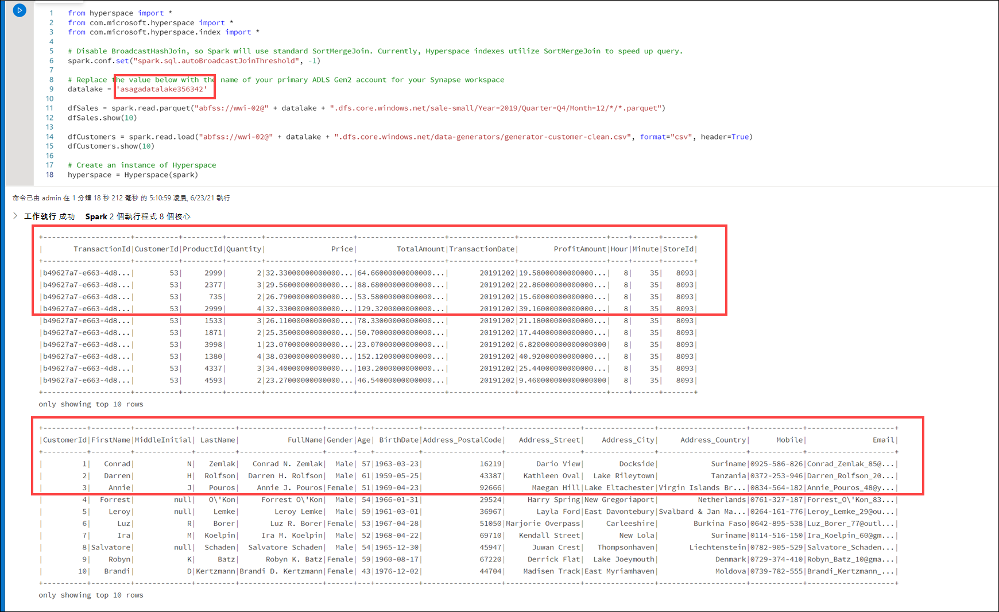

    > **备注**： 可以选择单元格左侧的“运行”按钮，或输入 `Shift+Enter` 以执行单元格并在下方创建新单元格。
    >
    > 由于必须启动新的 Spark 群集，首次在笔记本中执行单元格将花几分钟的时间。每个后续单元格执行都必须更快。

8. 使用以下代码将新的代码单元格添加到笔记本中：

    ```python
    # 创建索引：每个索引都包含一个名称、一组索引列和一组包含的列
    indexConfigSales = IndexConfig("indexSALES", ["CustomerId"], ["TotalAmount"])
    indexConfigCustomers = IndexConfig("indexCUSTOMERS", ["CustomerId"], ["FullName"])

    hyperspace.createIndex(dfSales, indexConfigSales)			# 只需创建一次索引
    hyperspace.createIndex(dfCustomers, indexConfigCustomers)	# 只需创建一次索引
    hyperspace.indexes().show()
    ```

9. 运行新单元格。将创建两个索引并显示其结构。

    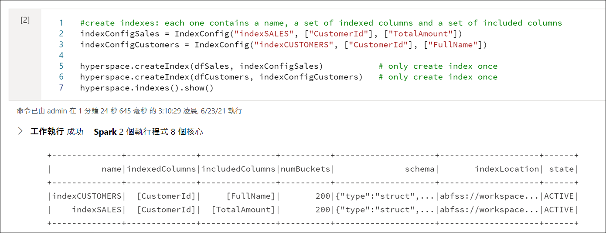

10. 使用以下代码将另一个新的代码单元格添加到笔记本中：

    ```python
    df1 = dfSales.filter("""CustomerId = 200""").select("""TotalAmount""")
    df1.show()
    df1.explain(True)
    ```

11. 运行新单元格。输出将显示物理执行计划没有考虑任何索引（对原始数据文件执行文件扫描）。

    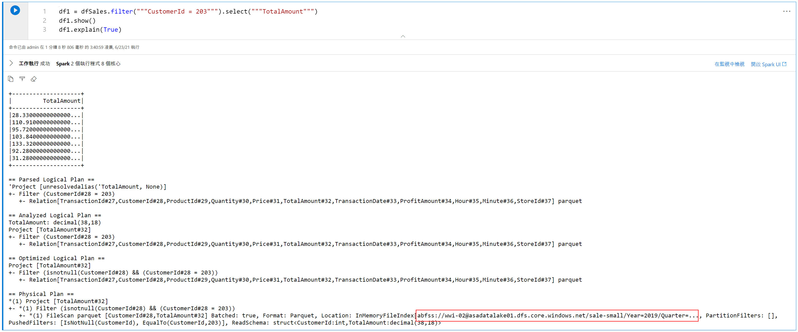

12. 现在，使用以下代码将另一个新单元格添加到笔记本中（注意开头额外的一行，用于在 Spark 引擎中启用 Hyperspace 优化）：

    ```python
    # 启用 Hyperspace - Hyperspace 优化规则对 Spark 优化器可见，并利用现有的 Hyperspace 索引来优化用户查询
    Hyperspace.enable(spark)
    df1 = dfSales.filter("""CustomerId = 200""").select("""TotalAmount""")
    df1.show()
    df1.explain(True)
    ```

13. 运行新单元格。输出将显示物理执行计划目前正在使用索引而不是原始数据文件。

    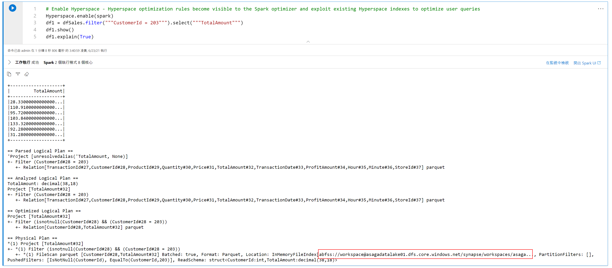

14. Hyperspace 提供了一个 Explain API，可以比较没有索引和有索引的执行计划。使用以下代码添加新单元格：

    ```python
    df1 = dfSales.filter("""CustomerId = 200""").select("""TotalAmount""")

    spark.conf.set("spark.hyperspace.explain.displayMode", "html")
    hyperspace.explain(df1, True, displayHTML)
    ```

15. 运行新单元格。输出显示了 `Plan with indexes` 与 `Plan without indexes` 的比较。仔细观察比较，使用索引文件的第一种情况和使用原始数据文件的第二种情况。

    

16. 现在，让我们研究涉及联接操作的更复杂的情况。使用以下代码添加新单元格：

    ```python
    eqJoin = dfSales.join(dfCustomers, dfSales.CustomerId == dfCustomers.CustomerId).select(dfSales.TotalAmount, dfCustomers.FullName)

    hyperspace.explain(eqJoin, True, displayHTML)
    ```

17. 运行新单元格。输出再次显示了 `Plan with indexes` 与 `Plan without indexes` 之间的比较，其中第一种情况使用索引，第二种情况使用原始数据文件。

    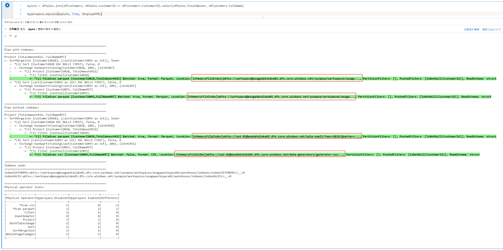

    如果要停用 Hyperspace 并清理索引，可以运行以下代码：

    ```python
    # 禁用 Hyperspace - Hyperspace 规则在查询优化期间不再适用。由于创建的索引将一直保持不变，因此禁用 Hyperspace 将不会对其造成影响
    Hyperspace.disable(spark)

    hyperspace.deleteIndex("indexSALES")
    hyperspace.vacuumIndex("indexSALES")
    hyperspace.deleteIndex("indexCUSTOMERS")
    hyperspace.vacuumIndex("indexCUSTOMERS")
    ```

#### 任务 2：通过 MSSparkUtil 库浏览 Data Lake Storage

Microsoft Spark 实用工具 (MSSparkUtils) 是一个内置包，有助于轻松执行常见任务。可以使用 MSSparkUtils 来处理文件系统、获取环境变量以及处理机密。

1. 继续使用上一个任务中的笔记本，并使用以下代码添加新单元格：

    ```python
    from notebookutils import mssparkutils

    #
    # Microsoft Spark 实用工具
    #
    # https://docs.microsoft.com/zh-cn/azure/synapse-analytics/spark/microsoft-spark-utilities?pivots=programming-language-python
    #

    # Azure 存储访问信息
    blob_account_name = datalake
    blob_container_name = 'wwi-02'
    blob_relative_path = '/'
    linkedServiceName = datalake
    blob_sas_token = mssparkutils.credentials.getConnectionStringOrCreds(linkedServiceName)

    # 允许 SPARK 从 Blob 远程访问
    spark.conf.set('fs.azure.sas.%s.%s.blob.core.windows.net' % (blob_container_name, blob_account_name), blob_sas_token)

    files = mssparkutils.fs.ls('/')
    for file in files:
        print(file.name, file.isDir, file.isFile, file.path, file.size)

    mssparkutils.fs.mkdirs('/SomeNewFolder')

    files = mssparkutils.fs.ls('/')
    for file in files:
        print(file.name, file.isDir, file.isFile, file.path, file.size)
    ```

2. 运行新单元，并观察如何使用 `mssparkutils` 来处理文件系统。

### 资源

请使用以下资源详细了解本实验室中涵盖的主题：

- [Azure Synapse Analytics 中的 Apache Spark](https://docs.microsoft.com/azure/synapse-analytics/spark/apache-spark-overview)
- [宣布用于 Azure Synapse 的 Azure 数据资源管理器数据连接器](https://techcommunity.microsoft.com/t5/azure-data-explorer/announcing-azure-data-explorer-data-connector-for-azure-synapse/ba-p/1743868)
- [使用适用于 Azure Synapse Analytics 的 Apache Spark 连接到 Azure 数据资源管理器](https://docs.microsoft.com/azure/synapse-analytics/quickstart-connect-azure-data-explorer)
- [Azure Synapse Analytics 共享元数据](https://docs.microsoft.com/azure/synapse-analytics/metadata/overview)
- [Microsoft Spark 实用工具简介](https://docs.microsoft.com/azure/synapse-analytics/spark/microsoft-spark-utilities?pivots=programming-language-python)
- [Hyperspace - 一个开放源代码索引子系统，可加速 Apache Spark™ 和大数据工作负载基于索引的查询](https://github.com/microsoft/hyperspace)
