# 模块 2 - 设计和实现服务层

本模块介绍如何在新式数据仓库中设计和实现数据存储，以优化分析工作负载。学生将了解如何设计多维架构来存储事实和维度数据。然后，学生将了解如何通过从 Azure 数据工厂加载增量数据来填充缓慢变化维度。

在本模块中，学生将能够：

- 为分析工作负载设计星型架构 (OLAP)
- 使用 Azure 数据工厂和映射数据流填充缓慢变化维度

## 实验室详细信息

- [模块 2 - 设计和实现服务层](#module-2---design-and-implement-the-serving-layer)
  - [实验室详细信息](#lab-details)
    - [实验室设置和先决条件](#lab-setup-and-pre-requisites)
  - [练习 0：启动专用 SQL 池](#exercise-0-start-the-dedicated-sql-pool)
  - [练习 1：实现星型架构](#exercise-1-implementing-a-star-schema)
    - [任务 1：在 SQL 数据库中创建星型架构](#task-1-create-star-schema-in-sql-database)
  - [练习 2：实现雪花型架构](#exercise-2-implementing-a-snowflake-schema)
    - [任务 1：在 SQL 数据库中创建产品雪花型架构](#task-1-create-product-snowflake-schema-in-sql-database)
    - [任务 2：在 SQL 数据库中创建经销商雪花型架构](#task-2-create-reseller-snowflake-schema-in-sql-database)
  - [练习 3：实现时间维度表](#exercise-3-implementing-a-time-dimension-table)
    - [任务 1：创建时间维度表](#task-1-create-time-dimension-table)
    - [任务 2：填充时间维度表](#task-2-populate-the-time-dimension-table)
    - [任务 3：将数据加载到其他表](#task-3-load-data-into-other-tables)
    - [任务 4：查询数据](#task-4-query-data)
  - [练习 4：在 Synapse Analytics 中实现星型架构](#exercise-4-implementing-a-star-schema-in-synapse-analytics)
    - [任务 1：在 Synapse 专用 SQL 中创建星型架构](#task-1-create-star-schema-in-synapse-dedicated-sql)
    - [任务 2：将数据加载到 Synapse 表](#task-2-load-data-into-synapse-tables)
    - [任务 3：从 Synapse 查询数据](#task-3-query-data-from-synapse)
  - [练习 5：使用映射数据流更新缓慢变化维度](#exercise-5-updating-slowly-changing-dimensions-with-mapping-data-flows)
    - [任务 1：创建 Azure SQL 数据库链接服务](#task-1-create-the-azure-sql-database-linked-service)
    - [任务 2：创建映射数据流](#task-2-create-a-mapping-data-flow)
    - [任务 3：创建管道并运行数据流](#task-3-create-a-pipeline-and-run-the-data-flow)
    - [任务 4：查看插入数据](#task-4-view-inserted-data)
    - [任务 5：更新源客户记录](#task-5-update-a-source-customer-record)
    - [任务 6：重新运行映射数据流](#task-6-re-run-mapping-data-flow)
    - [任务 7：验证记录是否已更新](#task-7-verify-record-updated)
  - [练习 6：清理](#exercise-6-cleanup)
    - [任务 1：暂停专用 SQL 池](#task-1-pause-the-dedicated-sql-pool)

### 实验室设置和先决条件

> **备注：** 如果**不**使用托管实验室环境，而是使用自己的 Azure 订阅，则仅完成 `Lab setup and pre-requisites` 步骤。否则，请跳转到练习 0。

1. 如果还未设置，请按照本模块的[实验室设置说明](https://github.com/solliancenet/microsoft-data-engineering-ilt-deploy/blob/main/setup/02/README.md)进行操作。

2. 在计算机或实验室虚拟机上安装 [Azure Data Studio](https://docs.microsoft.com/sql/azure-data-studio/download-azure-data-studio?view=sql-server-ver15)。

## 练习 0：启动专用 SQL 池

本实验室使用专用 SQL 池。第一步是确保它没有暂停。如果暂停，请按照以下说明启动它：

1. 打开 Synapse Studio (<https://web.azuresynapse.net/>)。

2. 选择 **“管理”** 中心。

    

3. 在左侧菜单中，选择 **“SQL 池”** **(1)**。如果专用 SQL 池已暂停，请将鼠标悬停在池名称上并选择 **“恢复”(2)**。

    

4. 出现提示时，选择 **“恢复”**。恢复池可能需要一到两分钟。

    

> 恢复专用 SQL 池后，请**继续下一个练习**。

## 练习 1：实现星型架构

星型架构是关系数据仓库广泛采用的一种成熟的建模方法。它要求建模者将他们的模型表按维度或事实分类。

**维度表**描述业务实体，即你建模的内容。实体可以包括产品、人、地点和概念（包括时间本身）。星型架构中最一致的表是日期维度表。维度表包含充当唯一标识符的一个（或多个）键列和描述性列。

维度表包含属性数据，这些数据可能会更改，但一般不会经常更改。例如，客户的姓名和地址存储在维度表中，仅当客户的个人资料发生更改时，这些数据才会更新。为了尽量缩小大型事实数据表的大小，不需要将客户的姓名和地址输入到事实数据表的每一行中。事实数据表和维度表可以共享一个客户 ID。查询可以联接两个表，以关联客户的个人资料和事务。

**事实数**据表存储观察结果或事件，可以是销售订单、库存余额、汇率、温度等。事实数据表包含与维度表相关的维度键列和数值度量列。维度键列决定事实数据表的维度，而维度键值决定事实数据表的粒度。例如，假设一个事实数据表用于存储销售目标，它有两个维度键列 `Date` 和 `ProductKey`。该表有两个维度，这很容易理解。但是，如果不考虑维度键值，就无法确定粒度。在本示例中，假设 Date 列中存储的值是每个月的第一天。在这种情况下，粒度为月产品级别。

通常，维度表包含的行数相对较少。另一方面，事实数据表可以包含非常多的行，并且随着时间的推移会继续增长。

下面是一个示例星型架构，其中事实数据表位于中间，维度表将其包围：


### 任务 1：在 SQL 数据库中创建星型架构

在本任务中，你将使用外键约束在 SQL 数据库中创建一个星型架构。第一步是创建基本维度表和事实数据表。

1. 登录到 Azure 门户 (<https://portal.azure.com>)。

2. 打开此实验室的资源组，然后选择 **“SourceDB”** SQL 数据库。

    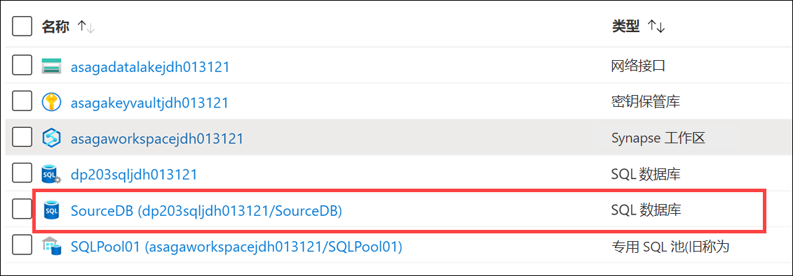

3. 复制“概述”窗格上的 **“服务器名称”** 值。

    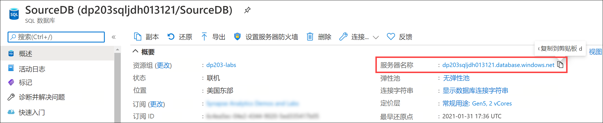

4. 打开 Azure Data Studio。

5. 选择左侧菜单上的 **“服务器”**，然后单击 **“添加连接”**。

    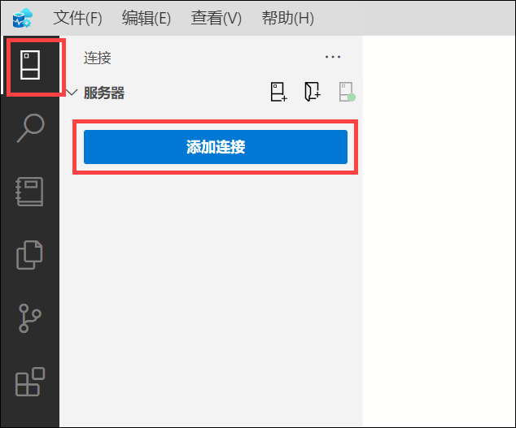

6. 在“连接详细信息”表单中提供以下信息：

    - **服务器**：将 SourceDB 服务器名称值粘贴到这里。
    - **身份验证类型**：选择 `SQL Login`。
    - **用户名**：输入 `sqladmin`。
    - **密码**：输入你在部署实验室环境时提供的密码，或者托管实验室环境向你提供的密码。
    - **记住密码**：已选中。
    - **数据库**：选择 `SourceDB`。

    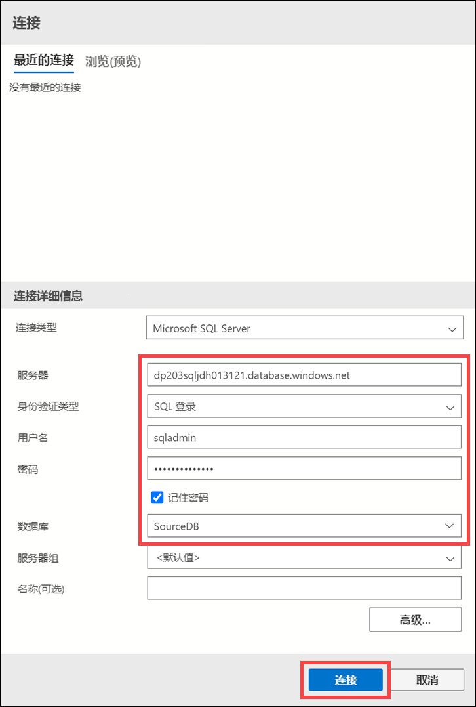

7. 选择 **“连接”**。

8. 在左侧菜单中选择 **“服务器”**，然后右键单击你在实验室开始时添加的 SQL 服务器。选择 **“新建查询”**。

    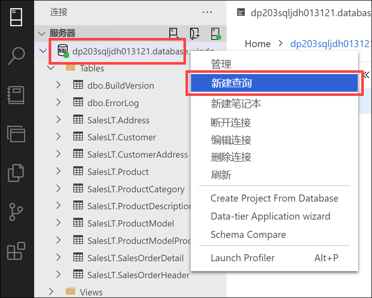

9. 将以下内容粘贴到查询窗口以创建维度表和事实数据表：

    ```sql
    CREATE TABLE [dbo].[DimReseller](
        [ResellerKey] [int] IDENTITY(1,1) NOT NULL,
        [GeographyKey] [int] NULL,
        [ResellerAlternateKey] [nvarchar](15) NULL,
        [Phone] [nvarchar](25) NULL,
        [BusinessType] [varchar](20) NOT NULL,
        [ResellerName] [nvarchar](50) NOT NULL,
        [NumberEmployees] [int] NULL,
        [OrderFrequency] [char](1) NULL,
        [OrderMonth] [tinyint] NULL,
        [FirstOrderYear] [int] NULL,
        [LastOrderYear] [int] NULL,
        [ProductLine] [nvarchar](50) NULL,
        [AddressLine1] [nvarchar](60) NULL,
        [AddressLine2] [nvarchar](60) NULL,
        [AnnualSales] [money] NULL,
        [BankName] [nvarchar](50) NULL,
        [MinPaymentType] [tinyint] NULL,
        [MinPaymentAmount] [money] NULL,
        [AnnualRevenue] [money] NULL,
        [YearOpened] [int] NULL
    );
    GO

    CREATE TABLE [dbo].[DimEmployee](
        [EmployeeKey] [int] IDENTITY(1,1) NOT NULL,
        [ParentEmployeeKey] [int] NULL,
        [EmployeeNationalIDAlternateKey] [nvarchar](15) NULL,
        [ParentEmployeeNationalIDAlternateKey] [nvarchar](15) NULL,
        [SalesTerritoryKey] [int] NULL,
        [FirstName] [nvarchar](50) NOT NULL,
        [LastName] [nvarchar](50) NOT NULL,
        [MiddleName] [nvarchar](50) NULL,
        [NameStyle] [bit] NOT NULL,
        [Title] [nvarchar](50) NULL,
        [HireDate] [date] NULL,
        [BirthDate] [date] NULL,
        [LoginID] [nvarchar](256) NULL,
        [EmailAddress] [nvarchar](50) NULL,
        [Phone] [nvarchar](25) NULL,
        [MaritalStatus] [nchar](1) NULL,
        [EmergencyContactName] [nvarchar](50) NULL,
        [EmergencyContactPhone] [nvarchar](25) NULL,
        [SalariedFlag] [bit] NULL,
        [Gender] [nchar](1) NULL,
        [PayFrequency] [tinyint] NULL,
        [BaseRate] [money] NULL,
        [VacationHours] [smallint] NULL,
        [SickLeaveHours] [smallint] NULL,
        [CurrentFlag] [bit] NOT NULL,
        [SalesPersonFlag] [bit] NOT NULL,
        [DepartmentName] [nvarchar](50) NULL,
        [StartDate] [date] NULL,
        [EndDate] [date] NULL,
        [Status] [nvarchar](50) NULL,
	    [EmployeePhoto] [varbinary](max) NULL
    );
    GO

    CREATE TABLE [dbo].[DimProduct](
        [ProductKey] [int] IDENTITY(1,1) NOT NULL,
        [ProductAlternateKey] [nvarchar](25) NULL,
        [ProductSubcategoryKey] [int] NULL,
        [WeightUnitMeasureCode] [nchar](3) NULL,
        [SizeUnitMeasureCode] [nchar](3) NULL,
        [EnglishProductName] [nvarchar](50) NOT NULL,
        [SpanishProductName] [nvarchar](50) NOT NULL,
        [FrenchProductName] [nvarchar](50) NOT NULL,
        [StandardCost] [money] NULL,
        [FinishedGoodsFlag] [bit] NOT NULL,
        [Color] [nvarchar](15) NOT NULL,
        [SafetyStockLevel] [smallint] NULL,
        [ReorderPoint] [smallint] NULL,
        [ListPrice] [money] NULL,
        [Size] [nvarchar](50) NULL,
        [SizeRange] [nvarchar](50) NULL,
        [Weight] [float] NULL,
        [DaysToManufacture] [int] NULL,
        [ProductLine] [nchar](2) NULL,
        [DealerPrice] [money] NULL,
        [Class] [nchar](2) NULL,
        [Style] [nchar](2) NULL,
        [ModelName] [nvarchar](50) NULL,
        [LargePhoto] [varbinary](max) NULL,
        [EnglishDescription] [nvarchar](400) NULL,
        [FrenchDescription] [nvarchar](400) NULL,
        [ChineseDescription] [nvarchar](400) NULL,
        [ArabicDescription] [nvarchar](400) NULL,
        [HebrewDescription] [nvarchar](400) NULL,
        [ThaiDescription] [nvarchar](400) NULL,
        [GermanDescription] [nvarchar](400) NULL,
        [JapaneseDescription] [nvarchar](400) NULL,
        [TurkishDescription] [nvarchar](400) NULL,
        [StartDate] [datetime] NULL,
        [EndDate] [datetime] NULL,
        [Status] [nvarchar](7) NULL
    );
    GO

    CREATE TABLE [dbo].[FactResellerSales](
        [ProductKey] [int] NOT NULL,
        [OrderDateKey] [int] NOT NULL,
        [DueDateKey] [int] NOT NULL,
        [ShipDateKey] [int] NOT NULL,
        [ResellerKey] [int] NOT NULL,
        [EmployeeKey] [int] NOT NULL,
        [PromotionKey] [int] NOT NULL,
        [CurrencyKey] [int] NOT NULL,
        [SalesTerritoryKey] [int] NOT NULL,
        [SalesOrderNumber] [nvarchar](20) NOT NULL,
        [SalesOrderLineNumber] [tinyint] NOT NULL,
        [RevisionNumber] [tinyint] NULL,
        [OrderQuantity] [smallint] NULL,
        [UnitPrice] [money] NULL,
        [ExtendedAmount] [money] NULL,
        [UnitPriceDiscountPct] [float] NULL,
        [DiscountAmount] [float] NULL,
        [ProductStandardCost] [money] NULL,
        [TotalProductCost] [money] NULL,
        [SalesAmount] [money] NULL,
        [TaxAmt] [money] NULL,
        [Freight] [money] NULL,
        [CarrierTrackingNumber] [nvarchar](25) NULL,
        [CustomerPONumber] [nvarchar](25) NULL,
        [OrderDate] [datetime] NULL,
        [DueDate] [datetime] NULL,
        [ShipDate] [datetime] NULL
    );
    GO
    ```

10. 选择 **“运行”** 或按 `F5` 执行查询。

    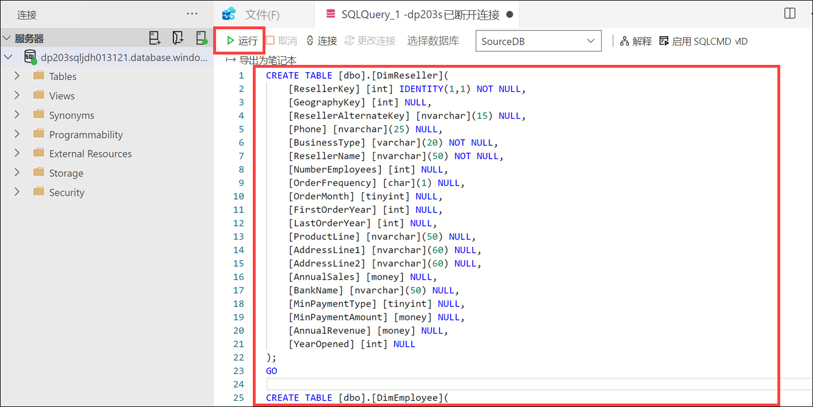

    现在，我们有三个维度表和一个事实数据表。这些表在一起表示了一个星型架构：

    

    但是，由于我们使用的是 SQL 数据库，因此可以添加外键关系和约束来定义关系和强制执行表值。

11. 使用以下内容替换**并执行**查询以创建 `DimReseller` 主键和约束：

    ```sql
    -- Create DimReseller PK
    ALTER TABLE [dbo].[DimReseller] WITH CHECK ADD 
        CONSTRAINT [PK_DimReseller_ResellerKey] PRIMARY KEY CLUSTERED 
        (
            [ResellerKey]
        )  ON [PRIMARY];
    GO

    -- Create DimReseller unique constraint
    ALTER TABLE [dbo].[DimReseller] ADD  CONSTRAINT [AK_DimReseller_ResellerAlternateKey] UNIQUE NONCLUSTERED 
    (
        [ResellerAlternateKey] ASC
    )WITH (PAD_INDEX = OFF, STATISTICS_NORECOMPUTE = OFF, SORT_IN_TEMPDB = OFF, IGNORE_DUP_KEY = OFF, ONLINE = OFF, ALLOW_ROW_LOCKS = ON, ALLOW_PAGE_LOCKS = ON)
    GO
    ```

12. 使用以下内容替换**并执行**查询以创建 `DimEmployee` 主键：

    ```sql
    -- Create DimEmployee PK
    ALTER TABLE [dbo].[DimEmployee] WITH CHECK ADD 
        CONSTRAINT [PK_DimEmployee_EmployeeKey] PRIMARY KEY CLUSTERED 
        (
        [EmployeeKey]
        )  ON [PRIMARY];
    GO
    ```

13. 使用以下内容替换**并执行**查询以创建 `DimProduct` 主键和约束：

    ```sql
    -- Create DimProduct PK
    ALTER TABLE [dbo].[DimProduct] WITH CHECK ADD 
        CONSTRAINT [PK_DimProduct_ProductKey] PRIMARY KEY CLUSTERED 
        (
            [ProductKey]
        )  ON [PRIMARY];
    GO

    -- Create DimProduct unique constraint
    ALTER TABLE [dbo].[DimProduct] ADD  CONSTRAINT [AK_DimProduct_ProductAlternateKey_StartDate] UNIQUE NONCLUSTERED 
    (
        [ProductAlternateKey] ASC,
        [StartDate] ASC
    )WITH (PAD_INDEX = OFF, STATISTICS_NORECOMPUTE = OFF, SORT_IN_TEMPDB = OFF, IGNORE_DUP_KEY = OFF, ONLINE = OFF, ALLOW_ROW_LOCKS = ON, ALLOW_PAGE_LOCKS = ON)
    GO
    ```

    > 现在我们可以创建事实数据表和维度表之间的关系，明确地定义星型架构。

14. 使用以下内容替换**并执行**查询以创建 `FactResellerSales` 主键和外键关系：

    ```sql
    -- Create FactResellerSales PK
    ALTER TABLE [dbo].[FactResellerSales] WITH CHECK ADD 
        CONSTRAINT [PK_FactResellerSales_SalesOrderNumber_SalesOrderLineNumber] PRIMARY KEY CLUSTERED 
        (
            [SalesOrderNumber], [SalesOrderLineNumber]
        )  ON [PRIMARY];
    GO

    -- Create foreign key relationships to the dimension tables
    ALTER TABLE [dbo].[FactResellerSales] ADD
        CONSTRAINT [FK_FactResellerSales_DimEmployee] FOREIGN KEY([EmployeeKey])
                REFERENCES [dbo].[DimEmployee] ([EmployeeKey]),
        CONSTRAINT [FK_FactResellerSales_DimProduct] FOREIGN KEY([ProductKey])
                REFERENCES [dbo].[DimProduct] ([ProductKey]),
        CONSTRAINT [FK_FactResellerSales_DimReseller] FOREIGN KEY([ResellerKey])
                REFERENCES [dbo].[DimReseller] ([ResellerKey]);
    GO
    ```

    我们的星型架构现在定义了事实数据表和维度表之间关系。如果使用工具（如 SQL Server Management Studio）将这些表排列成图表，则可以清楚地看到它们之间的关系：

    

## 练习 2：实现雪花型架构

**雪花型**架构是针对单个业务实体的一组规范化表。例如，Adventure Works 按类别和子类别对产品进行分类。类别被分配到子类别，而产品进而被分配到子类别。在 Adventure Works 关系数据仓库中，产品维度已规范化并存储在三个相关表中：`DimProductCategory`、`DimProductSubcategory` 和 `DimProduct`。

雪花型架构是星型架构的一种变体。将规范化的维度表添加到星型架构即可创建雪花型模式。在下图中，你将看到围绕蓝色事实数据表的黄色维度表。请注意，为了规范化业务实体，许多维度表相互关联：


### 任务 1：在 SQL 数据库中创建产品雪花型架构

在此任务中，你需要添加两个新的维度表: `DimProductCategory` 和 `DimProductSubcategory`。在这两个表和 `DimProduct` 表之间创建一个关系，以创建一个规范化的产品维度，称之为雪花型维度。执行此操作将更新星型架构以包含规范化的产品维度，从而将其转换为雪花型架构。

1. 打开 Azure 数据资源管理器。

2. 在左侧菜单中选择 **“服务器”**，然后右键单击你在实验室开始时添加的 SQL 服务器。选择 **“新建查询”**。

    

3. 将以下内容粘贴到查询窗口**并执行**查询以创建新的维度表：

    ```sql
    CREATE TABLE [dbo].[DimProductCategory](
        [ProductCategoryKey] [int] IDENTITY(1,1) NOT NULL,
        [ProductCategoryAlternateKey] [int] NULL,
        [EnglishProductCategoryName] [nvarchar](50) NOT NULL,
        [SpanishProductCategoryName] [nvarchar](50) NOT NULL,
        [FrenchProductCategoryName] [nvarchar](50) NOT NULL
    );
    GO

    CREATE TABLE [dbo].[DimProductSubcategory](
        [ProductSubcategoryKey] [int] IDENTITY(1,1) NOT NULL,
        [ProductSubcategoryAlternateKey] [int] NULL,
        [EnglishProductSubcategoryName] [nvarchar](50) NOT NULL,
        [SpanishProductSubcategoryName] [nvarchar](50) NOT NULL,
        [FrenchProductSubcategoryName] [nvarchar](50) NOT NULL,
        [ProductCategoryKey] [int] NULL
    );
    GO
    ```

4. 使用以下内容替换**并执行**查询以创建 `DimProductCategory` 和 `DimProductSubcategory` 主键和约束：

    ```sql
    -- Create DimProductCategory PK
    ALTER TABLE [dbo].[DimProductCategory] WITH CHECK ADD 
        CONSTRAINT [PK_DimProductCategory_ProductCategoryKey] PRIMARY KEY CLUSTERED 
        (
            [ProductCategoryKey]
        )  ON [PRIMARY];
    GO

    -- Create DimProductSubcategory PK
    ALTER TABLE [dbo].[DimProductSubcategory] WITH CHECK ADD 
        CONSTRAINT [PK_DimProductSubcategory_ProductSubcategoryKey] PRIMARY KEY CLUSTERED 
        (
            [ProductSubcategoryKey]
        )  ON [PRIMARY];
    GO

    -- Create DimProductCategory unique constraint
    ALTER TABLE [dbo].[DimProductCategory] ADD  CONSTRAINT [AK_DimProductCategory_ProductCategoryAlternateKey] UNIQUE NONCLUSTERED 
    (
        [ProductCategoryAlternateKey] ASC
    )WITH (PAD_INDEX = OFF, STATISTICS_NORECOMPUTE = OFF, SORT_IN_TEMPDB = OFF, IGNORE_DUP_KEY = OFF, ONLINE = OFF, ALLOW_ROW_LOCKS = ON, ALLOW_PAGE_LOCKS = ON)
    GO

    -- Create DimProductSubcategory unique constraint
    ALTER TABLE [dbo].[DimProductSubcategory] ADD  CONSTRAINT [AK_DimProductSubcategory_ProductSubcategoryAlternateKey] UNIQUE NONCLUSTERED 
    (
        [ProductSubcategoryAlternateKey] ASC
    )WITH (PAD_INDEX = OFF, STATISTICS_NORECOMPUTE = OFF, SORT_IN_TEMPDB = OFF, IGNORE_DUP_KEY = OFF, ONLINE = OFF, ALLOW_ROW_LOCKS = ON, ALLOW_PAGE_LOCKS = ON)
    GO
    ```

5. 使用以下内容替换**并执行**查询以创建 `DimProduct` 和 `DimProductSubcategory` 以及 `DimProductSubcategory` 和 `DimProductCategory` 之间的外键关系：

    ```sql
    -- Create foreign key relationship between DimProduct and DimProductSubcategory
    ALTER TABLE [dbo].[DimProduct] ADD 
        CONSTRAINT [FK_DimProduct_DimProductSubcategory] FOREIGN KEY 
        (
            [ProductSubcategoryKey]
        ) REFERENCES [dbo].[DimProductSubcategory] ([ProductSubcategoryKey]);
    GO

    -- Create foreign key relationship between DimProductSubcategory and DimProductCategory
    ALTER TABLE [dbo].[DimProductSubcategory] ADD 
        CONSTRAINT [FK_DimProductSubcategory_DimProductCategory] FOREIGN KEY 
        (
            [ProductCategoryKey]
        ) REFERENCES [dbo].[DimProductCategory] ([ProductCategoryKey]);
    GO
    ```

    你已通过将三个产品表规范化为单个业务实体或产品维度创建了雪花型维度：

    

    当我们将其他表添加到图表中时，我们可以看到星型架构现在通过对产品表进行规范化而转换为雪花型架构。如果使用工具（如 SQL Server Management Studio）将这些表排列成图表，则可以清楚地看到它们之间的关系：

    

### 任务 2：在 SQL 数据库中创建经销商雪花型架构

在此任务中，你需要添加两个新的维度表: `DimCustomer` 和 `DimGeography`。在这两个表和 `DimReseller` 表之间创建一个关系，以创建一个规范化的经销商维度或雪花型维度。

1. 将以下内容粘贴到查询窗口**并执行**查询以创建新的维度表：

    ```sql
    CREATE TABLE [dbo].[DimCustomer](
        [CustomerKey] [int] IDENTITY(1,1) NOT NULL,
        [GeographyKey] [int] NULL,
        [CustomerAlternateKey] [nvarchar](15) NOT NULL,
        [Title] [nvarchar](8) NULL,
        [FirstName] [nvarchar](50) NULL,
        [MiddleName] [nvarchar](50) NULL,
        [LastName] [nvarchar](50) NULL,
        [NameStyle] [bit] NULL,
        [BirthDate] [date] NULL,
        [MaritalStatus] [nchar](1) NULL,
        [Suffix] [nvarchar](10) NULL,
        [Gender] [nvarchar](1) NULL,
        [EmailAddress] [nvarchar](50) NULL,
        [YearlyIncome] [money] NULL,
        [TotalChildren] [tinyint] NULL,
        [NumberChildrenAtHome] [tinyint] NULL,
        [EnglishEducation] [nvarchar](40) NULL,
        [SpanishEducation] [nvarchar](40) NULL,
        [FrenchEducation] [nvarchar](40) NULL,
        [EnglishOccupation] [nvarchar](100) NULL,
        [SpanishOccupation] [nvarchar](100) NULL,
        [FrenchOccupation] [nvarchar](100) NULL,
        [HouseOwnerFlag] [nchar](1) NULL,
        [NumberCarsOwned] [tinyint] NULL,
        [AddressLine1] [nvarchar](120) NULL,
        [AddressLine2] [nvarchar](120) NULL,
        [Phone] [nvarchar](20) NULL,
        [DateFirstPurchase] [date] NULL,
        [CommuteDistance] [nvarchar](15) NULL
    );
    GO

    CREATE TABLE [dbo].[DimGeography](
        [GeographyKey] [int] IDENTITY(1,1) NOT NULL,
        [City] [nvarchar](30) NULL,
        [StateProvinceCode] [nvarchar](3) NULL,
        [StateProvinceName] [nvarchar](50) NULL,
        [CountryRegionCode] [nvarchar](3) NULL,
        [EnglishCountryRegionName] [nvarchar](50) NULL,
        [SpanishCountryRegionName] [nvarchar](50) NULL,
        [FrenchCountryRegionName] [nvarchar](50) NULL,
        [PostalCode] [nvarchar](15) NULL,
        [SalesTerritoryKey] [int] NULL,
        [IpAddressLocator] [nvarchar](15) NULL
    );
    GO
    ```

2. 使用以下内容替换并执行查询以在 `DimCustomer` 表上创建 `DimCustomer` 和 `DimGeography` 主键以及唯一非聚集索引：

    ```sql
    -- Create DimCustomer PK
    ALTER TABLE [dbo].[DimCustomer] WITH CHECK ADD 
        CONSTRAINT [PK_DimCustomer_CustomerKey] PRIMARY KEY CLUSTERED
        (
            [CustomerKey]
        )  ON [PRIMARY];
    GO

    -- Create DimGeography PK
    ALTER TABLE [dbo].[DimGeography] WITH CHECK ADD 
        CONSTRAINT [PK_DimGeography_GeographyKey] PRIMARY KEY CLUSTERED 
        (
        [GeographyKey]
        )  ON [PRIMARY];
    GO

    -- Create DimCustomer index
    CREATE UNIQUE NONCLUSTERED INDEX [IX_DimCustomer_CustomerAlternateKey] ON [dbo].[DimCustomer]([CustomerAlternateKey]) ON [PRIMARY];
    GO
    ```

3. 使用以下内容替换**并执行**查询以创建 `DimReseller` 和 `DimGeography` 以及 `DimGeography` 和 `DimCustomer` 之间的外键关系：

    ```sql
    -- Create foreign key relationship between DimReseller and DimGeography
    ALTER TABLE [dbo].[DimReseller] ADD
        CONSTRAINT [FK_DimReseller_DimGeography] FOREIGN KEY
        (
            [GeographyKey]
        ) REFERENCES [dbo].[DimGeography] ([GeographyKey]);
    GO

    -- Create foreign key relationship between DimCustomer and DimGeography
    ALTER TABLE [dbo].[DimCustomer] ADD
        CONSTRAINT [FK_DimCustomer_DimGeography] FOREIGN KEY
        (
            [GeographyKey]
        )
        REFERENCES [dbo].[DimGeography] ([GeographyKey])
    GO
    ```

    现在，你有了一个新的雪花型维度，它使用地理和客户维度将经销商数据规范化。

    

    现在，我们来看看这些新表如何为雪花型架构添加另一个详细信息级别：

    

## 练习 3：实现时间维度表

时间维度表是最常用的维度表之一。这种类型的表支持用于时间分析和报告的一致粒度，通常包含时间层次结构，如 `Year` > `Quarter` > `Month` > `Day`。

时间维度表可以包含特定于业务的属性，这些属性可作为报告和筛选的有用参考，例如结账期和公共假期。

这是你将要创建的时间维度表的架构：

| 列 | 数据类型 |
| --- | --- |
| DateKey | `int` |
| DateAltKey | `datetime` |
| CalendarYear | `int` |
| CalendarQuarter | `int` |
| MonthOfYear | `int` |
| MonthName | `nvarchar(15)` |
| DayOfMonth | `int` |
| DayOfWeek | `int` |
| DayName | `nvarchar(15)` |
| FiscalYear | `int` |
| FiscalQuarter | `int` |

### 任务 1：创建时间维度表

在此任务中，你将添加时间维度表并为 `FactRetailerSales` 表创建外键关系。

1. 将以下内容粘贴到查询窗口**并执行**查询以创建新的时间维度表：

    ```sql
    CREATE TABLE DimDate
        (DateKey int NOT NULL,
        DateAltKey datetime NOT NULL,
        CalendarYear int NOT NULL,
        CalendarQuarter int NOT NULL,
        MonthOfYear int NOT NULL,
        [MonthName] nvarchar(15) NOT NULL,
        [DayOfMonth] int NOT NULL,
        [DayOfWeek] int NOT NULL,
        [DayName] nvarchar(15) NOT NULL,
        FiscalYear int NOT NULL,
        FiscalQuarter int NOT NULL)
    GO
    ```

2. 使用以下内容替换**并执行**查询以在 `DimDate` 表上创建主键以及唯一非聚集索引：

    ```sql
    -- Create DimDate PK
    ALTER TABLE [dbo].[DimDate] WITH CHECK ADD 
        CONSTRAINT [PK_DimDate_DateKey] PRIMARY KEY CLUSTERED 
        (
            [DateKey]
        )  ON [PRIMARY];
    GO

    -- Create unique non-clustered index
    CREATE UNIQUE NONCLUSTERED INDEX [AK_DimDate_DateAltKey] ON [dbo].[DimDate]([DateAltKey]) ON [PRIMARY];
    GO
    ```

3. 使用以下内容替换**并执行**查询以创建 `FactRetailerSales` 和 `DimDate` 之间的外键关系：

    ```sql
    ALTER TABLE [dbo].[FactResellerSales] ADD
        CONSTRAINT [FK_FactResellerSales_DimDate] FOREIGN KEY([OrderDateKey])
                REFERENCES [dbo].[DimDate] ([DateKey]),
        CONSTRAINT [FK_FactResellerSales_DimDate1] FOREIGN KEY([DueDateKey])
                REFERENCES [dbo].[DimDate] ([DateKey]),
        CONSTRAINT [FK_FactResellerSales_DimDate2] FOREIGN KEY([ShipDateKey])
                REFERENCES [dbo].[DimDate] ([DateKey]);
    GO
    ```

    > 注意这三个字段引用 `DimDate` 表的主键的方式。

    现在，我们的雪花型架构更新为包含时间维度表：

    

### 任务 2：填充时间维度表

你可以通过多种方式填充时间维度表，包括使用日期/时间函数的 T-SQL 脚本、Microsoft Excel 函数、从平面文件导入或通过 BI（商业智能）工具自动生成。在此任务中，你将使用 T-SQL 填充时间维度表，并在此过程中与生成方法进行比较。

1. 将以下内容粘贴到查询窗口**并执行**查询以创建新的时间维度表：

    ```sql
    DECLARE @StartDate datetime
    DECLARE @EndDate datetime
    SET @StartDate = '01/01/2005'
    SET @EndDate = getdate() 
    DECLARE @LoopDate datetime
    SET @LoopDate = @StartDate
    WHILE @LoopDate <= @EndDate
    BEGIN
    INSERT INTO dbo.DimDate VALUES
        (
            CAST(CONVERT(VARCHAR(8), @LoopDate, 112) AS int) , -- date key
            @LoopDate, -- date alt key
            Year(@LoopDate), -- calendar year
            datepart(qq, @LoopDate), -- calendar quarter
            Month(@LoopDate), -- month number of year
            datename(mm, @LoopDate), -- month name
            Day(@LoopDate),  -- day number of month
            datepart(dw, @LoopDate), -- day number of week
            datename(dw, @LoopDate), -- day name of week
            CASE
                WHEN Month(@LoopDate) < 7 THEN Year(@LoopDate)
                ELSE Year(@Loopdate) + 1
            END, -- Fiscal year (assuming fiscal year runs from Jul to June)
            CASE
                WHEN Month(@LoopDate) IN (1, 2, 3) THEN 3
                WHEN Month(@LoopDate) IN (4, 5, 6) THEN 4
                WHEN Month(@LoopDate) IN (7, 8, 9) THEN 1
                WHEN Month(@LoopDate) IN (10, 11, 12) THEN 2
            END -- fiscal quarter 
        )  		  
        SET @LoopDate = DateAdd(dd, 1, @LoopDate)
    END
    ```

    > 在我们的环境中，插入生成的行大约需要 **18 秒**。

    此查询从开始日期 2005 年 1 月 1 日开始循环，一直到当前日期，针对每天进行计算并将值插入表中。

2. 使用以下内容替换**并执行**查询以查看时间维度表数据：

    ```sql
    SELECT * FROM dbo.DimDate
    ```

    你应该会看到类似如下的输出:

    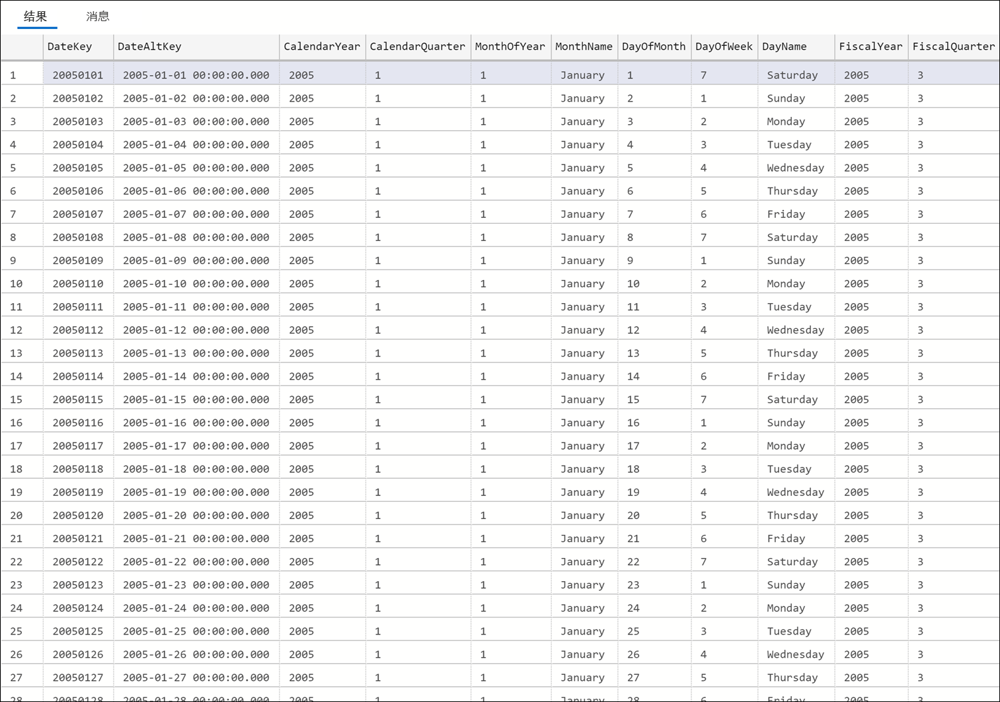

3. 这里有另一种方法可以循环遍历日期来填充表，这一次需设置开始日期和结束日期。使用以下内容替换**并执行**查询以在给定时段（1900 年 1 月 1 日 - 2050 年 12 月 31 日）内循环遍历日期并显示输出：

    ```sql
    DECLARE @BeginDate datetime
    DECLARE @EndDate datetime

    SET @BeginDate = '1/1/1900'
    SET @EndDate = '12/31/2050'

    CREATE TABLE #Dates ([date] datetime)

    WHILE @BeginDate <= @EndDate
    BEGIN
    INSERT #Dates
    VALUES
    (@BeginDate)

    SET @BeginDate = @BeginDate + 1
    END
    SELECT * FROM #Dates
    DROP TABLE #Dates
    ```

    > 在我们的环境中，插入生成的行大约需要 **4** 秒。

    这种方法也可以使用，但是它需要清理许多内容，而且执行缓慢，并且当我们添加到其他字段中时，它有很多代码。另外，它使用循环，这在使用 T-SQL 插入数据时不是最佳做法。

4. 使用以下内容替换**并执行**查询，以使用 [CTE](https://docs.microsoft.com/sql/t-sql/queries/with-common-table-expression-transact-sql?view=sql-server-ver15)（通用表表达式）语句改进先前的方法：

    ```sql
    WITH mycte AS
    (
        SELECT cast('1900-01-01' as datetime) DateValue
        UNION ALL
        SELECT DateValue + 1
        FROM mycte 
        WHERE DateValue + 1 < '2050-12-31'
    )

    SELECT DateValue
    FROM mycte
    OPTION (MAXRECURSION 0)
    ```

    > 在我们的环境中，执行 CTE 查询只花费了**不到一秒**钟的时间。

### 任务 3：将数据加载到其他表

在此任务中，你将使用公共数据源中的数据加载维度表和事实数据表。

1. 将以下内容粘贴到查询窗口**并执行**查询以创建主密钥加密、数据库范围的凭据和访问包含源数据的公共 Blob 存储帐户的外部数据源：

    ```sql
    IF NOT EXISTS (SELECT * FROM sys.symmetric_keys) BEGIN
        declare @pasword nvarchar(400) = CAST(newid() as VARCHAR(400));
        EXEC('CREATE MASTER KEY ENCRYPTION BY PASSWORD = ''' + @pasword + '''')
    END

    CREATE DATABASE SCOPED CREDENTIAL [dataengineering]
    WITH IDENTITY='SHARED ACCESS SIGNATURE',  
    SECRET = 'sv=2019-10-10&st=2021-02-01T01%3A23%3A35Z&se=2030-02-02T01%3A23%3A00Z&sr=c&sp=rl&sig=HuizuG29h8FOrEJwIsCm5wfPFc16N1Z2K3IPVoOrrhM%3D'
    GO

    -- Create external data source secured using credential
    CREATE EXTERNAL DATA SOURCE PublicDataSource WITH (
        TYPE = BLOB_STORAGE,
        LOCATION = 'https://solliancepublicdata.blob.core.windows.net/dataengineering',
        CREDENTIAL = dataengineering
    );
    GO
    ```

2. 使用以下内容替换**并执行**查询以将数据插入到事实数据表和维度表：

    ```sql
    BULK INSERT[dbo].[DimGeography] FROM 'dp-203/awdata/DimGeography.csv'
    WITH (
        DATA_SOURCE='PublicDataSource',
        CHECK_CONSTRAINTS,
        DATAFILETYPE='widechar',
        FIELDTERMINATOR='|',
        ROWTERMINATOR='\n',
        KEEPIDENTITY,
        TABLOCK
    );
    GO

    BULK INSERT[dbo].[DimCustomer] FROM 'dp-203/awdata/DimCustomer.csv'
    WITH (
        DATA_SOURCE='PublicDataSource',
        CHECK_CONSTRAINTS,
        DATAFILETYPE='widechar',
        FIELDTERMINATOR='|',
        ROWTERMINATOR='\n',
        KEEPIDENTITY,
        TABLOCK
    );
    GO

    BULK INSERT[dbo].[DimReseller] FROM 'dp-203/awdata/DimReseller.csv'
    WITH (
        DATA_SOURCE='PublicDataSource',
        CHECK_CONSTRAINTS,
        DATAFILETYPE='widechar',
        FIELDTERMINATOR='|',
        ROWTERMINATOR='\n',
        KEEPIDENTITY,
        TABLOCK
    );
    GO

    BULK INSERT[dbo].[DimEmployee] FROM 'dp-203/awdata/DimEmployee.csv'
    WITH (
        DATA_SOURCE='PublicDataSource',
        CHECK_CONSTRAINTS,
        DATAFILETYPE='widechar',
        FIELDTERMINATOR='|',
        ROWTERMINATOR='\n',
        KEEPIDENTITY,
        TABLOCK
    );
    GO

    BULK INSERT[dbo].[DimProductCategory] FROM 'dp-203/awdata/DimProductCategory.csv'
    WITH (
        DATA_SOURCE='PublicDataSource',
        CHECK_CONSTRAINTS,
        DATAFILETYPE='widechar',
        FIELDTERMINATOR='|',
        ROWTERMINATOR='\n',
        KEEPIDENTITY,
        TABLOCK
    );
    GO

    BULK INSERT[dbo].[DimProductSubcategory] FROM 'dp-203/awdata/DimProductSubcategory.csv'
    WITH (
        DATA_SOURCE='PublicDataSource',
        CHECK_CONSTRAINTS,
        DATAFILETYPE='widechar',
        FIELDTERMINATOR='|',
        ROWTERMINATOR='\n',
        KEEPIDENTITY,
        TABLOCK
    );
    GO

    BULK INSERT[dbo].[DimProduct] FROM 'dp-203/awdata/DimProduct.csv'
    WITH (
        DATA_SOURCE='PublicDataSource',
        CHECK_CONSTRAINTS,
        DATAFILETYPE='widechar',
        FIELDTERMINATOR='|',
        ROWTERMINATOR='\n',
        KEEPIDENTITY,
        TABLOCK
    );
    GO

    BULK INSERT[dbo].[FactResellerSales] FROM 'dp-203/awdata/FactResellerSales.csv'
    WITH (
        DATA_SOURCE='PublicDataSource',
        CHECK_CONSTRAINTS,
        DATAFILETYPE='widechar',
        FIELDTERMINATOR='|',
        ROWTERMINATOR='\n',
        KEEPIDENTITY,
        TABLOCK
    );
    GO
    ```

### 任务 4：查询数据

1. 粘贴**并执行**以下查询，通过雪花型架构在经销商、产品和月份粒度级别检索经销商销售数据：

    ```sql
    SELECT
            pc.[EnglishProductCategoryName]
            ,Coalesce(p.[ModelName], p.[EnglishProductName]) AS [Model]
            ,CASE
                WHEN e.[BaseRate] < 25 THEN 'Low'
                WHEN e.[BaseRate] > 40 THEN 'High'
                ELSE 'Moderate'
            END AS [EmployeeIncomeGroup]
            ,g.City AS ResellerCity
            ,g.StateProvinceName AS StateProvince
            ,r.[AnnualSales] AS ResellerAnnualSales
            ,d.[CalendarYear]
            ,d.[FiscalYear]
            ,d.[MonthOfYear] AS [Month]
            ,f.[SalesOrderNumber] AS [OrderNumber]
            ,f.SalesOrderLineNumber AS LineNumber
            ,f.OrderQuantity AS Quantity
            ,f.ExtendedAmount AS Amount  
        FROM
            [dbo].[FactResellerSales] f
        INNER JOIN [dbo].[DimReseller] r
            ON f.ResellerKey = r.ResellerKey
        INNER JOIN [dbo].[DimGeography] g
            ON r.GeographyKey = g.GeographyKey
        INNER JOIN [dbo].[DimEmployee] e
            ON f.EmployeeKey = e.EmployeeKey
        INNER JOIN [dbo].[DimDate] d
            ON f.[OrderDateKey] = d.[DateKey]
        INNER JOIN [dbo].[DimProduct] p
            ON f.[ProductKey] = p.[ProductKey]
        INNER JOIN [dbo].[DimProductSubcategory] psc
            ON p.[ProductSubcategoryKey] = psc.[ProductSubcategoryKey]
        INNER JOIN [dbo].[DimProductCategory] pc
            ON psc.[ProductCategoryKey] = pc.[ProductCategoryKey]
        ORDER BY Amount DESC
    ```

    应会看到类似下面的输出：

    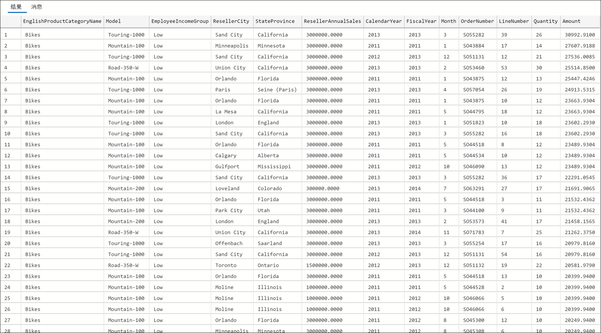

2. 使用以下内容替换**并执行**查询，以将结果限制为 2012 至 2013 会计年度的 10 月销售额：

    ```sql
    SELECT
            pc.[EnglishProductCategoryName]
            ,Coalesce(p.[ModelName], p.[EnglishProductName]) AS [Model]
            ,CASE
                WHEN e.[BaseRate] < 25 THEN 'Low'
                WHEN e.[BaseRate] > 40 THEN 'High'
                ELSE 'Moderate'
            END AS [EmployeeIncomeGroup]
            ,g.City AS ResellerCity
            ,g.StateProvinceName AS StateProvince
            ,r.[AnnualSales] AS ResellerAnnualSales
            ,d.[CalendarYear]
            ,d.[FiscalYear]
            ,d.[MonthOfYear] AS [Month]
            ,f.[SalesOrderNumber] AS [OrderNumber]
            ,f.SalesOrderLineNumber AS LineNumber
            ,f.OrderQuantity AS Quantity
            ,f.ExtendedAmount AS Amount  
        FROM
            [dbo].[FactResellerSales] f
        INNER JOIN [dbo].[DimReseller] r
            ON f.ResellerKey = r.ResellerKey
        INNER JOIN [dbo].[DimGeography] g
            ON r.GeographyKey = g.GeographyKey
        INNER JOIN [dbo].[DimEmployee] e
            ON f.EmployeeKey = e.EmployeeKey
        INNER JOIN [dbo].[DimDate] d
            ON f.[OrderDateKey] = d.[DateKey]
        INNER JOIN [dbo].[DimProduct] p
            ON f.[ProductKey] = p.[ProductKey]
        INNER JOIN [dbo].[DimProductSubcategory] psc
            ON p.[ProductSubcategoryKey] = psc.[ProductSubcategoryKey]
        INNER JOIN [dbo].[DimProductCategory] pc
            ON psc.[ProductCategoryKey] = pc.[ProductCategoryKey]
        WHERE d.[MonthOfYear] = 10 AND d.[FiscalYear] IN (2012, 2013)
        ORDER BY d.[FiscalYear]
    ```

    应会看到类似下面的输出：

    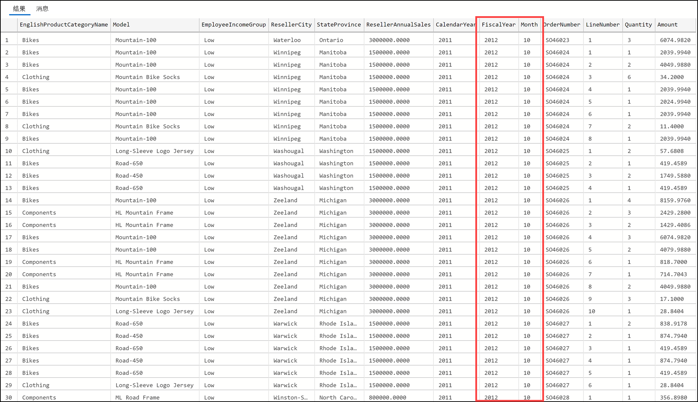

    > 请注意使用**时间维度表**是如何使按特定日期部分和逻辑日期（例如会计年度）进行筛选比动态计算日期函数更容易且性能更高。

## 练习 4：在 Synapse Analytics 中实现星型架构

对于较大的数据集，你可以在 Azure Synapse 而不是 SQL Server 中实现数据仓库。星型架构模型仍然是在 Synapse 专用 SQL 池中进行数据建模的最佳做法。你可能会注意到在 Synapse Analytics 中创建表与在 SQL 数据库中创建表有一些不同，但应用相同的数据建模原则。

 在 Synapse 中创建星型架构或雪花型架构时，需要对表创建脚本进行一些更改。在 Synapse 中，没有像在 SQL Server 中那样的外键和唯一值约束。由于这些规则没有在数据库层强制执行，因此用于加载数据的作业对维护数据完整性有更多的责任。你仍然可以选择使用聚集索引，但对于 Synapse 中的大多数维度表，使用聚集列存储索引 (CCI) 将使你受益。

由于 Synapse Analytics 是一个[大规模并行处理](https://docs.microsoft.com/azure/architecture/data-guide/relational-data/data-warehousing#data-warehousing-in-azure) (MPP) 系统，因此与对称多处理 (SMP) 系统（如 Azure SQL 数据库等 OLTP 数据库）不同，必须考虑数据在表设计中的分布方式。表类别通常确定了要选择哪个选项来分布表。

| 表类别 | 建议的分布选项 |
|:---------------|:--------------------|
| 事实数据           | 结合聚集列存储索引使用哈希分布。在同一个分布列中联接两个哈希表时，可以提高性能。 |
| 维度      | 对小型表使用复制表。如果表太大，以致无法在每个计算节点上存储，可以使用哈希分布式表。 |
| 暂存        | 对临时表使用轮循机制表。使用 CTAS 执行加载的速度较快。将数据存储到临时表后，可以使用 INSERT...SELECT 将数据移到生产表。 |

对于本练习中的维度表，每个表存储的数据量都完全符合使用复制分布的标准。

### 任务 1：在 Synapse 专用 SQL 中创建星型架构

在此任务中，你将在 Azure Synapse 专用池中创建星型架构。第一步是创建基本维度表和事实数据表。

1. 登录到 Azure 门户 (<https://portal.azure.com>)。

2. 打开此实验室的资源组，然后选择 **“Synapse 工作区”**。

    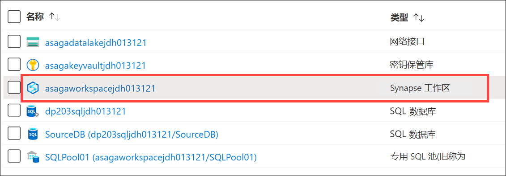

3. 在 Synapse 工作区“概述”边栏选项卡中，选择 `Open Synapse Studio` 中的 **“打开”** 链接。

    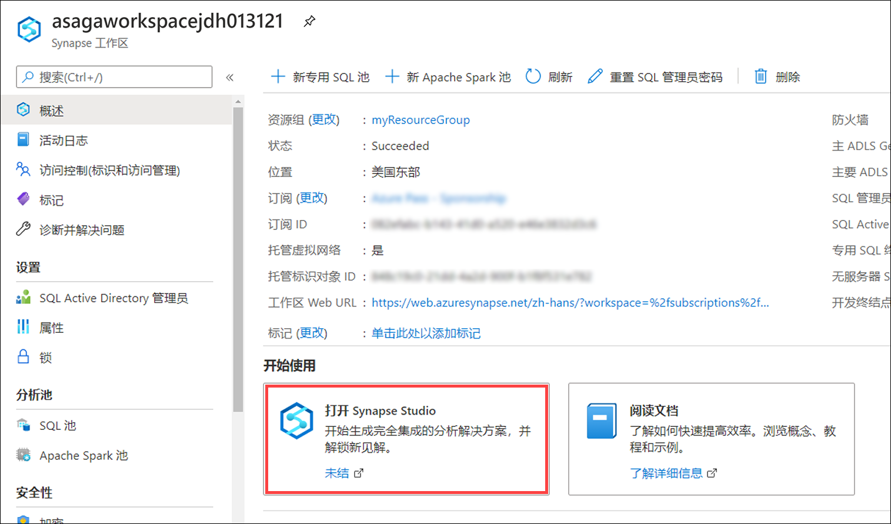

4. 在 Synapse Studio 中，导航到 **“数据”** 中心。

    

5. 选择 **“工作区”** 选项卡 **(1)**， 展开 “数据库”，然后右键单击 **“SQLPool01”(2)**。选择 **“新建 SQL 脚本”(3)**，然后选择 **“空脚本”(4)**。

    

6. 将以下脚本粘贴到空的脚本窗口中，然后选择 **“运行”** 或按 `F5` 执行查询。你可能会注意到原始 SQL 星型架构创建脚本进行了一些更改。一些显著的更改包括：
    - 已将分布设置添加到每个表中
    - 聚集列存储索引用于大多数表。
    - 哈希函数用于事实数据表分布，因为它将是一个较大的表，应该跨节点分布。
    - 一些字段使用无法包含在 Azure Synapse 中的聚集列存储索引中的 varbinary 数据类型。一个简单的解决方案是改用聚集索引。
    
    ```sql
    CREATE TABLE dbo.[DimCustomer](
        [CustomerID] [int] NOT NULL,
        [Title] [nvarchar](8) NULL,
        [FirstName] [nvarchar](50) NOT NULL,
        [MiddleName] [nvarchar](50) NULL,
        [LastName] [nvarchar](50) NOT NULL,
        [Suffix] [nvarchar](10) NULL,
        [CompanyName] [nvarchar](128) NULL,
        [SalesPerson] [nvarchar](256) NULL,
        [EmailAddress] [nvarchar](50) NULL,
        [Phone] [nvarchar](25) NULL,
        [InsertedDate] [datetime] NOT NULL,
        [ModifiedDate] [datetime] NOT NULL,
        [HashKey] [char](66)
    )
    WITH
    (
        DISTRIBUTION = REPLICATE,
        CLUSTERED COLUMNSTORE INDEX
    );
    GO
    
    CREATE TABLE [dbo].[FactResellerSales](
        [ProductKey] [int] NOT NULL,
        [OrderDateKey] [int] NOT NULL,
        [DueDateKey] [int] NOT NULL,
        [ShipDateKey] [int] NOT NULL,
        [ResellerKey] [int] NOT NULL,
        [EmployeeKey] [int] NOT NULL,
        [PromotionKey] [int] NOT NULL,
        [CurrencyKey] [int] NOT NULL,
        [SalesTerritoryKey] [int] NOT NULL,
        [SalesOrderNumber] [nvarchar](20) NOT NULL,
        [SalesOrderLineNumber] [tinyint] NOT NULL,
        [RevisionNumber] [tinyint] NULL,
        [OrderQuantity] [smallint] NULL,
        [UnitPrice] [money] NULL,
        [ExtendedAmount] [money] NULL,
        [UnitPriceDiscountPct] [float] NULL,
        [DiscountAmount] [float] NULL,
        [ProductStandardCost] [money] NULL,
        [TotalProductCost] [money] NULL,
        [SalesAmount] [money] NULL,
        [TaxAmt] [money] NULL,
        [Freight] [money] NULL,
        [CarrierTrackingNumber] [nvarchar](25) NULL,
        [CustomerPONumber] [nvarchar](25) NULL,
        [OrderDate] [datetime] NULL,
        [DueDate] [datetime] NULL,
        [ShipDate] [datetime] NULL
    )
    WITH
    (
        DISTRIBUTION = HASH([SalesOrderNumber]),
        CLUSTERED COLUMNSTORE INDEX
    );
    GO

    CREATE TABLE [dbo].[DimDate]
    ( 
        [DateKey] [int]  NOT NULL,
        [DateAltKey] [datetime]  NOT NULL,
        [CalendarYear] [int]  NOT NULL,
        [CalendarQuarter] [int]  NOT NULL,
        [MonthOfYear] [int]  NOT NULL,
        [MonthName] [nvarchar](15)  NOT NULL,
        [DayOfMonth] [int]  NOT NULL,
        [DayOfWeek] [int]  NOT NULL,
        [DayName] [nvarchar](15)  NOT NULL,
        [FiscalYear] [int]  NOT NULL,
        [FiscalQuarter] [int]  NOT NULL
    )
    WITH
    (
        DISTRIBUTION = REPLICATE,
        CLUSTERED COLUMNSTORE INDEX
    );
    GO

    CREATE TABLE [dbo].[DimReseller](
        [ResellerKey] [int] NOT NULL,
        [GeographyKey] [int] NULL,
        [ResellerAlternateKey] [nvarchar](15) NULL,
        [Phone] [nvarchar](25) NULL,
        [BusinessType] [varchar](20) NOT NULL,
        [ResellerName] [nvarchar](50) NOT NULL,
        [NumberEmployees] [int] NULL,
        [OrderFrequency] [char](1) NULL,
        [OrderMonth] [tinyint] NULL,
        [FirstOrderYear] [int] NULL,
        [LastOrderYear] [int] NULL,
        [ProductLine] [nvarchar](50) NULL,
        [AddressLine1] [nvarchar](60) NULL,
        [AddressLine2] [nvarchar](60) NULL,
        [AnnualSales] [money] NULL,
        [BankName] [nvarchar](50) NULL,
        [MinPaymentType] [tinyint] NULL,
        [MinPaymentAmount] [money] NULL,
        [AnnualRevenue] [money] NULL,
        [YearOpened] [int] NULL
    )
    WITH
    (
        DISTRIBUTION = REPLICATE,
        CLUSTERED COLUMNSTORE INDEX
    );
    GO
    
    CREATE TABLE [dbo].[DimEmployee](
        [EmployeeKey] [int] NOT NULL,
        [ParentEmployeeKey] [int] NULL,
        [EmployeeNationalIDAlternateKey] [nvarchar](15) NULL,
        [ParentEmployeeNationalIDAlternateKey] [nvarchar](15) NULL,
        [SalesTerritoryKey] [int] NULL,
        [FirstName] [nvarchar](50) NOT NULL,
        [LastName] [nvarchar](50) NOT NULL,
        [MiddleName] [nvarchar](50) NULL,
        [NameStyle] [bit] NOT NULL,
        [Title] [nvarchar](50) NULL,
        [HireDate] [date] NULL,
        [BirthDate] [date] NULL,
        [LoginID] [nvarchar](256) NULL,
        [EmailAddress] [nvarchar](50) NULL,
        [Phone] [nvarchar](25) NULL,
        [MaritalStatus] [nchar](1) NULL,
        [EmergencyContactName] [nvarchar](50) NULL,
        [EmergencyContactPhone] [nvarchar](25) NULL,
        [SalariedFlag] [bit] NULL,
        [Gender] [nchar](1) NULL,
        [PayFrequency] [tinyint] NULL,
        [BaseRate] [money] NULL,
        [VacationHours] [smallint] NULL,
        [SickLeaveHours] [smallint] NULL,
        [CurrentFlag] [bit] NOT NULL,
        [SalesPersonFlag] [bit] NOT NULL,
        [DepartmentName] [nvarchar](50) NULL,
        [StartDate] [date] NULL,
        [EndDate] [date] NULL,
        [Status] [nvarchar](50) NULL,
        [EmployeePhoto] [varbinary](max) NULL
    )
    WITH
    (
        DISTRIBUTION = REPLICATE,
        CLUSTERED INDEX (EmployeeKey)
    );
    GO
    
    CREATE TABLE [dbo].[DimProduct](
        [ProductKey] [int] NOT NULL,
        [ProductAlternateKey] [nvarchar](25) NULL,
        [ProductSubcategoryKey] [int] NULL,
        [WeightUnitMeasureCode] [nchar](3) NULL,
        [SizeUnitMeasureCode] [nchar](3) NULL,
        [EnglishProductName] [nvarchar](50) NOT NULL,
        [SpanishProductName] [nvarchar](50) NULL,
        [FrenchProductName] [nvarchar](50) NULL,
        [StandardCost] [money] NULL,
        [FinishedGoodsFlag] [bit] NOT NULL,
        [Color] [nvarchar](15) NOT NULL,
        [SafetyStockLevel] [smallint] NULL,
        [ReorderPoint] [smallint] NULL,
        [ListPrice] [money] NULL,
        [Size] [nvarchar](50) NULL,
        [SizeRange] [nvarchar](50) NULL,
        [Weight] [float] NULL,
        [DaysToManufacture] [int] NULL,
        [ProductLine] [nchar](2) NULL,
        [DealerPrice] [money] NULL,
        [Class] [nchar](2) NULL,
        [Style] [nchar](2) NULL,
        [ModelName] [nvarchar](50) NULL,
        [LargePhoto] [varbinary](max) NULL,
        [EnglishDescription] [nvarchar](400) NULL,
        [FrenchDescription] [nvarchar](400) NULL,
        [ChineseDescription] [nvarchar](400) NULL,
        [ArabicDescription] [nvarchar](400) NULL,
        [HebrewDescription] [nvarchar](400) NULL,
        [ThaiDescription] [nvarchar](400) NULL,
        [GermanDescription] [nvarchar](400) NULL,
        [JapaneseDescription] [nvarchar](400) NULL,
        [TurkishDescription] [nvarchar](400) NULL,
        [StartDate] [datetime] NULL,
        [EndDate] [datetime] NULL,
        [Status] [nvarchar](7) NULL    
    )
    WITH
    (
        DISTRIBUTION = REPLICATE,
        CLUSTERED INDEX (ProductKey)
    );
    GO

    CREATE TABLE [dbo].[DimGeography](
        [GeographyKey] [int] NOT NULL,
        [City] [nvarchar](30) NULL,
        [StateProvinceCode] [nvarchar](3) NULL,
        [StateProvinceName] [nvarchar](50) NULL,
        [CountryRegionCode] [nvarchar](3) NULL,
        [EnglishCountryRegionName] [nvarchar](50) NULL,
        [SpanishCountryRegionName] [nvarchar](50) NULL,
        [FrenchCountryRegionName] [nvarchar](50) NULL,
        [PostalCode] [nvarchar](15) NULL,
        [SalesTerritoryKey] [int] NULL,
        [IpAddressLocator] [nvarchar](15) NULL
    )
    WITH
    (
        DISTRIBUTION = REPLICATE,
        CLUSTERED COLUMNSTORE INDEX
    );
    GO
    ```
    你将在脚本窗口的左上角找到 `Run`。
    

### 任务 2：将数据加载到 Synapse 表

在此任务中，你将使用公共数据源中的数据加载 Synapse 维度表和事实数据表。使用 T-SQL 从 Azure 存储文件加载此数据有两种方法：COPY 命令或使用 Polybase 从外部表中选择。对于此任务，你将使用 COPY，因为它是一种从 Azure 存储加载分隔数据的简单而灵活的语法。如果源是一个专用存储帐户，你可以包含一个 CREDENTIAL 选项来授权 COPY 命令读取数据，但对于这个示例，这不是必需的。

1. 粘贴以下内容**并执行**查询以将数据插入到事实数据表和维度表：

    ```sql
    COPY INTO [dbo].[DimProduct]
    FROM 'https://solliancepublicdata.blob.core.windows.net/dataengineering/dp-203/awdata/DimProduct.csv'
    WITH (
        FILE_TYPE='CSV',
        FIELDTERMINATOR='|',
        FIELDQUOTE='',
        ROWTERMINATOR='\n',
        ENCODING = 'UTF16'
    );
    GO

    COPY INTO [dbo].[DimReseller]
    FROM 'https://solliancepublicdata.blob.core.windows.net/dataengineering/dp-203/awdata/DimReseller.csv'
    WITH (
        FILE_TYPE='CSV',
        FIELDTERMINATOR='|',
        FIELDQUOTE='',
        ROWTERMINATOR='\n',
        ENCODING = 'UTF16'
    );
    GO

    COPY INTO [dbo].[DimEmployee]
    FROM 'https://solliancepublicdata.blob.core.windows.net/dataengineering/dp-203/awdata/DimEmployee.csv'
    WITH (
        FILE_TYPE='CSV',
        FIELDTERMINATOR='|',
        FIELDQUOTE='',
        ROWTERMINATOR='\n',
        ENCODING = 'UTF16'
    );
    GO

    COPY INTO [dbo].[DimGeography]
    FROM 'https://solliancepublicdata.blob.core.windows.net/dataengineering/dp-203/awdata/DimGeography.csv'
    WITH (
        FILE_TYPE='CSV',
        FIELDTERMINATOR='|',
        FIELDQUOTE='',
        ROWTERMINATOR='\n',
        ENCODING = 'UTF16'
    );
    GO

    COPY INTO [dbo].[FactResellerSales]
    FROM 'https://solliancepublicdata.blob.core.windows.net/dataengineering/dp-203/awdata/FactResellerSales.csv'
    WITH (
        FILE_TYPE='CSV',
        FIELDTERMINATOR='|',
        FIELDQUOTE='',
        ROWTERMINATOR='\n',
        ENCODING = 'UTF16'
    );
    GO
    ```

2. 要在 Azure Synapse 中填充时间维度表，从分隔文件加载数据是最快的，因为用于创建时间数据的循环方法运行缓慢。如果要填充这个重要的时间维度，请将以下内容粘贴到查询窗口**并执行**查询：

    ```sql
    COPY INTO [dbo].[DimDate]
    FROM 'https://solliancepublicdata.blob.core.windows.net/dataengineering/dp-203/awdata/DimDate.csv'
    WITH (
        FILE_TYPE='CSV',
        FIELDTERMINATOR='|',
        FIELDQUOTE='',
        ROWTERMINATOR='0x0a',
        ENCODING = 'UTF16'
    );
    GO
    ```

### 任务 3：从 Synapse 查询数据

1. 粘贴**并执行**以下查询，从 Synapse 星型架构中的经销商位置、产品和月份粒度级别检索经销商销售数据：

    ```sql
    SELECT
        Coalesce(p.[ModelName], p.[EnglishProductName]) AS [Model]
        ,g.City AS ResellerCity
        ,g.StateProvinceName AS StateProvince
        ,d.[CalendarYear]
        ,d.[FiscalYear]
        ,d.[MonthOfYear] AS [Month]
        ,sum(f.OrderQuantity) AS Quantity
        ,sum(f.ExtendedAmount) AS Amount
        ,approx_count_distinct(f.SalesOrderNumber) AS UniqueOrders  
    FROM
        [dbo].[FactResellerSales] f
    INNER JOIN [dbo].[DimReseller] r
        ON f.ResellerKey = r.ResellerKey
    INNER JOIN [dbo].[DimGeography] g
        ON r.GeographyKey = g.GeographyKey
    INNER JOIN [dbo].[DimDate] d
        ON f.[OrderDateKey] = d.[DateKey]
    INNER JOIN [dbo].[DimProduct] p
        ON f.[ProductKey] = p.[ProductKey]
    GROUP BY
        Coalesce(p.[ModelName], p.[EnglishProductName])
        ,g.City
        ,g.StateProvinceName
        ,d.[CalendarYear]
        ,d.[FiscalYear]
        ,d.[MonthOfYear]
    ORDER BY Amount DESC
    ```

    应会看到类似下面的输出：

    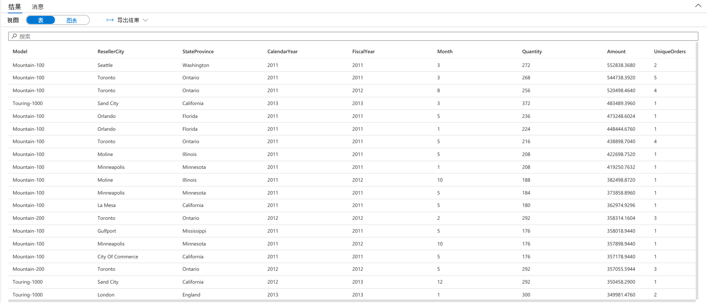

2. 使用以下内容替换**并执行**查询，以将结果限制为 2012 至 2013 会计年度的 10 月销售额：

    ```sql
    SELECT
        Coalesce(p.[ModelName], p.[EnglishProductName]) AS [Model]
        ,g.City AS ResellerCity
        ,g.StateProvinceName AS StateProvince
        ,d.[CalendarYear]
        ,d.[FiscalYear]
        ,d.[MonthOfYear] AS [Month]
        ,sum(f.OrderQuantity) AS Quantity
        ,sum(f.ExtendedAmount) AS Amount
        ,approx_count_distinct(f.SalesOrderNumber) AS UniqueOrders  
    FROM
        [dbo].[FactResellerSales] f
    INNER JOIN [dbo].[DimReseller] r
        ON f.ResellerKey = r.ResellerKey
    INNER JOIN [dbo].[DimGeography] g
        ON r.GeographyKey = g.GeographyKey
    INNER JOIN [dbo].[DimDate] d
        ON f.[OrderDateKey] = d.[DateKey]
    INNER JOIN [dbo].[DimProduct] p
        ON f.[ProductKey] = p.[ProductKey]
    WHERE d.[MonthOfYear] = 10 AND d.[FiscalYear] IN (2012, 2013)
    GROUP BY
        Coalesce(p.[ModelName], p.[EnglishProductName])
        ,g.City
        ,g.StateProvinceName
        ,d.[CalendarYear]
        ,d.[FiscalYear]
        ,d.[MonthOfYear]
    ORDER BY d.[FiscalYear]
    ```

    应会看到类似下面的输出：

    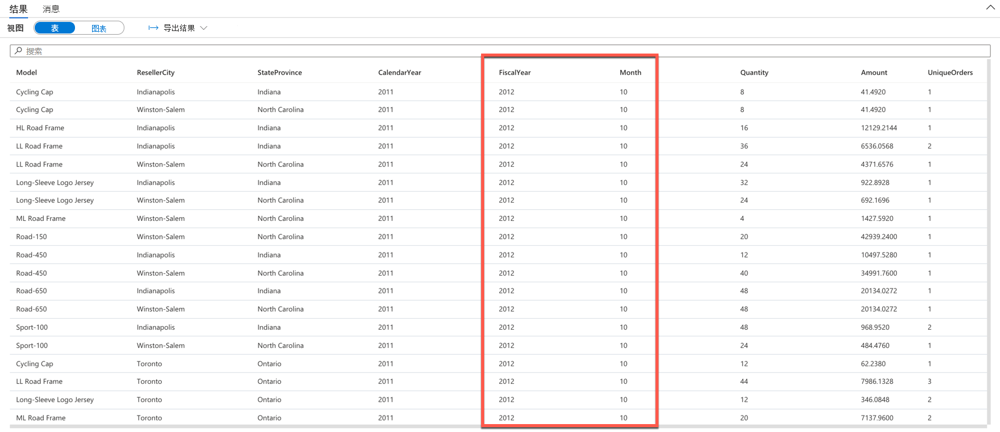

    > 请注意使用**时间维度表是**如何使按特定日期部分和逻辑日期（例如会计年度）进行筛选比动态计算日期函数更容易且性能更高。

## 练习 5：使用映射数据流更新缓慢变化维度

**缓慢变化维度** (SCD) 是指随着时间的推移适当地管理维度成员变化的维度。当业务实体值随时间变化时，它将以临时方式应用。缓慢变化维度的一个很好的示例是客户维度，特别是它的联系人详细信息列，如电子邮件地址和电话号码。相反，当维度属性经常发生变化时，一些维度被认为是快速变化的，例如股票的市场价格。在这些情况下，常用的设计方法是在事实数据表度量中存储快速变化的属性值。

星型架构设计理论参考了两种常见的 SCD 类型：类型 1 和类型 2。维度类型表可以是 类型 1 或类型 2，或者对不同的列同时支持这两种类型。

**类型 1 SCD**

**类型 1 SCD** 始终反映最新的值，并且当检测到源数据中的更改时，将覆盖维度表数据。这种设计方法通常用于存储补充值（如客户的电子邮件地址或电话号码）的列。当客户电子邮件地址或电话号码更改时，维度表将用新值更新客户行。就好像客户始终具有此联系人信息。

**类型 2 SCD**

**类型 2 SCD** 支持对维度成员进行版本控制。如果源系统不存储版本，那么通常是数据仓库加载过程检测更改，并在维度表中适当地管理更改。在这种情况下，维度表必须使用代理键来提供对维度成员版本的唯一引用。它还包括定义版本的日期范围有效性的列（例如 `StartDate` 和 `EndDate`），并且可能包括一个标志列（例如 `IsCurrent`），以便按当前维度成员轻松进行筛选。

例如，Adventure Works 将销售人员分配到销售区域。当销售人员重新定位区域时，必须创建新版本的销售人员，以确保历史事实与前一个区域保持关联。为了支持按销售人员对销售进行准确的历史分析，维度表必须存储销售人员及其关联区域的版本。该表还应包括开始和结束日期值，以定义时间有效性。当前版本可能会定义一个空的结束日期（或 12/31/9999），表示该行是当前版本。该表还必须定义代理键，因为业务键（在本例中为员工 ID）不是唯一的。

当源数据不存储版本时，必须使用一个中间系统（如数据仓库）来检测和存储更改，理解这一点很重要。表加载过程必须保留现有数据并检测更改。当检测到更改时，表加载过程必须使当前版本过期。它通过更新 `EndDate` 值并插入一个具有从先前 `EndDate` 值开始的 `StartDate` 值的新版本来记录这些更改。此外，相关事实必须使用基于时间的查找来检索与事实日期相关的维度键值。

在此练习中，你将创建一个 类型 1 SCD，其中 Azure SQL 数据库作为源，Synapse 专用 SQL 池作为目标。

### 任务 1：创建 Azure SQL 数据库链接服务

借助 Synapse Analytics 中的链接服务，你能够管理到外部资源的连接。在此任务中，你将为用作 `DimCustomer` 维度表的数据源的 Azure SQL 数据库创建链接服务。

1. 在 Synapse Studio 中，导航到 **“管理”** 中心。

    

2. 选择左侧的 **“链接服务”**，然后选择 **“+ 新建”**。

    

3. 选择 **“Azure SQL 数据库”**，然后选择 **“继续”**。

    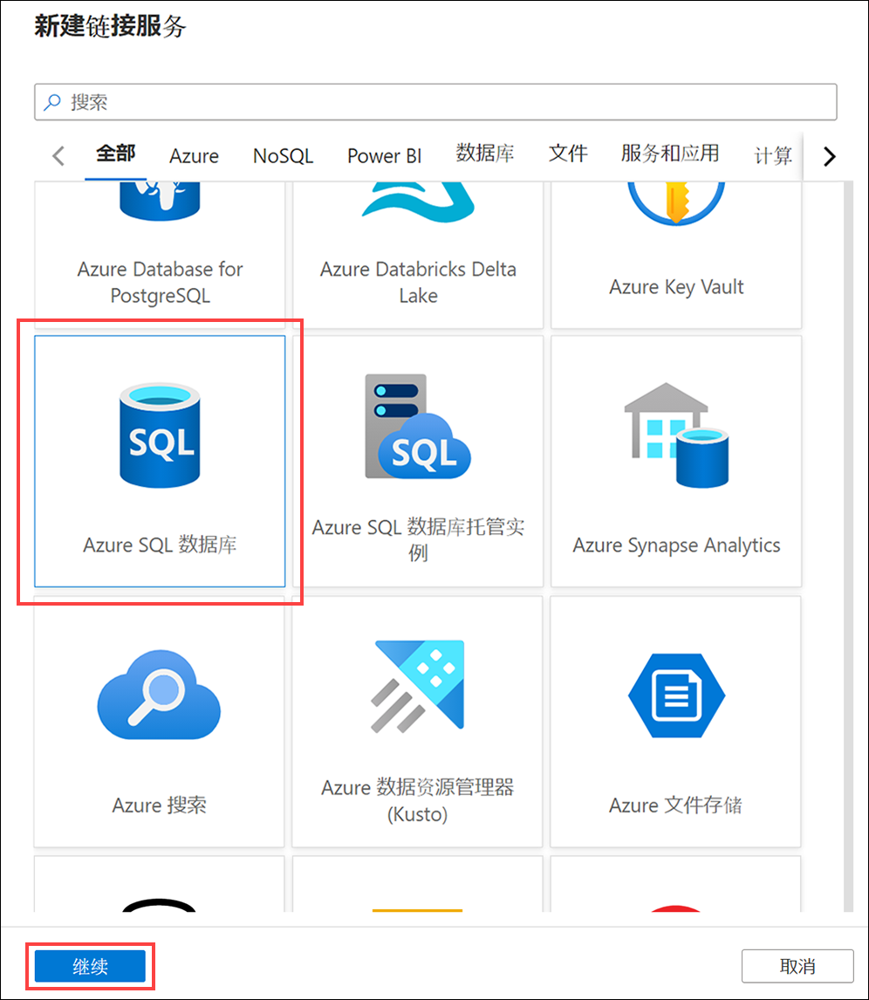

4. 按如下方式填写“新建链接服务”表单：

    - **名称**： 输入 `AzureSqlDatabaseSource`
    - **帐户选择方式**： 选择 `From Azure subscription`
    - **Azure 订阅**： 选择用于本实验室的 Azure 订阅
    - **服务器名称**： 选择名为 `dp203sqlSUFFIX` 的 Azure SQL Server（其中 SUFFIX 是你的唯一后缀）
    - **数据库名称**： 选择 `SourceDB`
    - **身份验证类型**： 选择 `SQL authentication`
    - **用户名**： 输入 `sqladmin`
    - **密码**： 输入你在环境设置期间提供的密码，或者如果这是托管实验室环境，则输入提供给你的密码（也在本实验室开始时使用）

    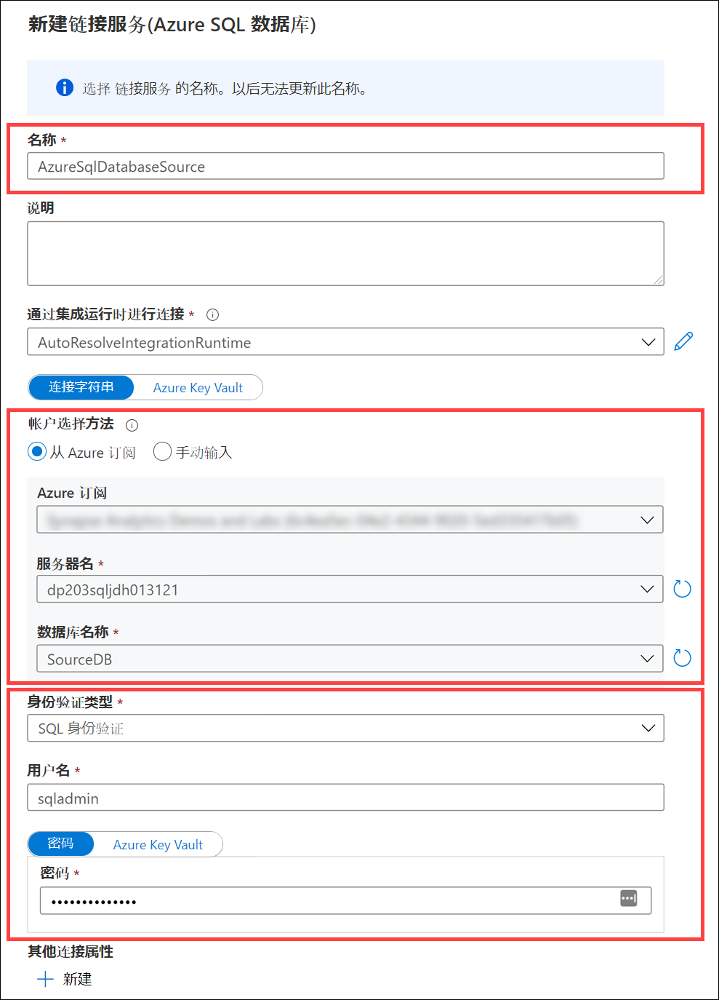

5. 选择 **“创建”**。

### 任务 2：创建映射数据流

映射数据流是管道活动，通过无代码体验提供一种直观方式来指定数据转换方式。此功能提供数据清理、转换、聚合、转化、联接、数据复制操作等。

在此任务中，你将创建映射数据流以创建 类型 1 SCD。

1. 导航到 **“开发”** 中心。

    

2. 选择 **“+”**，然后选择 **“数据流”**。

    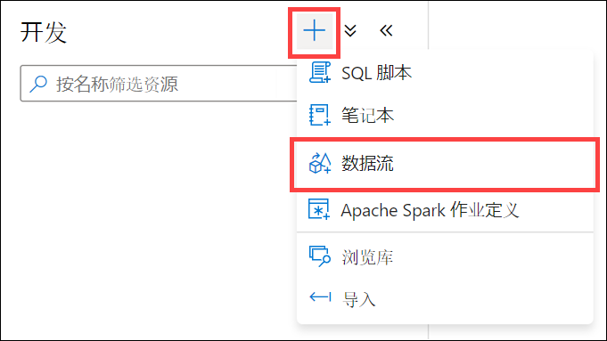

3. 在新数据流的属性窗格中，在 **“名称”** 字段 **(1)** 中输入 `UpdateCustomerDimension`，然后选择 **“属性”** 按钮 **(2)** 以隐藏属性窗格。

    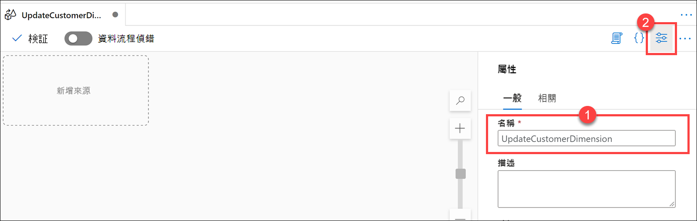

4. 选择 **“数据流调试”** 以启用调试程序。这样，我们将能够在管道中执行数据流之前预览数据转换和调试数据流。

    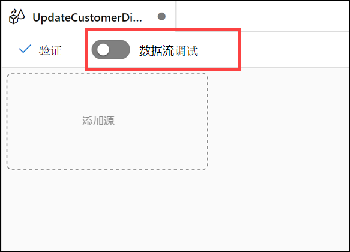

5. 在显示的对话框中选择 **“确定”** 以打开数据流调试。

    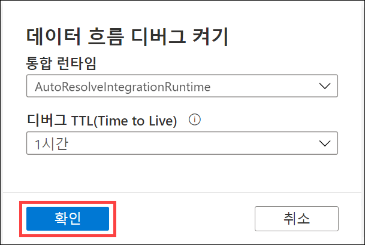

    调试群集将在几分钟后启动。同时，可以继续执行下一步。

6. 在画布上选择 **“添加源”**。

    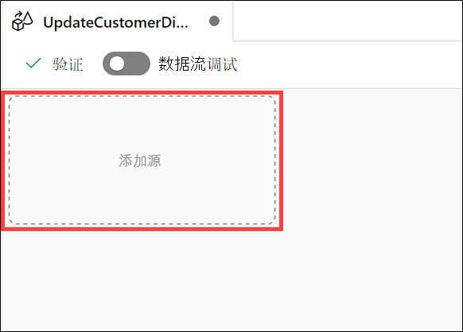

7. 在`Source settings`下，配置以下属性：

    - **输出流名称**： 输入`SourceDB`
    - **源类型**： 选择`Dataset`
    - **选项**： 选择`Allow schema drift`并使其他选项保持为未选中状态
    - **采样**： 选择`Disable`
    - **数据集**： 选择 **“+ 新建”**，创建新数据集

    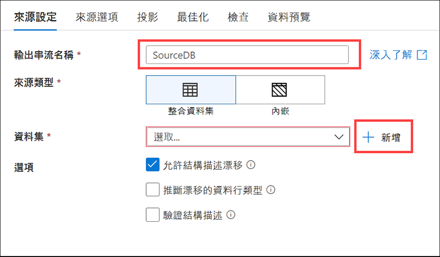

8. 在“新建集成数据集”对话框中，选择 **“Azure SQL 数据库”**，然后选择 **“继续”**。

    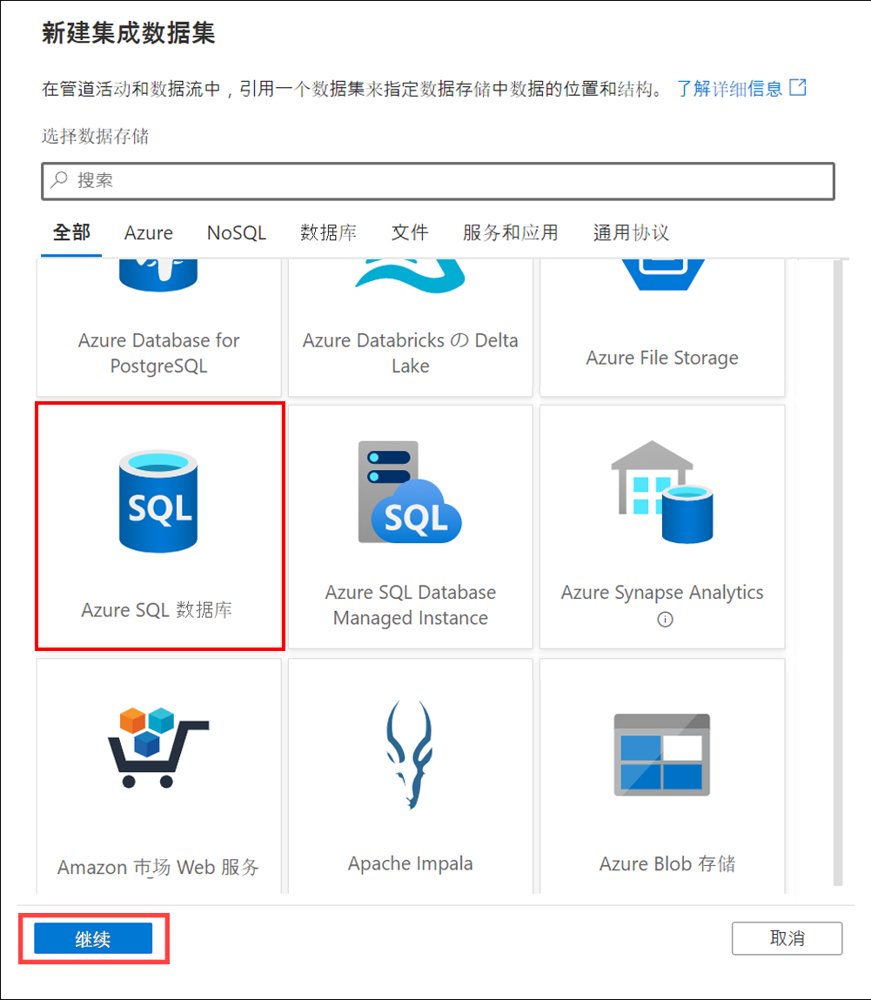

9. 在数据集属性中，配置以下内容：

    - **名称**： 输入 `SourceCustomer`
    - **链接服务**： 选择 `AzureSqlDatabaseSource`
    - **表名称**： 选择 `SalesLT.Customer`

    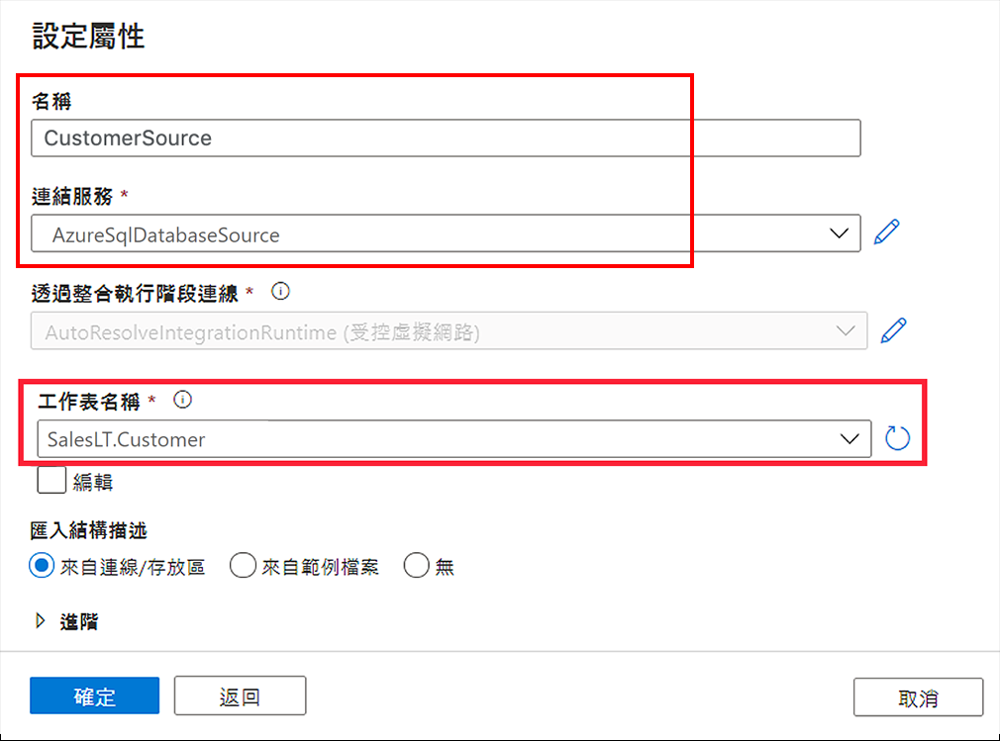

10. 选择 **“确定”** 以创建数据集。

11. `SourceCustomer` 数据集现在应该出现，并已选为源设置的数据集。

    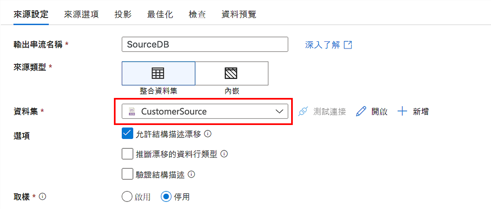

12. 选择画布上 `SourceDB` 源右侧的 **“+”**，然后选择 **“派生列”**。

    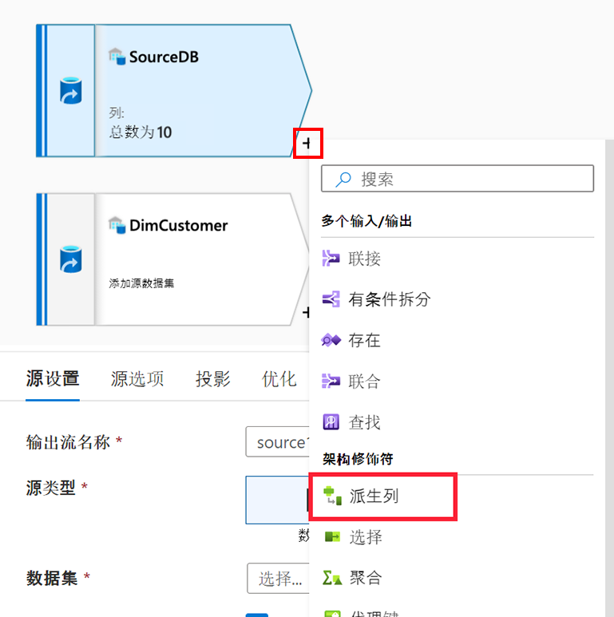

13. 在`Derived column's settings`下，配置以下属性：

    - **输出流名称**： 输入 `CreateCustomerHash`
    - **传入流**： 选择 `SourceDB`
    - **列**： 输入以下内容：

    | 列 | 表达式 | 描述 |
    | --- | --- | --- |
    | 键入 `HashKey` | `sha2(256, iifNull(Title,'') +FirstName +iifNull(MiddleName,'') +LastName +iifNull(Suffix,'') +iifNull(CompanyName,'') +iifNull(SalesPerson,'') +iifNull(EmailAddress,'') +iifNull(Phone,''))` | 创建表值的 SHA256 哈希。通过将传入记录的哈希与目标记录的哈希值进行比较（匹配 `CustomerID` 值）来使用该值检测行更改。`iifNull` 函数用空字符串替换 null 值。否则，当存在 null 条目时，哈希值往往会重复。 |

    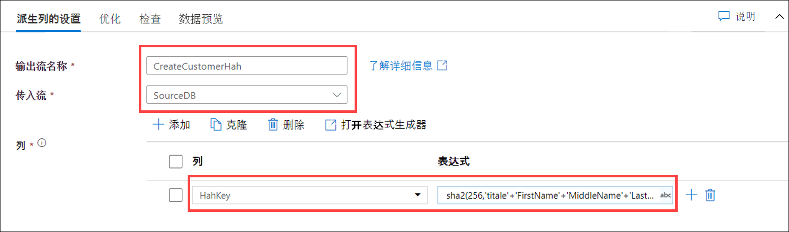

14. 单击 **“表达式”** 文本框，然后选择 **“打开表达式生成器”**。

    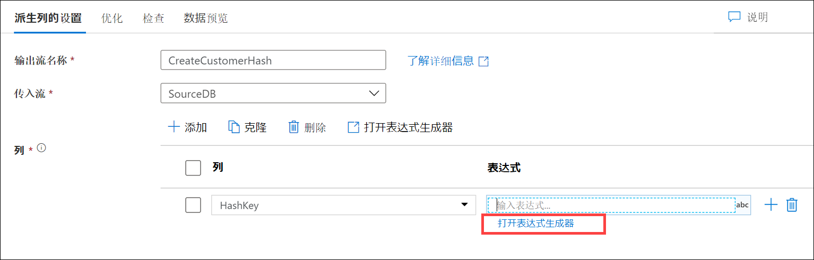

15. 选择 `Data preview` 旁边的 **“刷新”** 以预览 `HashKey` 列的输出，该列使用你添加的 `sha2` 函数。你应会看到每个哈希值都是唯一的。

    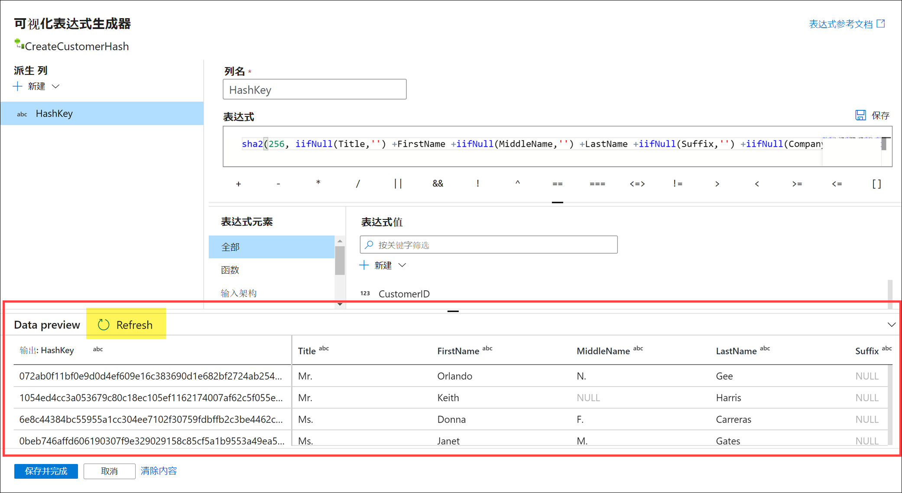

16. 选择 **“保存并完成”** 以关闭表达式生成器。

17. 在 `SourceDB` 源下面的画布上选择 **“添加源”**。我们需要添加位于 Synapse 专用 SQL 池中的 `DimCustomer` 表，以便在比较记录的存在和比较哈希时使用。

    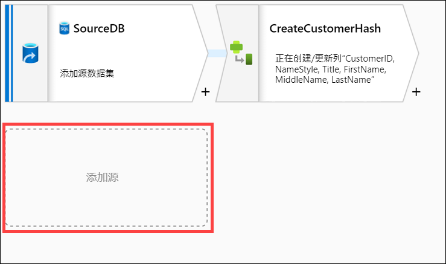

18. 在`Source settings`下，配置以下属性：

    - **输出流名称**：输入`SynapseDimCustomer`
    - **源类型**：选择`Dataset`
    - **选项**： 选择`Allow schema drift`并使其他选项保持为未选中状态
    - **采样**：选择`Disable`
    - **数据集**：选择 **“+ 新建”**，创建新数据集

    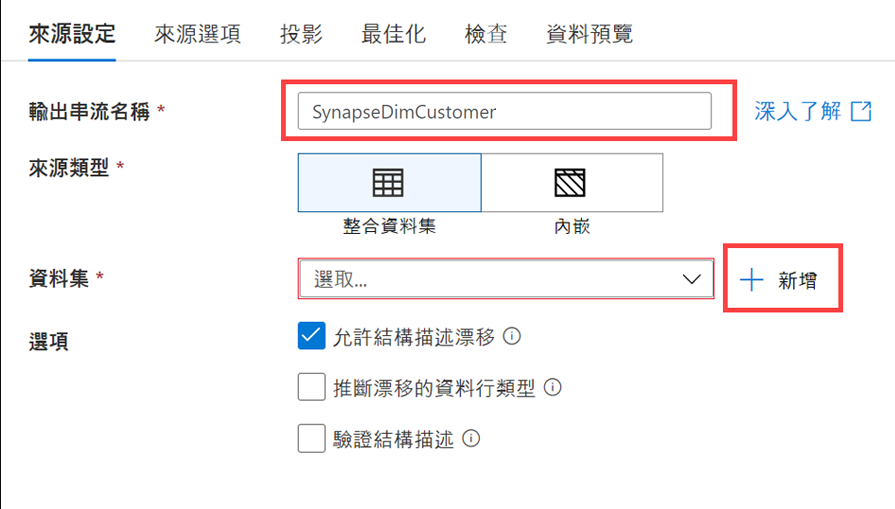

19. 在“新建集成数据集”对话框中，选择 **“Azure Synapse Analytics”**，然后选择 **“继续”**。

    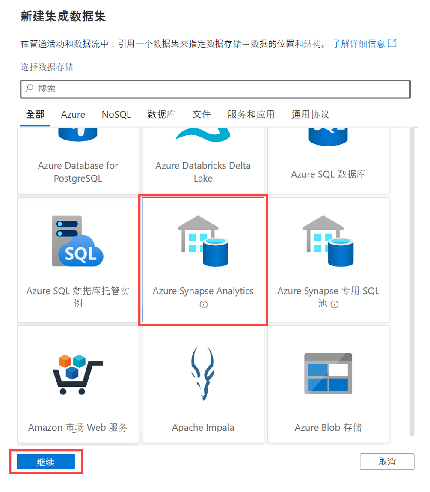

20. 在数据集属性中，配置以下内容：

    - **名称**：输入 `DimCustomer`
    - **链接服务**： 选择 Synapse 工作区链接服务
    - **表名称**：选择下拉菜单旁边的 **“刷新”** 按钮

    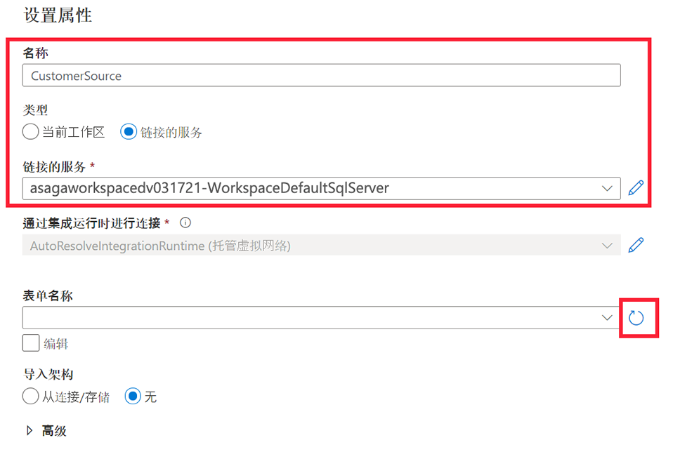

21. 在 **“值”** 字段中，输入 `SQLPool01`，然后选择 **“确定”**。

    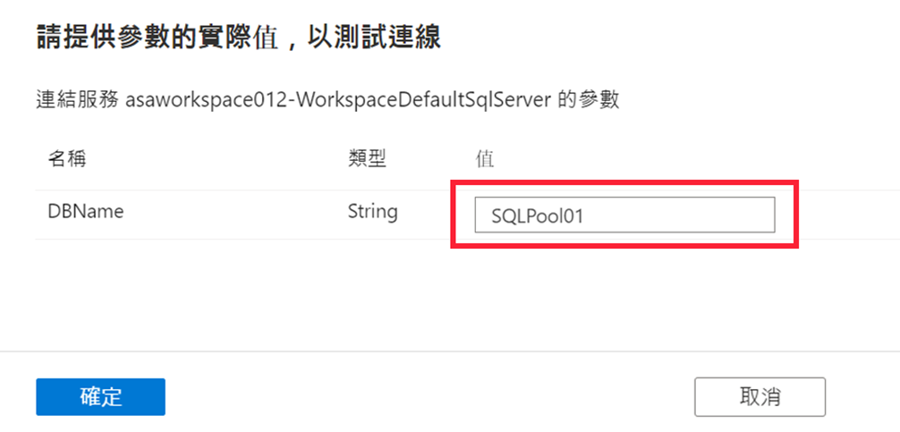

22. 在 **“表名称”** 下选择 `dbo.DimCustomer`，在 **“导入架构”** 下选择 `From connection/store`，然后选择 **“确定”** 创建数据集。

    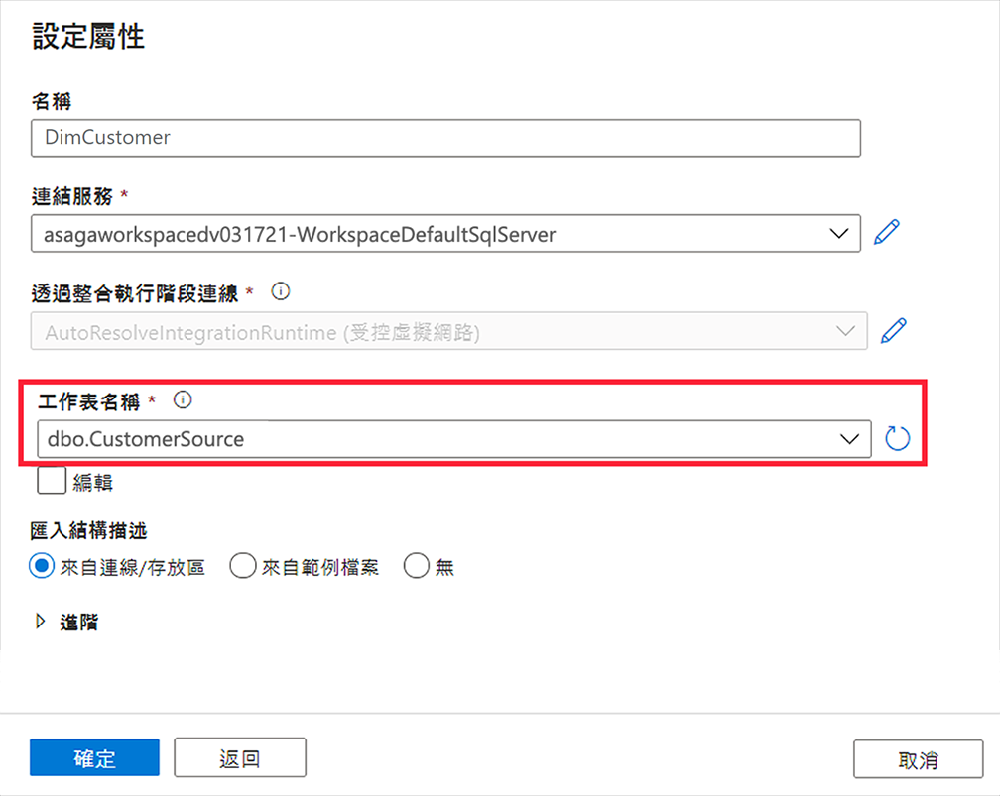

23. `DimCustomer` 数据集现在应该出现，并已选为源设置的数据集。

    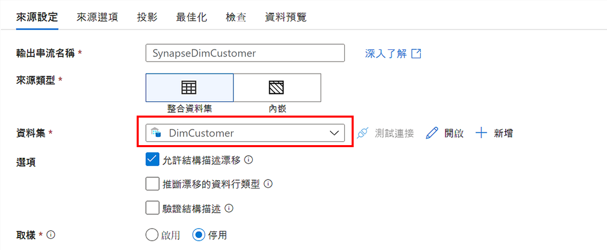

24. 选择你添加的 `DimCustomer` 数据集旁边的 **“打开”**。

    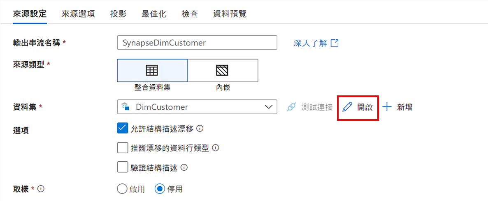

25. 在 `DBName` 旁边的 **“值”** 字段中输入 `SQLPool01`。

    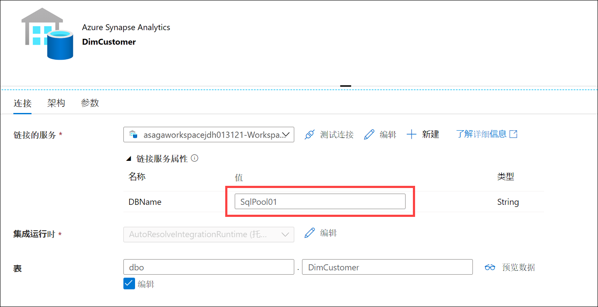

26. 切换回数据流。请*不要*关闭 `DimCustomer` 数据集。选择画布上 `CreateCustomerHash` 派生列右侧的 **“+”**，然后选择 **“存在”**。

    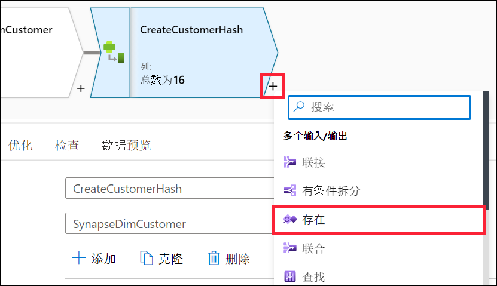

27. 在`Exists settings`下，配置以下属性：

    - **输出流名称**： 输入`Exists`
    - **左流**：选择 `CreateCustomerHash`
    - **右流**：选择 `SynapseDimCustomer`
    - **存在类型**：选择`Doesn't exist`
    - **存在条件**： 为左流和右流设置以下内容：

    | 左：CreateCustomerHash 的列 | 右：SynapseDimCustomer 的列 |
    | --- | --- |
    | `HashKey` | `HashKey` |

    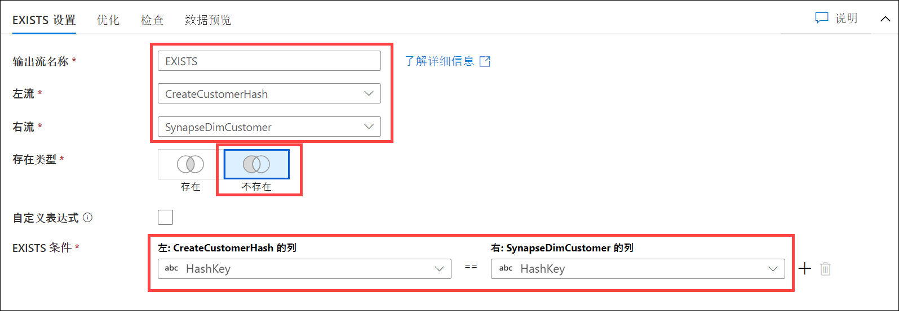

28. 选择画布上`Exists`右侧的 **“+”**，然后选择 **“查找”**。

    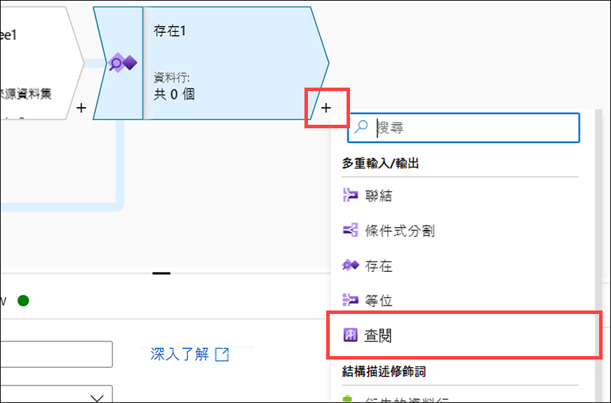

29. 在`Lookup settings`下，配置以下属性：

    - **输出流名称**：输入`LookupCustomerID`
    - **主流**：选择`Exists`
    - **查找流**：选择`SynapseDimCustomer`
    - **匹配多个行**：未选中
    - **匹配**：选择`Any row`
    - **查找条件**：为左流和右流设置以下内容：

    | 左：存在的列 | 右：SynapseDimCustomer 的列 |
    | --- | --- |
    | `CustomerID` | `CustomerID` |

    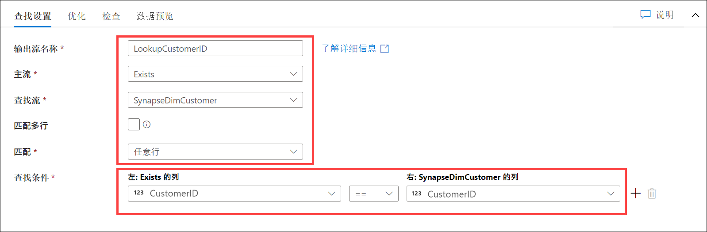

30. 选择画布上 `LookupCustomerID` 右侧的 **“+”**，然后选择 **“派生列”**。

    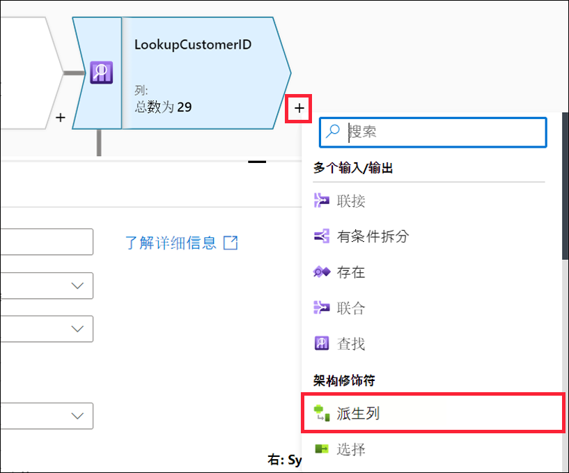

31. 在`Derived column's settings`下，配置以下属性：

    - **输出流名称**： 输入 `SetDates`
    - **传入流**：选择 `LookupCustomerID`
    - **列**：输入以下内容：

    | 列 | 表达式 | 描述 |
    | --- | --- | --- |
    | 选择 `InsertedDate` | `iif(isNull(InsertedDate), currentTimestamp(), {InsertedDate})` | 如果 `InsertedDate` 值为 null，请插入当前时间戳。否则，请使用 `InsertedDate` 值。 |
    | 选择 `ModifiedDate` | `currentTimestamp()` | 始终使用当前时间戳更新 `ModifiedDate` 值。 |

    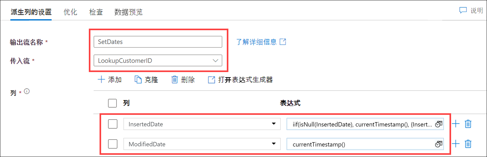

    > **备注**： 若要插入第二列，请选择“列”列表上方的 **“+ 添加”**，然后选择 **“添加列”**。

32. 选择画布上 `SetDates` 派生列步骤右侧的 **“+”**，然后选择 **“更改行”**。

    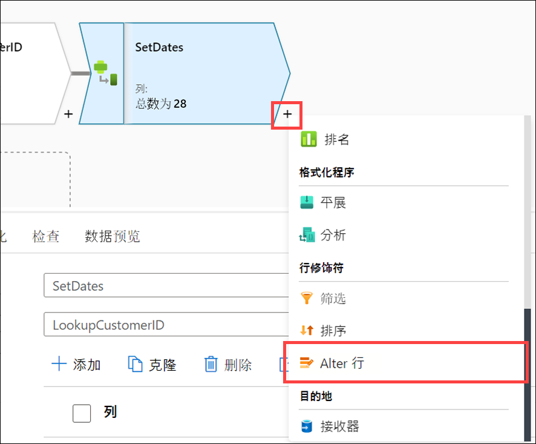

33. 在`Alter row settings`下，配置以下属性：

    - **输出流名称**：输入 `AllowUpserts`
    - **传入流**：选择 `SetDates`
    - **更改行条件**：输入以下内容：

    | 条件 | 表达式 | 描述 |
    | --- | --- | --- |
    | 选择 `Upsert if` | `true()` | 在 `Upsert if` 条件上将条件设置为 `true()` 以允许更新插入。这将确保通过映射数据流中的步骤的所有数据都将插入或更新到接收器中。 |

    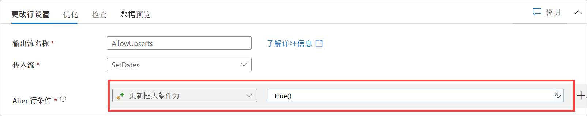

34. 选择画布上 `AllowUpserts` 更改行步骤右侧的 **“+”**，然后选择 **“接收器”**。

    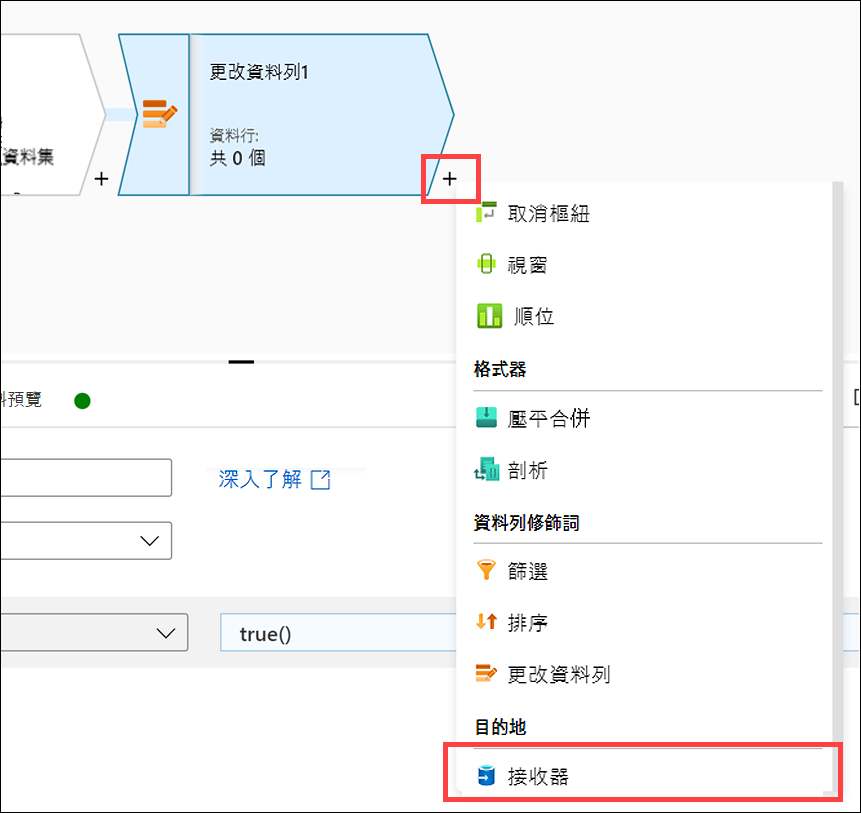

35. 在`Sink`下，配置以下属性：

    - **输出流名称**：输入`Sink`
    - **传入流**：选择`AllowUpserts`
    - **接收器类型**：选择`Dataset`
    - **数据集**：选择`DimCustomer`
    - **选项**：选中`Allow schema drift`，并取消选中`Validate schema`。

    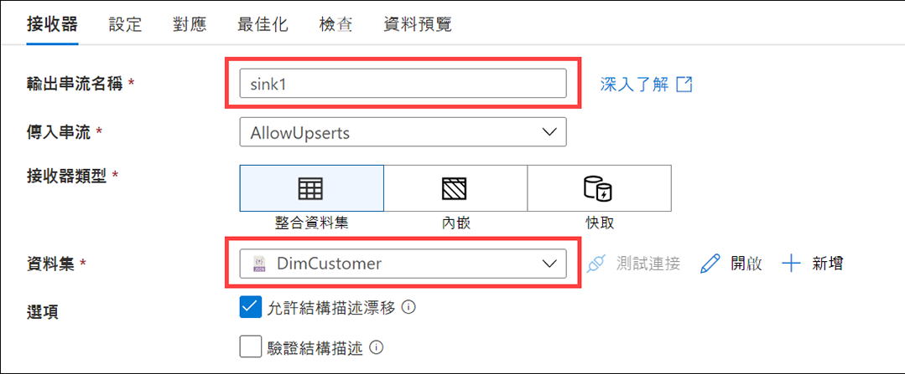

36. 选择 **“设置”** 选项卡并配置以下属性：

    - **更新方法**：选择`Allow upsert`并取消选择所有其他选项
    - **键列**：选择`List of columns`，然后选择列表中的`CustomerID`
    - **表操作**：选择 `None`
    - **启用暂存**：未选中

    

37. 选择 **“映射”** 选项卡，然后取消选择 **“自动映射”**。如下所述配置输入列映射：

    | 输入列 | 输出列 |
    | --- | --- |
    | `SourceDB@CustomerID` | `CustomerID` |
    | `SourceDB@Title` | `Title` |
    | `SourceDB@FirstName` | `FirstName` |
    | `SourceDB@MiddleName` | `MiddleName` |
    | `SourceDB@LastName` | `LastName` |
    | `SourceDB@Suffix` | `Suffix` |
    | `SourceDB@CompanyName` | `CompanyName` |
    | `SourceDB@SalesPerson` | `SalesPerson` |
    | `SourceDB@EmailAddress` | `EmailAddress` |
    | `SourceDB@Phone` | `Phone` |
    | `InsertedDate` | `InsertedDate` |
    | `ModifiedDate` | `ModifiedDate` |
    | `CreateCustomerHash@HashKey` | `HashKey` |

    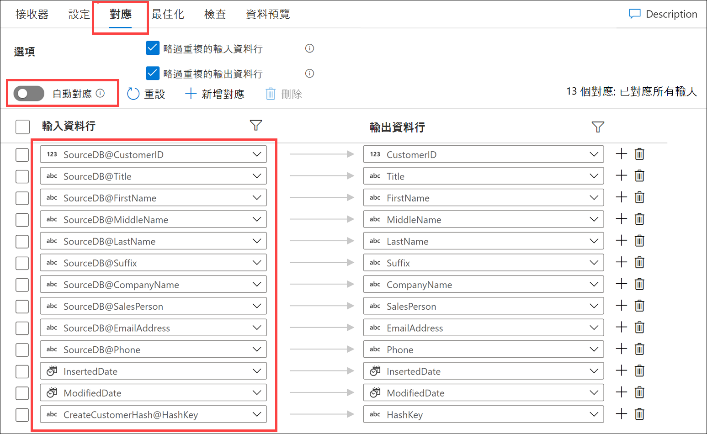

38. 完成的映射流应如下所示。选择 **“发布所有”**，以保存更改。

    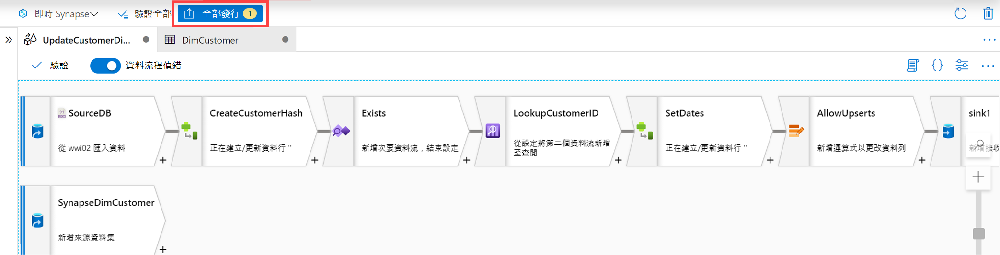

39. 选择 **“发布”**。

    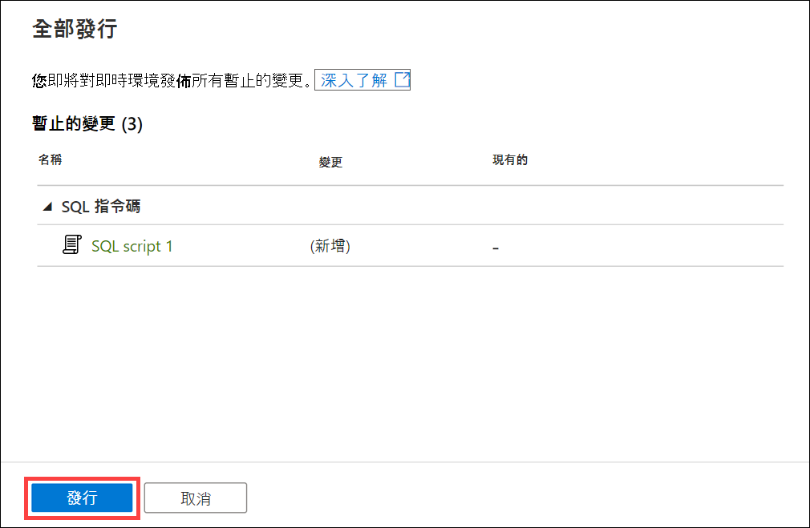

### 任务 3：创建管道并运行数据流

在此任务中，您将创建一个新的 Synapse 集成管道来执行映射数据流，然后运行它来更新插入客户记录。

1. 导航到 **“集成”** 中心。

    

2. 依次选择 **“+”** 和 **“管道”**。

    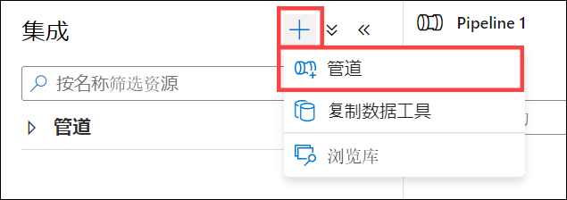

3. 在新管道的属性窗格中，在 **“名称”** 字段 **(1)** 中输入 `RunUpdateCustomerDimension`，然后选择 **“属性”** 按钮 **(2)** 以隐藏属性窗格。

    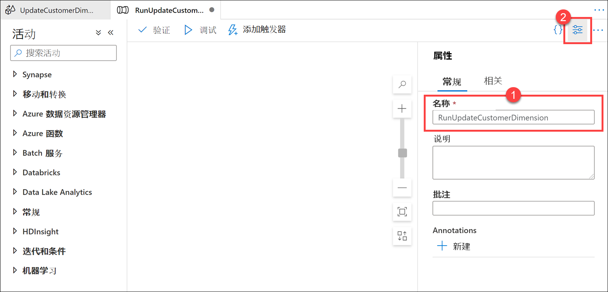

4. 在设计画布左侧的“活动”窗格下，展开`Move & transform`，然后将 **“数据流”** 活动拖放到画布上。

    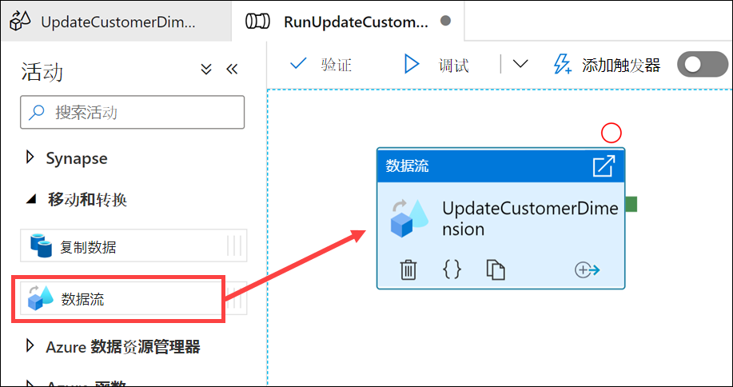

5. 在`General`选项卡下，输入 **“UpdateCustomerDimension”** 作为名称。

    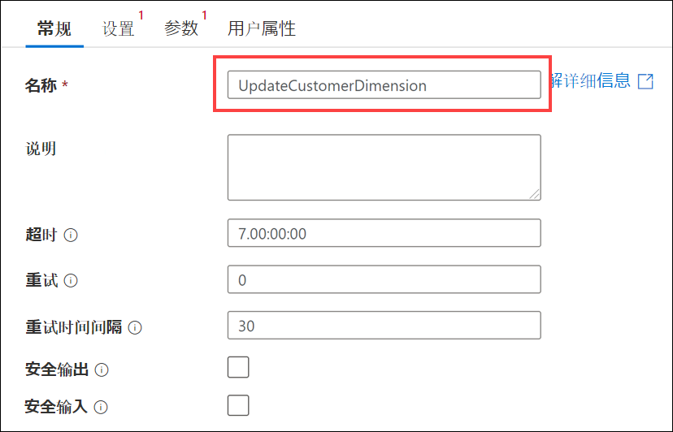

6. 在`Settings`选项卡下，选择 **“UpdateCustomerDimension”** 数据流。

    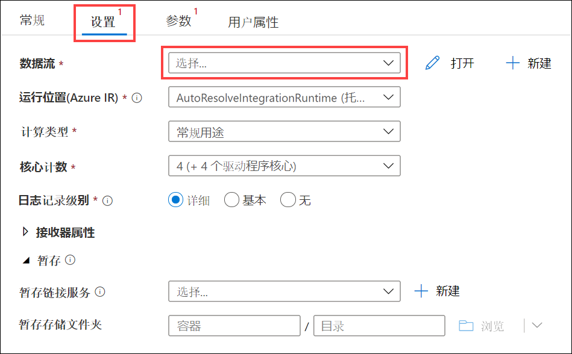

6. 选择 **“发布所有”**，然后在出现的对话框中选择 **“发布”**。

    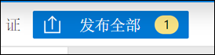

7. 发布完成后，选择管道画布上方的 **“添加触发器”**，然后选择 **“立即触发”**。

    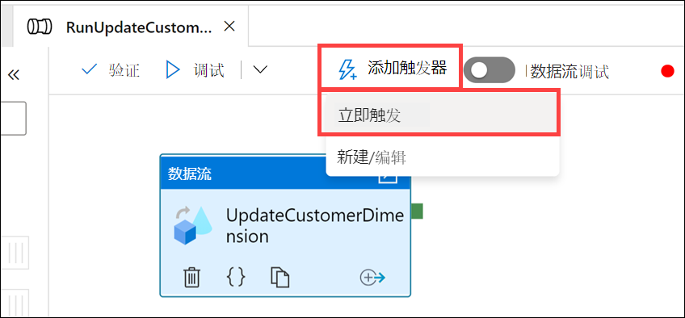

8. 导航到 **“监视”** 中心。

    

9. 选择左侧菜单 **(1)** 中的 **“管道运行”** 并等待管道运行成功完成 **(2)**。在管道运行完成之前，可能必须多次选择 **“刷新”(3)**。

    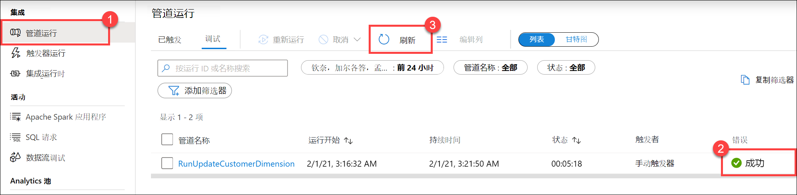

### 任务 4：查看插入数据

1. 导航到 **“数据”** 中心。

    

2. 选择 **“工作区”** 选项卡 **(1)**，展开“数据库”，然后右键单击 **“SQLPool01”(2)**。选择 **“新建 SQL 脚本”(3)**，然后选择 **“空脚本”(4)**。

    

3. 在查询窗口中粘贴以下内容，然后选择“运行”或按 F5 执行脚本并查看结果：

    ```sql
    SELECT * FROM DimCustomer
    ```

    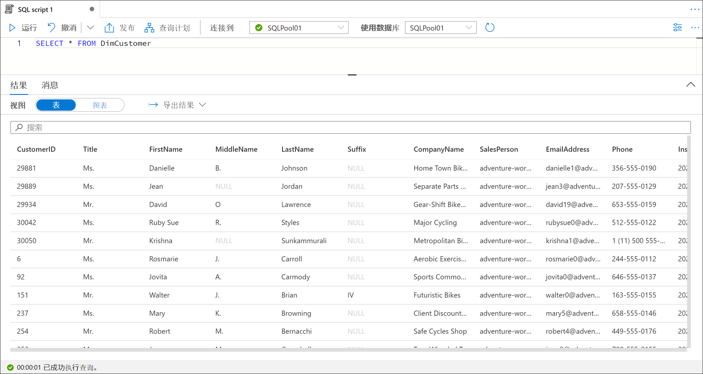

### 任务 5：更新源客户记录

1. 打开 Azure Data Studio，或者如果它仍然处于打开状态，则切换回它。

2. 在左侧菜单中选择 **“服务器”**，然后右键单击你在实验室开始时添加的 SQL 服务器。选择 **“新建查询”**。

    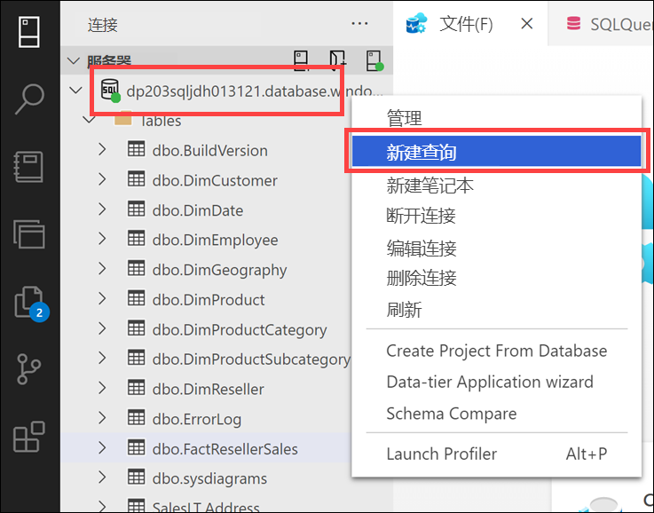

3. 将以下内容粘贴到查询窗口中以查看 `CustomerID` 为 10 的客户：

    ```sql
    SELECT * FROM [SalesLT].[Customer] WHERE CustomerID = 10
    ```

4. 选择 **“运行”** 或按 `F5` 执行查询。

    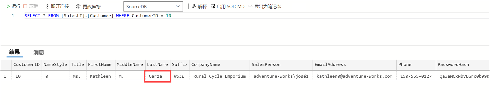

    显示 Kathleen M. Garza 女士的客户。我们来更改客户的姓氏。

5. 使用以下内容替换**并执行**查询以更新客户的姓氏：

    ```sql
    UPDATE [SalesLT].[Customer] SET LastName = 'Smith' WHERE CustomerID = 10
    SELECT * FROM [SalesLT].[Customer] WHERE CustomerID = 10
    ```

    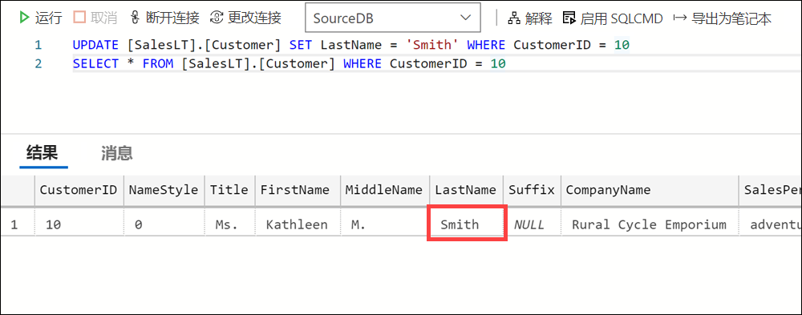

### 任务 6：重新运行映射数据流

1. 切换回 Synapse Studio。

2. 导航到 **“集成”** 中心。

    

3. 选择 **RunUpdateCustomerDimension** 管道。

    

4. 选择管道画布上方的 **“添加触发器”**，然后选择 **“立即触发”**。

    

5. 选择`Pipeline run`对话框中的 **“确定”** 以触发管道。

    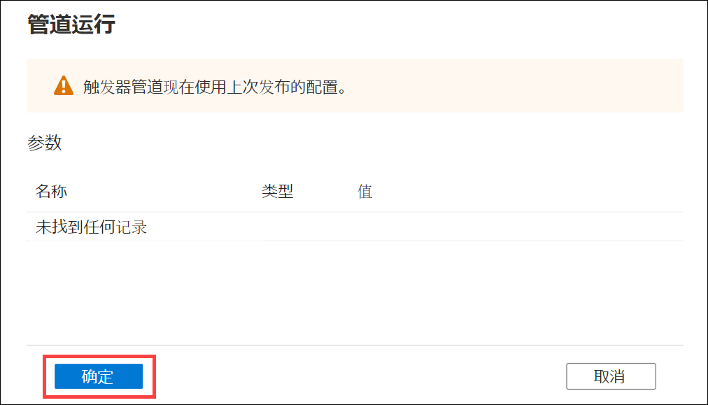

6. 导航到 **“监视”** 中心。

    

7. 选择左侧菜单 **(1)** 中的 **“管道运行”** 并等待管道运行成功完成 **(2)**。在管道运行完成之前，可能必须多次选择 **“刷新”(3)**。

    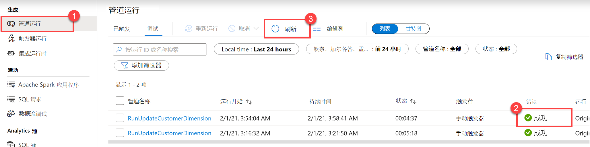

### 任务 7：验证记录是否已更新

1. 导航到 **“数据”** 中心。

    

2. 选择 **“工作区”** 选项卡 **(1)**，展开“数据库”，然后右键单击 **“SQLPool01”(2)**。选择 **“新建 SQL 脚本”(3)**，然后选择 **“空脚本”(4)**。

    

3. 在查询窗口中粘贴以下内容，然后选择“运行”或按 F5 执行脚本并查看结果：

    ```sql
    SELECT * FROM DimCustomer WHERE CustomerID = 10
    ```

    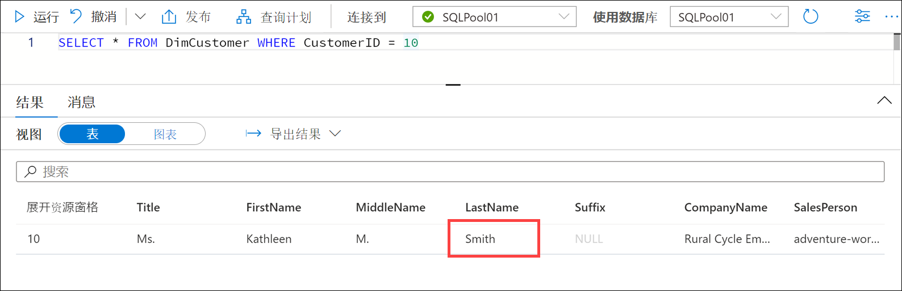

    如我们所见，客户记录已成功更新，以修改 `LastName` 值以匹配源记录。

## 练习 6：清理

完成以下步骤，释放不再需要的资源。

### 任务 1：暂停专用 SQL 池

1. 打开 Synapse Studio (<https://web.azuresynapse.net/>)。

2. 选择 **“管理”** 中心。

    

3. 在左侧菜单中，选择 **“SQL 池” (1)**。将鼠标悬停在专用 SQL 池的名称上，并选择 **“暂停” (2)**。

    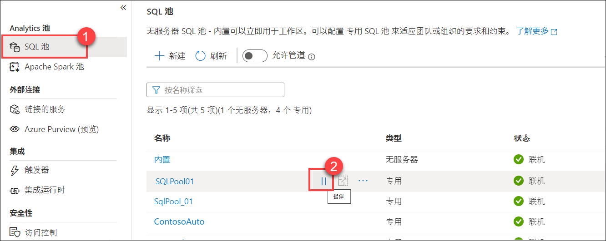

4. 出现提示时，选择 **“暂停”**。

    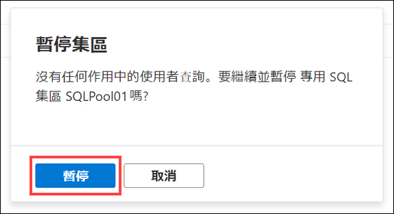
