# 模块 4 - 使用无服务器 SQL 池运行交互式查询

在本模块中，学生将了解如何通过 Azure Synapse Analytics 中的无服务器 SQL 池执行的 T-SQL 语句使用数据湖中的文件和外部文件源。学生将查询 Data Lake 中的 Parquet 文件，以及外部数据存储中的 CSV 文件。接下来，他们将创建 Azure Active Directory 安全组并通过基于角色的访问控制 (RBAC) 和访问控制列表 (ACL) 强制访问 Data Lake 中的文件。

在本模块中，学生将能够：

- 使用无服务器 SQL 池查询 Parquet 数据
- 创建用于 Parquet 和 CSV 文件的外部表
- 使用无服务器 SQL 池创建视图
- 在使用无服务器 SQL 池时保护对数据湖中的数据的访问
- 使用基于角色的访问控制 (RBAC) 和访问控制列表 (ACL) 配置数据湖安全性

## 实验室详细信息

- [模块 4 - 使用无服务器 SQL 池运行交互式查询](#module-4---run-interactive-queries-using-serverless-sql-pools)
  - [实验室详细信息](#lab-details)
  - [实验室设置和先决条件](#lab-setup-and-pre-requisites)
  - [练习 1：在 Azure Synapse Analytics 中使用无服务器 SQL 池查询 Data Lake Store](#exercise-1-querying-a-data-lake-store-using-serverless-sql-pools-in-azure-synapse-analytics)
    - [任务 1：使用无服务器 SQL 池查询销售 Parquet 数据](#task-1-query-sales-parquet-data-with-serverless-sql-pools)
    - [任务 2：为 2019 销售数据创建外部表](#task-2-create-an-external-table-for-2019-sales-data)
    - [任务 3：为 CSV 文件创建外部表](#task-3-create-an-external-table-for-csv-files)
    - [任务 4：使用无服务器 SQL 池创建视图](#task-4-create-a-view-with-a-serverless-sql-pool)
  - [练习 2：通过在 Azure Synapse Analytics 中使用无服务器 SQL 池来保护对数据的访问](#exercise-2-securing-access-to-data-through-using-a-serverless-sql-pool-in-azure-synapse-analytics)
    - [任务 1：创建 Azure Active Directory 安全组](#task-1-create-azure-active-directory-security-groups)
    - [任务 2：添加组成员](#task-2-add-group-members)
    - [任务 3：配置数据湖安全性 - 基于角色的访问控制 (RBAC)](#task-3-configure-data-lake-security---role-based-access-control-rbac)
    - [任务 4：配置数据湖安全性 - 访问控制列表 (ACL)](#task-4-configure-data-lake-security---access-control-lists-acls)
    - [任务 5：测试权限](#task-5-test-permissions)

Tailwind Trader 的数据工程师希望找到一种方法来探索数据湖、转换和准备数据并简化数据转换管道。此外，他们还希望数据分析师使用熟悉的 T-SQL 语言或他们偏好的、可连接到 SQL 终结点的工具，探索数据湖中的数据以及数据科学家或数据工程师创建的 Spark 外部表。

## 实验室设置和先决条件

> **备注：** 如果**不**使用托管实验室环境，而是使用自己的 Azure 订阅，则仅完成 `Lab setup and pre-requisites` 步骤。否则，请跳转到练习 1。

必须具有创建新的 Azure Active Directory 安全组并为其分配成员的权限。

完成此模块的[实验室设置说明](https://github.com/solliancenet/microsoft-data-engineering-ilt-deploy/blob/main/setup/04/README.md)。

请注意，以下模块使用相同的环境：

- [模块 4](labs/04/README.md)
- [模块 5](labs/05/README.md)
- [模块 7](labs/07/README.md)
- [模块 8](labs/08/README.md)
- [模块 9](labs/09/README.md)
- [模块 10](labs/10/README.md)
- [模块 11](labs/11/README.md)
- [模块 12](labs/12/README.md)
- [模块 13](labs/13/README.md)
- [模块 16](labs/16/README.md)

## 练习 1：在 Azure Synapse Analytics 中使用无服务器 SQL 池查询 Data Lake Store

通过数据探索来理解数据也是当今数据工程师和数据科学家面临的核心挑战之一。不同的数据处理引擎的性能、复杂性和灵活性会有所不同，具体取决于数据的底层结构以及探索过程的具体要求。

在 Azure Synapse Analytics 中，可以使用 SQL 和/或 Apache Spark for Synapse。对服务的选择主要取决于你的个人偏好和专业知识。在执行数据工程任务时，这两种选择在很多情况下都是同样有效的。但是，在某些情况下，利用 Apache Spark 的强大功能有助于克服源数据的问题。这是因为在 Synapse 笔记本中，可以从大量的免费库进行导入，使用数据时这些库可以为环境添加功能。而在其他情况下，使用无服务器 SQL 池来探索数据，或者通过可以从外部工具（例如 Power BI）访问的 SQL 视图来公开数据湖中的数据，会更加方便且速度更快。

在本练习中，使用这两种选项探索数据湖。

### 任务 1：使用无服务器 SQL 池查询销售 Parquet 数据

在使用无服务器 SQL 池查询 Parquet 文件时，可以使用 T-SQL 语法探索数据。

1. 打开 Synapse Studio (<https://web.azuresynapse.net/>)，然后导航到 **“数据”** 中心。

    

2. 选择 **“链接”** 选项卡 **(1)** 并展开 **“Azure Data Lake Storage Gen2”**。 展开 `asaworkspaceXX` 主 ADLS Gen2 帐户 **(2)** 并选择 **`wwi-02`** 容器 **(3)**。导航至 `sale-small/Year=2016/Quarter=Q4/Month=12/Day=20161231` 文件夹 **(4)**。右键单击 `sale-small-20161231-snappy.parquet` 文件 **(5)**，依次选择 **“新建 SQL 脚本”(6)** 和 **“选择前 100 行”(7)**。

    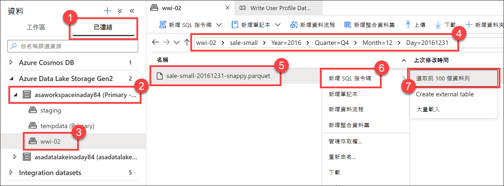

3. 确保已在查询窗口上方的 `Connect to` 下拉列表中选择 **“Built-in”** **(1)**，然后运行查询 **(2)**。 数据会由无服务器 SQL 终结点加载并处理，就和处理任何常规关系数据库的数据一样。

    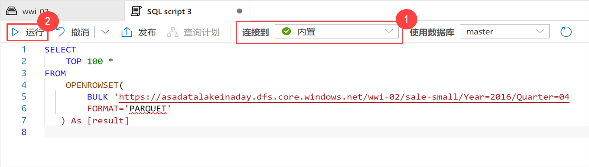

    单元格输出显示来自 Parquet 文件的查询结果。

    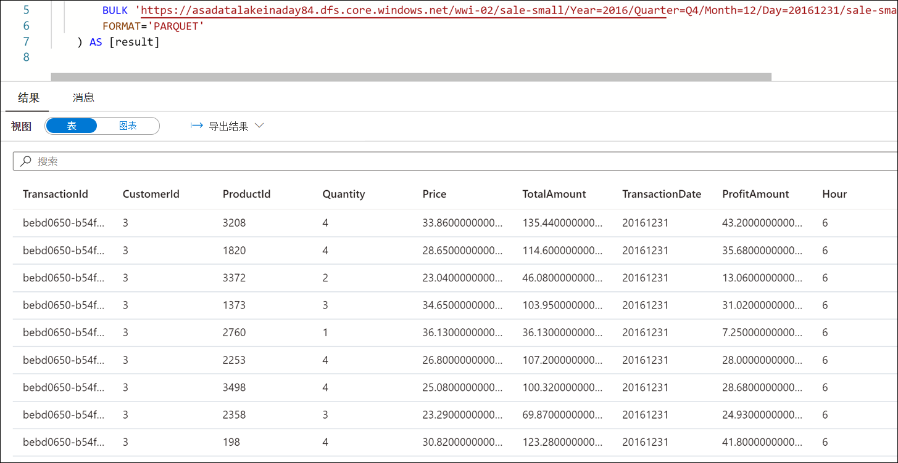

4. 修改 SQL 查询，执行聚合和分组操作以更好地理解数据。采用以下内容替换查询，确保 `OPENROWSET` 中的文件路径与当前文件路径匹配：

    ```sql
    SELECT
        TransactionDate, ProductId,
            CAST(SUM(ProfitAmount) AS decimal(18,2)) AS [(sum) Profit],
            CAST(AVG(ProfitAmount) AS decimal(18,2)) AS [(avg) Profit],
            SUM(Quantity) AS [(sum) Quantity]
    FROM
        OPENROWSET(
            BULK 'https://asadatalakeSUFFIX.dfs.core.windows.net/wwi-02/sale-small/Year=2016/Quarter=Q4/Month=12/Day=20161231/sale-small-20161231-snappy.parquet',
            FORMAT='PARQUET'
        ) AS [r] GROUP BY r.TransactionDate, r.ProductId;
    ```

    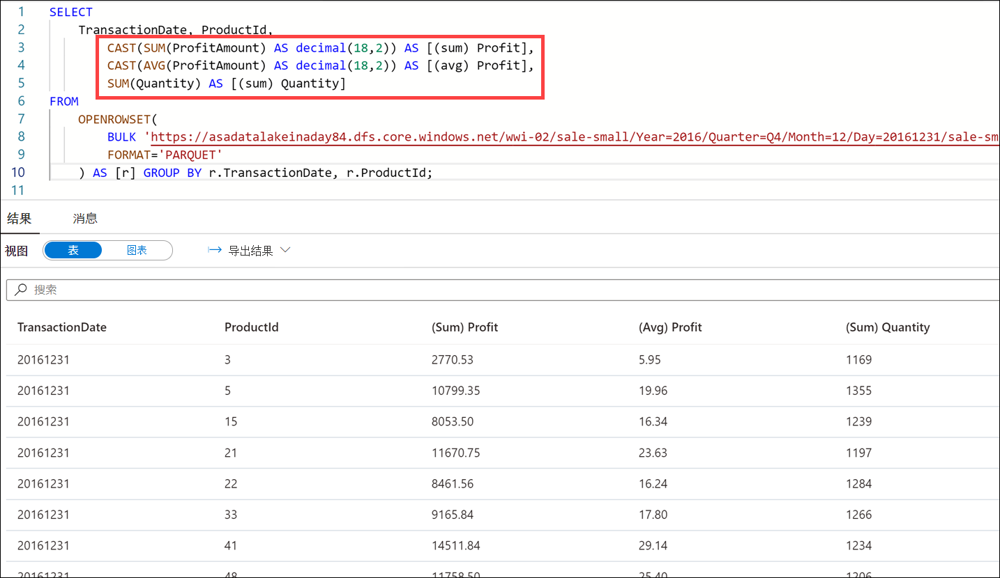

5. 让我们从 2016 年的这个单一文件过渡到更新的数据集。我们想要了解含所有 2019 年数据的 Parquet 文件中包含多少条记录。对于规划如何优化向 Azure Synapse Analytics 的数据导入，这些信息非常重要。为此，我们将使用以下内容替换查询（请务必在 BULK 语句中通过替换 `[asadatalakeSUFFIX]` 来更新自己的数据湖名称）：

    ```sql
    SELECT
        COUNT(*)
    FROM
        OPENROWSET(
            BULK 'https://asadatalakeSUFFIX.dfs.core.windows.net/wwi-02/sale-small/Year=2019/*/*/*/*',
            FORMAT='PARQUET'
        ) AS [r];
    ```

    > 请注意我们更新路径的方式，这样能包括 `sale-small/Year=2019` 的所有子文件夹中所有的 Parquet 文件。

    输出应该为 **339507246** 条记录。

### 任务 2：为 2019 销售数据创建外部表

在需要查询 Parquet 文件时，我们可以创建外部表，而不是每次都创建带有 `OPENROWSET` 和根 2019 文件夹路径的脚本。

1. 在 Synapse Studio 中，导航到 **“数据”** 中心。

    

2. 选择 **“链接”** 选项卡 **(1)** 并展开 **“Azure Data Lake Storage Gen2”**。展开 `asaworkspaceXX` 主 ADLS Gen2 帐户 **(2)** 并选择 **`wwi-02`** 容器 **(3)**。导航至 `sale-small/Year=2019/Quarter=Q1/Month=1/Day=20190101` 文件夹 **(4)**。右键单击 `sale-small-20190101-snappy.parquet` 文件 **(5)**，依次选择 **“新建 SQL 脚本”(6)** 和 **“创建外部表”(7)**。

    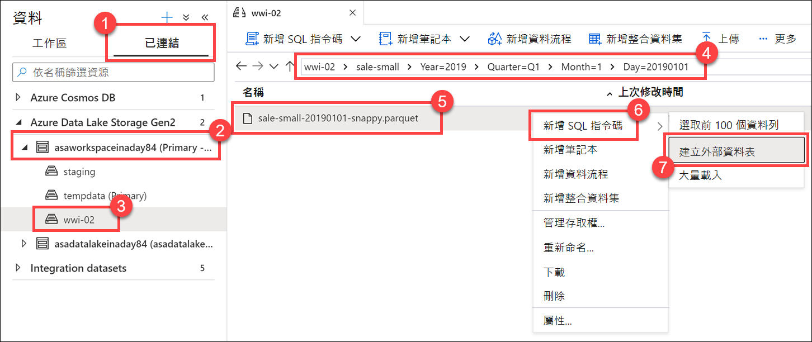

3. 确保已为 **“SQL 池”(1)** 选择 **`Built-in`**。 在 **“选择数据库”** 下选择 **“+ 新建”**，并输入 `demo` **(2)**。对于 **“外部表名称”**， 输入 `All2019Sales` **(3)**。 在 **“创建外部表”** 下选择 **“使用 SQL 脚本”(4)**，然后选择 **“创建”(5)**。

    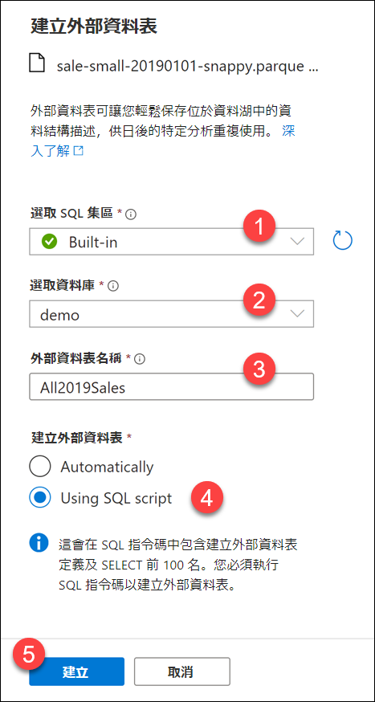

    > **备注**： 确保脚本连接到无服务器 SQL 池 (`Built-in`) **(1)**，并且将数据库设置为 `demo` **(2)**。

    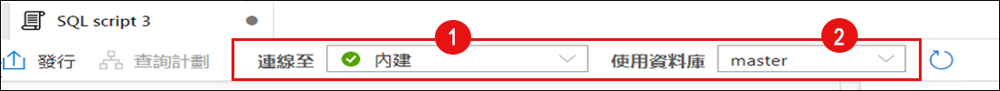

    生成的脚本包含以下组成部分：

    - **1)** 该脚本首先创建一个 `FORMAT_TYPE` 为 `PARQUET` 的 `SynapseParquetFormat` 外部文件格式。
    - **2)** 接着创建外部数据源，指向数据湖存储帐户的 `wwi-02` 容器。
    - **3)** CREATE EXTERNAL TABLE `WITH` 语句指定文件位置，并引用上面创建的新外部文件格式和数据源。
    - **4)** 最后，我们从 `2019Sales` 外部表中选择前 100 个结果。

    

4. 将 `CREATE EXTERNAL TABLE` 语句中的 `LOCATION` 值替换为 **`sale-small/Year=2019/*/*/*/*.parquet`**。

    

5. **运行**该脚本。

    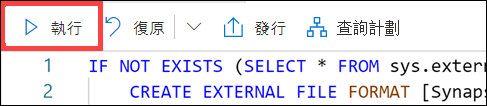

    运行脚本后，我们可以看到针对 `All2019Sales` 外部表的 SELECT 查询的输出。这会显示位于 `YEAR=2019` 文件夹中的 Parquet 文件中的前 100 条记录。

    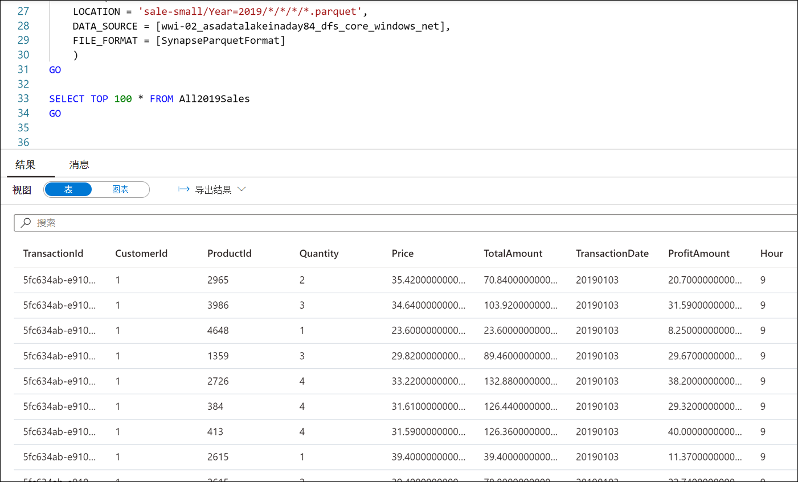

### 任务 3：为 CSV 文件创建外部表

Tailwind Traders 找到了他们想要使用的国家人口数据的开放数据源。他们不想简单地复制这些数据，因为将来这些数据会根据预计的人口数量定期更新。

你决定创建连接到外部数据源的外部表。

1. 将 SQL 脚本替换为以下内容：

    ```sql
    IF NOT EXISTS (SELECT * FROM sys.symmetric_keys) BEGIN
        declare @pasword nvarchar(400) = CAST(newid() as VARCHAR(400));
        EXEC('CREATE MASTER KEY ENCRYPTION BY PASSWORD = ''' + @pasword + '''')
    END

    CREATE DATABASE SCOPED CREDENTIAL [sqlondemand]
    WITH IDENTITY='SHARED ACCESS SIGNATURE',  
    SECRET = 'sv=2018-03-28&ss=bf&srt=sco&sp=rl&st=2019-10-14T12%3A10%3A25Z&se=2061-12-31T12%3A10%3A00Z&sig=KlSU2ullCscyTS0An0nozEpo4tO5JAgGBvw%2FJX2lguw%3D'
    GO

    -- Create external data source secured using credential
    CREATE EXTERNAL DATA SOURCE SqlOnDemandDemo WITH (
        LOCATION = 'https://sqlondemandstorage.blob.core.windows.net',
        CREDENTIAL = sqlondemand
    );
    GO

    CREATE EXTERNAL FILE FORMAT QuotedCsvWithHeader
    WITH (  
        FORMAT_TYPE = DELIMITEDTEXT,
        FORMAT_OPTIONS (
            FIELD_TERMINATOR = ',',
            STRING_DELIMITER = '"',
            FIRST_ROW = 2
        )
    );
    GO

    CREATE EXTERNAL TABLE [population]
    (
        [country_code] VARCHAR (5) COLLATE Latin1_General_BIN2,
        [country_name] VARCHAR (100) COLLATE Latin1_General_BIN2,
        [year] smallint,
        [population] bigint
    )
    WITH (
        LOCATION = 'csv/population/population.csv',
        DATA_SOURCE = SqlOnDemandDemo,
        FILE_FORMAT = QuotedCsvWithHeader
    );
    GO
    ```

    在脚本的顶部，我们采用随机密码创建了 `MASTER KEY` **(1)**。接下来，我们使用用于委托访问的共享访问签名 (SAS)，为外部存储帐户 **(2)** 中的容器创建数据库范围的凭据。在创建 `SqlOnDemandDemo` 外部数据源 **(3)** 时会使用此凭据，该数据源指向包含人口数据的外部存储帐户的位置：

    

    > 当任何主体使用 DATA_SOURCE 调用 OPENROWSET 函数，或从不访问公共文件的外部表中选择数据时，将使用数据库范围的凭据。数据库范围的凭据不需要匹配存储帐户的名称，因为它将在定义存储位置的 DATA SOURCE 中显式使用。

    在脚本的下一部分中，我们创建了一个名为 `QuotedCsvWithHeader` 的外部文件格式。创建外部文件格式是创建外部表的先决条件。通过创建外部文件格式，可指定外部表引用的数据的实际布局。这里我们指定 CSV 字段终止符、字符串分隔符并将 `FIRST_ROW` 值设为 2，因为文件包含标题行：

    

    最后，在脚本的底部，我们创建了一个名为 `population` 的外部表。`WITH` 子句指定 CSV 文件的相对位置，指向上面创建的数据源以及 `QuotedCsvWithHeader` 文件格式：

    

2. **运行**该脚本。

    

    请注意，此查询没有数据结果。

3. 将 SQL 脚本替换为以下内容，从人口外部表（按人口大于 1 亿的 2019 年数据进行筛选）中进行选择：

    ```sql
    SELECT [country_code]
        ,[country_name]
        ,[year]
        ,[population]
    FROM [dbo].[population]
    WHERE [year] = 2019 and population > 100000000
    ```

4. **运行**该脚本。

    

5. 在查询结果中，选择 **“图表”** 视图，然后如下方式对其进行配置：

    - **图表类型**： 选择 `Bar`。
    - **类别列**： 选择 `country_name`。
    - **图例（系列）列**： 选择 `population`。
    - **图例位置**： 选择 `center - bottom`。

    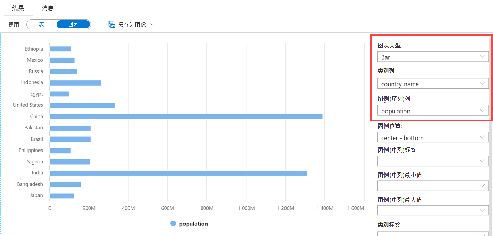

### 任务 4：使用无服务器 SQL 池创建视图

创建一个视图以包装 SQL 查询。通过视图，可以重用查询，如果希望将 Power BI 之类的工具与无服务器 SQL 池结合使用，也需使用视图。

1. 在 Synapse Studio 中，导航到 **“数据”** 中心。

    

2. 选择 **“链接”** 选项卡 **(1)** 并展开 **“Azure Data Lake Storage Gen2”**。展开 `asaworkspaceXX` 主 ADLS Gen2 帐户 **(2)** 并选择 **`wwi-02`** 容器 **(3)**。 导航到 `customer-info` 文件夹 **(4)**。右键单击 `customerinfo.csv` 文件 **(5)**，依次选择 **“新建 SQL 脚本”(6)** 和 **“选择前 100 行”(7)**。

    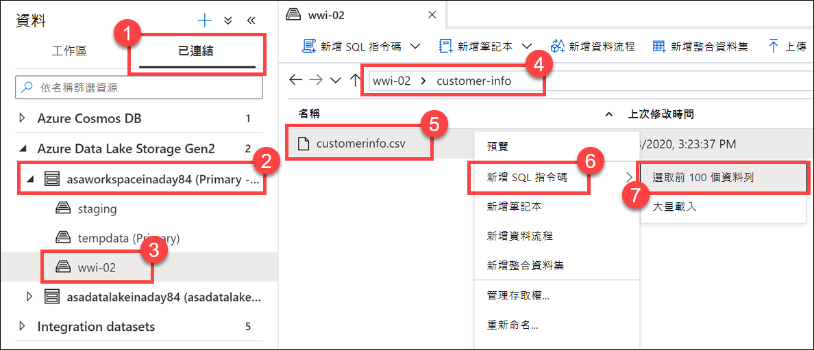

3. 选择 **“运行”** 以执行脚本 **(1)**。注意，CSV 文件的第一行是列标题行 **(2)**。

    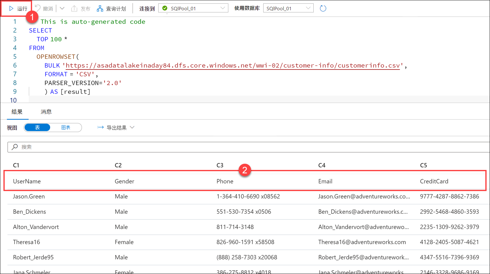

4. 使用以下内容更新脚本，且务必将 OPENROWSET BULK **路径中的 YOUR_DATALAKE_NAME (1)** （你的主数据湖存储帐户）替换为前面 select 语句中的值。将 **“使用数据库”** 值设置为 **`demo` (2)** （根据需要使用右侧的刷新按钮）：

    ```sql
    CREATE VIEW CustomerInfo AS
        SELECT * 
    FROM OPENROWSET(
            BULK 'https://YOUR_DATALAKE_NAME.dfs.core.windows.net/wwi-02/customer-info/customerinfo.csv',
            FORMAT = 'CSV',
            PARSER_VERSION='2.0',
            FIRSTROW=2
        )
    WITH (
        [UserName] VARCHAR (50),
        [Gender] VARCHAR (10),
        [Phone] VARCHAR (50),
        [Email] VARCHAR (100),
        [CreditCard] VARCHAR (50)
    ) AS [r];
    GO

    SELECT * FROM CustomerInfo;
    GO
    ```

    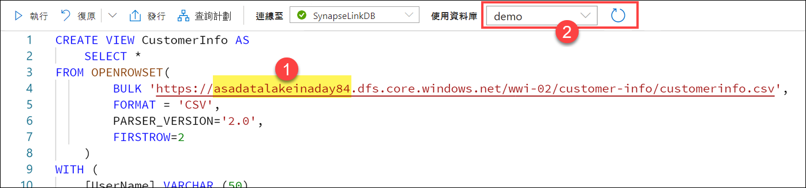

5. 选择 **“运行”** 以执行脚本。

    

    我们刚刚创建了视图来包装从 CSV 文件中选择数据的 SQL 查询，然后从视图中选择了行：

    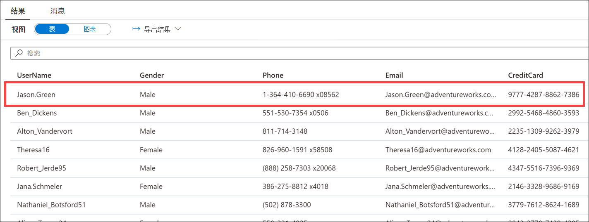

    注意，第一行不再包含列标题。这是因为我们在创建视图时在 `OPENROWSET` 语句中使用了 `FIRSTROW=2` 设置。

6. 在 **“数据”** 中心选择 **“工作区”** 选项卡 **(1)**。选择“数据库”组 **(2)** 右侧的操作省略号 **(…)**， 然后选择 **“刷新”(3)**。

    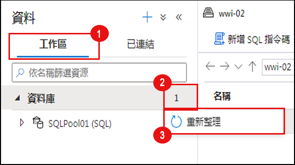

7. 展开 `demo` SQL 数据库。

    

    该数据库包含以下我们在前面步骤中创建的对象：

    - **1) 外部表**： `All2019Sales` 和 `population`。
    - **2) 外部数据源**： `SqlOnDemandDemo` 和 `wwi-02_asadatalakeinadayXXX_dfs_core_windows_net`。
    - **3) 外部文件格式**： `QuotedCsvWithHeader` 和 `SynapseParquetFormat`。
    - **4) 视图**： `CustomerInfo`。 

## 练习 2：通过在 Azure Synapse Analytics 中使用无服务器 SQL 池来保护对数据的访问

Tailwind Traders 希望强制要求对销售数据的任何修改只能在本年度进行，同时允许所有授权用户查询全部数据。他们有一个小组的管理员，这些管理员可以根据需要修改历史数据。

- Tailwind Traders 应该在 AAD 中创建一个安全组（例如名为 `tailwind-history-owners` 的安全组），目的是让属于该组的所有用户都有权限修改以前年份的数据。
- 需要将 `tailwind-history-owners` 安全组分配至包含数据湖的 Azure 存储帐户的 Azure 存储内置 RBAC 角色 `Storage Blob Data Owner`。这让添加到该角色的 AAD 用户和服务主体能修改以前年份的所有数据。
- 他们需要将有权修改所有历史数据的用户安全主体添加到 `tailwind-history-owners` 安全组。
- Tailwind Traders 应该在 AAD 中创建另外一个安全组（例如名为 `tailwind-readers` 的安全组），目的是让属于该组的所有用户都有权限读取文件系统（在本例中为 `prod`）中的所有内容，包括所有历史数据。
- 需要将 `tailwind-readers` 安全组分配至包含数据湖的 Azure 存储帐户的 Azure 存储内置 RBAC 角色 `Storage Blob Data Reader`。这让添加到该安全组的 AAD 用户和服务主体能读取文件系统中的所有数据，但是不能修改这些数据。
- Tailwind Traders 应该在 AAD 中创建另外一个安全组（例如名为 `tailwind-2020-writers` 的安全组），目的是让属于该组的所有用户都有权限修改仅 2020 年的数据。
- 他们要创建另外一个安全组（例如名为 `tailwind-current-writers` 的安全组），目的是仅向该组中添加安全组。该组仅具有修改当前年份数据的权限（使用 ACL 进行设置）。
- 他们需要将 `tailwind-readers` 安全组添加到 `tailwind-current-writers` 安全组。
- 在 2020 年初，Tailwind Traders 将 `tailwind-current-writers` 添加至 `tailwind-2020-writers` 安全组。
- 在 2020 年初，Tailwind Traders 对 `2020` 文件夹设置 `tailwind-2020-writers` 安全组的 ACL 权限 - 读取、写入和执行。
- 在 2021 年初，为了撤销对 2020 年数据的写入权限，他们从 `tailwind-2020-writers` 组中删除 `tailwind-current-writers` 安全组。`tailwind-readers` 的成员依然能读取文件系统的内容，因为他们的读取和执行（列出）权限不是通过 ACL 授予的，而是通过文件系统级别上的 RBAC 内置角色授予的。
- 此方法考虑到对 ACL 的当前更改不继承权限，因此删除 write 权限需要编写遍历其所有内容的代码并在每个文件夹和文件对象上删除权限。
- 这种方法相对较快。无论受保护的数据量是多少，RBAC 角色分配的传播可能都需要 5 分钟。

### 任务 1：创建 Azure Active Directory 安全组

在这一段中，我们将如上所述创建安全组。但是，我们的数据集中只有到 2019 年的数据，所以我们将 2021 改为 2019，创建 `tailwind-2019-writers` 组。

1. 在另一个浏览器选项卡中切换回 Azure 门户 (<https://portal.azure.com>)，让 Synapse Studio 保持打开状态。

2. 选择 Azure 菜单 **(1)**，然后选择 **“Azure Active Directory”(2)**。

    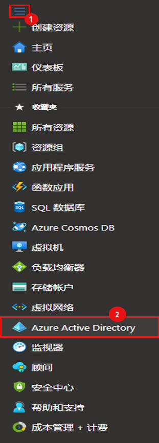

3. 在左侧菜单中选择 **“组”**。

    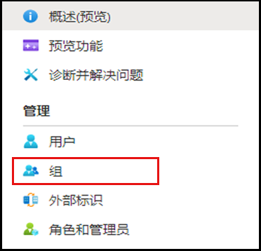

4. 选择 **“+ 新建组”**。

    

5. 从 **“组类型”** 中选择 `Security`。输入 `tailwind-history-owners-<suffix>` 作为**组名称** （其中 `<suffix>` 是一个唯一值，例如你名字的首字母后跟两位或更多数字），然后选择 **“创建”**。

    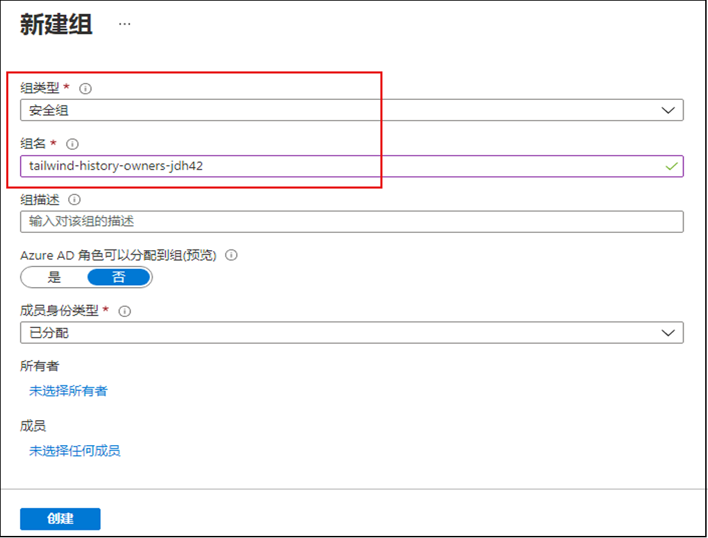

6. 选择 **“+ 新建组”**。

    

7. 从 **“组类型”** 中选择 `Security`。输入 `tailwind-readers-<suffix>` 作为**组名称** （其中 `<suffix>` 是一个唯一值，例如你名字的首字母后跟两位或更多数字），然后选择 **“创建”**。

    

8. 选择 **“+ 新建组”**。

    

9. 从 **“组类型”** 中选择 `Security`。输入 `tailwind-current-writers-<suffix>` 作为**组名称** （其中 `<suffix>` 是一个唯一值，例如你名字的首字母后跟两位或更多数字），然后选择 **“创建”**。

    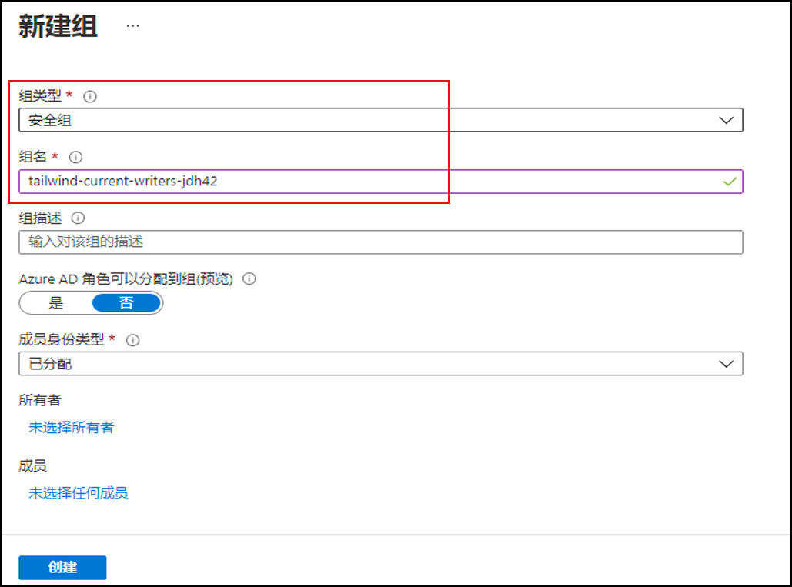

10. 选择 **“+ 新建组”**。

    

11. 从 **“组类型”** 中选择 `Security`。输入 `tailwind-2019-writers-<suffix>` 作为**组名称**（其中 `<suffix>` 是一个唯一值，例如你名字的首字母后跟两位或更多数字），然后选择 **“创建”**。

    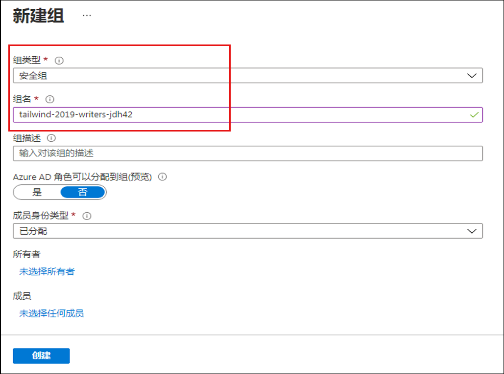

### 任务 2：添加组成员

为了测试这些权限，我们将自己的帐户添加到 `tailwind-readers-<suffix>` 组。

1. 打开新创建的 **`tailwind-readers-<suffix>`** 组。

2. 选择左侧的 **“成员”(1)**，然后选择 **“+ 添加成员”(2)**。

    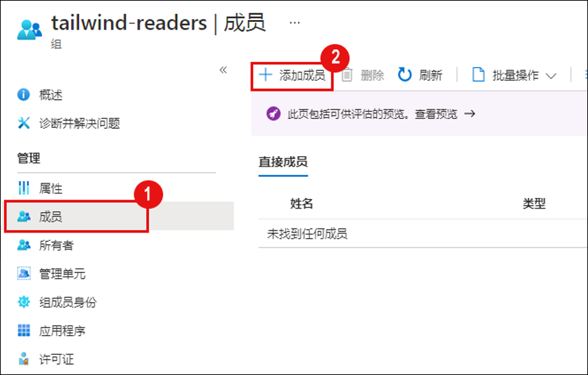

3. 添加你针对实验室所登录的用户帐户，然后选择 **“选择”**。

    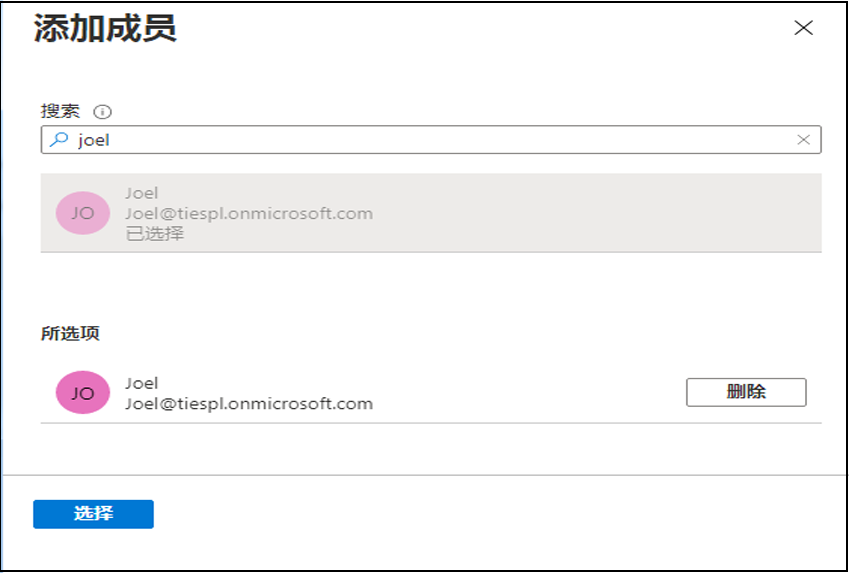

4. 打开 **`tailwind-2019-writers-<suffix>`** 组。

5. 选择左侧的 **“成员”(1)**，然后选择 **“+ 添加成员”(2)**。

    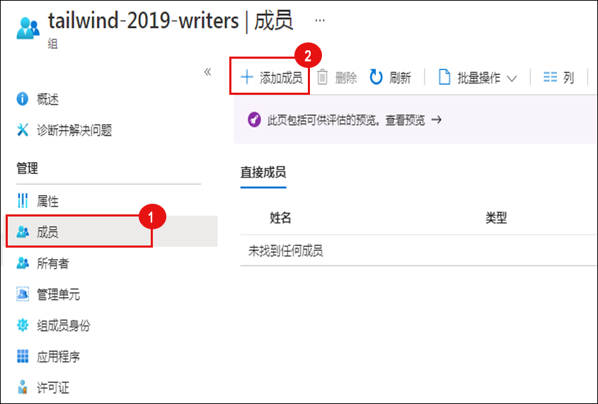

6. 搜索 `tailwind`，选择 **`tailwind-current-writers-<suffix>`** 组，然后选择 **“选择”**。

    

7. 选择左侧菜单中的 **“概述”**，然后**复制** **对象 ID**。

    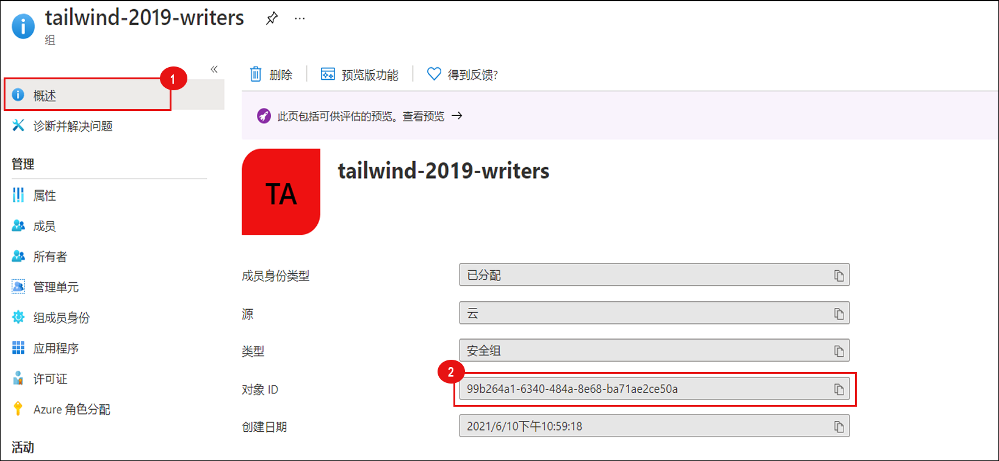

    > **备注**： 将**对象 ID** 值保存至记事本或类似的文本编辑器。在稍后的步骤中，在存储帐户中分配访问控制时会用到此值。

### 任务 3：配置数据湖安全性 - 基于角色的访问控制 (RBAC)

1. 打开用于此实验室的 Azure 资源组，该资源组包含 Synapse Analytics 工作区。

2. 打开默认的 Data Lake Storage 帐户。

    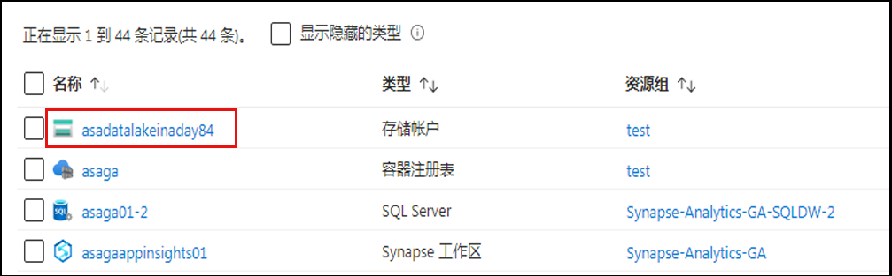

3. 在左侧菜单中选择 **“访问控制(IAM)”**。

    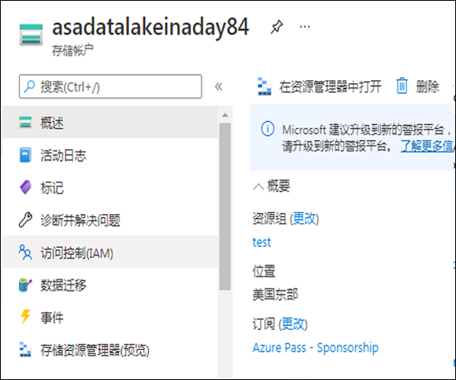

4. 选择 **“角色分配”** 选项卡。

    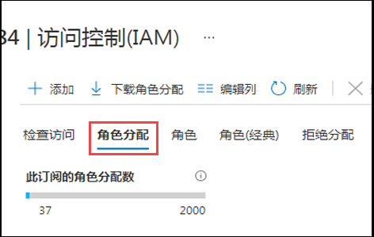

5. 依次选择 **“+ 添加”** 和 **“添加角色分配”**。

    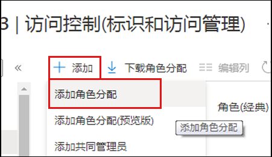

6. 对于 **“角色”**，选择 **`Storage Blob Data Reader`**。 搜索 **`tailwind-readers`** 并从结果中选择 `tailwind-readers-<suffix>`，然后选择 **“保存”**。

    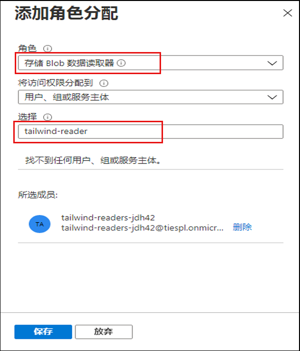

    由于我们的用户帐户已添加到该组中，因此我们拥有对该帐户的 blob 容器中所有文件的读取访问权限。Tailwind Traders 需要将所有用户添加到 `tailwind-readers-<suffix>` 安全组。

7. 依次选择 **“+ 添加”** 和 **“添加角色分配”**。

    

8. 对于 **“角色”**，选择 **`Storage Blob Data Owner`**。搜索 **`tailwind`** 并从结果中选择 **`tailwind-history-owners-<suffix>`**，然后选择 **“保存”**。

    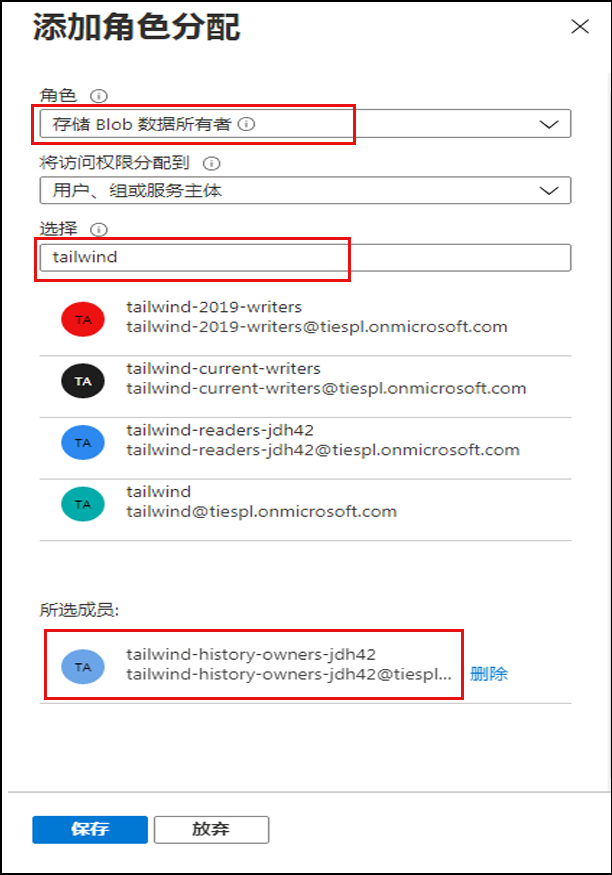

    现在将 `tailwind-history-owners-<suffix>` 安全组分配至包含数据湖的 Azure 存储帐户的 Azure 存储内置 RBAC 角色 `Storage Blob Data Owner`。这让添加到该角色的 Azure AD 用户和服务主体能修改所有数据。

    Tailwind Traders 需要将有权修改所有历史数据的用户安全主体添加到 `tailwind-history-owners-<suffix>` 安全组。

9. 在存储帐户的 **“访问控制(IAM)”** 列表中，选择 **“存储 Blob 数据所有者”** 角色 **(1)** 下自己的 Azure 用户帐户，然后选择 **“删除”(2)**。

    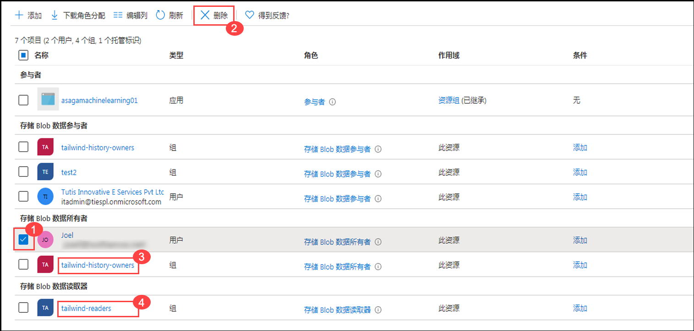

    请注意，`tailwind-history-owners-<suffix>` 组分配至 **“存储 Blob 数据所有者”** 组 **(3)**，而 `tailwind-readers-<suffix>` 分配至 **“存储 Blob 数据读取者”** 组 **(4)**。

    > **备注**： 你可能需要导航回资源组，然后返回此屏幕以查看所有新的角色分配。

### 任务 4：配置数据湖安全性 - 访问控制列表 (ACL)

1. 在左侧菜单 **(1)** 中，选择 **“存储资源管理器(预览)”**。 展开“容器”并选择 **“wwi-02”** 容器 **(2)**。打开 **“sale-small”** 文件夹 **(3)**，右键单击 **“Year=2019”** 文件夹 **(4)**，然后选择 **“管理访问权限” (5)**。

    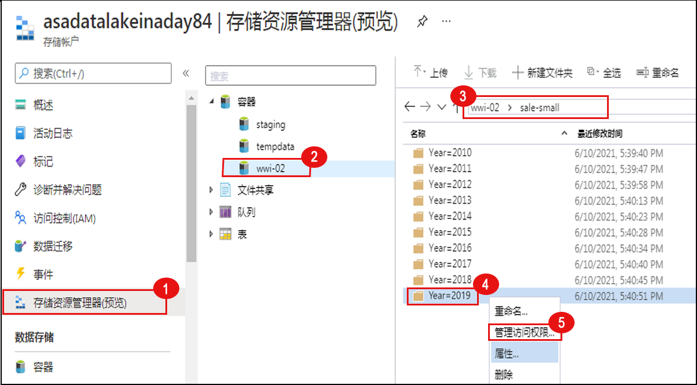

2. 将从 **`tailwind-2019-writers-<suffix>`** 安全组复制的**对象 ID** 值粘贴到 **“添加用户、组或服务主体”** 文本框中，然后选择 **“添加”**。

    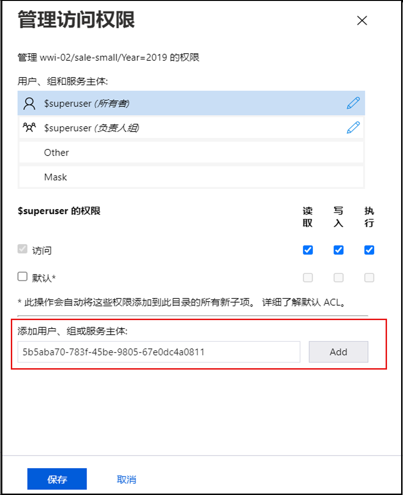

3. 现在，你应该看到在“管理访问权限”对话框 **(1)** 中选中了 `tailwind-2019-writers-<suffix>` 组。勾选 **“访问”** 和 **“默认”** 复选框以及它们各自的 **“读取”**、 **“写入”** 和 **“执行”** 复选框 **(2)**，然后选择 **“保存”**。

    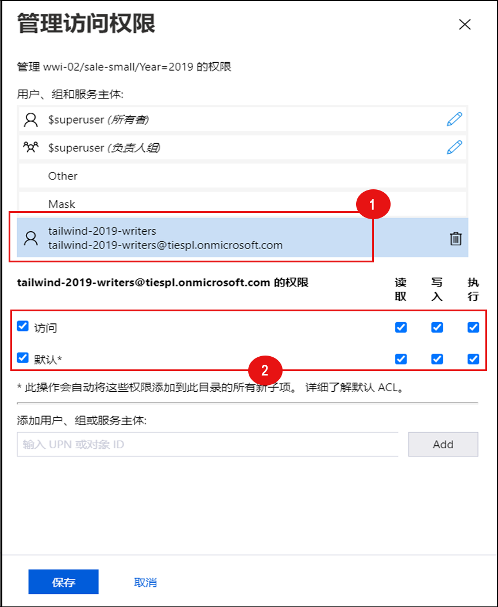

    现在，安全 ACL 已被设置为允许任何添加到 `tailwind-current-<suffix>` 安全组的用户通过 `tailwind-2019-writers-<suffix>` 组写入 `Year=2019` 文件夹。这些用户只能管理当前（本例中为 2019）的销售文件。

    在下一年的年初，为了撤销对 2019 年数据的写入权限，他们要从 `tailwind-2019-writers-<suffix>` 中删除 `tailwind-current-writers-<suffix>` 安全组。`tailwind-readers-<suffix>` 的成员依然能读取文件系统的内容，因为他们的读取和执行（列出）权限不是通过 ACL 授予的，而是通过文件系统级别上的 RBAC 内置角色授予的。

    请注意，我们在此配置中同时配置了访问 ACL 和默认 ACL____。

    *访问* ACL 控制对某个对象的访问权限。文件和目录都具有访问 ACL。

    *默认* ACL 是与目录关联的 ACL 模板，用于确定在该目录下创建的任何子项的访问 ACL。文件没有默认 ACL。

    访问 ACL 和默认 ACL 具有相同的结构。

### 任务 5：测试权限

1. 在 Synapse Studio 中，导航到 **“数据”** 中心。

    

2. 选择 **“链接”** 选项卡 **(1)** 并展开 **“Azure Data Lake Storage Gen2”**。展开 `asaworkspaceXX` 主 ADLS Gen2 帐户 **(2)** 并选择 **`wwi-02`** 容器 **(3)**。导航至 `sale-small/Year=2016/Quarter=Q4/Month=12/Day=20161231` 文件夹 **(4)**。右键单击 `sale-small-20161231-snappy.parquet` 文件 **(5)**，依次选择 **“新建 SQL 脚本”(6)** 和 **“选择前 100 行”(7)**。

    

3. 确保已在查询窗口上方的 `Connect to` 下拉列表中选择 **“Built-in”** **(1)**，然后运行查询 **(2)**。数据由无服务器 SQL 池终结点加载，并像处理来自任何常规关系数据中的数据那样对其进行处理。

    

    单元格输出显示来自 Parquet 文件的查询结果。

    

    通过 `tailwind-readers-<suffix>` 安全组（随后通过 **“存储 Blob 数据读取者”** 角色分配获授存储帐户上的 RBAC 权限）分配给我们的 Parquet 文件的读取权限让我们能查看文件内容。

    但是，由于我们从 **“存储 Blob 数据所有者”** 角色中删除了自己的帐户，并且没有将帐户添加到 `tailwind-history-owners-<suffix>` 安全组中，因此若要尝试写入此目录，该如何操作呢？

    我们来试一试。

4. 在 **“数据”** 中心中，再次选择 **“链接”** 选项卡 (1) 并展开 **“Azure Data Lake Storage Gen2”**。展开 `asaworkspaceXX` 主 ADLS Gen2 帐户 **(2)** 并选择 **`wwi-02`** 容器 **(3)**。导航至 `sale-small/Year=2016/Quarter=Q4/Month=12/Day=20161231` 文件夹 **(4)**。右键单击 `sale-small-20161231-snappy.parquet` 文件 **(5)**，选择 **“新建笔记本”(6)**，然后选择 **“加载到 DataFrame”(7)**。

    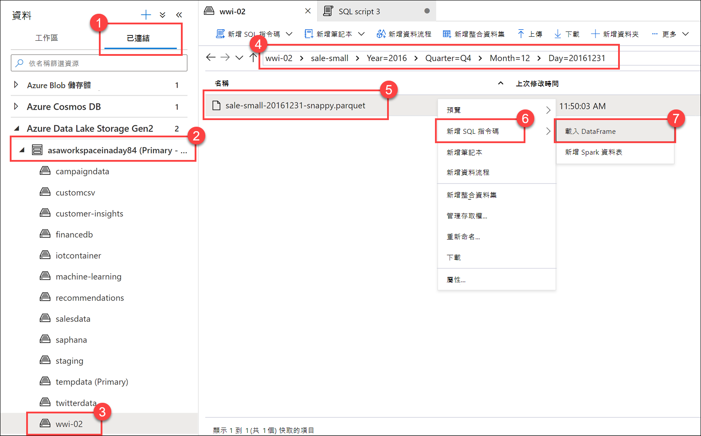

5. 将你的 Spark 池附加至笔记本。

    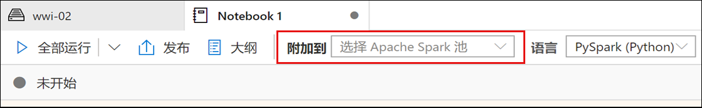

6. 在笔记本中选择 **“+”**，然后选择单元格 1 下的 **“</> 代码单元格”** 以添加新的代码单元格。

    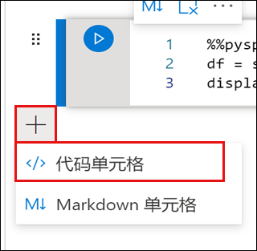

7. 在新单元格中输入以下内容，然后**从单元格 1 复制 Parquet 路径**，并粘贴该值以替换 `REPLACE_WITH_PATH` **(1)**。通过将 `-test` 添加到文件名末尾 **(2)**，重命名 Parquet 文件：

    ```python
    df.write.parquet('REPLACE_WITH_PATH')
    ```

    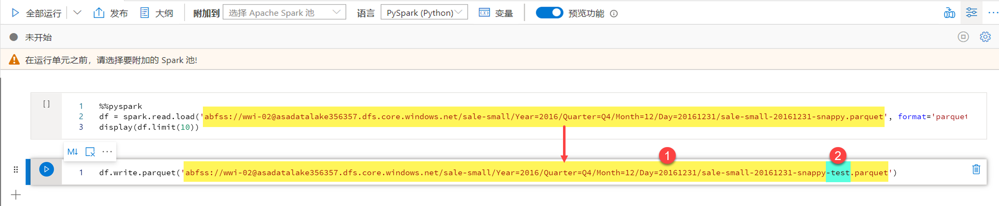

8. 在工具栏上选择 **“全部运行”** 以运行这两个单元格。几分钟后，当 Spark 池启动且单元格运行时，应该能在单元格 1 的输出 **(1)** 中看到文件数据。不过单元格 2 的输出 **(2)** 中应该会出现 **“403 错误”**。

    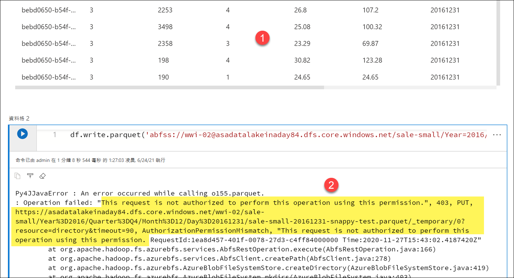

    按照预期，我们没有写入权限。单元格 2 返回的错误是 `This request is not authorized to perform this operation using this permission.`，且带有状态代码 403。

9. 让笔记本保持打开状态，并在另一个选项卡中切换回 Azure门户 (<https://portal.azure.com>)。

10. 选择 Azure 菜单 **(1)**，然后选择 **“Azure Active Directory”(2)**。

    

11. 在左侧菜单中选择 **“组”**。

    

12. 在搜索框中键入 **`tailwind`** **(1)**，然后在结果中选择 **`tailwind-history-owners-<suffix>`** **(2)**。

    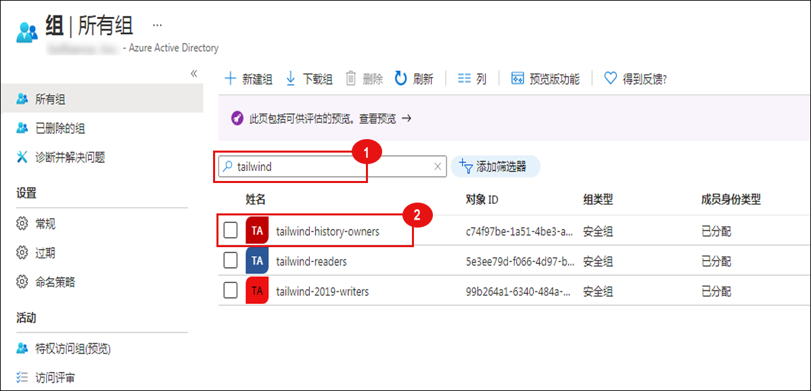

13. 选择左侧的 **“成员”(1)**，然后选择 **“+ 添加成员”(2)**。

    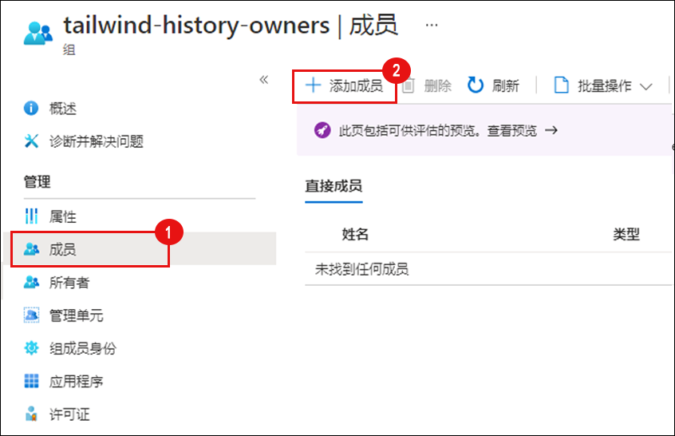

14. 添加你针对实验室所登录的用户帐户，然后选择 **“选择”**。

    

15. 切换回 Synapse Studio 中打开的 Synapse 笔记本，然后再次**运行**单元格 2 **(1)**。几分钟后，你应该能看到 **“已成功”(2)** 的状态。

    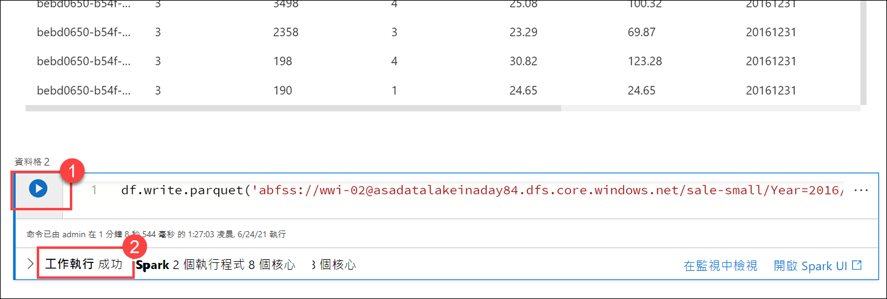

    该单元格这次能成功运行是因为我们将帐户添加到了 `tailwind-history-owners-<suffix>` 组，该组分配到了 **“存储 Blob 数据所有者”** 角色。

    > **备注**： 如果这次出现相同的错误，请停止笔记本**上的 Spark 会话**，然后依次选择 **“全部发布”** 和“发布”。发布更改后，选择页面右上角的用户配置文件并**注销**。成功注销后，**关闭浏览器选项**卡，然后重启 Synapse Studio (<https://web.azuresynapse.net/>)，重新打开笔记本并重新运行该单元格。因为必须刷新安全令牌才能进行身份验证更改，所以可能需要这样做。

    现在我们来验证文件是否成功写入数据湖。

16. 导航回 `sale-small/Year=2016/Quarter=Q4/Month=12/Day=20161231` 文件夹。应该能看到我们从笔记本写入的新 `sale-small-20161231-snappy-test.parquet` 文件的文件夹 **(1)**。如果这里没有列出，请选择工具栏中的 **“更多”** **(2)**，然后选择 **“刷新”(3)**。

    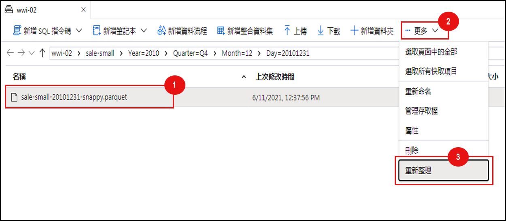
