# 模块 5 - 使用 Apache Spark 探索、转换数据并将数据加载到数据仓库中

此模块介绍如何浏览存储在 Data Lake 中的数据、转换数据以及将数据加载到关系数据存储中。学生将浏览 Parquet 和 JSON 文件并使用技术查询和转换具有层次结构的 JSON 文件。随后，学生将使用 Apache Spark 将数据加载到数据仓库中，并将 Data Lake 中的 Parquet 数据与专用 SQL 池中的数据联接起来。

在本模块中，学生将能够：

- 在 Synapse Studio 中浏览数据
- 在 Azure Synapse Analytics 中使用 Spark 笔记本引入数据
- 使用 Azure Synapse Analytics 中 Spark 池中的 DataFrame 转换数据
- 在 Azure Synapse Analytics 中集成 SQL 和 Spark 池

## 实验室详细信息

- [模块 5 - 使用 Apache Spark 探索、转换数据并将数据加载到数据仓库中](#module-5---explore-transform-and-load-data-into-the-data-warehouse-using-apache-spark)
  - [实验室详细信息](#lab-details)
  - [实验室设置和先决条件](#lab-setup-and-pre-requisites)
  - [练习 0：启动专用 SQL 池](#exercise-0-start-the-dedicated-sql-pool)
  - [练习 1：在 Synapse Studio 中浏览数据](#exercise-1-perform-data-exploration-in-synapse-studio)
    - [任务 1：使用 Azure Synapse Studio 中的数据预览器浏览数据](#task-1-exploring-data-using-the-data-previewer-in-azure-synapse-studio)
    - [任务 2：使用无服务器 SQL 池浏览文件](#task-2-using-serverless-sql-pools-to-explore-files)
    - [任务 3：使用 Synapse Spark 浏览和修复数据](#task-3-exploring-and-fixing-data-with-synapse-spark)
  - [练习 2：在 Azure Synapse Analytics 中使用 Spark 笔记本引入数据](#exercise-2-ingesting-data-with-spark-notebooks-in-azure-synapse-analytics)
    - [任务 1：使用适用于 Azure Synapse 的 Apache Spark 从 Data Lake 中引入和浏览 Parquet 文件](#task-1-ingest-and-explore-parquet-files-from-a-data-lake-with-apache-spark-for-azure-synapse)
  - [练习 3：使用 Azure Synapse Analytics 的 Spark 池中的 DataFrame 转换数据](#exercise-3-transforming-data-with-dataframes-in-spark-pools-in-azure-synapse-analytics)
    - [任务 1：使用适用于 Azure Synapse 的 Apache Spark 查询和转换 JSON 数据](#task-1-query-and-transform-json-data-with-apache-spark-for-azure-synapse)
  - [练习 4：在 Azure Synapse Analytics 中集成 SQL 和 Spark 池](#exercise-4-integrating-sql-and-spark-pools-in-azure-synapse-analytics)
    - [任务 1：更新笔记本](#task-1-update-notebook)

## 实验室设置和先决条件

> **备注：**如果**不**使用托管实验室环境，而是使用自己的 Azure 订阅，则仅完成`Lab setup and pre-requisites`步骤。否则，请跳转到练习 0。

**完成此模块的[实验室设置说明](https://github.com/solliancenet/microsoft-data-engineering-ilt-deploy/blob/main/setup/04/README.md)**。

请注意，以下模块使用相同的环境：

- [模块 4](labs/04/README.md)
- [模块 5](labs/05/README.md)
- [模块 7](labs/07/README.md)
- [模块 8](labs/08/README.md)
- [模块 9](labs/09/README.md)
- [模块 10](labs/10/README.md)
- [模块 11](labs/11/README.md)
- [模块 12](labs/12/README.md)
- [模块 13](labs/13/README.md)
- [模块 16](labs/16/README.md)

## 练习 0：启动专用 SQL 池

本实验室使用专用 SQL 池。第一步是确保它没有暂停。如果暂停，请按照以下说明启动它：

1. 打开 Synapse Studio (<https://web.azuresynapse.net/>)。

2. 选择 **“管理”** 中心。

    

3. 在左侧菜单中，选择 **“SQL 池”** **(1)**。如果专用 SQL 池已暂停，请将鼠标悬停在池名称上并选择 **“恢复”(2)**。

    

4. 出现提示时，选择 **“恢复”**。恢复池可能需要一到两分钟。

    

> 恢复专用 SQL 池后，**请继续下一个练习**。

## 练习 1：在 Synapse Studio 中浏览数据

在数据引入过程中，通常最先执行的数据工程任务之一是浏览要导入的数据。通过数据浏览，工程师可以更好地理解要引入的文件的内容。这一过程有助于识别任何可能阻碍自动引入过程的潜在数据质量问题。通过浏览，我们可以深入了解数据类型、数据质量，以及是否需要在将数据导入 Data Lake 或用于分析工作负载前对文件进行任何处理。

Tailspin Traders 的工程师在将一些销售数据引入数据仓库时遇到了问题，并请求相关协助来理解如何使用 Synapse Studio 帮助解决这些问题。此过程的第一步是要浏览数据，理解什么导致了他们遇到的问题，然后为他们提供解决方案。

### 任务 1：使用 Azure Synapse Studio 中的数据预览器浏览数据

Azure Synapse Studio 提供了多种浏览数据的方式，可以是简单的预览界面，也可以采用更复杂的编程方式（使用 Synapse Spark 笔记本）。在本练习中，你将学习如何使用这些功能来浏览、识别标识和修复有问题的文件。你将浏览存储在 Data Lake 的 `wwi-02/sale-poc` 文件夹中的 CSV 文件，并了解如何识别和修复问题。

1. 打开 Synapse Studio (<https://web.azuresynapse.net/>)，然后导航到 **“数据”** 中心。

    

    > 在“数据”中心，你可以访问工作区中已预配的 SQL 池数据库和 SQL 无服务器数据库，以及访问外部数据源，例如存储帐户和其他链接服务。

2. 我们想要访问存储在工作区主 Data Lake 中的文件，所以要选择数据中心内的 **“链接”** 选项卡。

    

3. 在 **“链接”** 选项卡上，展开 **“Azure Data Lake Storage Gen2”**，然后展开工作区的主 Data Lake。

    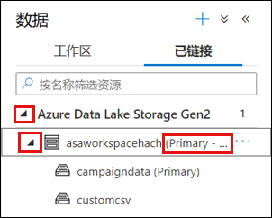

4. 在主 Data Lake 存储帐户内的容器列表中，选择 `wwi-02` 容器。

    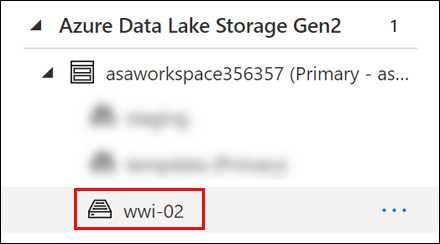

5. 在“容器资源管理器”窗口中，双击 `sale-poc` 文件夹将其打开。

    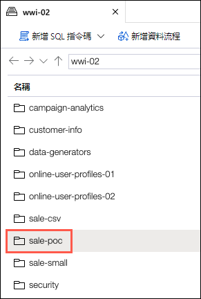

6. `sale-poc` 文件夹包含 2017 年 5 月的销售数据。该文件夹中有 31 个文件，每个文件代表当月的一天。这些文件由临时程序导入帐户，以解决 Tailspin 导入过程的问题。现在让我们花几分钟时间浏览部分文件。

7. 右键单击列表中的第一个文件 `sale-20170501.csv`，然后从上下文菜单中选择 **“预览”**。

    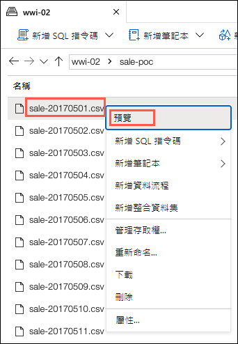

8. 通过 Synapse Studio 的 **“预览”** 功能，可以在无需使用代码的情况下快速检查文件内容。这是基本理解单个文件特征（列）和存储在其中的数据类型的有效方法。

    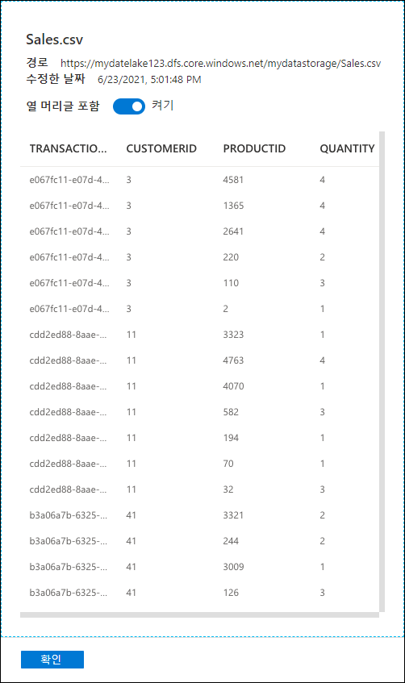

    > 在 `sale-20170501.csv` 的“预览”对话框中，花一点时间浏览文件预览。向下滚动只能显示预览中有限的行数，所以这只能大致了解文件结构。向右滚动可以看到文件中包含的列数及其名称。

9. 选择 **“确定”** 关闭 `sale-20170501.csv` 文件的预览。

10. 在执行数据浏览时，请务必查看多个文件，因为这有助于获得更具代表性的数据样本。让我们看看 `wwi-02\sale-poc` 文件夹中的下一个文件。右键单击 `sale-20170502.csv` 文件，然后从上下文菜单中选择 **“预览”**。

    

11. 在“预览”对话框中，你将立即注意到此文件结构与 `sale-20170501.csv` 文件不同。预览中未显示数据行，而列标题似乎包含数据而非字段名称。

    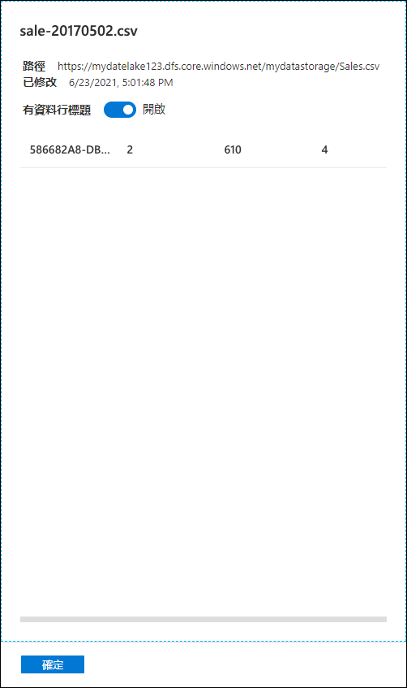

12. 在预览对话框中，必须选择关闭 **“包含列标题”** 选项。由于该文件似乎不包含列标题，请将其设置为关闭并检查结果。

    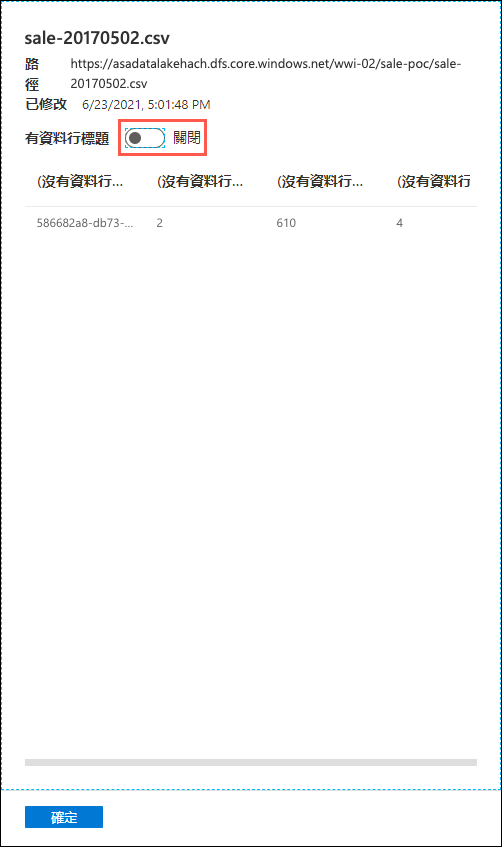

    > 将 **“包含列标题”** 设置为关闭可验证文件是否不包含列标题。所有列的标题中都有“（无列名称）”。此设置将数据适当地向下移动，使其看起来只是一行。通过向右滚动，可以注意到虽然看起来只有一行，但列数比预览第一个文件时看到的要多很多。该文件包含 11 列。

13. 我们已看到两种不同文件结构，现在通过查看另一个文件，再来看看我们是否可以了解 `sale-poc` 文件夹中哪种文件格式更具代表性。像之前一样，右键单击名为 `sale-20170503.csv` 的文件并选择 **“预览”**。

    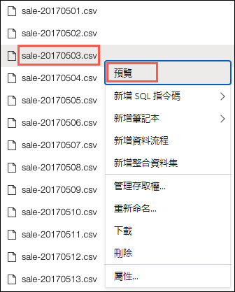

14. 预览显示 `sale-20170503.csv` 文件结构类似于 `20170501.csv` 中的结构。

    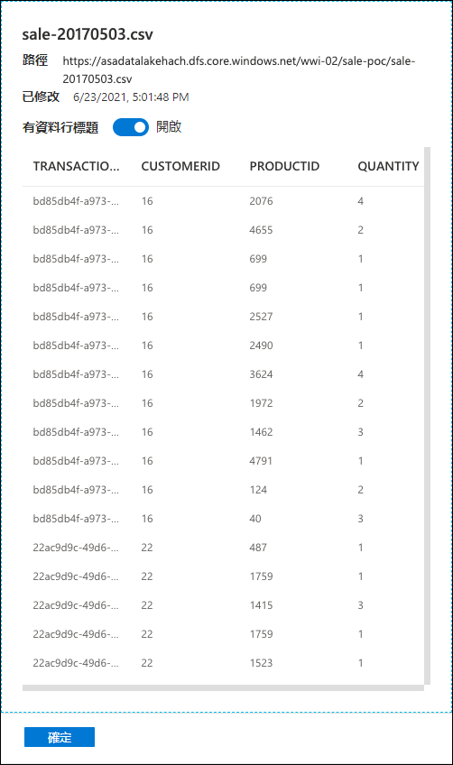

15. 选择 **“确定”** 关闭预览。

16. 现在，花几分钟时间预览 `sale-poc` 文件夹中的一些其他文件。这些文件的结构是否与 5 月 1 日和 3 日的文件相同？

### 任务 2：使用无服务器 SQL 池浏览文件

Synapse Studio 中的 **“预览”** 功能有助于快速浏览文件，但不能让我们更深入地查看数据或深入了解有问题的文件。在此任务中，我们将使用 Synapse 的 **“无服务器 SQL 池（内置）”** 功能来通过 T-SQL 浏览这些文件。

1. 再次右键单击 `sale-20170501.csv` 文件，这次选择 **“新建 SQL 脚本”** 并从上下文菜单中选择 **“前 100 行”**。

    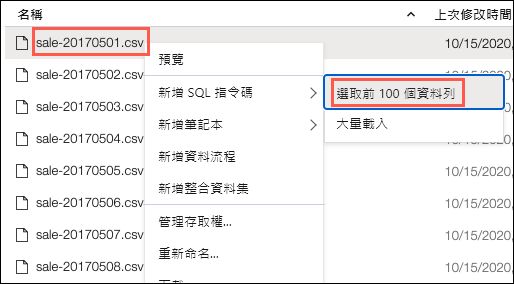

2. 一个新的 SQL 脚本选项卡将在 Synapse Studio 中打开，其中包含一个 `SELECT` 语句来读取文件的前 100 行。这提供了另一种方式来检查文件内容。通过限制要检查的行数，我们可以加快浏览过程，因为加载文件中所有数据的查询会运行得更慢。

    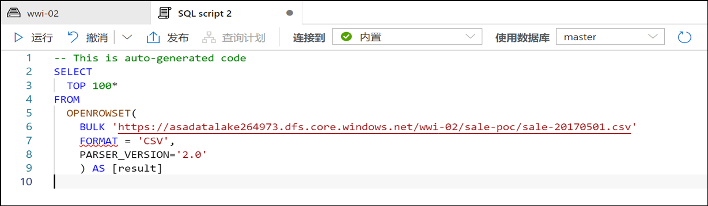

    > 针对存储在 Data Lake 中文件的 T-SQL 查询利用了 `OPENROWSET` 函数。可以在查询的 `FROM` 子句中像引用名为 `OPENROWSET` 的表那样引用 `OPENROWSET` 函数。该函数通过内置的 `BULK` 提供程序（用于从文件中读取数据并将数据作为行集返回）支持批量操作。要了解详细信息，可以查看 [OPENROWSET 文档](https://docs.microsoft.com/azure/synapse-analytics/sql/develop-openrowset)。

3. 现在，请选择工具栏上的 **“运行”** 以执行查询。

    

4. 在 **“结果”** 窗格中，观察输出。

    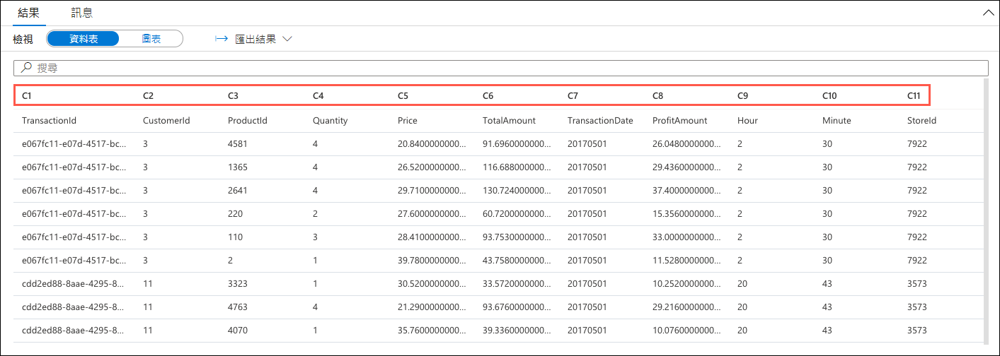

    > 在结果中，你将注意到包含列标题的第一行以数据行的形式呈现，分配给列的名称为 `C1` - `C11`。可以使用 `OPENROWSET` 函数的 `FIRSTROW` 参数来指定要显示为数据的文件首行的编号。默认值为 1，如果文件包含标题行，则可以将该值设置为 2 以跳过列标题。然后，可以使用 `WITH` 子句指定与文件关联的架构。

5. 让我们修改查询，告知其跳过标题行。在查询窗口中，在 `PARSER_VERSION='2.0'` 后面立即插入以下代码片段：

    ```sql
    , FIRSTROW = 2
    ```

6. 接下来，插入以下 SQL 代码以指定最终的 `)` 和 `AS [result]` 之间的架构：

    ```sql
    WITH (
        [TransactionId] varchar(50),
        [CustomerId] int,
        [ProductId] int,
        [Quantity] int,
        [Price] decimal(10,3),
        [TotalAmount] decimal(10,3),
        [TransactionDate] varchar(8),
        [ProfitAmount] decimal(10,3),
        [Hour] int,
        [Minute] int,
        [StoreId] int
    )
    ```

7. 最终查询应类似于以下内容（其中 `[YOUR-DATA-LAKE-ACCOUNT-NAME]` 是主 Data Lake 存储帐户的名称）：

    ```sql
    SELECT
        TOP 100 *
    FROM
        OPENROWSET(
            BULK 'https://[YOUR-DATA-LAKE-ACCOUNT-NAME].dfs.core.windows.net/wwi-02/sale-poc/sale-20170501.csv',
            FORMAT = 'CSV',
            PARSER_VERSION='2.0',
            FIRSTROW = 2
        ) WITH (
            [TransactionId] varchar(50),
            [CustomerId] int,
            [ProductId] int,
            [Quantity] int,
            [Price] decimal(10,3),
            [TotalAmount] decimal(10,3),
            [TransactionDate] varchar(8),
            [ProfitAmount] decimal(10,3),
            [Hour] int,
            [Minute] int,
            [StoreId] int
        ) AS [result]
    ```

    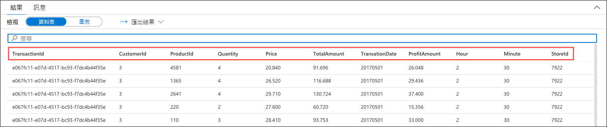

    > 现在，通过 `OPENROWSET` 函数，可以使用 T-SQL 语法进一步浏览数据。例如，可以使用 `WHERE` 子句来检查各种字段中的 `null` 或其他值，这些值可能需要在将数据用于高级分析工作负载之前处理。指定架构后，可以按名称引用字段以简化此过程。

8. 通过选择选项卡名称左侧的 `X` 关闭“SQL 脚本”选项卡。

    

9. 如果出现提示，请在 **“放弃更改?”** 对话框中选择 **“关闭 + 放弃更改”**。

    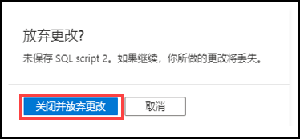

10. 使用 **“预览”** 功能时，可以看到 `sale-20170502.csv` 文件格式不佳。我们来看看能否使用 T-SQL 了解有关此文件中数据的更多信息。返回 `wwi-02` 选项卡，右键单击 `sale-20170502.csv` 文件并选择 **“新建 SQL 脚本”** 和 **“选择前 100 行”**。

    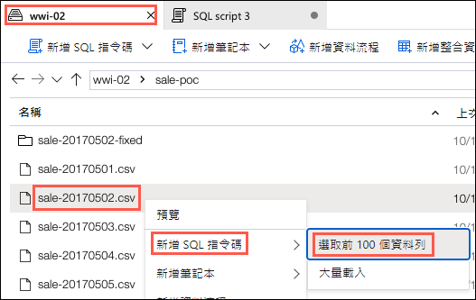

11. 按照先前操作，选择工具栏上的 **“运行”** 以执行查询。

    

12. 执行此查询会导致错误，**“信息”** 窗格中显示 `Error handling external file: 'Row larger than maximum allowed row size of 8388608 bytes found starting at byte 0.'`。

    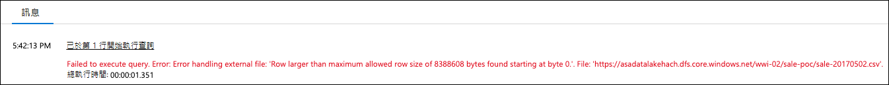

    > 此错误与此前在此文件的预览窗口中所看到的一致。在预览中，我们看到数据分为了多列，但所有数据都位于一行中。这意味着数据使用默认的字段分隔符（逗号）来拆分为列。然而，似乎缺少行终止符 `\r`。

13. 此时，我们知道 `sale-20170502.csv` 文件是格式不佳的 CSV 文件，因而需要更好地了解该文件的格式，以便了解如何解决问题。T-SQL 不提供查询文件何为行终止符的机制，因此可以利用 [Notepad++](https://notepad-plus-plus.org/downloads/) 之类的工具来进行了解。

    > 如果没有安装 Notepad++，可随时查看接下来的三个步骤即可。

14. 通过从 Data Lake 下载 `sale-20170501.csv` 和 `sale-20170502.csv` 文件，并在 [Notepad++](https://notepad-plus-plus.org/downloads/) 中将其打开，可以查看到文件中的行尾字符。

    > 要显示行终止符符号，请打开 Notepad++ 的 **“视图”** 菜单，然后选择 **“显示符号”** 并选择 **“显示行尾”**。
    >
    > 

15. 在 Notepad++ 中打开 `sale-20170501.csv` 文件后，可发现格式良好的文件在每行末尾包含一个换行 (LF) 字符。

    

16. 在 Notepad++ 中打开 `sale-20170502.csv` 文件后，可发现没有行终止符。数据作为单行输入到 CSV 文件中，每个字段值仅用逗号分隔。

    

    > 请注意，尽管此文件中的数据由单行组成，但依然可以看到不同行潜在的所在位置。在此行中，每隔 11 个字段就可以看到 TransactionId GUID 值。这表明文件在处理时遇到某种错误，导致文件中列标题和行分隔符缺失。

17. 为了修复文件，需要使用代码。T-SQL 和 Synapse Pipelines 不具备有效处理此类问题的功能。为解决此文件问题，需要使用 Synapse Spark 笔记本。

### 任务 3：使用 Synapse Spark 浏览和修复数据

在此任务中，你将使用 Synapse Spark 笔记本浏览 Data Lake `wwi-02/sale-poc` 文件夹中的部分文件。还将使用 Python 代码修复 `sale-20170502.csv` 文件的问题，这样目录中的所有文件都可以在稍后在本实验室使用 Synapse 管道来引入。

1. 在 Synapse Studio 中，打开 **“开发”** 中心。

    

2. 从 <https://solliancepublicdata.blob.core.windows.net/notebooks/Lab%202%20-%20Explore%20with%20Spark.ipynb> 下载要用于此练习的 Jupyter 笔记本。这样将下载一个名为 `Lab 2 - Explore with Spark.ipynb` 的文件。

    该链接将在新的浏览器窗口中打开文件的内容。在“文件”菜单中选择 **“另存为”**。默认情况下，浏览器会尝试将其保存为文本文件。如果有此选项，请将 `Save as type` 设置为 **“所有文件(*.*)”**。确保文件名以 `.ipynb` 结尾。

    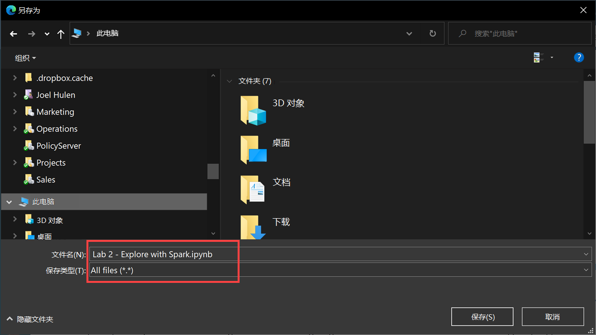

3. 在“开发”中心，选择“添加新资源(**+**)”按钮，然后选择 **“导入”**。

    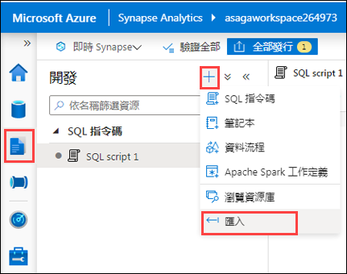

4. 选择在步骤 2 中下载的 **“实验室 2 - 使用 Spark 浏览”**，然后选择 **“打开”**。

5. 按照笔记本中包含的说明，完成此任务的其余部分。完成笔记本后，返回本指南并继续下一部分。

6. 完成 **“实验 2 - 使用 Spark 浏览”** 笔记本后，单击工具栏最右侧的“停止会话”按钮，释放 Spark 群集以进行下一个练习。  

Tailwind Traders 拥有来自各种数据源的非结构化和半结构化文件。他们的数据工程师希望利用 Spark 专业知识来浏览、引入和转换这些文件。

你建议使用 Synapse 笔记本，这些笔记本已集成在 Azure Synapse Analytics 工作区中并可通过 Synapse Studio 使用。

## 练习 2：在 Azure Synapse Analytics 中使用 Spark 笔记本引入数据

### 任务 1：使用适用于 Azure Synapse 的 Apache Spark 从 Data Lake 中引入和浏览 Parquet 文件

Tailwind Traders 在其 Data Lake 中存储了 Parquet 文件。他们想知道如何使用 Apache Spark 快速访问和浏览这些文件。

你的建议是使用“数据”中心来查看连接的存储帐户中的 Parquet 文件，然后使用“新建笔记本”上下文菜单创建一个新的 Synapse 笔记本，它用于加载具有所选 Parquet 文件的内容的 Spark 数据帧__。

1. 打开 Synapse Studio (<https://web.azuresynapse.net/>)。

2. 选择 **“数据”** 中心。

    

3. 选择 **“链接”** 选项卡 **(1)** 并展开 `Azure Data Lake Storage Gen2` 组，然后展开主 Data Lake 存储帐户（*名称可能与在此处看到的不同；它是列出的第一个存储帐户*）。选择 **“wwi-02”** 容器 **(2)** 并浏览到 `sale-small/Year=2010/Quarter=Q4/Month=12/Day=20101231` 文件夹 **(3)**。右键单击 Parquet 文件 **(4)**，选择 **“新建笔记本”(5)**，然后选择 **“加载到 DataFrame”(6)**。

    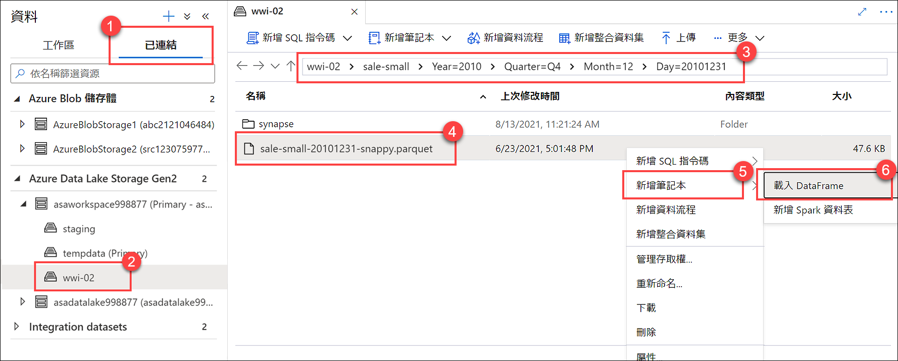

    这将生成一个包含 PySpark 代码的笔记本，用于将数据加载到 Spark 数据帧中，并显示带有标题的 100 行内容。

4. 确保将 Spark 池已附加到该笔记本。

    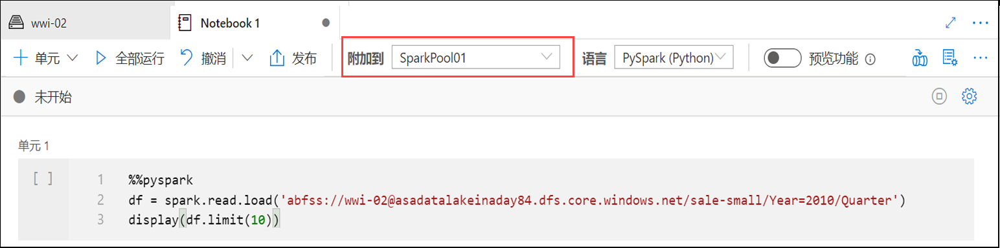

    Spark 池为所有笔记本计算提供计算。如果查看笔记本的底部，会看到该池并未启动。当运行笔记本中的单元格，但池处于空闲状态时，该池将启动并分配资源。这是一次性操作，直到池因空闲时间过长而自动暂停。

    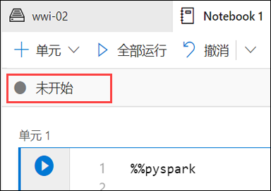

    > 自动暂停设置在“管理”中心内的 Spark 池配置上进行配置。

5. 在单元格的代码下面添加以下内容，定义一个名为 `datalake` 的变量，其值是主存储账户的名称（用第 2 行的存储账户名称替换 REPLACE_WITH_YOUR_DATALAKE_NAME 值）：

    ```python
    datalake = 'REPLACE_WITH_YOUR_DATALAKE_NAME'
    ```

    

    稍后将在几个单元格中使用此变量。

6. 在笔记本工具栏上选择 **“全部运行”**，以执行笔记本。

    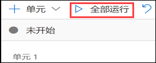

    > **备注：** 首次在 Spark 池中运行笔记本时，Azure Synapse 会创建一个新的会话。这大约需要 3-5 分钟时间。

    > **备注：** 若要仅运行单元格，请将鼠标悬停在单元格上，然后选择单元格左侧的“运行单元格”图标，或者选中单元格，再在键盘上按下 **Ctrl+Enter**__。

7. 单元格运行完成后，在单元格输出中将视图更改为 **“图表”**。

    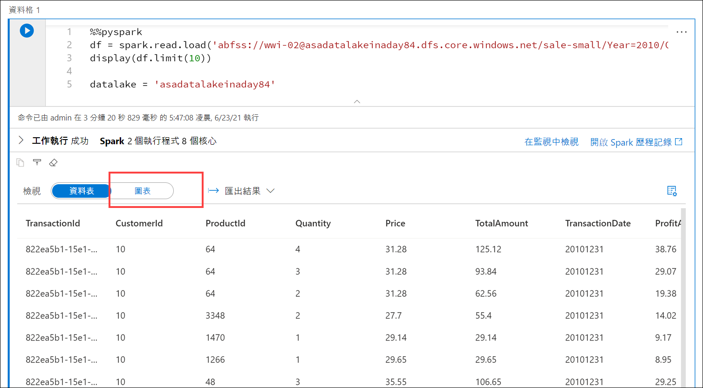

    默认情况下，使用 `display()` 函数时，单元格会输出为表格视图。我们在输出中看到 Parquet 文件（2010 年 12 月 31 日）中存储的销售交易数据。选择 **“图表”** 可视化效果可查看数据的不同视图。

8. 选择右侧的 **“视图选项”** 按钮。

    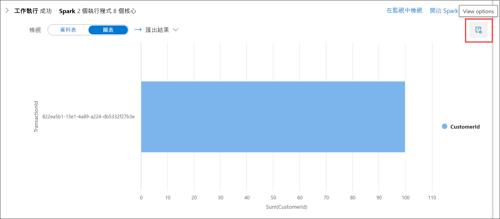

9. 将键设置为 **`ProductId`**，将值设置为 **`TotalAmount` (1)**，然后选择 **“应用”(2)**。

    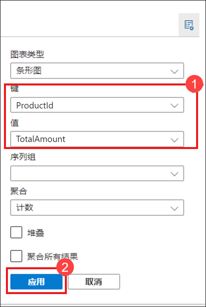

10. 已显示“图表”可视化效果。将鼠标悬停在条形上可查看详细信息。

    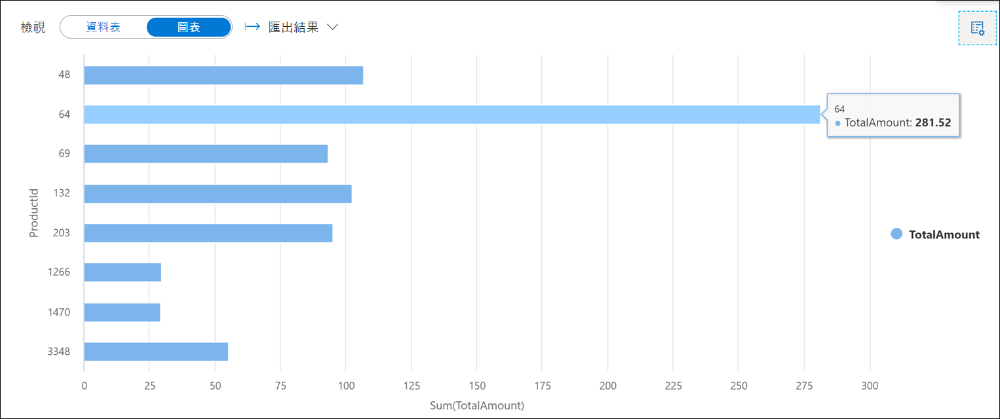

11. 通过先后选择 **“+”** 以及图表下方的 **“</> 代码单元格”**，在下方创建一个新单元格*。

    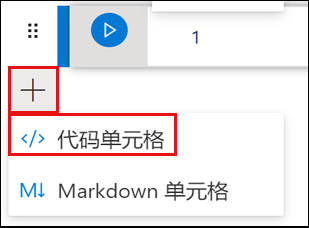

12. Spark 引擎可分析 Parquet 文件并推断架构。若要实现这一点，请在新单元格中输入以下内容并**运行**它：

    ```python
    df.printSchema()
    ```

    输出应如下所示：

    ```text
    root
        |-- TransactionId: string (nullable = true)
        |-- CustomerId: integer (nullable = true)
        |-- ProductId: short (nullable = true)
        |-- Quantity: short (nullable = true)
        |-- Price: decimal(29,2) (nullable = true)
        |-- TotalAmount: decimal(29,2) (nullable = true)
        |-- TransactionDate: integer (nullable = true)
        |-- ProfitAmount: decimal(29,2) (nullable = true)
        |-- Hour: byte (nullable = true)
        |-- Minute: byte (nullable = true)
        |-- StoreId: short (nullable = true)
    ```

    Spark 会计算文件内容来推断架构。对于数据探索和大多数转换任务，这种自动推理通常就已经足够。但是，将数据加载到 SQL 表等外部资源时，有时需要声明自己的架构并将其应用于数据集。目前，架构似乎还不错。

13. 现在让我们在数据帧中使用聚合和分组操作来更好地理解数据。创建一个新单元格，然后输入以下内容，再**运行**该单元格：

    ```python
    from pyspark.sql import SparkSession
    from pyspark.sql.types import *
    from pyspark.sql.functions import *

    profitByDateProduct = (df.groupBy("TransactionDate","ProductId")
        .agg(
            sum("ProfitAmount").alias("(sum)ProfitAmount"),
            round(avg("Quantity"), 4).alias("(avg)Quantity"),
            sum("Quantity").alias("(sum)Quantity"))
        .orderBy("TransactionDate"))
    display(profitByDateProduct.limit(100))
    ```

    > 导入所需的 Python 库，以使用架构中定义的聚合函数和类型来成功执行查询。

    输出显示了上图中所示的相同数据，但现在具有 `sum` 和 `avg` 聚合 **(1)**。请注意，我们使用 **`alias`** 方法 **(2)** 来更改列名称。

    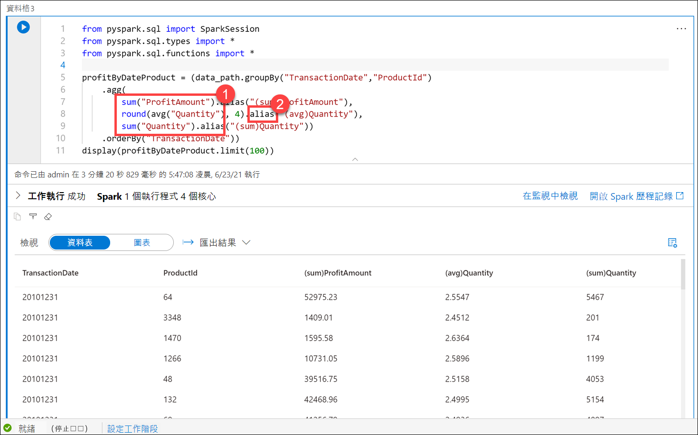

## 练习 3：使用 Azure Synapse Analytics 的 Spark 池中的 DataFrame 转换数据

### 任务 1：使用适用于 Azure Synapse 的 Apache Spark 查询和转换 JSON 数据

除了销售数据，Tailwind Traders 还有来自电子商务系统的客户资料数据，提供了过去 12 个月内网站每位访问者（客户）的购买最多的产品情况。这些数据存储在 Data Lake 的 JSON 文件中。他们一直在尝试引入、探索和转换这些 JSON 文件，希望得到你的指导。这些文件有一个层次结构，他们希望在将这些文件加载到关系数据存储中之前能够进行平展。他们还希望在数据工程过程中应用分组和聚合操作。

你建议使用 Synapse 笔记本来探索并应用 JSON 文件上的数据转换。

1. 在 Spark 笔记本中创建一个新单元格，输入以下代码并执行该单元格：

    ```python
    df = (spark.read \
            .option('inferSchema', 'true') \
            .json('abfss://wwi-02@' + datalake + '.dfs.core.windows.net/online-user-profiles-02/*.json', multiLine=True)
        )

    df.printSchema()
    ```

    > 我们在第一个单元格中创建的 `datalake` 变量在这里用作文件路径的一部分。

    输出应如下所示：

    ```text
    root
    |-- topProductPurchases: array (nullable = true)
    |    |-- element: struct (containsNull = true)
    |    |    |-- itemsPurchasedLast12Months: long (nullable = true)
    |    |    |-- productId: long (nullable = true)
    |-- visitorId: long (nullable = true)
    ```

    > 请注意，我们选择的是 `online-user-profiles-02` 目录中的所有 JSON 文件。每个 JSON 文件包含多行，这也是指定 `multiLine=True` 选项的原因。此外，我们将 `inferSchema` 选项设置为 `true`，指示 Spark 引擎查看文件并根据数据的性质创建架构。

2. 到目前为止，我们在这些单元中一直使用的是 Python 代码。如果要使用 SQL 语法查询文件，一种选择是在数据帧中创建数据的临时视图。在新单元格中执行以下操作来创建名为 `user_profiles` 的视图：

    ```python
    # 创建名为 user_profiles 的视图
    df.createOrReplaceTempView("user_profiles")
    ```

3. 创建新单元格。由于我们要使用 SQL，而不是 Python，因此使用 `%%sql` magic 将单元格的语言设置为 SQL。在单元格中执行以下代码：

    ```sql
    %%sql

    SELECT * FROM user_profiles LIMIT 10
    ```

    请注意，输出显示了 `topProductPurchases` 的嵌套数据，其中包括一个包含 `productId` 和 `itemsPurchasedLast12Months` 值的数组。可以通过单击每行中的直角三角形来展开字段。

    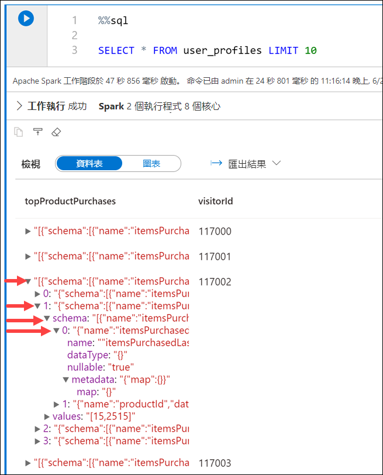

    这使分析数据变得有点困难。这是因为 JSON 文件的内容看起来如下所示：

    ```json
    [
    {
        "visitorId": 9529082,
        "topProductPurchases": [
        {
            "productId": 4679,
            "itemsPurchasedLast12Months": 26
        },
        {
            "productId": 1779,
            "itemsPurchasedLast12Months": 32
        },
        {
            "productId": 2125,
            "itemsPurchasedLast12Months": 75
        },
        {
            "productId": 2007,
            "itemsPurchasedLast12Months": 39
        },
        {
            "productId": 1240,
            "itemsPurchasedLast12Months": 31
        },
        {
            "productId": 446,
            "itemsPurchasedLast12Months": 39
        },
        {
            "productId": 3110,
            "itemsPurchasedLast12Months": 40
        },
        {
            "productId": 52,
            "itemsPurchasedLast12Months": 2
        },
        {
            "productId": 978,
            "itemsPurchasedLast12Months": 81
        },
        {
            "productId": 1219,
            "itemsPurchasedLast12Months": 56
        },
        {
            "productId": 2982,
            "itemsPurchasedLast12Months": 59
        }
        ]
    },
    {
        ...
    },
    {
        ...
    }
    ]
    ```

4. PySpark 包含一个特殊的 [`explode` 函数](https://spark.apache.org/docs/latest/api/python/pyspark.sql.html?highlight=explode#pyspark.sql.functions.explode)，可为数组的每个元素返回一个新行。这将有助于平展 `topProductPurchases` 列，以提高可读性或方便查询。在新单元格中执行以下操作：

    ```python
    from pyspark.sql.functions import udf, explode

    flat=df.select('visitorId',explode('topProductPurchases').alias('topProductPurchases_flat'))
    flat.show(100)
    ```

    在此单元格中，我们创建了一个名为 `flat` 的新数据帧（其中包括 `visitorId` 字段）和一个名为 `topProductPurchases_flat` 的新别名字段。正如你所见，输出更易于阅读，而且通过扩展，更易于查询。

    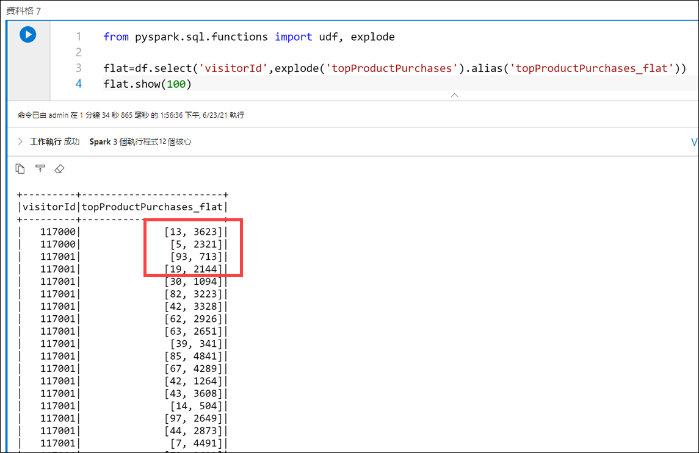

5. 创建一个新单元格并执行以下代码，以创建数据帧的新平展版本，该版本提取 `topProductPurchases_flat.productId` 和 `topProductPurchases_flat.itemsPurchasedLast12Months` 字段，为每个数据组合创建新行：

    ```python
    topPurchases = (flat.select('visitorId','topProductPurchases_flat.productId','topProductPurchases_flat.itemsPurchasedLast12Months')
        .orderBy('visitorId'))

    topPurchases.show(100)
    ```

    在输出中，请注意现在每个 `visitorId` 都有多行。

    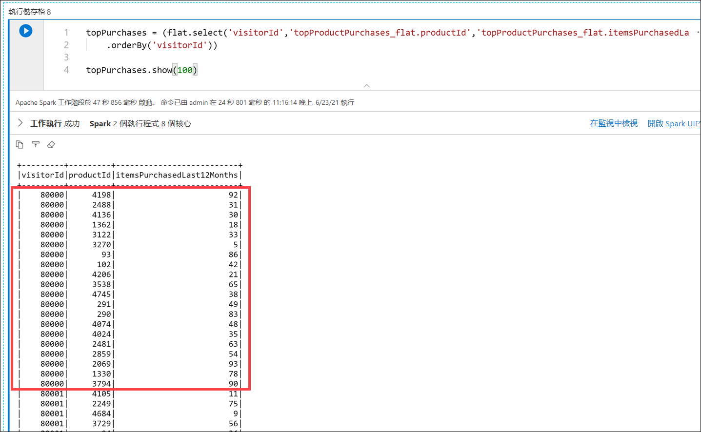

6. 我们按过去 12 个月内购买的商品数量来排序。创建新单元格并执行以下代码：

    ```python
    # 我们按过去 12 个月内购买的商品数量来排序。
    sortedTopPurchases = topPurchases.orderBy("itemsPurchasedLast12Months")

    display(sortedTopPurchases.limit(100))
    ```

    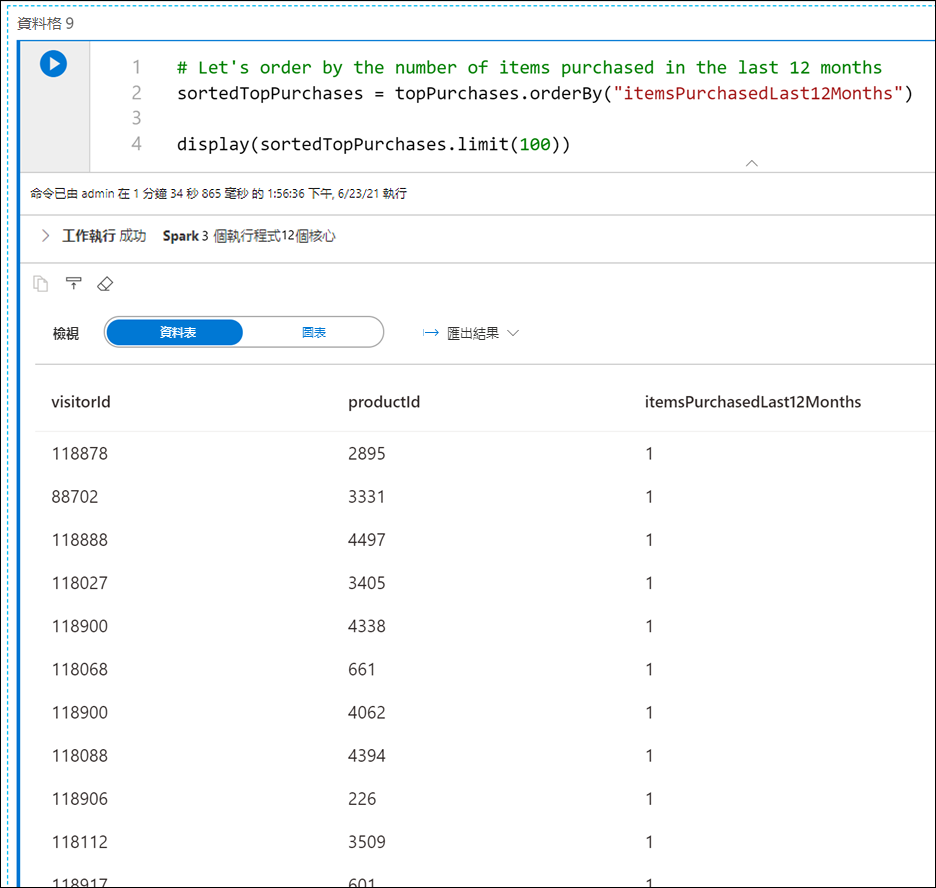

7. 如何按相反的顺序进行排序？可能有结论表示可进行如下调用： `topPurchases.orderBy("itemsPurchasedLast12Months desc")`. 在新单元格中试用：

    ```python
    topPurchases.orderBy("itemsPurchasedLast12Months desc")
    ```

    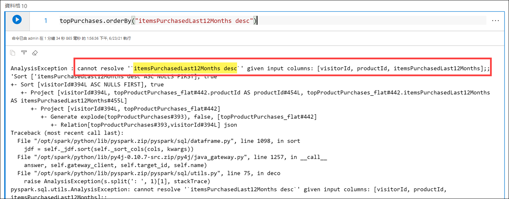

    请注意，出现了 `AnalysisException` 错误，因为 `itemsPurchasedLast12Months desc` 与列名不匹配。

    为什么这不起作用？

    - `DataFrames` API 在 SQL 引擎的基础上生成。
    - 一般来说，大家都很熟悉这个 API 和 SQL 语法。
    - 问题是 `orderBy(..)` 需要列的名称。
    - 我们指定的是 **“requests desc”** 形式的 SQL 表达式。
    - 但需要的是以编程方式表达此类表达式的方法。
    - 这将我们引向第二个变体 `orderBy(Column)`，更具体地说，则是 `Column` 类。

8. **Column** 类是一种对象，不仅包含列的名称，还包含列级转换，例如按降序排序。在新单元格中执行以下代码：

    ```python
    sortedTopPurchases = (topPurchases
        .orderBy( col("itemsPurchasedLast12Months").desc() ))

    display(sortedTopPurchases.limit(100))
    ```

    请注意，得益于 **`col`** 对象上的 **`desc()`** 方法，现在结果按 `itemsPurchasedLast12Months` 列以降序方式排序。

    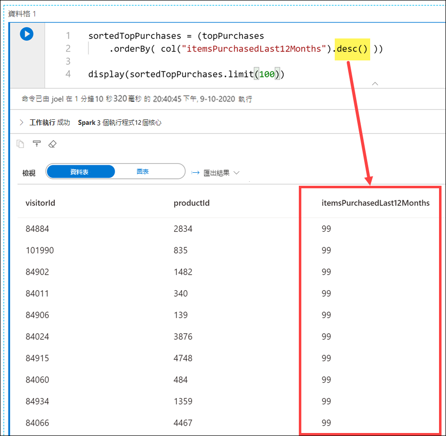

9. 每位客户购买了多少种*类型*的产品？为弄清楚这一点，需要按 `visitorId` 分组并聚合每位客户的行数。在新单元格中执行以下代码：

    ```python
    groupedTopPurchases = (sortedTopPurchases.select("visitorId")
        .groupBy("visitorId")
        .agg(count("*").alias("total"))
        .orderBy("visitorId") )

    display(groupedTopPurchases.limit(100))
    ```

    请注意我们如何在 `visitorId` 列上使用 **`groupBy`** 方法，以及在记录计数上使用 **`agg`** 方法来显示每位客户的总量。

    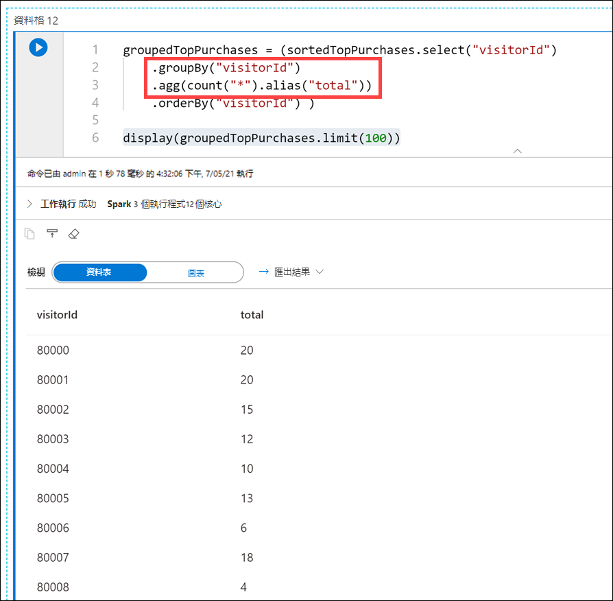

10. 每位客户*总共购*买了多少产品？为弄清楚这一点，需要按 `visitorId` 分组并聚合每位客户的 `itemsPurchasedLast12Months` 值的总和。在新单元格中执行以下代码：

    ```python
    groupedTopPurchases = (sortedTopPurchases.select("visitorId","itemsPurchasedLast12Months")
        .groupBy("visitorId")
        .agg(sum("itemsPurchasedLast12Months").alias("totalItemsPurchased"))
        .orderBy("visitorId") )

    display(groupedTopPurchases.limit(100))
    ```

    这里我们再次按 `visitorId` 分组，但现在是在 **`agg`** 方法中的 `itemsPurchasedLast12Months` 列上使用 **`sum`**。 请注意，我们已将 `itemsPurchasedLast12Months` 列包含在 `select` 语句中，因此可以在 `sum` 中使用它。

    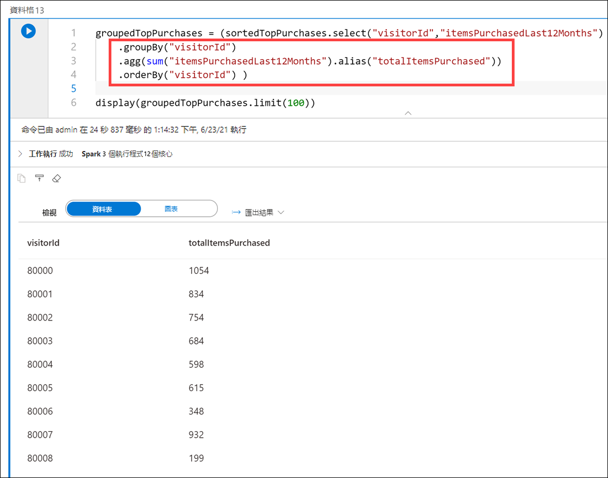

## 练习 4：在 Azure Synapse Analytics 中集成 SQL 和 Spark 池

Tailwind Traders 希望在 Spark 中执行数据工程任务后，将数据写入与专用 SQL 池相关的 SQL 数据库，然后引用该 SQL 数据库作为与包含其他文件数据的 Spark 数据帧的联接源。

你决定使用 Synapse SQL 的 Apache Spark 连接器，以在 Azure Synapse 中的 Spark 数据库和 SQL 数据库之间高效进行数据传输。

可以使用 JDBC 来执行 Spark 数据库与 SQL 数据库之间的数据传输。但是，假设有两个分布式系统（例如 Spark 池和 SQL 池），则 JDBC 往往会成为串行数据传输的瓶颈。

Apache Spark 池到 Synapse SQL 的连接器是适用于 Apache Spark 的一个数据源实现。它使用 Azure Data Lake Storage Gen2 以及专用 SQL 池中的 PolyBase 在 Spark 群集与 Synapse SQL 实例之间高效地传输数据。

### 任务 1：更新笔记本

1. 到目前为止，我们在这些单元中一直使用的是 Python 代码。如果要使用 Apache Spark 池到 Synapse SQL 的连接器 (`sqlanalytics`)，一种选择是在数据帧内创建数据的临时视图。在新单元格中执行以下操作来创建名为 `top_purchases` 的视图：

    ```python
    # 为购买最多的产品创建临时视图，以便从 Scala 进行加载
    topPurchases.createOrReplaceTempView("top_purchases")
    ```

    我们从之前创建的 `topPurchases` 数据帧中创建了一个新的临时视图，其中包含平展的 JSON 用户购买数据。

2. 必须在 Scala 中执行使用 Apache Spark 池到 Synapse SQL 的连接器的代码。为此，我们将 `%%spark` magic 添加到单元格中。在新单元格中执行以下命令以从 `top_purchases` 视图中读取：

    ```java
    %%spark
    // 确保专用 SQL 池（下面的 SQLPool01）的名称与你的 SQL 池的名称匹配。
    val df = spark.sqlContext.sql("select * from top_purchases")
    df.write.sqlanalytics("SQLPool01.wwi.TopPurchases", Constants.INTERNAL)
    ```

    > **备注**： 执行此单元所需的时间可能超过 1 分钟。如果之前运行过此命令，则会收到一条错误消息，指出“已存在名为…的对象”，原因是该表已经存在。

    单元格执行完毕后，查看一下 SQL 表的列表，以验证是否成功创建该表。

3. **让笔记本保持打开状态**，然后导航到 **“数据”** 中心（如果尚未选择）。

    

4. 选择 **“工作区”** 选项卡 **(1)**，展开 SQL 数据库，选择表上的 **“省略号(…)”** **(2)**，然后选择 **“刷新”(3)**。展开 **`wwi.TopPurchases`** 表和列 **(4)**。

    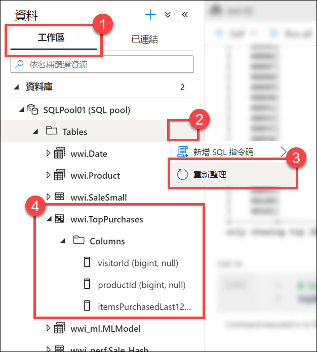

    如你所见，已根据 Spark 数据帧的派生架构，自动为我们创建 `wwi.TopPurchases` 表。Apache Spark 池到 Synapse SQL 的连接器负责创建表并高效将数据加载到其中。

5. 返**回笔记本**并在新单元格中执行以下命令，以从位于 `sale-small/Year=2019/Quarter=Q4/Month=12/` 文件夹中的所有 Parquet 文件中读取销售数据：

    ```python
    dfsales = spark.read.load('abfss://wwi-02@' + datalake + '.dfs.core.windows.net/sale-small/Year=2019/Quarter=Q4/Month=12/*/*.parquet', format='parquet')
    display(dfsales.limit(10))
    ```

    > **备注**： 执行此单元所需的时间可能超过 3 分钟。
    >
    > 我们在第一个单元格中创建的 `datalake` 变量在这里用作文件路径的一部分。

    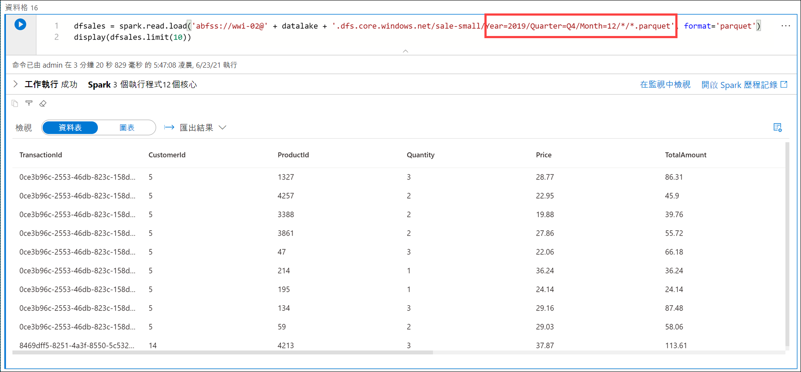

    将上面单元中的文件路径与第一个单元中的文件路径进行比较。在这里，我们使用相对路径从位于 `sale-small` 的 Parquet 文件中加载 **2019 年 12 月的所有销售数**据，而不仅仅是 2010 年 12 月 31 日的销售数据。

    接下来，我们将之前创建的 SQL 表中的 `TopSales` 数据加载到新的 Spark 数据帧中，然后将其与这个新的 `dfsales` 数据帧联接起来。为此，必须再次在新单元上使用 `%%spark` magic，因为我们将使用 Apache Spark 池到 Synapse SQL 的连接器从 SQL 数据库检索数据。然后，我们需要将数据帧内容添加到新的临时视图中，以便可通过 Python 访问数据。

6. 在新单元格中执行以下命令以从 `TopSales` SQL 表中读取数据，并将其保存到临时视图中：

    ```java
    %%spark
    // 确保 SQL 池（下面的 SQLPool01）的名称与你的 SQL 池的名称匹配。
    val df2 = spark.read.sqlanalytics("SQLPool01.wwi.TopPurchases")
    df2.createTempView("top_purchases_sql")

    df2.head(10)
    ```

    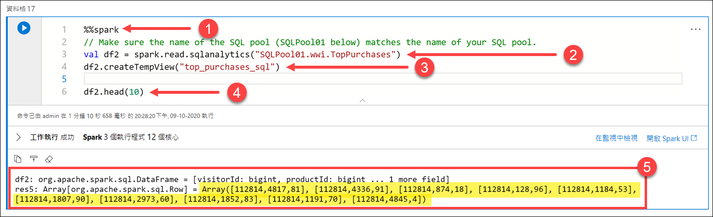

    在单元格顶部使用 `%%spark` magic **(1)** 将单元格的语言设置为 `Scala`。我们将一个名为 `df2` 的新变量声明为由 `spark.read.sqlanalytics` 方法创建的新 DataFrame，该方法从 SQL 数据库中的 `TopPurchases` 表 **(2)** 中读取数据。然后，我们填充了一个名为 `top_purchases_sql` 的新临时视图 **(3)**。最后，我们显示了 `df2.head(10))` 行 **(4)** 的前 10 条记录。单元格输出显示了数据帧值 **(5)**。

7. 在新单元格中执行以下命令，以便从 `top_purchases_sql` 中创建一个新的 Python 数据帧，然后显示前 10 个结果：

    ```python
    dfTopPurchasesFromSql = sqlContext.table("top_purchases_sql")

    display(dfTopPurchasesFromSql.limit(10))
    ```

    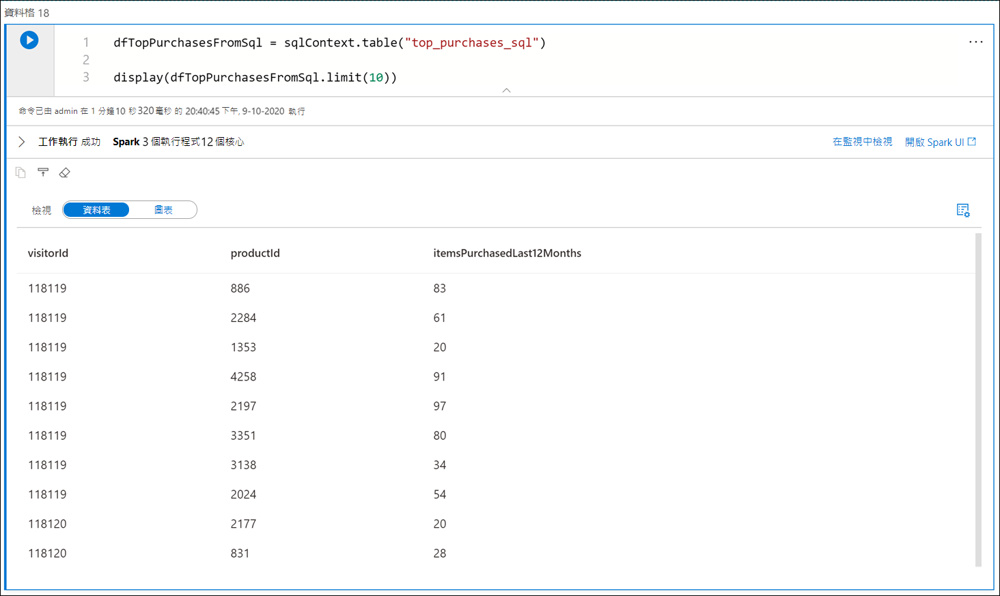

8. 在新单元格中执行以下操作，连接来自销售的 Parquet 文件和 `TopPurchases` SQL 数据库的数据：

    ```python
    inner_join = dfsales.join(dfTopPurchasesFromSql,
        (dfsales.CustomerId == dfTopPurchasesFromSql.visitorId) & (dfsales.ProductId == dfTopPurchasesFromSql.productId))

    inner_join_agg = (inner_join.select("CustomerId","TotalAmount","Quantity","itemsPurchasedLast12Months","top_purchases_sql.productId")
        .groupBy(["CustomerId","top_purchases_sql.productId"])
        .agg(
            sum("TotalAmount").alias("TotalAmountDecember"),
            sum("Quantity").alias("TotalQuantityDecember"),
            sum("itemsPurchasedLast12Months").alias("TotalItemsPurchasedLast12Months"))
        .orderBy("CustomerId") )

    display(inner_join_agg.limit(100))
    ```

    在查询中，我们联接了 `dfsales` 和 `dfTopPurchasesFromSql` 数据帧，在 `CustomerId` 和 `ProductId` 上进行匹配。此联接将 `TopPurchases` SQL 表数据与 2019 年 12 月销售的 Parquet 数据 **(1)** 结合起来。

    我们按 `CustomerId` 和 `ProductId` 字段分组。由于 `ProductId` 字段名称不明确（在两个数据帧中都存在），因此必须完全限定 `ProductId` 名称引用 `TopPurchases` 数据帧中的名称 **(2)**。

    然后，我们创建了一个聚合，其中汇总了 12 月在每种产品上花费的总金额、12 月的产品总数以及过去 12 个月内购买的产品总数 **(3)**。

    最后，我们在表视图中显示了联接和聚合的数据。

    > **备注**： 可随意单击表视图中的列标题来对结果集进行排序。

    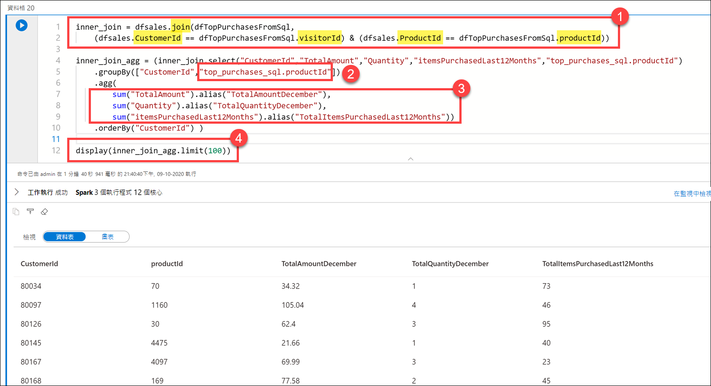
