# 模块 8 - 使用 Azure 数据工厂或 Azure Synapse 管道转换数据

本模块向学生介绍如何执行以下操作：构建数据集成管道以从多个数据源引入数据、使用映射数据流和笔记本转换数据、将数据移动到一个或多个数据接收器中。

在本模块中，学生将能够：

- 使用 Azure Synapse 管道大规模执行无代码转换
- 创建数据管道来导入格式错乱的 CSV 文件
- 创建映射数据流

## 实验室详细信息

- [模块 8 - 使用 Azure 数据工厂或 Azure Synapse 管道转换数据](#module-8---transform-data-with-azure-data-factory-or-azure-synapse-pipelines)
  - [实验室详细信息](#lab-details)
  - [实验室设置和先决条件](#lab-setup-and-pre-requisites)
  - [练习 0：启动专用 SQL 池](#exercise-0-start-the-dedicated-sql-pool)
  - [实验室 1：使用 Azure Synapse 管道大规模执行无代码转换](#lab-1-code-free-transformation-at-scale-with-azure-synapse-pipelines)
    - [练习 1：创建工件](#exercise-1-create-artifacts)
      - [任务 1：创建 SQL 表](#task-1-create-sql-table)
      - [任务 2：创建链接服务](#task-2-create-linked-service)
      - [任务 3：创建数据集](#task-3-create-data-sets)
      - [任务 4：创建活动分析数据集](#task-4-create-campaign-analytics-dataset)
    - [练习 2：创建数据管道来导入格式错乱的 CSV 文件](#exercise-2-create-data-pipeline-to-import-poorly-formatted-csv)
      - [任务 1：创建活动分析数据流](#task-1-create-campaign-analytics-data-flow)
      - [任务 2：创建活动分析数据管道](#task-2-create-campaign-analytics-data-pipeline)
      - [任务 3：运行活动分析数据管道](#task-3-run-the-campaign-analytics-data-pipeline)
      - [任务 4：查看活动分析表的内容](#task-4-view-campaign-analytics-table-contents)
    - [练习 3：为经常购买的产品创建映射数据流](#exercise-3-create-mapping-data-flow-for-top-product-purchases)
      - [任务 1：创建映射数据流](#task-1-create-mapping-data-flow)
  - [实验室 2：协调 Azure Synapse 管道中的数据移动和转换](#lab-2-orchestrate-data-movement-and-transformation-in-azure-synapse-pipelines)
    - [练习 1：创建、触发和监视管道](#exercise-1-create-trigger-and-monitor-pipeline)
      - [任务 1：创建管道](#task-1-create-pipeline)
      - [任务 2：触发、监视和分析用户配置文件数据管道](#task-2-trigger-monitor-and-analyze-the-user-profile-data-pipeline)

## 实验室设置和先决条件

> **备注：** 如果**不**使用托管实验室环境，而是使用自己的 Azure 订阅，则仅完成 `Lab setup and pre-requisites` 步骤。否则，请跳转到练习 0。

**完成此模块的[实验室设置说明](https://github.com/solliancenet/microsoft-data-engineering-ilt-deploy/blob/main/setup/04/README.md)**。

请注意，以下模块使用相同的环境：

- [模块 4](labs/04/README.md)
- [模块 5](labs/05/README.md)
- [模块 7](labs/07/README.md)
- [模块 8](labs/08/README.md)
- [模块 9](labs/09/README.md)
- [模块 10](labs/10/README.md)
- [模块 11](labs/11/README.md)
- [模块 12](labs/12/README.md)
- [模块 13](labs/13/README.md)
- [模块 16](labs/16/README.md)

## 练习 0：启动专用 SQL 池

本实验室使用专用 SQL 池。第一步是确保它没有暂停。如果暂停，请按照以下说明启动它：

1. 打开 Synapse Studio (<https://web.azuresynapse.net/>)。

2. 选择 **“管理”** 中心。

    

3. 在左侧菜单中，选择 **“SQL 池”** **(1)**。如果专用 SQL 池已暂停，请将鼠标悬停在池名称上并选择 **“恢复”(2)**。

    

4. 出现提示时，选择 **“恢复”**。恢复池可能需要一到两分钟。

    

> 恢复专用 SQL 池后，**请继续下一个练习**。

## 实验室 1：使用 Azure Synapse 管道大规模执行无代码转换

Tailwind Traders 希望为数据工程任务提供无代码选项。其动机是希望使了解数据但不具有太多开发经验的初级工程师能够构建和维护数据转换操作。此要求的另一个推动因素是通过依赖固定到特定版本的库来减少由复杂代码引起的脆弱性、取消代码测试要求，以及提高长期维护的便利性。

他们的另一个要求是在数据湖和专用 SQL 池中维护转换后的数据。通过同时在数据湖和专用 SQL 池中维护数据，他们能够在数据集中灵活保留更多字段（与事实数据表和维度表中存储的字段相比），并且使他们能够在专用 SQL 池处于暂停状态时访问数据，从而优化成本。

考虑到这些要求，你建议构建映射数据流。

映射数据流是管道活动，通过无代码体验提供一种直观方式来指定数据转换方式。此功能提供数据清理、转换、聚合、转化、联接、数据复制操作等。

其他优势

- 通过执行 Spark 实现云规模
- 提供轻松构建可复原数据流的引导式体验
- 可根据用户需要灵活转换数据
- 从单一控制平面监视和管理数据流

### 练习 1：创建工件

#### 任务 1：创建 SQL 表

我们将要构建的映射数据流会将用户购买数据写入到专用 SQL 池。Tailwind Traders 还没有存储此类数据的表。第一步，我们将执行 SQL 脚本来创建此表。

1. 打开 Synapse Analytics Studio (<https://web.azuresynapse.net/>)，然后导航到 **“开发”** 中心。

    

2. 在 **“开发”** 菜单中选择 **“+”** 按钮 **(1)**，然后在上下文菜单中选择 **“SQL 脚本”(2)**。

    

3. 在工具栏菜单中，连接到 **“SQLPool01”** 数据库以执行该查询。

    

4. 在查询窗口中，将脚本替换为以下内容，以创建新表，该表将用户偏好产品（存储在 Azure Cosmos DB 中）与电商网站中每位用户经常购买的产品（以 JSON 文件格式存储在数据湖中）联接起来：

    ```sql
    CREATE TABLE [wwi].[UserTopProductPurchases]
    (
        [UserId] [int]  NOT NULL,
        [ProductId] [int]  NOT NULL,
        [ItemsPurchasedLast12Months] [int]  NULL,
        [IsTopProduct] [bit]  NOT NULL,
        [IsPreferredProduct] [bit]  NOT NULL
    )
    WITH
    (
        DISTRIBUTION = HASH ( [UserId] ),
        CLUSTERED COLUMNSTORE INDEX
    )
    ```

5. 在工具栏菜单中选择 **“运行”** 以执行 SQL 命令。

    

6. 在查询窗口中，将脚本替换为以下内容，为活动分析 CSV 文件创建新表：

    ```sql
    CREATE TABLE [wwi].[CampaignAnalytics]
    (
        [Region] [nvarchar](50)  NOT NULL,
        [Country] [nvarchar](30)  NOT NULL,
        [ProductCategory] [nvarchar](50)  NOT NULL,
        [CampaignName] [nvarchar](500)  NOT NULL,
        [Revenue] [decimal](10,2)  NULL,
        [RevenueTarget] [decimal](10,2)  NULL,
        [City] [nvarchar](50)  NULL,
        [State] [nvarchar](25)  NULL
    )
    WITH
    (
        DISTRIBUTION = HASH ( [Region] ),
        CLUSTERED COLUMNSTORE INDEX
    )
    ```

7. 在工具栏菜单中选择 **“运行”** 以执行 SQL 命令。

    

#### 任务 2：创建链接服务

Azure Cosmos DB 是可以在映射数据流中使用的一种数据源。Tailwind Traders 还未创建链接服务。请按照本节中的步骤创建一个。

> **备注**： 如果已创建 Cosmos DB 链接服务，可跳过此部分。

1. 导航到 **“管理”** 中心。

    

2. 打开 **“链接服务”**，然后选择 **“+ 新建”** 以创建新的链接服务。在选项列表中选择 **“Azure Cosmos DB (SQL API)”**，然后选择 **“继续”**。

    

3. 将链接服务命名为 `asacosmosdb01` **(1)**，选择 **Cosmos DB 帐户名称** (`asacosmosdbSUFFIX`)，然后将 **“数据库名称”** 值设置为 `CustomerProfile` **(2)**。选择 **“测试连接”** 以确保成功 **(3)**，然后选择 **“创建”(4)**。

    

#### 任务 3：创建数据集

用户配置文件来自两个不同的数据源，我们现在将创建它们：`asal400_ecommerce_userprofiles_source` 和 `asal400_customerprofile_cosmosdb`。来自电商系统的客户配置文件数据存储在数据湖内的 JSON 文件中，提供每位网站访问者（客户）在过去 12 个月经常购买的产品。用户配置文件数据（包含产品偏好和产品评论等）在 Cosmos DB 中存储为 JSON 文档。

在本节中，你将为 SQL 表创建数据集，该表将作为稍后在此实验室中创建的数据管道的数据接收器。

完成以下步骤创建下面两个数据集：`asal400_ecommerce_userprofiles_source` 和 `asal400_customerprofile_cosmosdb`。

1. 导航到 **“数据”** 中心。

    

2. 在工具栏中选择 **“+”** **(1)**，然后选择 **“集成数据集”(2)** 以创建新数据集。

    

3. 在列表中选择 **“Azure Cosmos DB (SQL API)”** **(1)**，然后选择 **“继续”(2)**。

    

4. 使用以下特征配置数据集，然后选择 **“确定”(4)**：

    - **名称**： 输入 `asal400_customerprofile_cosmosdb` **(1)**。
    - **链接服务**： 选择 Azure Cosmos DB 链接服务 **(2)**。
    - **集合**： 选择 `OnlineUserProfile01` **(3)**。

    

5. 创建数据集后，选择 **“连接”** 选项卡下的 **“预览数据”**。

    

6. 预览数据查询选中的 Azure Cosmos DB 集合，并返回其中的文档示例。文档以 JSON 格式存储，并包含 `userId` 字段、`cartId`、`preferredProducts`（一些可能为空产品 ID）和 `productReviews`（编写的一些产品评论，可能为空）。

    

7. 在工具栏中选择 **“+”** **(1)**，然后选择 **“集成数据集”(2)** 以创建新数据集。

    

8. 在列表中选择 **“Azure Data Lake Storage Gen2”** **(1)**，然后选择 **“继续”(2)**。

    

9. 选择 **“JSON”** 格式 **(1)**，然后选择 **“继续”(2)**。

    

10. 使用以下特征配置数据集，然后选择 **“确定”(5)**：

    - **名称**：输入 `asal400_ecommerce_userprofiles_source` **(1)**。
    - **链接服务**：选择已存在的 `asadatalakeXX` 链接服务 **(2)**。
    - **文件路径**：浏览到路径 `wwi-02/online-user-profiles-02` **(3)**。
    - **导入架构**：选择 `From connection/store` **(4)**。

    

11. 在工具栏中选择 **“+”** **(1)**，然后选择 **“集成数据集”(2)** 以创建新数据集。

    

12. 在列表中选择 **“Azure Synapse Analytics”** **(1)**，然后选择 **“继续”(2)**。

    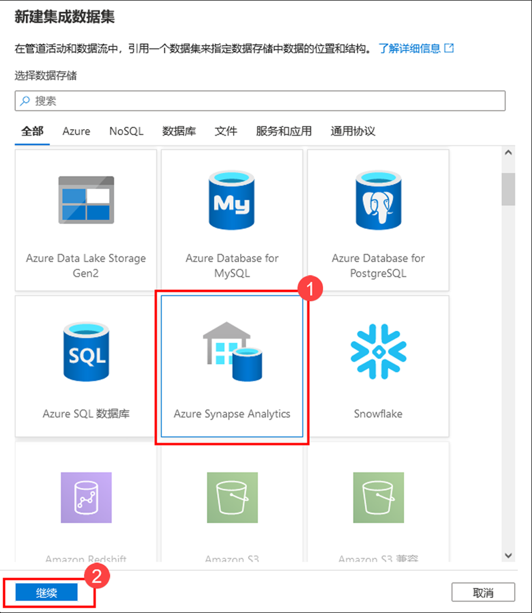

13. 使用以下特征配置数据集，然后选择 **“确定”(5)**：

    - **名称**：输入 `asal400_wwi_campaign_analytics_asa` **(1)**。
    - **链接服务**： 选择 `SqlPool01` 服务 **(2)**。
    - **表名称**： 选择 `wwi.CampaignAnalytics` **(3)**。
    - **导入架构**： 选择`From connection/store` **(4)**。

    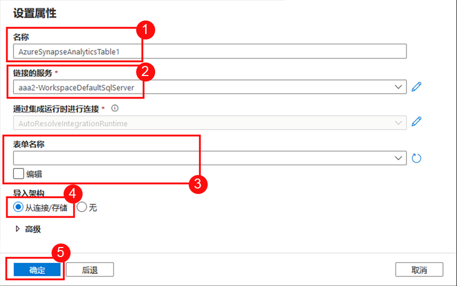

14. 在工具栏中选择 **“+”** **(1)**，然后选择 **“集成数据集”(2)** 以创建新数据集。

    

15. 在列表中选择 **“Azure Synapse Analytics”** **(1)**，然后选择 **“继续”(2)**。

    

16. 使用以下特征配置数据集，然后选择 **“确定”(5)**：

    - **名称**：输入 `asal400_wwi_usertopproductpurchases_asa` **(1)**。
    - **链接服务**：选择 `SqlPool01` 服务 **(2)**。
    - **表名称**：选择 `wwi.UserTopProductPurchases` **(3)**。
    - **导入架构**：选择`From connection/store` **(4)**。

    

#### 任务 4：创建活动分析数据集

你的组织收到一个格式错乱的 CSV 文件，其中包含营销活动数据。该文件已被上传到数据湖，现在必须将其导入到数据仓库。


问题包括收入货币数据中的无效字符和未对齐的列。

1. 导航到 **“数据”** 中心。

    

2. 在工具栏中选择 **“+”** **(1)**，然后选择 **“集成数据集”(2)** 以创建新数据集。

    

3. 在列表中选择 **“Azure Data Lake Storage Gen2”** **(1)**，然后选择 **“继续”(2)**。

    

4. 选择 **“DelimitedText”** 格式 **(1)**，然后选择 **“继续”(2)**。

    

5. 使用以下特征配置数据集，然后选择 **“确定”(6)**：

    - **名称**：输入 `asal400_campaign_analytics_source` **(1)**。
    - **链接服务**：选择 `asadatalakeSUFFIX` 链接服务 **(2)**。
    - **文件路径**：浏览到路径 `wwi-02/campaign-analytics/campaignanalytics.csv` **(3)**。
    - **第一行作为标题**： 保持`unchecked`状态 **(4)**。**我们将跳过标题**，因为标题中的列数与数据行中的列数不匹配。
    - **导入架构**：选择`From connection/store` **(5)**。

    

6. 创建数据集后，导航到其 **“连接”** 选项卡。保留默认设置。它们应符合以下配置：

    - **压缩类型**：选择`none`。
    - **列分隔符**：选择`Comma (,)`。
    - **行分隔符**：选择`Default (\r,\n, or \r\n)`。
    - **编码**：选择 `Default(UTF-8)。
    - **转义字符**：选择`Backslash (\)`。
    - **引号字符**：选择`Double quote (")`。
    - **第一行作为标题**：保持`unchecked`状态。
    - **NULL 值**：使字段保留空白。

    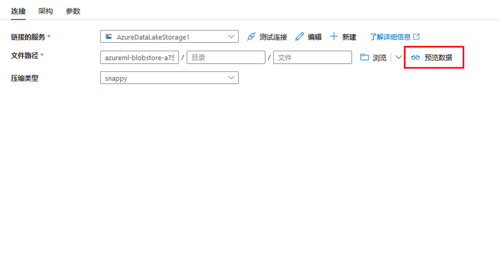

7. 选择 **“预览数据”**。

8. 预览数据会显示 CSV 文件的示例。开始此任务时屏幕截图中会显示一些问题。注意，由于我们没有将第一行设置为标题，因此标题列将显示为第一行。另外还要注意，在前面的屏幕截图中看见的城市和州的值不会出现。这是因为标题行中的列数与文件的其余部分不匹配。当我们在下一个练习中创建数据流时，将排除第一行。

    

9. 依次选择 **“全部发布”** 和 **“发布”**，以保存新资源。

    

### 练习 2：创建数据管道来导入格式错乱的 CSV 文件

#### 任务 1：创建活动分析数据流

1. 导航到 **“开发”** 中心。

    

2. 依次选择“+”和 **“数据流”**，以创建新数据流。

    

3. 在新数据流的 **“属性”** 边栏选项卡的 **“常规”** 设置中，将 **“名称”** 更新为： `asal400_lab2_writecampaignanalyticstoasa`。

    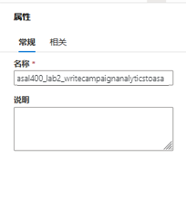

4. 在数据流画布上选择 **“添加源”**。

    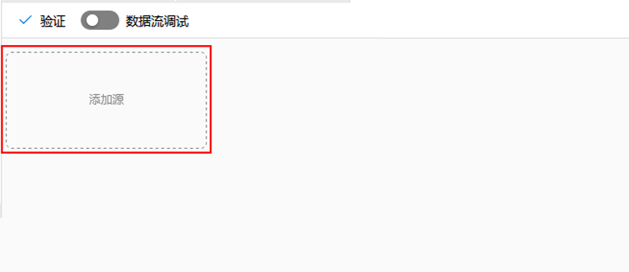

5. 在 **“源设置”** 下配置以下各项：

    - **输出流名称**：输入 `CampaignAnalytics`。
    - **源类型**：选择`Dataset`。
    - **数据集**：选择 `asal400_campaign_analytics_source`。
    - **选项**：选择`Allow schema drift`并保持其他选项为未选中状态。
    - **跳过行数**：输入 `1`。这使我们将跳过标题行（导致比 CSV 文件中的其他行少两列），从而截断最后两列数据。
    - **采样**：选择`Disable`。

    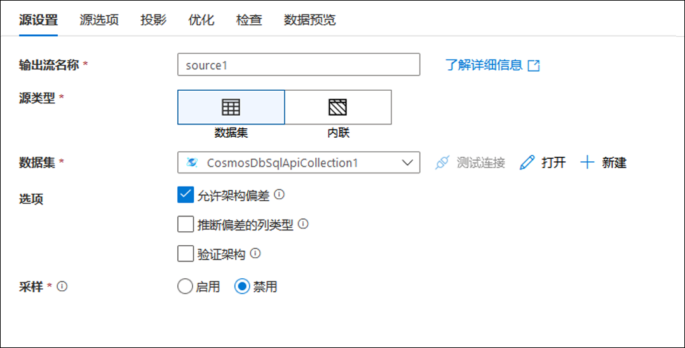

6. 在创建数据流时，可以通过打开调试来启用某些功能，例如预览数据和导入架构（投影）。由于启用此选项需要花费大量时间，再加上实验室环境的环境限制，我们将跳过这些功能。数据源具有需要设置的架构。为此，请选择设计画布上方的 **“脚本”**。

    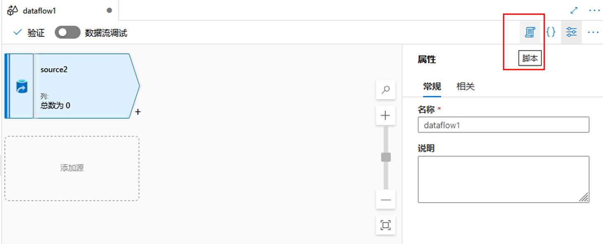

7. 将脚本替换为以下内容，以提供列映射（`output`），然后选择 **“确定”**：

    ```json
    source(output(
            {_col0_} as string,
            {_col1_} as string,
            {_col2_} as string,
            {_col3_} as string,
            {_col4_} as string,
            {_col5_} as double,
            {_col6_} as string,
            {_col7_} as double,
            {_col8_} as string,
            {_col9_} as string
        ),
        allowSchemaDrift: true,
        validateSchema: false,
        ignoreNoFilesFound: false) ~> CampaignAnalytics
    ```

    脚本应匹配以下内容：

    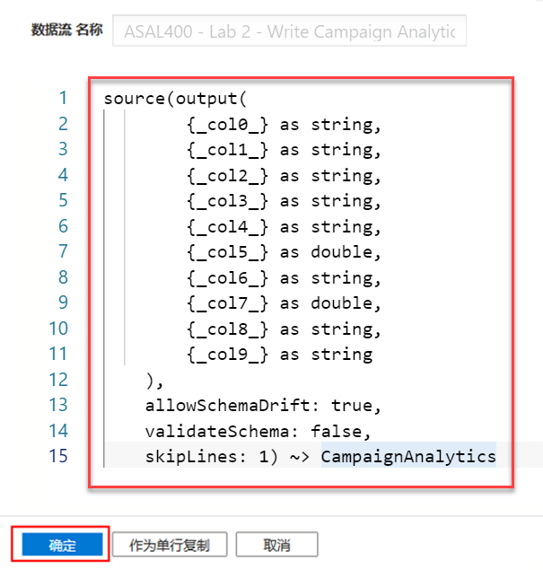

8. 选择 **“CampaignAnalytics”** 数据源，然后选择 **“投影”**。投影应显示以下架构：

    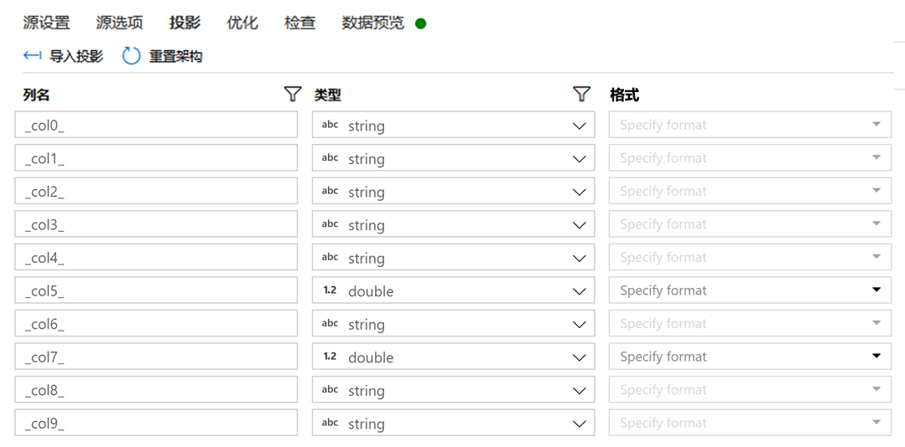

9. 选择 `CampaignAnalytics` 源右侧的 **“+”**，然后在上下文菜单中选择 **“选择”** 架构修饰符。

    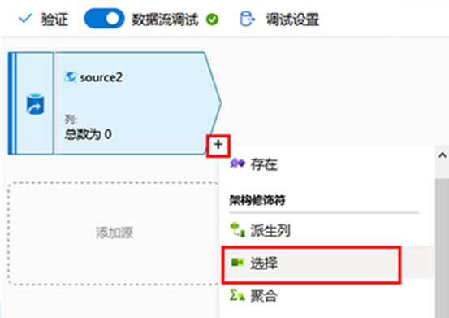

10. 在 **“选择设置”** 下配置以下各项：

    - **输出流名称**： 输入 `MapCampaignAnalytics`。
    - **传入流**：选择 `CampaignAnalytics`。
    - **选项**：选中这两个选项。
    - **输入列**：确保未选中`Auto mapping`，然后在 **“命名为”** 字段中提供以下值：
      - Region
      - Country
      - ProductCategory
      - CampaignName
      - RevenuePart1
      - Revenue
      - RevenueTargetPart1
      - RevenueTarget
      - City
      - State

    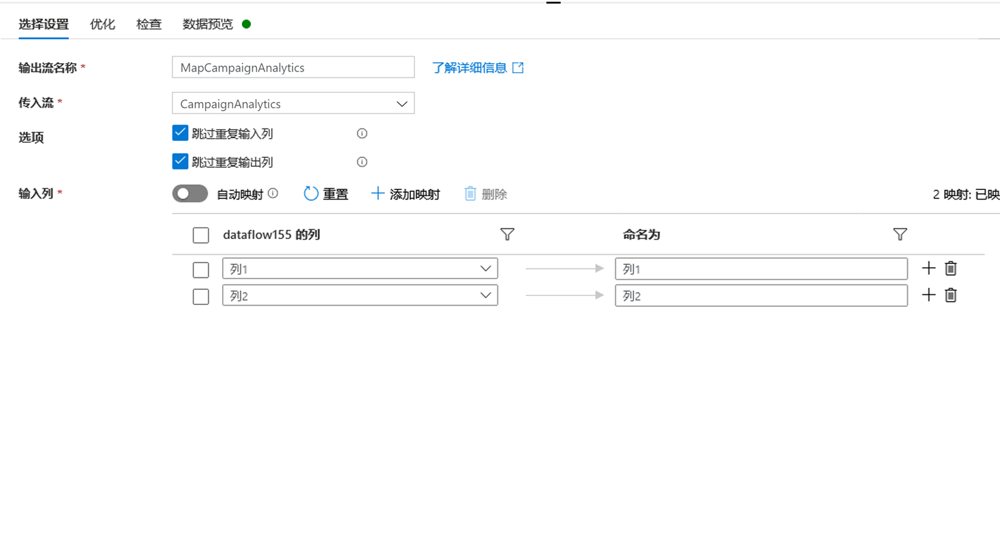

11. 选择 `MapCampaignAnalytics` 源右侧的 **“+”**，然后在上下文菜单中选择 **“派生列”** 架构修饰符。

    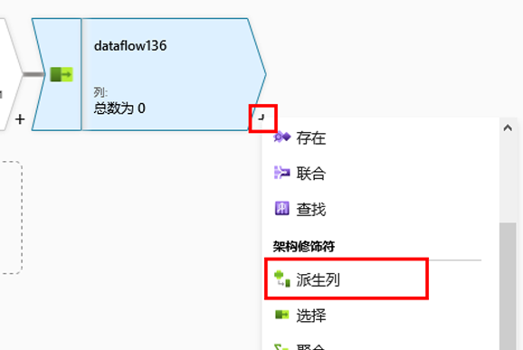

12. 在 **“派生列的设置”** 下配置以下各项：

    - **输出流名称**：输入 `ConvertColumnTypesAndValues`。
    - **传入流**：选择 `MapCampaignAnalytics`。
    - **列**：提供以下信息：

        | 列 | 表达式 | 描述 |
        | --- | --- | --- |
        | Revenue | `toDecimal(replace(concat(toString(RevenuePart1), toString(Revenue)), '\\', ''), 10, 2, '$###,###.##')` | 连接 `RevenuePart1` 和 `Revenue` 字段，替换无效 `\` 字符，然后将数据转换并格式化为十进制类型。 |
        | RevenueTarget | `toDecimal(replace(concat(toString(RevenueTargetPart1), toString(RevenueTarget)), '\\', ''), 10, 2, '$###,###.##')` | 连接 `RevenueTargetPart1` 和 `RevenueTarget` 字段，替换无效 `\` 字符，然后将数据转换并格式化为十进制类型。 |

    > **备注**： 若要插入第二列，请选择“列”列表上方的 **“+ 添加”**，然后选择 **“添加列”**。

    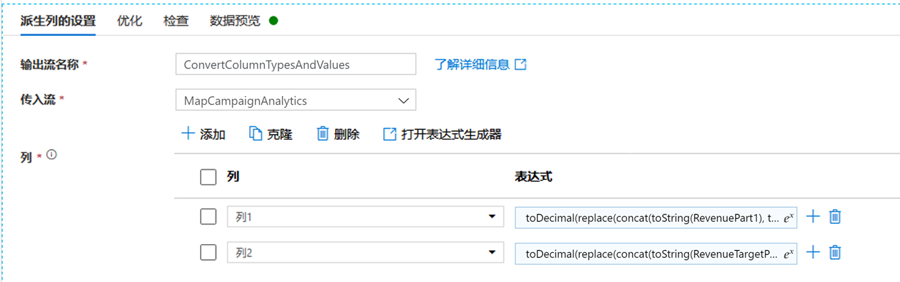

13. 选择 `ConvertColumnTypesAndValues` 步骤右侧的 **“+”**，然后在上下文菜单中选择 **“选择”** 架构修饰符。

    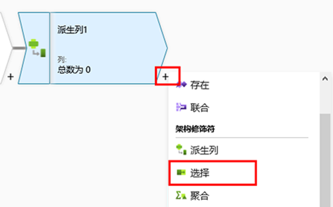

14. 在 **“选择设置”** 下配置以下各项：

    - **输出流名称**：输入 `SelectCampaignAnalyticsColumns`。
    - **传入流**：选择 `ConvertColumnTypesAndValues`。
    - **选项**：选中这两个选项。
    - **输入列**：确保未选中 `Auto mapping`，然后**删除** `RevenuePart1` 和 `RevenueTargetPart1`。我们不再需要这些字段。

    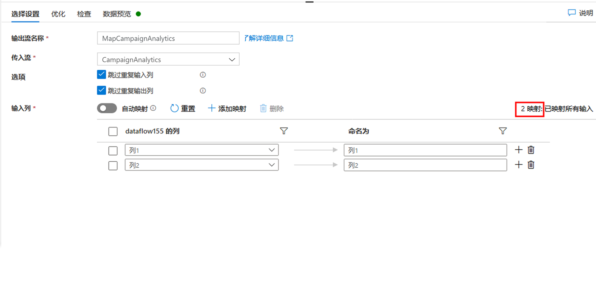

15. 选择 `SelectCampaignAnalyticsColumns` 步骤右侧的 **“+”**，然后在上下文菜单中选择 **“接收器”** 目标。

    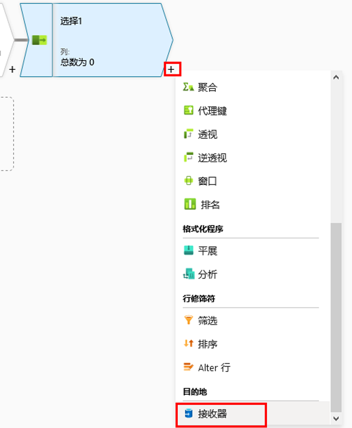

16. 在 **“接收器”** 下配置以下各项：

    - **输出流名称**：输入 `CampaignAnalyticsASA`。
    - **传入流**：选择 `SelectCampaignAnalyticsColumns`。
    - **接收器类型**：选择`Dataset`。
    - **数据集**：选择 `asal400_wwi_campaign_analytics_asa`，这是 CampaignAnalytics SQL 表。
    - **选项**：选中`Allow schema drift`，并取消选中`Validate schema`。

    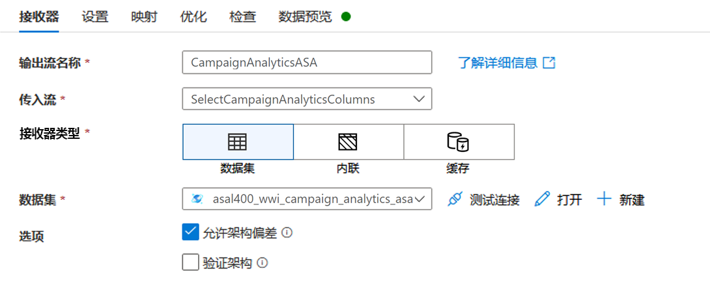

17. 选择 **“设置”**，然后配置以下各项：

    - **更新方法**：选中`Allow insert`，并将其余选项保持未选中状态。
    - **表操作**：选择`Truncate table`。
    - **启用暂存**：取消选中此选项。示例 CSV 文件很小，无需选择暂存选项。

    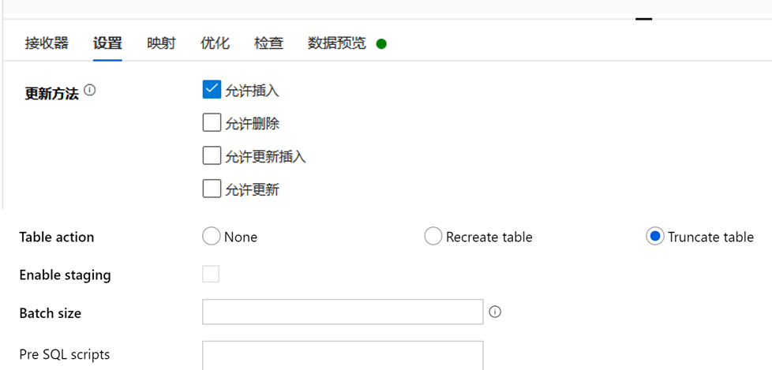

18. 完成的数据流应如下所示：

    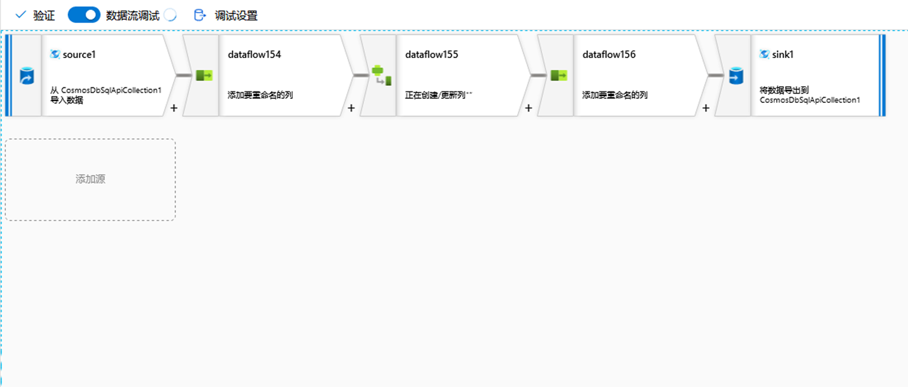

19. 依次选择 **“全部发布”** 和 **“发布”**，以保存新数据流。

    

#### 任务 2：创建活动分析数据管道

为了运行新的数据流，需要创建新管道并为其添加数据流活动。

1. 导航到 **“集成”** 中心。

    

2. 依次选择“+”和 **“管道”**，以创建新管道。

    

3. 在新管道的 **“属性”** 边栏选项卡的 **“常规”** 设置中，输入以下**名称**： `Write Campaign Analytics to ASA`。

4. 展开“活动”列表中的 **“移动和转换”**，然后将 **“数据流”** 活动拖放到管道画布上。

    

5. 在`General`部分，将 **“名称”** 值设置为 `asal400_lab2_writecampaignanalyticstoasa`。

    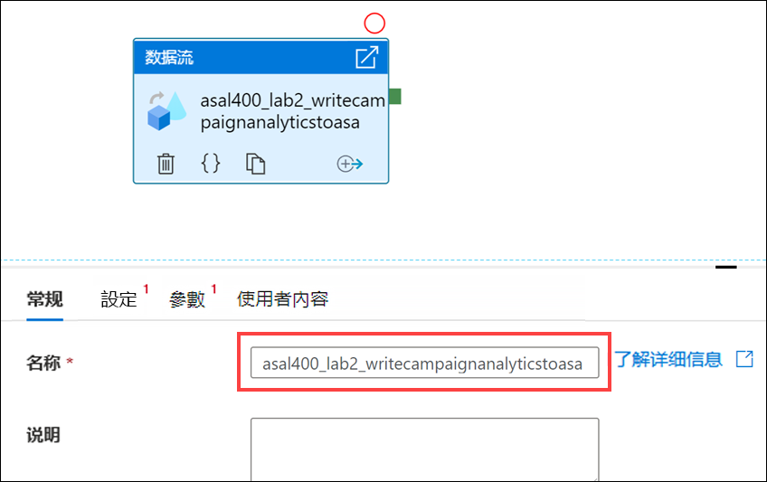

6. 选择 **“设置”** 选项卡，然后选择 **“数据流”** 下方的 `asal400_lab2_writecampaignanalyticstoasa`。

    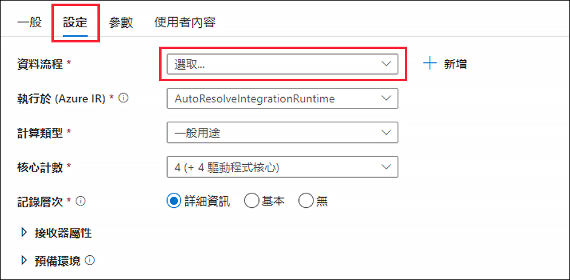

8. 选择 **“全部发布”**，以保存新管道。

    

#### 任务 3：运行活动分析数据管道

1. 选择 **“添加触发器”**，然后在管道画布顶部的工具栏中选择 **“立即触发”**。

    

2. 在`Pipeline run`边栏选项卡中，选择 **“确定”** 以启动管道运行。

    

3. 导航到 **“监视”** 中心。

    

4. 等待管道运行成功完成。可能需要刷新视图。

    > 在此过程中，请阅读其余的实验室说明，以熟悉内容。

    

#### 任务 4：查看活动分析表的内容

管道运行现已完成，让我们查看 SQL 表以验证数据是否成功复制。

1. 导航到 **“数据”** 中心。

    

2. 展开 **“工作区”** 部分下面的 `SqlPool01` 数据库，然后展开 `Tables`。

3. 右键单击 `wwi.CampaignAnalytics` 表，然后选择新 SQL 脚本上下文菜单下方的 **“选择前 1000 行”** 菜单项。可能需要刷新才能看到新表。

    

4. 正确转换的数据应该显示在查询结果中。

    

5. 将查询更新为以下内容，**并运行**：

    ```sql
    SELECT ProductCategory
    ,SUM(Revenue) AS TotalRevenue
    ,SUM(RevenueTarget) AS TotalRevenueTarget
    ,(SUM(RevenueTarget) - SUM(Revenue)) AS Delta
    FROM [wwi].[CampaignAnalytics]
    GROUP BY ProductCategory
    ```

6. 在查询结果中，选择 **“图表”** 视图。按照定义配置列：

    - **图表类型**：选择`Column`。
    - **类别列**：选择 `ProductCategory`。
    - **图例（系列）列**： 选择 `TotalRevenue`、`TotalRevenueTarget` 和 `Delta`。

    

### 练习 3：为经常购买的产品创建映射数据流

Tailwind Traders 需要将经常购买的产品（从电商系统以 JSON 文件导入）与用户偏好产品（来自在 Azure Cosmos DB 中以 JSON 文档存储的配置文件数据）组合在一起。他们希望将组合后的数据存储在专用 SQL 池和数据湖中，供进一步分析和报告。

为此，你将构建一个映射数据流用于执行以下任务：

- 为 JSON 数据添加两个 ADLS Gen2 数据源
- 平展这两组文件的层次结构
- 执行数据转换和类型转化
- 联接这两个数据源
- 基于条件逻辑在联接的数据集上创建新字段
- 筛选必需字段的 NULL 记录
- 写入专用 SQL 池
- 同时写入数据湖

#### 任务 1：创建映射数据流

1. 导航到 **“开发”** 中心。

    

2. 依次选择 **“+”** 和 **“数据流”**，以创建新数据流。

    

3. 在新数据流的 **“配置文件”** 窗格的 **“常规”** 部分，将 **“名称”** 更新为： `write_user_profile_to_asa`。

    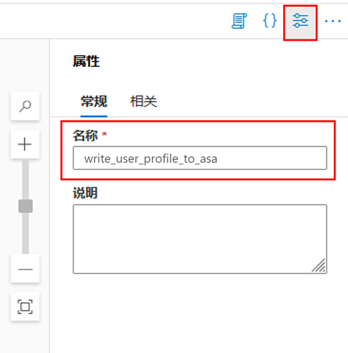

4. 选择 **“属性”** 按钮以隐藏窗格。

    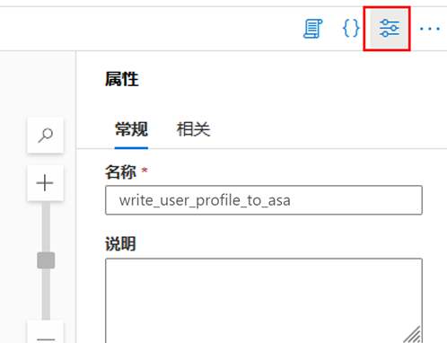

5. 在数据流画布上选择 **“添加源”**。

    

6. 在 **“源设置”** 下配置以下各项：

    - **输出流名称**：输入 `EcommerceUserProfiles`。
    - **源类型**：选择 `Dataset`。
    - **数据集**：选择 `asal400_ecommerce_userprofiles_source`。

    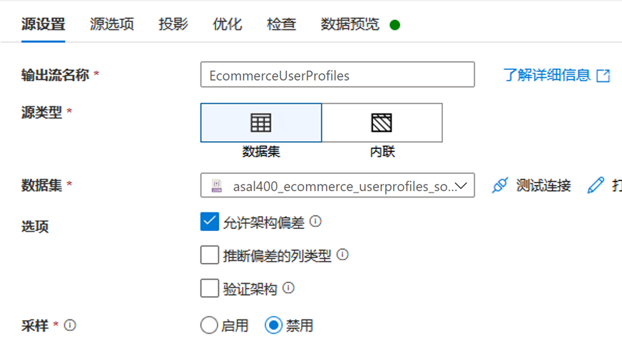

7. 选择 **“源选项”** 选项卡，然后配置以下各项：

    - **通配符路径**： 输入 `online-user-profiles-02/*.json`。
    - **JSON 设置**： 展开此部分，然后选择 **“文档数组”** 设置。这表示每个文件都包含 JSON 文档数组。

    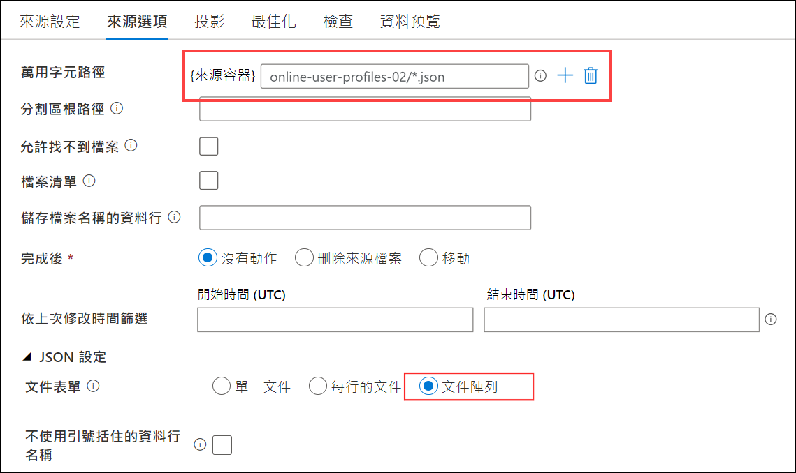

8. 选择 `EcommerceUserProfiles` 源右侧的 **“+”**，然后在上下文菜单中选择 **“派生列”** 架构修饰符。

    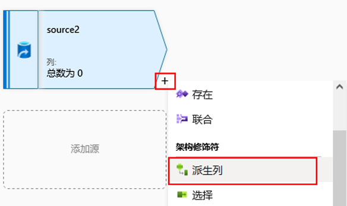

9. 在 **“派生列的设置”** 下配置以下各项：

    - **输出流名称**：输入 `userId`。
    - **传入流**：选择 `EcommerceUserProfiles`。
    - **列**：提供以下信息：

        | 列 | 表达式 | 描述 |
        | --- | --- | --- |
        | visitorId | `toInteger(visitorId)` | 将 `visitorId` 列从字符串转换为整数。 |

    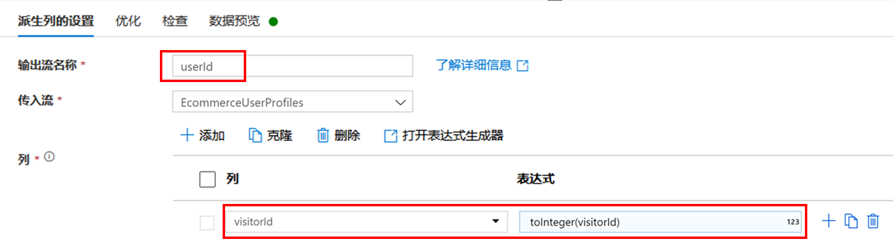

10. 选择 `userId` 步骤右侧的 **“+”**，然后在上下文菜单中选择 **“平展”** 格式化程序。

    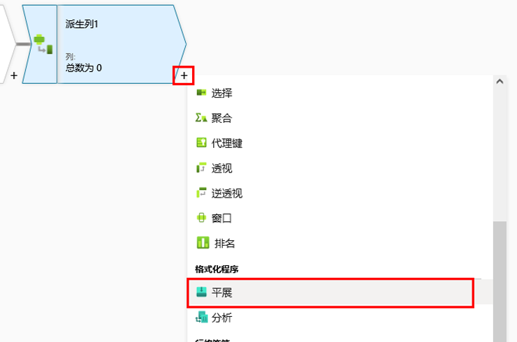

11. 在 **“平展设置”** 下配置以下各项：

    - **输出流名称**：输入 `UserTopProducts`。
    - **传入流**：选择 `userId`。
    - **展开**: 选择 `[] topProductPurchases`。
    - **输入列**：提供以下信息：

        | userId 的列 | 命名为 |
        | --- | --- |
        | visitorId | `visitorId` |
        | topProductPurchases.productId | `productId` |
        | topProductPurchases.itemsPurchasedLast12Months | `itemsPurchasedLast12Months` |

        > 选择 **“+ 添加映射”**，然后选择 **“固定映射”** 以添加每个新的列映射。

    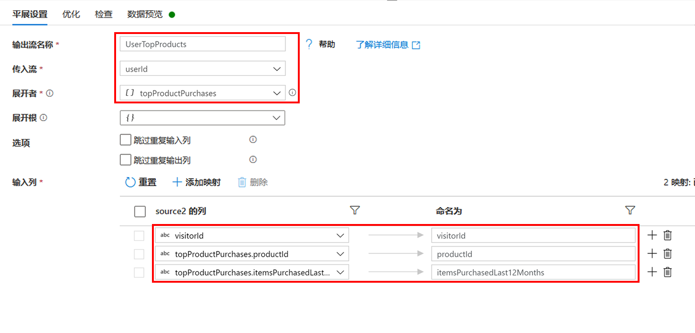

    这些设置提供数据源的平展视图，每个 `visitorId` 有一行或多行，类似于我们在上一个模块中研究 Spark 笔记本中的数据。使用数据预览需要启用调试模式，我们不会在本实验室中启用该模式。*以下屏幕截图仅用于演示*：

    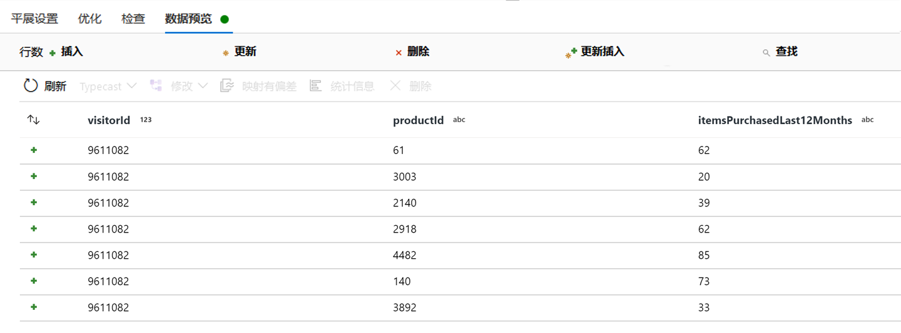

    > **重要提示**： 最新版本引入了一个 bug，不能从用户界面更新 userId 源列。请访问数据流的脚本（位于工具栏中）暂时修复该 bug。在脚本中找到 `userId` 活动，然后在 mapColumn 函数中确保追加适当的源字段。请确保 `productId` 源自 **topProductPurchases.productId**、**itemsPurchasedLast12Months** 源自 **topProductPurchases.itemsPurchasedLast12Months**。

    

    ```javascript
    userId foldDown(unroll(topProductPurchases),
        mapColumn(
            visitorId,
            productId = topProductPurchases.productId,
            itemsPurchasedLast12Months = topProductPurchases.itemsPurchasedLast12Months
        )
    ```

    

12. 选择 `UserTopProducts` 步骤右侧的 **“+”**，然后在上下文菜单中选择 **“派生列”** 架构修饰符。

    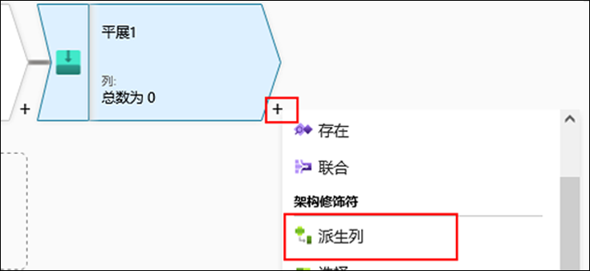

13. 在 **“派生列的设置”** 下配置以下各项：

    - **输出流名称**：输入 `DeriveProductColumns`。
    - **传入流**：选择 `UserTopProducts`。
    - **列**：提供以下信息：

        | 列 | 表达式 | 描述 |
        | --- | --- | --- |
        | productId | `toInteger(productId)` | 将 `productId` 列从字符串转换为整数。 |
        | itemsPurchasedLast12Months | `toInteger(itemsPurchasedLast12Months)` | 将 `itemsPurchasedLast12Months` 列从字符串转换为整数。 |

    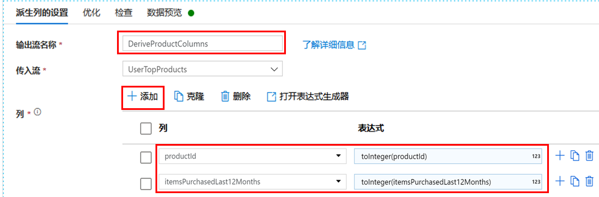

    > **备注**： 若要向派生列的设置添加一列，请选择第一列右侧的 **“+”**，然后选择 **“添加列”**。

    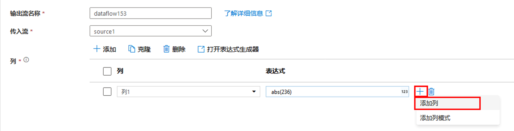

14. 在 `EcommerceUserProfiles` 源下面的数据流画布上选择 **“添加源”**。

    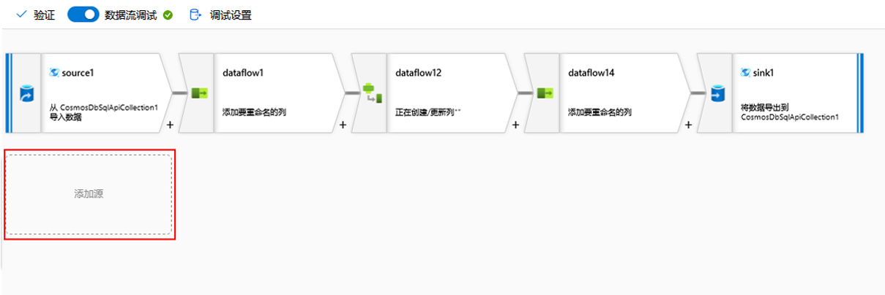

15. 在 **“源设置”** 下配置以下各项：

    - **输出流名称**：输入 `UserProfiles`。
    - **源类型**：选择`Dataset`。
    - **数据集**：选择 `asal400_customerprofile_cosmosdb`。

    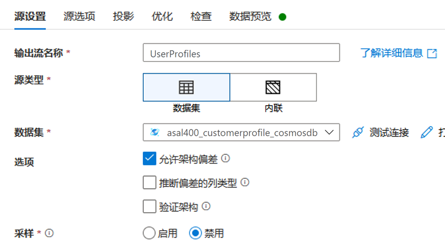

16. 由于我们不打算使用数据流调试程序，因此需要输入数据流的脚本视图以更新源投影。选择画布上方工具栏中的 **“脚本”**。

    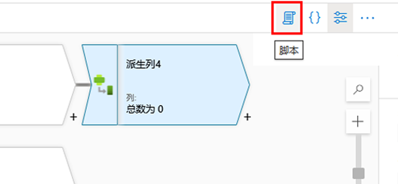

17. 在脚本中找到 **“UserProfiles”** `source`，并将其脚本块替换为以下内容，以将 `preferredProducts` 设置为 `integer[]` 数组，并确保正确定义 `productReviews` 数组中的数据类型：

    ```json
    source(output(
            cartId as string,
            preferredProducts as integer[],
            productReviews as (productId as integer, reviewDate as string, reviewText as string)[],
            userId as integer
        ),
        allowSchemaDrift: true,
        validateSchema: false,
        ignoreNoFilesFound: false,
        format: 'document') ~> UserProfiles
    ```

    

18. 选择 **“确定”**，以应用脚本更改。现已使用新架构更新了数据源。以下屏幕截图显示了可以使用数据预览选项查看源数据时源数据的外观。使用数据预览需要启用调试模式，我们不会在本实验室中启用该模式。 *以下屏幕截图仅用于演示*：

    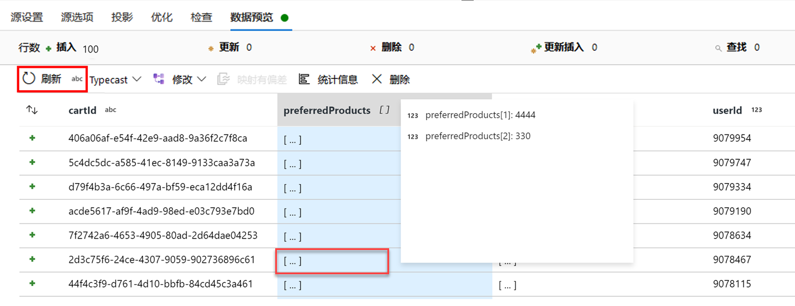

19. 选择 `UserProfiles` 源右侧的 **“+”**，然后在上下文菜单中选择 **“平展”** 格式化程序。

    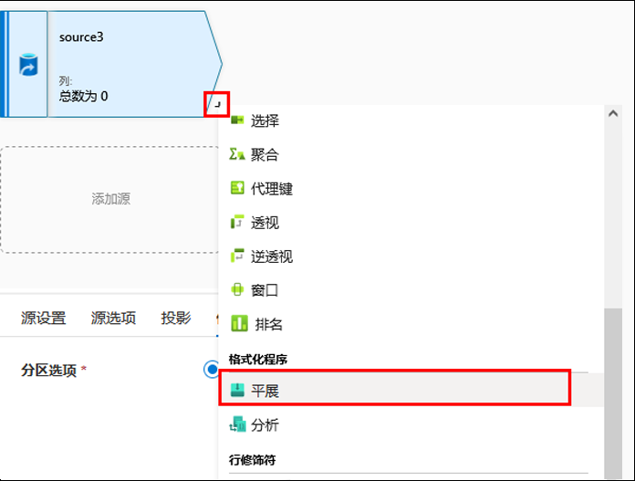

20. 在 **“平展设置”** 下配置以下各项：

    - **输出流名称**：输入 `UserPreferredProducts`。
    - **传入流**：选择 `UserProfiles`。
    - **展开**: 选择 `[] preferredProducts`。
    - **输入列**：提供以下信息。请务必**删除** `cartId` 和 `[] productReviews`：

        | UserProfiles 的列 | 命名为 |
        | --- | --- |
        | [] preferredProducts | `preferredProductId` |
        | userId | `userId` |

        > 选择 **“+ 添加映射”**，然后选择 **“固定映射”** 以添加每个新的列映射。

    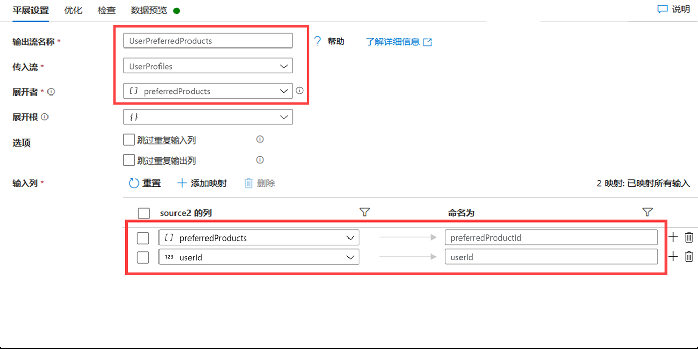

    这些设置提供数据源的平展视图，每个 `userId` 有一行或多行。使用数据预览需要启用调试模式，我们不会在本实验室中启用该模式。*以下屏幕截图仅用于演示*：

    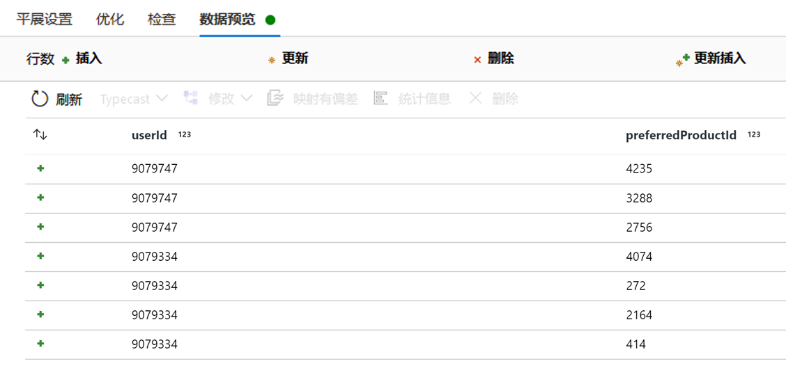

21. 现在我们来联接这两个数据源。选择 `DeriveProductColumns` 步骤右侧的 **“+”**，然后在上下文菜单中选择 **“联接”** 选项。

    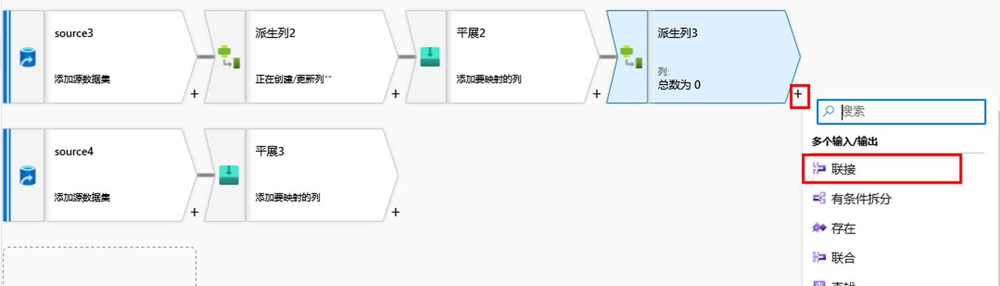

22. 在 **“联接设置”** 下配置以下各项：

    - **输出流名称**：输入 `JoinTopProductsWithPreferredProducts`。
    - **左流**：选择 `DeriveProductColumns`。
    - **右流**：选择 `UserPreferredProducts`。
    - **联接类型**：选择`Full outer`。
    - **联接条件**：提供以下信息：

        | 左：DeriveProductColumns 的列 | 右：UserPreferredProducts 的列 |
        | --- | --- |
        | `visitorId` | `userId` |

    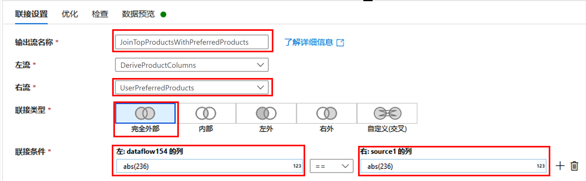

23. 选择 **“优化”** 并配置以下各项：

    - **广播**：选择`Fixed`。
    - **广播选项**：选中 `Left: 'DeriveProductColumns'`。
    - **分区选项**：选择`Set partitioning`。
    - **分区类型**：选择`Hash`。
    - **分区数**：输入 `30`。
    - **列**：选择 `productId`。

    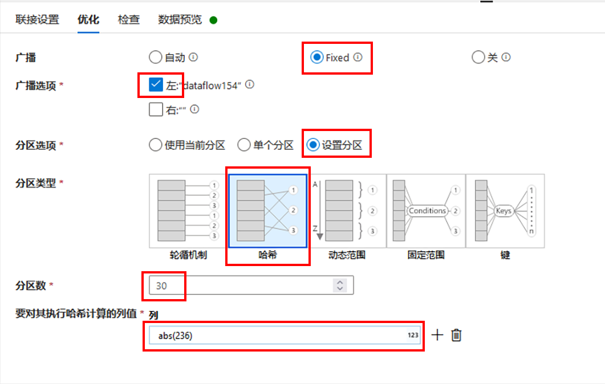

    <!-- **待办事项**： 添加优化描述。-->

24. 选择 **“检查”** 选项卡以查看联接映射，其中包括列馈送源，以及该列是否在联接中使用。

    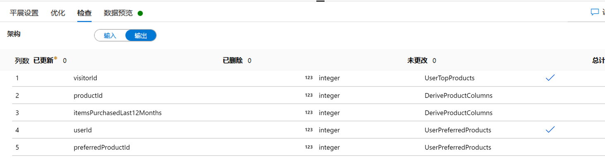

    **仅用于展示数据预览：** 由于我们没有打开数据流调试，因此不执行此步骤。在这个小型数据示例中，`userId` 和 `preferredProductId` 列可能仅显示 NULL 值。如果想知道有多少条记录包含这些字段的值，请选择一列，例如 `preferredProductId`，然后在上面的工具栏中选择 **“统计信息”**。这将显示列的图表，其中显示了值的比率。

    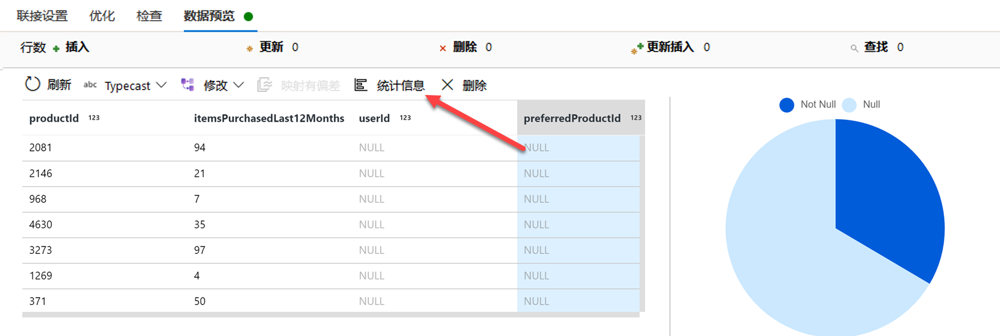

25. 选择 `JoinTopProductsWithPreferredProducts` 步骤右侧的 **“+”**，然后在上下文菜单中选择 **“派生列”** 架构修饰符。

    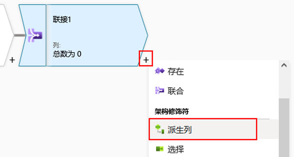

26. 在 **“派生列的设置”** 下配置以下各项：

    - **输出流名称**：输入 `DerivedColumnsForMerge`。
    - **传入流**：选择 `JoinTopProductsWithPreferredProducts`。
    - **列**：提供以下信息（**键入前两个列名称_**）___：

        | 列 | 表达式 | 描述 |
        | --- | --- | --- |
        | isTopProduct | `toBoolean(iif(isNull(productId), 'false', 'true'))` | 如果 `productId` 不为 NULL，则返回 `true`。回想一下，`productId` 由电商用户经常购买的产品数据世系提供。 |
        | isPreferredProduct | `toBoolean(iif(isNull(preferredProductId), 'false', 'true'))` | 如果 `preferredProductId` 不为 NULL，则返回 `true`。回想一下，`preferredProductId` 由 Azure Cosmos DB 用户配置文件数据世系提供。 |
        | productId | `iif(isNull(productId), preferredProductId, productId)` | 根据 `productId` 是否为 NULL，将 `productId` 输出设置为 `preferredProductId` 或 `productId` 值。
        | userId | `iif(isNull(userId), visitorId, userId)` | 根据 `userId` 是否为 NULL，将 `userId` 输出设置为 `visitorId` 或 `userId` 值。

    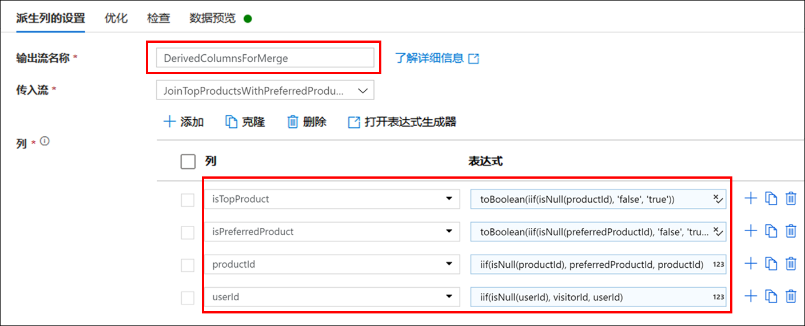

    > **备注**： 请记住，依次选择 **“+”** 和派生列右侧的 **“添加列”**，以在下面添加新列。

    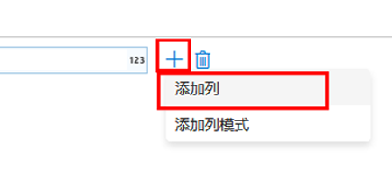

    派生列的设置提供以下结果：

    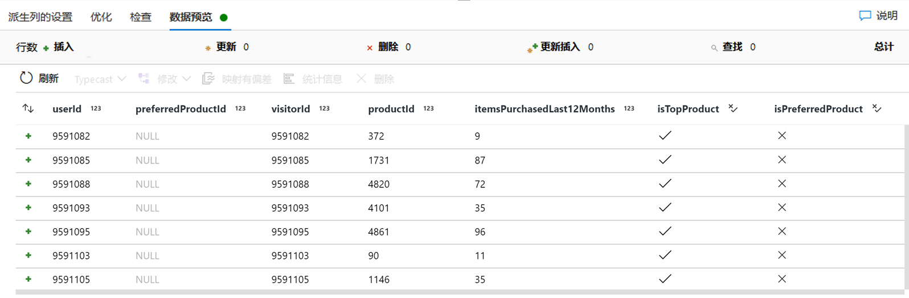

27. 选择 `DerivedColumnsForMerge` 步骤右侧的 **“+”**，然后在上下文菜单中选择 **“筛选器”** 目标。

    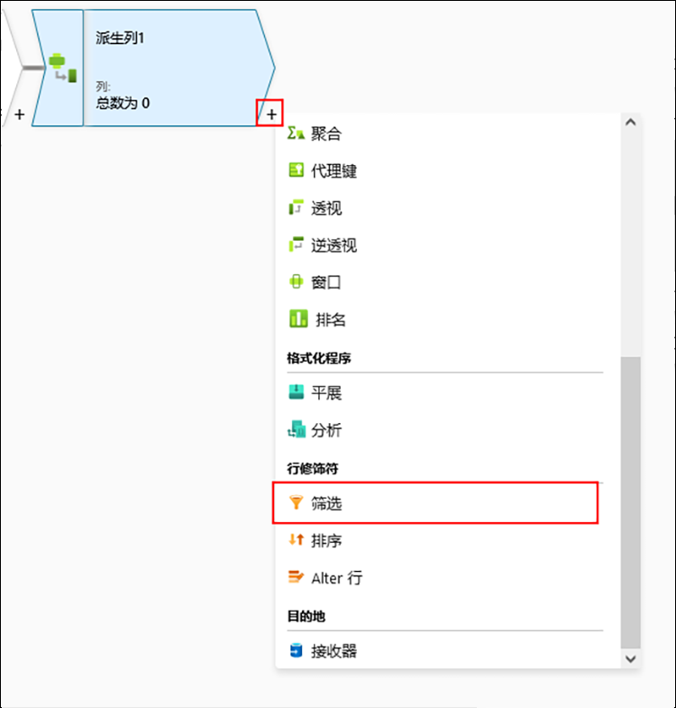

    我们将添加筛选步骤，以删除 `ProductId` 为 NULL 的所有记录。数据集有小部分无效记录，在加载到 `UserTopProductPurchases` 专用 SQL 池表时，值为 NULL 的 `ProductId` 将导致错误。

28. 将 **“筛选依据”** 表达式设置为 **`!isNull(productId)`**。

    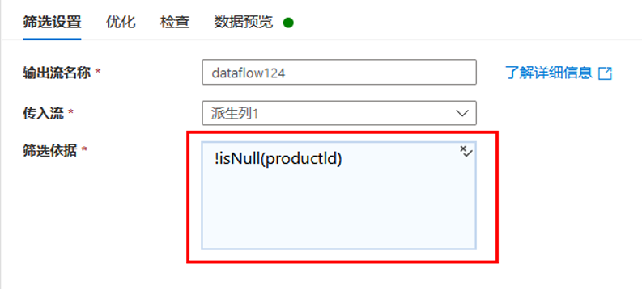

29. 选择 `Filter1` 步骤右侧的 **“+”**，然后在上下文菜单中选择 **“接收器”** 目标。

    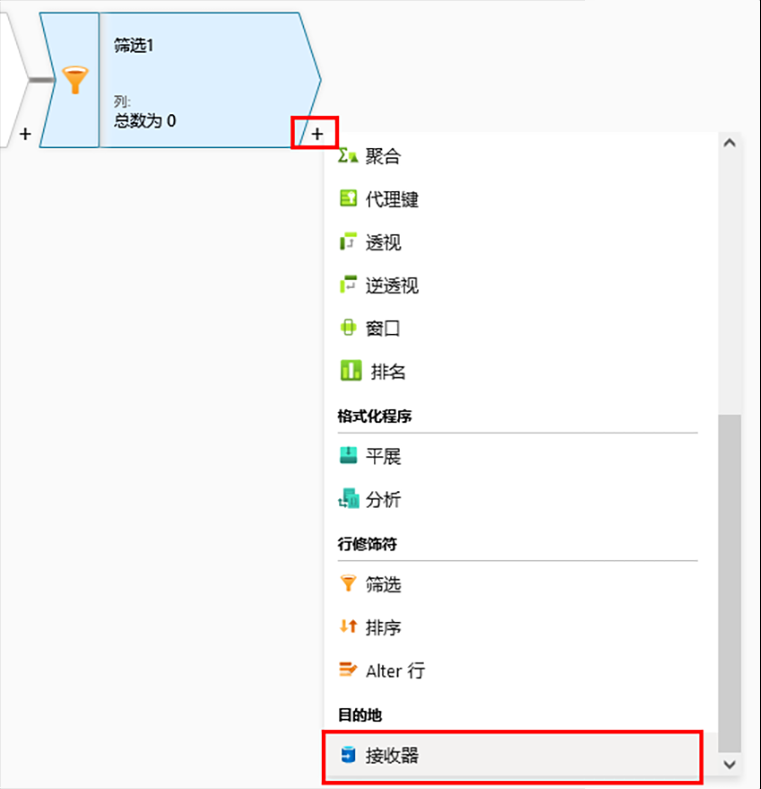

30. 在 **“接收器”** 下配置以下各项：

    - **输出流名称**：输入 `UserTopProductPurchasesASA`。
    - **传入流**：选择 `Filter1`。
    - **接收器类型**：选择`Dataset`。
    - **数据集**：选择 `asal400_wwi_usertopproductpurchases_asa`，这是 UserTopProductPurchases SQL 表。
    - **选项**：选中`Allow schema drift`，并取消选中`Validate schema`。

    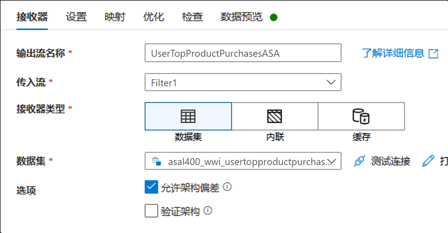

31. 选择 **“设置”**，然后配置以下各项：

    - **更新方法**： 选中`Allow insert`，并将其余选项保持未选中状态。
    - **表操作**： 选择`Truncate table`。
    - **启用暂存**： `Check` 此选项。由于我们将导入大量数据，因此需要启用暂存来提高性能。

    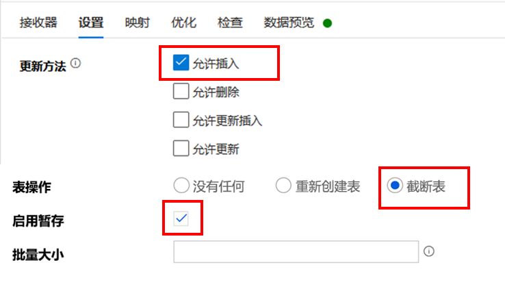

32. 选择 **“映射”**，然后配置以下各项：

    - **自动映射**：`Uncheck`此选项。
    - **列**：提供以下信息：

        | 输入列 | 输出列 |
        | --- | --- |
        | userId | UserId |
        | productId | ProductId |
        | itemsPurchasedLast12Months | ItemsPurchasedLast12Months |
        | isTopProduct | IsTopProduct |
        | isPreferredProduct | IsPreferredProduct |

    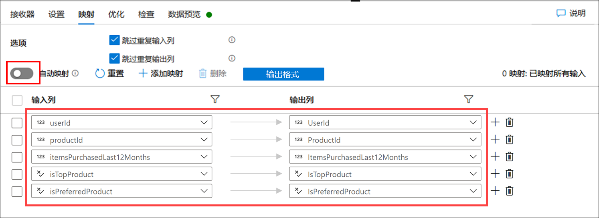

33. 选择 `Filter1` 步骤右侧的 **“+”**，然后在上下文菜单中选择 **“接收器”** 目标以添加第二个接收器。

    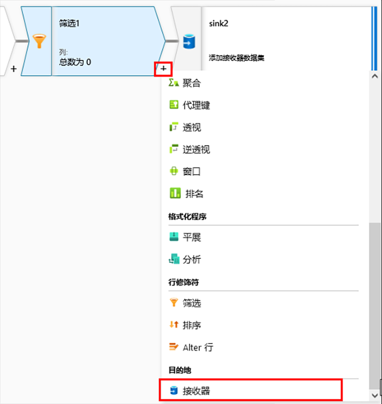

34. 在 **“接收器”** 下配置以下各项：

    - **输出流名称**：输入 `DataLake`。
    - **传入流**：选择 `Filter1`。
    - **接收器类型**：选择`Inline`。
    - **内联数据集类型**：选择 `Delta`。
    - **链接服务**：选择默认工作区数据湖存储帐户（例如：`asaworkspaceinaday84-WorspaceDefaultStorage`）。
    - **选项**：选中`Allow schema drift`，并取消选中`Validate schema`。

    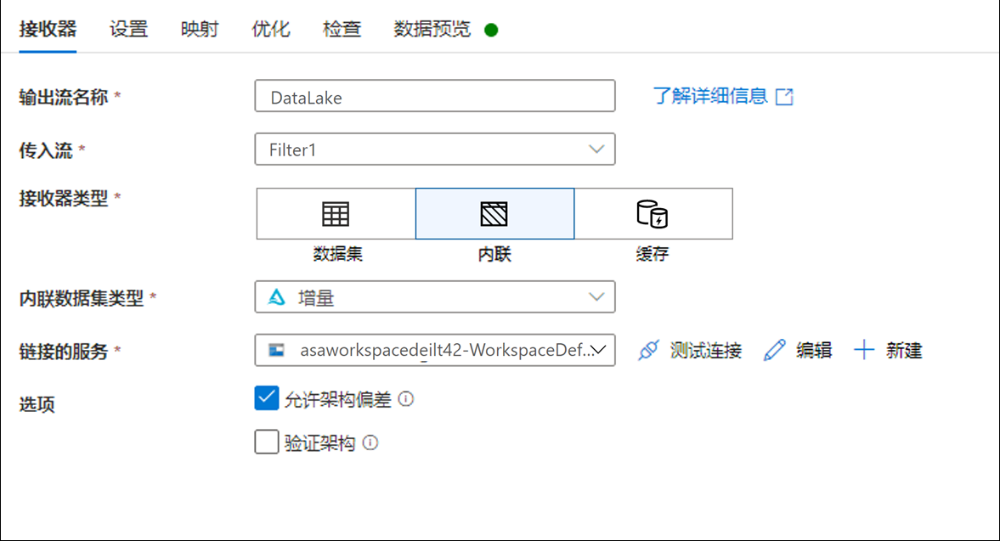

35. 选择 **“设置”**，然后配置以下各项：

    - **文件夹路径**：输入 `wwi-02/top-products`（由于 `top-products` 文件还不存在，请**复制**这两个值并将它们**粘贴**到字段中）。
    - **压缩类型**：选择 `snappy`。
    - **压缩级别**：选择`Fastest`。
    - **清空**：输入 0。
    - **截断表**：选择。
    - **更新方法**：选中`Allow insert`，并将其余选项保持未选中状态。
    - **合并架构（在 Delta 选项下）**：未选中。

    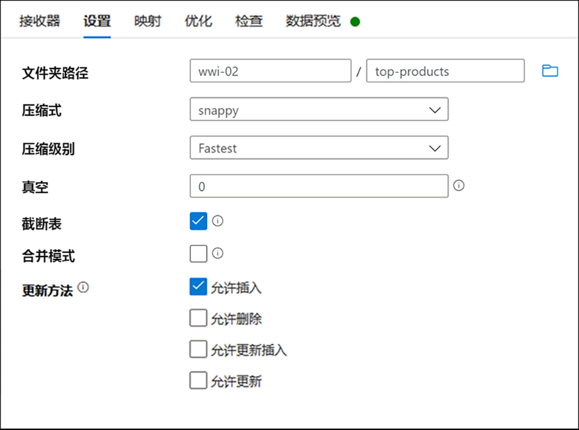

36. 选择 **“映射”**，然后配置以下各项：

    - **自动映射**：`Uncheck`此选项。
    - **列**：提供以下信息：

        | 输入列 | 输出列 |
        | --- | --- |
        | visitorId | visitorId |
        | productId | productId |
        | itemsPurchasedLast12Months | itemsPurchasedLast12Months |
        | preferredProductId | preferredProductId |
        | userId | userId |
        | isTopProduct | isTopProduct |
        | isPreferredProduct | isPreferredProduct |

    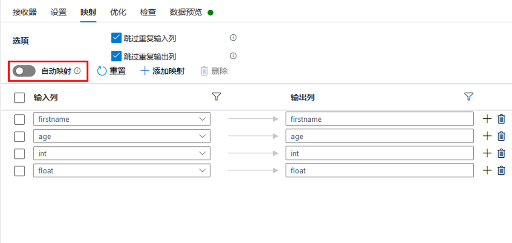

    > 请注意，与 SQL 池接收器相比，我们已选择为数据湖接收器保留更多字段（`visitorId` 和 `preferredProductId`）。这是因为我们没有坚持固定目标架构（如 SQL 表），而且我们希望在数据湖中保留尽可能多的原始数据。

37. 完成的数据流应如下所示：

    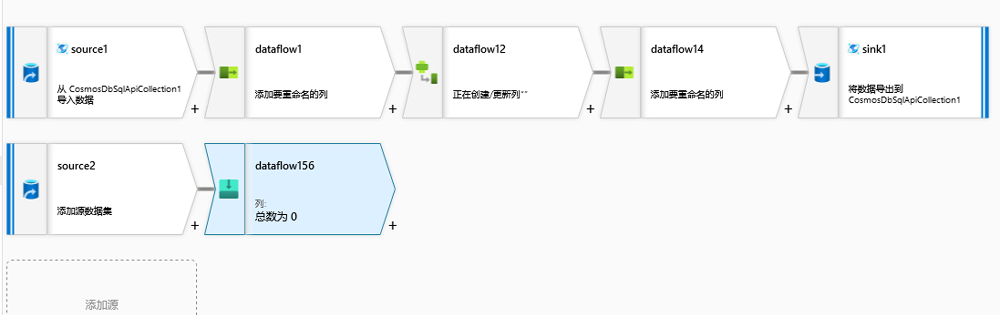

38. 依次选择 **“全部发布”** 和 **“发布”**，以保存新数据流。

    

## 实验室 2：协调 Azure Synapse 管道中的数据移动和转换

Tailwind Traders 熟悉 Azure 数据工厂 (ADF) 管道，并且想知道 Azure Synapse Analytics 是否可以与 ADF 集成或者是否具有类似的功能。他们希望在整个数据目录中（包括数据仓库的内部和外部）协调数据引入、转换和加载活动。

你建议使用包括 90 多个内置连接器的 Synapse Pipelines。它可以通过手动执行管道或通过协调加载数据，支持常见加载模式，能够完全平行地加载到数据湖或 SQL 表中，并且与 ADF 共享代码基。

通过使用 Synapse Pipelines，Tailwind Traders 可以体验与 ADF 相同且熟悉的界面，且无需使用 Azure Synapse Analytics 之外的协调服务。

### 练习 1：创建、触发和监视管道

#### 任务 1：创建管道

首先执行新的映射数据流。为了运行新的数据流，我们需要创建新管道并为其添加数据流活动。

1. 导航到 **“集成”** 中心。

    

2. 选择 **“+”(1)**，然后选择 **“管道”(2)**。

    

3. 在新数据流的 **“配置文件”** 窗格的 **“常规”** 部分，将 **“名称”** 更新为： `Write User Profile Data to ASA`。

    

4. 选择 **“属性”** 按钮以隐藏窗格。

    

5. 展开“活动”列表中的 **“移动和转换”**，然后将 **“数据流”** 活动拖放到管道画布上。

    

6. 在 **“常规”** 选项卡下，将名称设置为 `write_user_profile_to_asa`。

    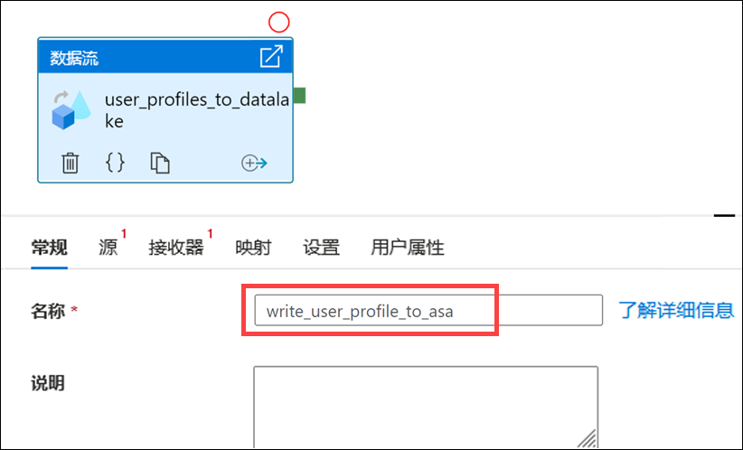

7. 选择 **“设置”** 选项卡 **(1)**。为 **“数据流”** 选择 `write_user_profile_to_asa` **(2)**，然后确保为 **“在 (Azure IR) 上运行”** 选择 `AutoResolveIntegrationRuntime` **(3)**。选择`General purpose` **计算类型 (4)**，并为 **“内核计数”** 选择`8(+ 8 个内核)` **(5)**。

    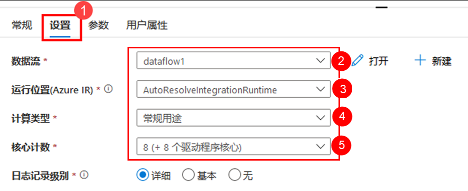

8. 选择 **“暂存”**，然后配置以下各项：

    - **暂存链接服务**：选择 `asadatalakeSUFFIX` 链接服务。
    - **暂存存储文件夹**：输入 `staging/userprofiles`。`userprofiles` 文件夹将在第一个管道运行期间自动创建。

    > **复制** `staging` 和 `userprofiles` 文件夹名称，并将它们**粘贴**到这两个字段中。

    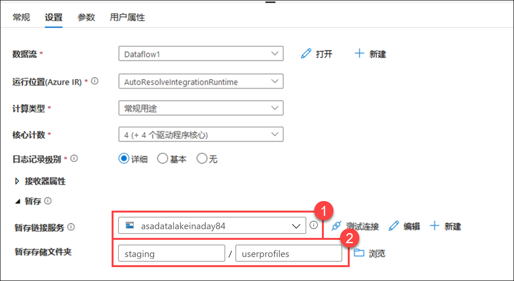

    当有大量数据要移入或移出 Azure Synapse Analytics 时，建议使用 PolyBase 下的暂存选项。你将需要尝试在生产环境中启用和禁用数据流上的暂存，以评估性能差异。

9. 依次选择 **“全部发布”** 和 **“发布”**，以保存管道。

    

#### 任务 2：触发、监视和分析用户配置文件数据管道

Tailwind Traders 想监视所有管道运行，并查看统计信息以进行性能调优和故障排除。

你已决定向 Tailwind Traders 展示如何手动触发、监视和分析管道运行。

1. 在管道顶部，依次选择 **“添加触发器”(1)**、 **“立即触发”(2)**。

    

2. 此管道没有参数，因此选择 **“确定”** 以运行触发器。

    

3. 导航到 **“监视”** 中心。

    

4. 选择 **“管道运行”(1)** 并等待管道运行成功完成 **(2)**。可能需要刷新 **(3)** 视图。

    > 在此过程中，请阅读其余的实验室说明，以熟悉内容。

    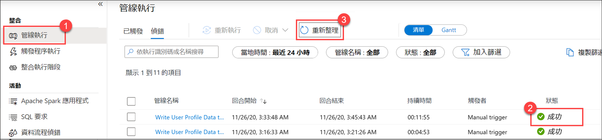

5. 选择管道的名称以查看管道的活动运行。

    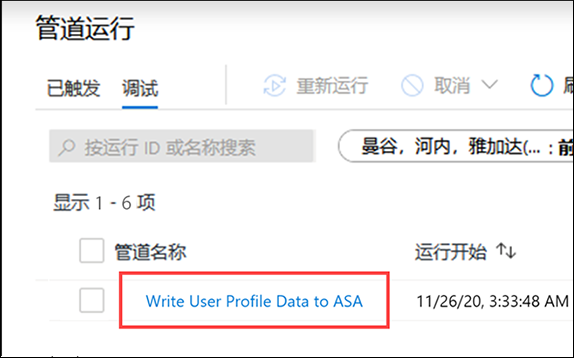

6. 将鼠标悬停在`Activity runs`列表中的数据流活动名称上，然后选择 **“数据流详细信息”** 图标。

    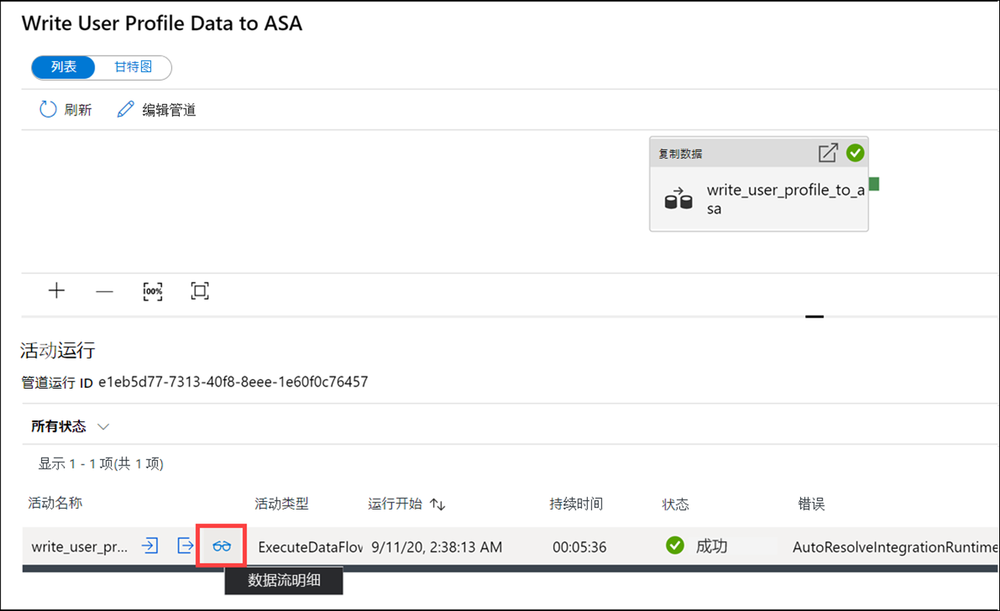

7. 数据流详细信息显示数据流步骤和处理详细信息。在我们的示例中，处理 SQL 池接收器的时间大约为 **44 秒** **(1)**，处理数据湖接收器的时间大约为 **12 秒** **(2)**。这两个的 Filter1 输出大约是 **100 万行 (3)**。可以看到完成哪些活动花费的时间最长。群集启动时间至少占用总管道运行时间 **2.5 分钟 (4)**。

    

8. 选择 `UserTopProductPurchasesASA` 接收器 **(1)** 以查看其详细信息。我们可以看到计算出 **1,622,203 行**，共有 30 个分区。在将数据写入 SQL 表之前，在 ADLS Gen2 中暂存数据大约需要 **8 秒** **(3)**。在本例中，总的接收器处理时间大约为 **44 秒 (4)**。很明显，我们有一个比其他分区大得多的**热分区 (5)**。如果我们需要从此管道中挤出额外的性能，则可以重新评估数据分区，以更均匀地分布分区，从而更好地促进并行数据加载和筛选。我们也可以尝试禁用暂存，以查看处理时间是否有差异。最后，专用 SQL 池的大小会影响将数据引入到接收器所需的时间。

    
