# 模块 9 - 将笔记本中的数据与 Azure 数据工厂或 Azure Synapse 管道集成

学生将学习如何创建链接服务，以及如何协调 Azure Synapse 管道中的数据移动和转换。

在本模块中，学生将能够：

- 协调 Azure Synapse 管道中的数据移动和转换

## 实验室详细信息

- [模块 9 - 将笔记本中的数据与 Azure 数据工厂或 Azure Synapse 管道集成](#module-9---integrate-data-from-notebooks-with-azure-data-factory-or-azure-synapse-pipelines)
  - [实验室详细信息](#lab-details)
  - [实验室设置和先决条件](#lab-setup-and-pre-requisites)
  - [练习 1：链接服务和数据集](#exercise-1-linked-service-and-datasets)
    - [任务 1：创建链接服务](#task-1-create-linked-service)
    - [任务 2：创建数据集](#task-2-create-datasets)
  - [练习 2：创建映射数据流和管道](#exercise-2-create-mapping-data-flow-and-pipeline)
    - [任务 1：检索 ADLS Gen2 链接服务名称](#task-1-retrieve-the-adls-gen2-linked-service-name)
    - [任务 2：创建映射数据流](#task-2-create-mapping-data-flow)
    - [任务 3：创建管道](#task-3-create-pipeline)
    - [任务 4：触发管道](#task-4-trigger-the-pipeline)
  - [练习 3：创建 Synapse Spark 笔记本以查找热门产品](#exercise-3-create-synapse-spark-notebook-to-find-top-products)
    - [任务 1：创建笔记本](#task-1-create-notebook)
    - [任务 2：将笔记本添加到管道](#task-2-add-the-notebook-to-the-pipeline)

> **待办事项：** 在模块 10 的设置中包括来自模块 9 的数据源、映射数据流和管道。

## 实验室设置和先决条件

> **备注：** 如果**不**使用托管实验室环境，而是使用自己的 Azure 订阅，则仅完成`Lab setup and pre-requisites`步骤。否则，请跳转到练习 1。

**完成此模块的[实验室设置说明](https://github.com/solliancenet/microsoft-data-engineering-ilt-deploy/blob/main/setup/04/README.md)**。

请注意，以下模块使用相同的环境：

- [模块 4](labs/04/README.md)
- [模块 5](labs/05/README.md)
- [模块 7](labs/07/README.md)
- [模块 8](labs/08/README.md)
- [模块 9](labs/09/README.md)
- [模块 10](labs/10/README.md)
- [模块 11](labs/11/README.md)
- [模块 12](labs/12/README.md)
- [模块 13](labs/13/README.md)
- [模块 16](labs/16/README.md)

## 练习 1：链接服务和数据集

**备注**：如果尚**未**完成模块 8，或者没有以下 Synapse 项目，请完成此练习：

- 链接服务：
  - `asacosmosdb01`
- 数据集：
  - `asal400_ecommerce_userprofiles_source`
  - `asal400_customerprofile_cosmosdb`

如果完成了模块 8 或已经拥有这些项目，请跳到练习 2。

### 任务 1：创建链接服务

请完成下面的步骤，创建 Azure Cosmos DB 链接服务。

> **备注**： 如果已创建 Cosmos DB 链接服务，可跳过此部分。

1. 打开 Synapse Studio (<https://web.azuresynapse.net/>)，然后导航到 **“管理”** 中心。

    

2. 打开 **“链接服务”**，然后选择 **“+ 新建”** 以创建新的链接服务。在选项列表中选择 **“Azure Cosmos DB (SQL API)”**，然后选择 **“继续”**。

    

3. 将链接服务命名为 `asacosmosdb01` **(1)**，选择 **Cosmos DB 帐户名称** (`asacosmosdbSUFFIX`)，然后将 **“数据库名称”** 值设置为 `CustomerProfile` **(2)**。选择 **“测试连接”** 以确保成功 **(3)**，然后选择 **“创建”(4)**。

    

### 任务 2：创建数据集

完成以下步骤以创建 `asal400_customerprofile_cosmosdb` 数据集。

> **演示者注意事项**： 如果你已完成模块 4，可跳过此部分。

1. 导航到 **“数据”** 中心。

    

2. 在工具栏中选择 **“+”** **(1)**，然后选择 **“集成数据集”(2)** 以创建新数据集。

    

3. 在列表中选择 **“Azure Cosmos DB (SQL API)”** **(1)**，然后选择 **“继续”(2)**。

    

4. 使用以下特征配置数据集，然后选择 **“确定”(4)**：

    - **名称**：输入 `asal400_customerprofile_cosmosdb` **(1)**。
    - **链接服务**：选择 Azure Cosmos DB 链接服务 **(2)**。
    - **集合**：选择 `OnlineUserProfile01` **(3)**。

    

5. 在工具栏中选择 **“+”** **(1)**，然后选择 **“集成数据集”(2)** 以创建新数据集。

    

6. 在列表中选择 **“Azure Data Lake Storage Gen2”** **(1)**，然后选择 **“继续”(2)**。

    

7. 选择 **“JSON”** 格式 **(1)**，然后选择 **“继续”(2)**。

    

8. 使用以下特征配置数据集，然后选择 **“确定”(5)**：

    - **名称**： 输入 `asal400_ecommerce_userprofiles_source` **(1)**。
    - **链接服务**：选择已存在的 `asadatalakeXX` 链接服务 **(2)**。
    - **文件路径**：浏览到路径 `wwi-02/online-user-profiles-02` **(3)**。
    - **导入架构**：选择 `From connection/store`**(4)**。

    

9. 依次选择 **“全部发布”** 和 **“发布”**，以保存新资源。

    

## 练习 2：创建映射数据流和管道

在本练习中，你将创建一个映射数据流，将用户配置文件数据复制到 Data Lake，然后创建管道，来协调执行数据流，以及稍后在本实验室中创建的 Spark 笔记本。

### 任务 1：检索 ADLS Gen2 链接服务名称

1. 导航到 **“管理”** 中心。

    

2. 在左侧菜单中，选择 **“链接服务”**。在列表中找到 **Azure Data Lake Storage Gen2** 链接服务，将鼠标悬停在该服务上，然后选择 **“{} 代码”**。

    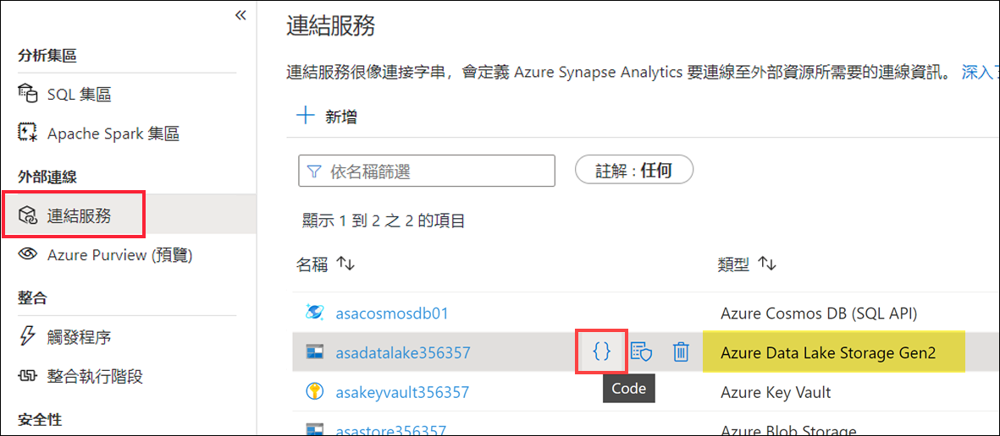

3. 复制链接服务的**名称**，然后选择 **“取消”** 关闭该对话框。在记事本或类似的文本编辑器中保存此值供以后使用。

    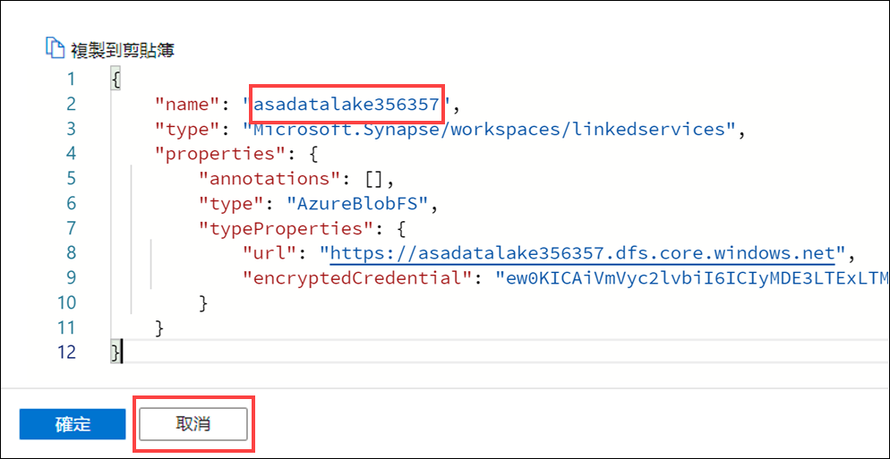

### 任务 2：创建映射数据流

1. 导航到 **“开发”** 中心。

    

2. 依次选择“+”和 **“数据流”**，以创建新数据流。

    

3. 在新数据流的 **“属性”** 边栏选项卡的 **“常规”** 设置中，将 **“名称”** 更新为： `user_profiles_to_datalake`. 请确保名称完全匹配。否则，几个步骤之后关闭代码视图时，会收到错误消息。

    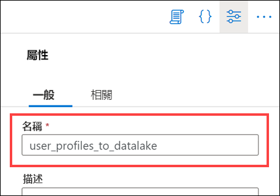

4. 选择位于数据流属性上方右上角的 **“{} 代码”** 按钮。

    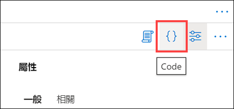

5. 将现有代码**替换**为以下内容：

    ```json
    {
        "name": "user_profiles_to_datalake",
        "properties": {
            "type": "MappingDataFlow",
            "typeProperties": {
                "sources": [
                    {
                        "dataset": {
                            "referenceName": "asal400_ecommerce_userprofiles_source",
                            "type": "DatasetReference"
                        },
                        "name": "EcommerceUserProfiles"
                    },
                    {
                        "dataset": {
                            "referenceName": "asal400_customerprofile_cosmosdb",
                            "type": "DatasetReference"
                        },
                        "name": "UserProfiles"
                    }
                ],
                "sinks": [
                    {
                        "linkedService": {
                            "referenceName": "INSERT_YOUR_DATALAKE_SERVICE_NAME",
                            "type": "LinkedServiceReference"
                        },
                        "name": "DataLake"
                    }
                ],
                "transformations": [
                    {
                        "name": "userId"
                    },
                    {
                        "name": "UserTopProducts"
                    },
                    {
                        "name": "DerivedProductColumns"
                    },
                    {
                        "name": "UserPreferredProducts"
                    },
                    {
                        "name": "JoinTopProductsWithPreferredProducts"
                    },
                    {
                        "name": "DerivedColumnsForMerge"
                    },
                    {
                        "name": "Filter1"
                    }
                ],
                "script": "source(output(\n\t\tvisitorId as string,\n\t\ttopProductPurchases as (productId as string, itemsPurchasedLast12Months as string)[]\n\t),\n\tallowSchemaDrift: true,\n\tvalidateSchema: false,\n\tignoreNoFilesFound: false,\n\tdocumentForm: 'arrayOfDocuments',\n\twildcardPaths:['online-user-profiles-02/*.json']) ~> EcommerceUserProfiles\nsource(output(\n\t\tcartId as string,\n\t\tpreferredProducts as integer[],\n\t\tproductReviews as (productId as integer, reviewDate as string, reviewText as string)[],\n\t\tuserId as integer\n\t),\n\tallowSchemaDrift: true,\n\tvalidateSchema: false,\n\tformat: 'document') ~> UserProfiles\nEcommerceUserProfiles derive(visitorId = toInteger(visitorId)) ~> userId\nuserId foldDown(unroll(topProductPurchases),\n\tmapColumn(\n\t\tvisitorId,\n\t\tproductId = topProductPurchases.productId,\n\t\titemsPurchasedLast12Months = topProductPurchases.itemsPurchasedLast12Months\n\t),\n\tskipDuplicateMapInputs: false,\n\tskipDuplicateMapOutputs: false) ~> UserTopProducts\nUserTopProducts derive(productId = toInteger(productId),\n\t\titemsPurchasedLast12Months = toInteger(itemsPurchasedLast12Months)) ~> DerivedProductColumns\nUserProfiles foldDown(unroll(preferredProducts),\n\tmapColumn(\n\t\tpreferredProductId = preferredProducts,\n\t\tuserId\n\t),\n\tskipDuplicateMapInputs: false,\n\tskipDuplicateMapOutputs: false) ~> UserPreferredProducts\nDerivedProductColumns, UserPreferredProducts join(visitorId == userId,\n\tjoinType:'outer',\n\tpartitionBy('hash', 30,\n\t\tproductId\n\t),\n\tbroadcast: 'left')~> JoinTopProductsWithPreferredProducts\nJoinTopProductsWithPreferredProducts derive(isTopProduct = toBoolean(iif(isNull(productId), 'false', 'true')),\n\t\tisPreferredProduct = toBoolean(iif(isNull(preferredProductId), 'false', 'true')),\n\t\tproductId = iif(isNull(productId), preferredProductId, productId),\n\t\tuserId = iif(isNull(userId), visitorId, userId)) ~> DerivedColumnsForMerge\nDerivedColumnsForMerge filter(!isNull(productId)) ~> Filter1\nFilter1 sink(allowSchemaDrift: true,\n\tvalidateSchema: false,\n\tformat: 'delta',\n\tcompressionType: 'snappy',\n\tcompressionLevel: 'Fastest',\n\tfileSystem: 'wwi-02',\n\tfolderPath: 'top-products',\n\ttruncate:true,\n\tmergeSchema: false,\n\tautoCompact: false,\n\toptimizedWrite: false,\n\tvacuum: 0,\n\tdeletable:false,\n\tinsertable:true,\n\tupdateable:false,\n\tupsertable:false,\n\tmapColumn(\n\t\tvisitorId,\n\t\tproductId,\n\t\titemsPurchasedLast12Months,\n\t\tpreferredProductId,\n\t\tuserId,\n\t\tisTopProduct,\n\t\tisPreferredProduct\n\t),\n\tskipDuplicateMapInputs: true,\n\tskipDuplicateMapOutputs: true) ~> DataLake"
            }
        }
    }
    ```

6. 将 `line 25` 上的 **INSERT_YOUR_DATALAKE_SERVICE_NAME** 替换为在上一个任务（任务 1）中复制的 ADLS Gen2 链接服务的名称。

    

    该值现在应包括链接服务的名称：

    

7. 选择 **“确定”**。

8. 数据流应如下所示：

    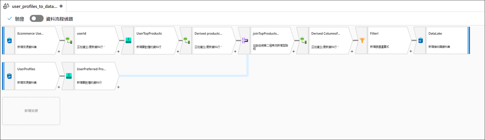

### 任务 3：创建管道

在此步骤中，将创建一个新的集成管道来执行数据流。

1. 导航到 **“集成”** 中心。

    

2. 选择 **“+”(1)**，然后选择 **“管道”(2)**。

    

3. 在新数据流的 **“配置文件”** 窗格的 **“常规”** 部分，将 **“名称”** 更新为： `User Profiles to Datalake`. 选择 **“属性”** 按钮以隐藏窗格。

    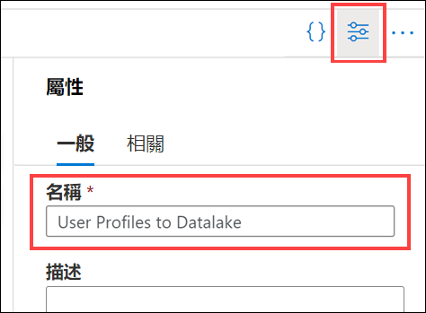

4. 展开“活动”列表中的 **“移动和转换”**，然后将 **“数据流”** 活动拖放到管道画布上。

    

5. 在 **“常规”** 选项卡下，将名称设置为 `user_profiles_to_datalake`。

    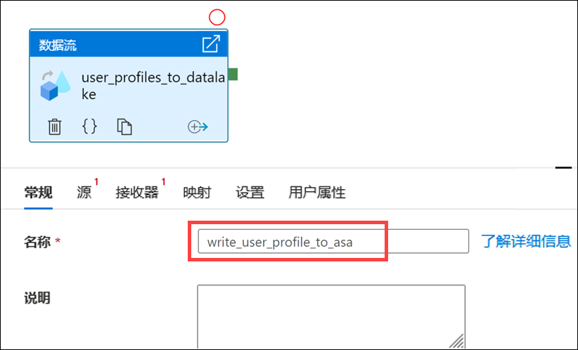

6. 选择 **“设置”** 选项卡 **(1)**。为 **“数据流”(2)** 选择 `user_profiles_to_datalake`，然后确保为 **“在 (Azure IR) 上运行” (3)** 选择 `AutoResolveIntegrationRuntime`。选择`General purpose` **计算类型 (4)**，并为 **“内核计数”** 选择`8 (+ 8 cores)` **(5)**。

    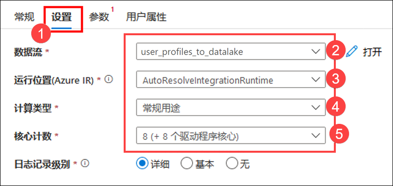

7. 依次选择 **“全部发布”** 和 **“发布”**，以保存管道。

    

### 任务 4：触发管道

1. 在管道顶部，依次选择 **“添加触发器”(1)**、**“立即触发”(2)**。

    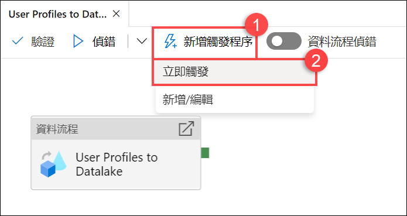

2. 此管道没有参数，因此选择 **“确定”** 以运行触发器。

    

3. 导航到 **“监视”** 中心。

    

4. 选择 **“管道运行”(1)** 并等待管道运行成功完成 **(2)**。可能需要刷新 **(3)** 视图。

    > 在此过程中，请阅读其余的实验室说明，以熟悉内容。

    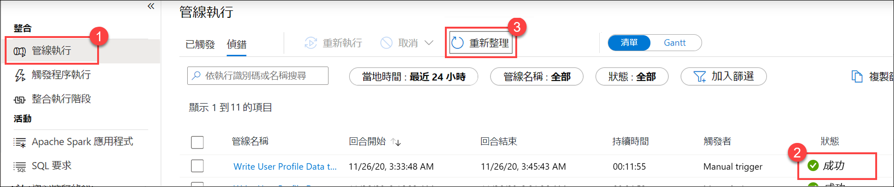

## 练习 3：创建 Synapse Spark 笔记本以查找热门产品

Tailwind Traders 使用 Synapse Analytics 中的映射数据流来处理、联接和导入用户配置文件数据。现在，他们想要根据产品的受欢迎度以及过去 12 个月内哪些产品购买次数最多，找出针对每位用户最受欢迎的前 5 种产品。然后，计算出总体排名前 5 的产品。

在实验室的这一部分中，你将创建一个 Synapse Spark 笔记本来进行这些计算。

> 我们将从作为数据流中第二个接收器添加的 Data Lake 中访问数据，删除专用 SQL 池依赖项。

### 任务 1：创建笔记本

1. 打开 Synapse Analytics Studio (<https://web.azuresynapse.net/>)，然后导航到 **“数据”** 中心。

    

2. 选择 **“链接”** 选项卡 **(1)** 并展开 **Azure Data Lake Storage Gen2** 下的 **“Data Lake Storage 主帐户”(2)**。选择 **wwi-02** 容器 **(3)**，然后打开 **top-products** 文件夹 **(4)**。右键单击任意 Parquet 文件 **(5)**，选择 **“新建笔记本”** 菜单项 **(6)**，然后选择 **“加载到 DataFrame”(7)**。如果未看到文件夹，请选择上方的 `Refresh`。

    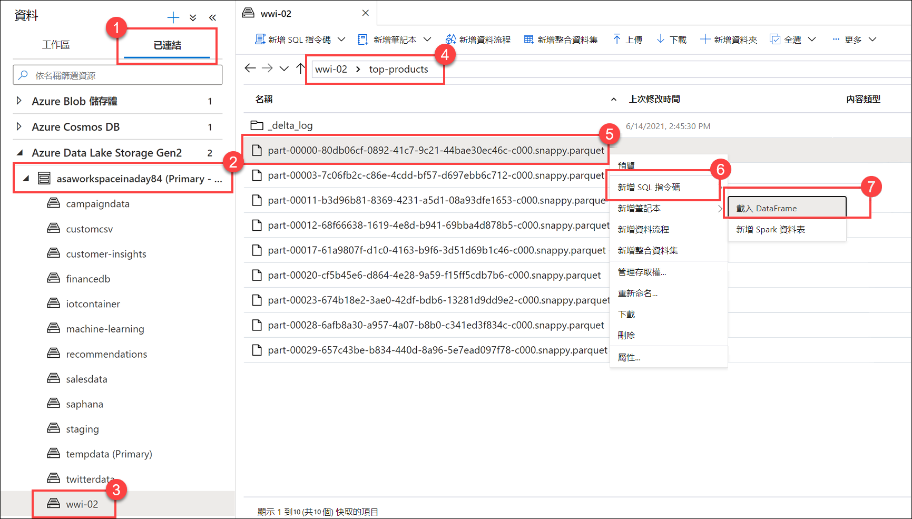

3. 确保笔记本附加到 Spark 池。

    

4. 将 Parquet 文件名替换为 `*.parquet` **(1)** 以选择 `top-products` 文件夹中的所有 Parquet 文件。例如，路径应该类似于： `abfss://wwi-02@YOUR_DATALAKE_NAME.dfs.core.windows.net/top-products/*.parquet`.

    

5. 在笔记本工具栏上选择 **“全部运行”**，以执行笔记本。

    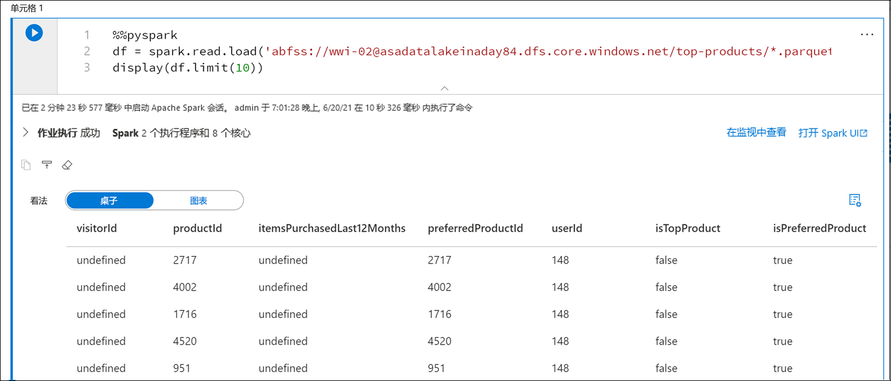

    > **备注：** 首次在 Spark 池中运行笔记本时，Synapse 会创建一个新的会话。这大约需要 3-5 分钟时间。

    > **备注：** 若要仅运行单元格，请将鼠标悬停在单元格上，然后选择单元格左侧的 *“运行单元格”* 图标，或者选中单元格，再在键盘上按下 **Ctrl+Enter**。

6. 通过选择 **“+”** 按钮并选择 **“</> 代码单元格”** 项，在下面创建一个新单元格。+ 按钮位于左侧笔记本单元格的下方。

    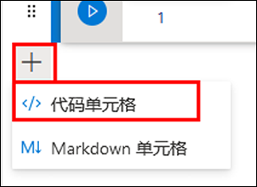

7. 在新单元格中输入并执行以下内容，填充名为 `topPurchases` 的新 DataFrame，创建一个名为 `top_purchases` 的新临时视图，并显示前 100 行：

    ```python
    topPurchases = df.select(
        "UserId", "ProductId",
        "ItemsPurchasedLast12Months", "IsTopProduct",
        "IsPreferredProduct")

    # 填充模板视图以便可从 SQL 进行查询
    topPurchases.createOrReplaceTempView("top_purchases")

    topPurchases.show(100)
    ```

    输出应如下所示：

    ```text
    +------+---------+--------------------------+------------+------------------+
    |UserId|ProductId|ItemsPurchasedLast12Months|IsTopProduct|IsPreferredProduct|
    +------+---------+--------------------------+------------+------------------+
    |   148|     2717|                      null|       false|              true|
    |   148|     4002|                      null|       false|              true|
    |   148|     1716|                      null|       false|              true|
    |   148|     4520|                      null|       false|              true|
    |   148|      951|                      null|       false|              true|
    |   148|     1817|                      null|       false|              true|
    |   463|     2634|                      null|       false|              true|
    |   463|     2795|                      null|       false|              true|
    |   471|     1946|                      null|       false|              true|
    |   471|     4431|                      null|       false|              true|
    |   471|      566|                      null|       false|              true|
    |   471|     2179|                      null|       false|              true|
    |   471|     3758|                      null|       false|              true|
    |   471|     2434|                      null|       false|              true|
    |   471|     1793|                      null|       false|              true|
    |   471|     1620|                      null|       false|              true|
    |   471|     1572|                      null|       false|              true|
    |   833|      957|                      null|       false|              true|
    |   833|     3140|                      null|       false|              true|
    |   833|     1087|                      null|       false|              true|
    ```

8. 在新单元格中执行以下操作，创建一个新的 DataFrame 以仅保存 `IsTopProduct` 和 `IsPreferredProduct` 都为 true 的首选产品：

    ```python
    from pyspark.sql.functions import *

    topPreferredProducts = (topPurchases
        .filter( col("IsTopProduct") == True)
        .filter( col("IsPreferredProduct") == True)
        .orderBy( col("ItemsPurchasedLast12Months").desc() ))

    topPreferredProducts.show(100)
    ```

    

9. 在新单元格中执行以下操作，以使用 SQL 创建新的临时视图：

    ```sql
    %%sql

    CREATE OR REPLACE TEMPORARY VIEW top_5_products
    AS
        select UserId, ProductId, ItemsPurchasedLast12Months
        from (select *,
                    row_number() over (partition by UserId order by ItemsPurchasedLast12Months desc) as seqnum
            from top_purchases
            ) a
        where seqnum <= 5 and IsTopProduct == true and IsPreferredProduct = true
        order by a.UserId
    ```

    *请注意，上述查询没有输出*。该查询使用 `top_purchases` 临时视图作为源，并应用 `row_number()over` 方法为每个用户的记录应用一个行号，其中 `ItemsPurchasedLast12Months` 是最大值。`where` 子句对结果进行筛选，这样最多只能检索五个产品，其中 `IsTopProduct` 和 `IsPreferredProduct` 都设置为 true。这就为我们提供了每个用户购买最多的五个产品，根据他们存储在 Azure Cosmos DB 中的用户配置文件，这些产品*也*被标识为他们最喜欢的产品。

10. 在新单元格中执行以下操作，创建并显示新的 DataFrame，该 DataFrame 存储了前一个单元格中创建的 `top_5_products` 临时视图的结果：

    ```python
    top5Products = sqlContext.table("top_5_products")

    top5Products.show(100)
    ```

    你会看到如下所示的输出，其中显示了每个用户的前五个首选产品：

    

11. 在新单元格中执行以下操作，比较每个客户最喜欢的产品数量和前五个首选产品的数量：

    ```python
    print('before filter: ', topPreferredProducts.count(), ', after filter: ', top5Products.count())
    ```

    输出应该类似于 `before filter：  997873 , after filter:  85020`。

12. 根据顾客喜欢且购买次数最多的产品，计算出总体排名前五的产品。为此，在新单元格中执行以下内容：

    ```python
    top5ProductsOverall = (top5Products.select("ProductId","ItemsPurchasedLast12Months")
        .groupBy("ProductId")
        .agg( sum("ItemsPurchasedLast12Months").alias("Total") )
        .orderBy( col("Total").desc() )
        .limit(5))

    top5ProductsOverall.show()
    ```

    在此单元格中，我们按产品 ID 对前五个首选产品进行分组，汇总过去 12 个月内购买的商品总数，按降序对该值进行排序，然后返回前五个结果。输出应类似于以下内容：

    ```text
    +---------+-----+
    |ProductId|Total|
    +---------+-----+
    |      347| 4523|
    |     4833| 4314|
    |     3459| 4233|
    |     2486| 4135|
    |     2107| 4113|
    +---------+-----+
    ```

13. 我们将从管道中执行该笔记本。我们想传入一个参数，该参数设置一个 `runId` 变量值，该值将用于命名 Parquet 文件。在新单元格中执行以下操作：

    ```python
    import uuid

    # 生成随机 GUID
    runId = uuid.uuid4()
    ```

    我们使用 Spark 附带的 `uuid` 库来生成随机 GUID。我们想用管道传入的参数覆盖 `runId` 变量。为此，需要将其切换为参数单元格。

14. 选择单元格 **(1)** 上方的操作省略号 **“(...)”**，然后选择 **“切换参数单元格”(2)**。

    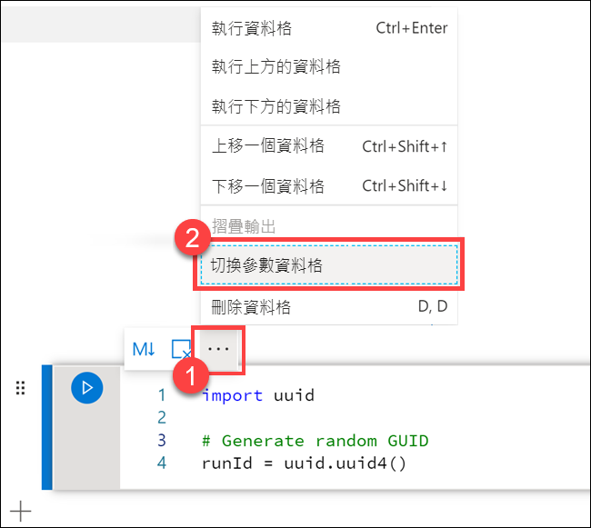

    切换此选项后，将在单元格上看到 **“参数”** 标签。

    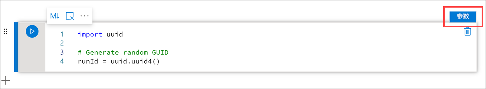

15. 将以下代码粘贴到新单元格中，以将 `runId` 变量用作主 Data Lake 帐户中 `/top5-products/` 路径内的 Parquet 文件名。将路径中的 **`YOUR_DATALAKE_NAME` 替换**为主 Data Lake 帐户的名称。要找到它，请向上滚动到页面 **(1)** 顶部的 **“单元格 1”**。从路径 **(2)** 复制 Data Lake Storage 帐户。将此值作为 **`YOUR_DATALAKE_NAME`** 的替换值粘贴到新单元格内的路径 **(3)** 中，然后执行该单元格。

    ```python
    %%pyspark

    top5ProductsOverall.write.parquet('abfss://wwi-02@YOUR_DATALAKE_NAME.dfs.core.windows.net/top5-products/' + str(runId) + '.parquet')
    ```

    

16. 验证文件是否已写入 Data Lake。导航到 **“数据”** 中心，然后选择 **“链接”** 选项卡 **(1)**。展开 Data Lake Storage 主帐户，选择 **wwi-02** 容器 **(2)**。导航到 **top5-products** 文件夹 **(3)**。你会在目录中看到 Parquet 文件的文件夹，文件名为 GUID **(4)**。

    

    笔记本单元格中 DataFrame 上的 Parquet 写入方法创建了此目录，此前该目录并不存在。

17. 返回到笔记本。在笔记本的右上方选择 **“停止会话”**。停止会话是为了释放计算资源，以便在下一节的管道中运行笔记本。

    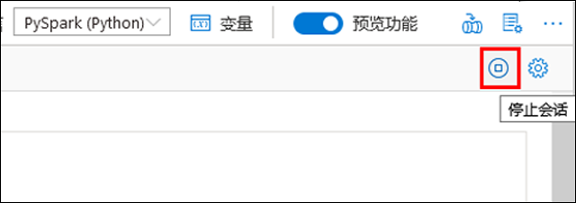

18. 在停止当前会话中选择 **“立即停止”**。

    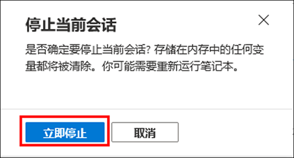

### 任务 2：将笔记本添加到管道

Tailwind Traders 希望在映射数据流运行后执行此笔记本，作为其协调过程的一部分。为此，我们将此笔记本作为新笔记本活动添加到管道中。

1. 返回到笔记本。选择笔记本右上角的 **“属性”** 按钮 **(1)**，然后输入 `Calculate Top 5 Products` 作为 **“名称”(2)**。

    

2. 选择笔记本右上角的 **“添加到管道”** 按钮 **(1)**，然后选择 **“现有管道”(2)**。

    

3. 选择 **“用户配置文件到 Data Lake”** 管道 **(1)**，然后选择 **“添加”(2)**。

    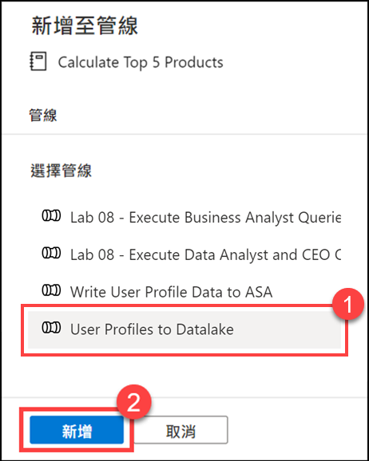

4. Synapse Studio 将笔记本活动添加到管道中。重新排列 **“笔记本活动”**，使其位于 **“数据流活动”** 的右侧。选择 **“数据流活动”**，然后将 **“成功”** 活动管道连接 **“绿色框”** 拖到 **“笔记本活动”** 中。

    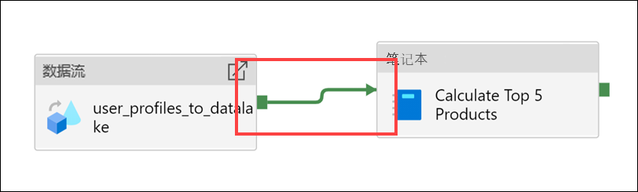

    “成功”活动箭头指示管道在数据流活动成功运行后执行笔记本活动。

5. 选择 **“笔记本活动”(1)**，再选择 **“设置”** 选项卡 **(2)**，展开 **“基本参数”(3)**，然后选择 **“+ 新建”(4)**。在 **“名称”** 字段中输入 **`runId`**。选择 **“字符串”** 作为 **“类型”(6)**。对于 **“值”**，选择 **“添加动态内容”(7)**。

    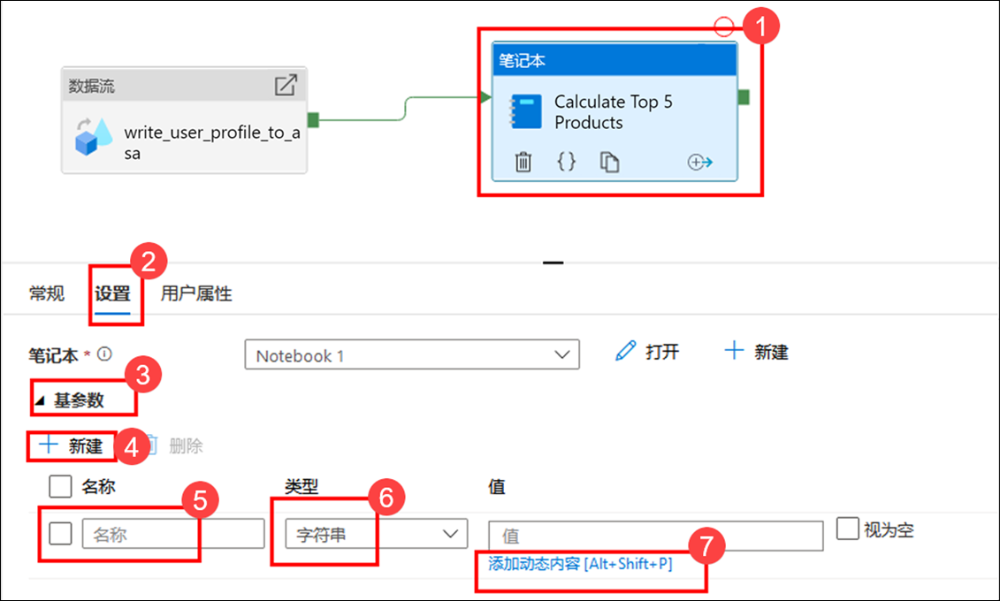

6. 在 **“系统变量”(1)** 下，选择 **“管道运行 ID”**。这会将 `@pipeline().RunId` 添加到动态内容框 **(2)**。选择 **“完成” (3)** 关闭对话框。

    

    管道运行 ID 值是分配给每个管道运行的唯一 GUID。通过将此值作为 `runId` 笔记本参数传入，我们将使用该值作为 Parquet 文件的名称。然后可以查看管道运行历史记录，并找到为每个管道运行创建的特定 Parquet 文件。

7. 依次选择 **“全部发布”** 和 **“发布”**，以保存更改。

    

8. **可选 - 现在，管道运行至少需要 10 分钟 -** 发布完成后，选择 **“添加触发器”(1)**，然后选择 **“立即触发”(2)** 以运行更新的管道。

    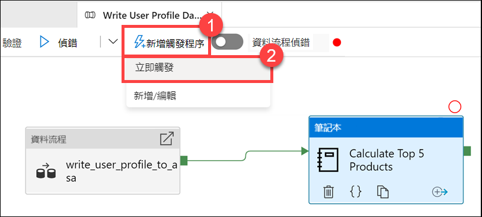

9. 选择 **“确定”** 以运行触发器。

    

10. 导航到 **“监视”** 中心。

    

11. 选择 **“管道运行”(1)** 并等待管道运行成功完成 **(2)**。可能需要刷新 **(3)** 视图。

    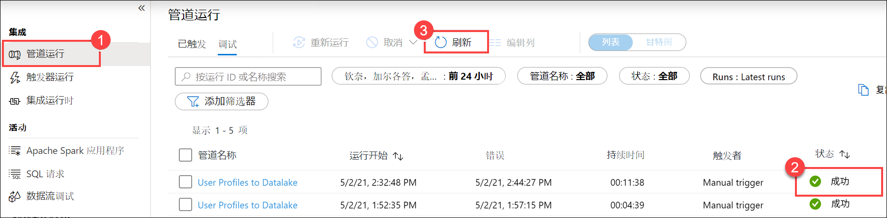

    > 添加笔记本活动后，运行可能需要 10 多分钟才能完成。
    > 在此过程中，请阅读其余的实验室说明，以熟悉内容。

12. 选择管道的名称以查看管道的活动运行。

    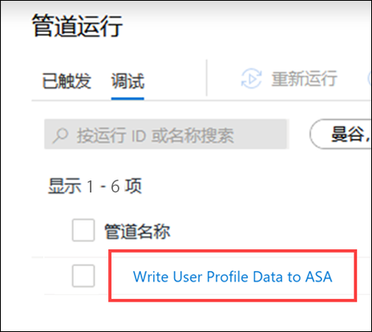

13. 这一次，可以看到 **“数据流”** 活动和新的 **“笔记本”** 活动 **(1)**。记下 **“管道运行 ID”** 值 **(2)**。我们将其与笔记本生成的 Parquet 文件名进行比较。选择 **“Calculate Top 5 Products”** 笔记本名称，以查看其详细信息 **(3)**。

    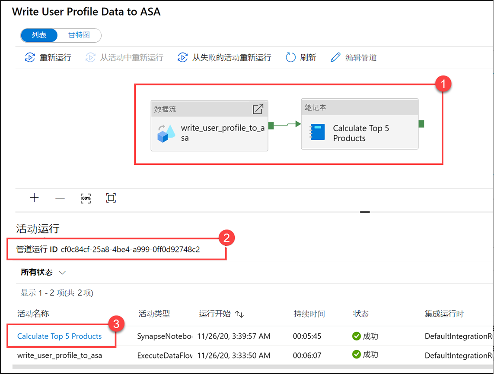

14. 在这里可以看到笔记本运行的详细信息。可以选择 **“回放”** 按钮 **(1)** 来观看 **“作业”(2)** 的进度回放。在底部，可以使用不同的筛选器选项 **(3)** 查看 **“诊断”** 和 **“日志”**。将鼠标悬停在阶段上可查看其详细信息，例如持续时间、任务总数、数据详细信息等。选择 **“阶段”** 上的 **“查看详细信息”** 链接以查看其详细信息 **(5)**。

    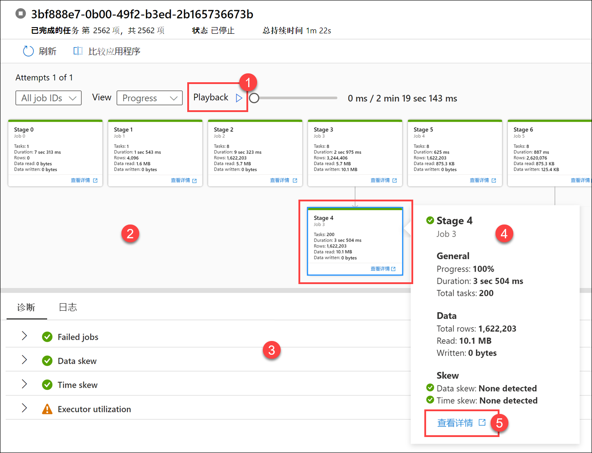

15. Spark 应用程序 UI 在新选项卡中打开，从中可以查看阶段详细信息。展开 **“DAG 可视化效果”** 以查看阶段详细信息。

    

16. 导航回 **“数据”** 中心。

    

17. 选择 **“链接”** 选项卡 **(1)**，选择 Data Lake Storage 主帐户上的 **wwi-02** 容器 **(2)**，导航到 **top5-products** 文件夹 **(3)**，然后验证 Parquet 文件的文件夹是否存在，其名称与 **“管道运行 ID”** 相匹配。

    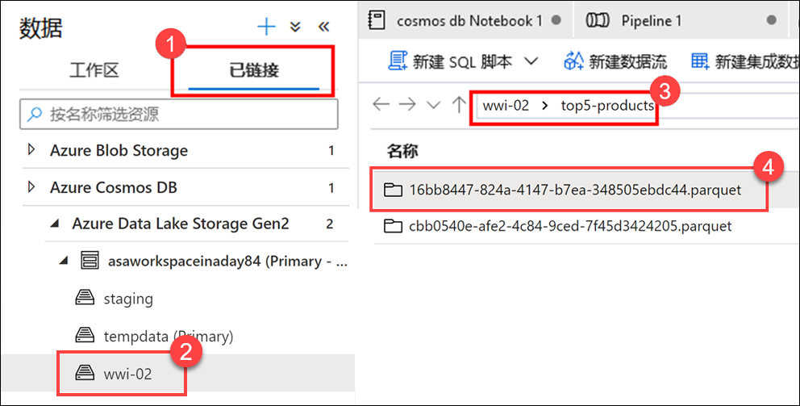

    如你所见，我们有一个文件，其名称与我们之前提到的 **“管道运行 ID”** 相匹配：

    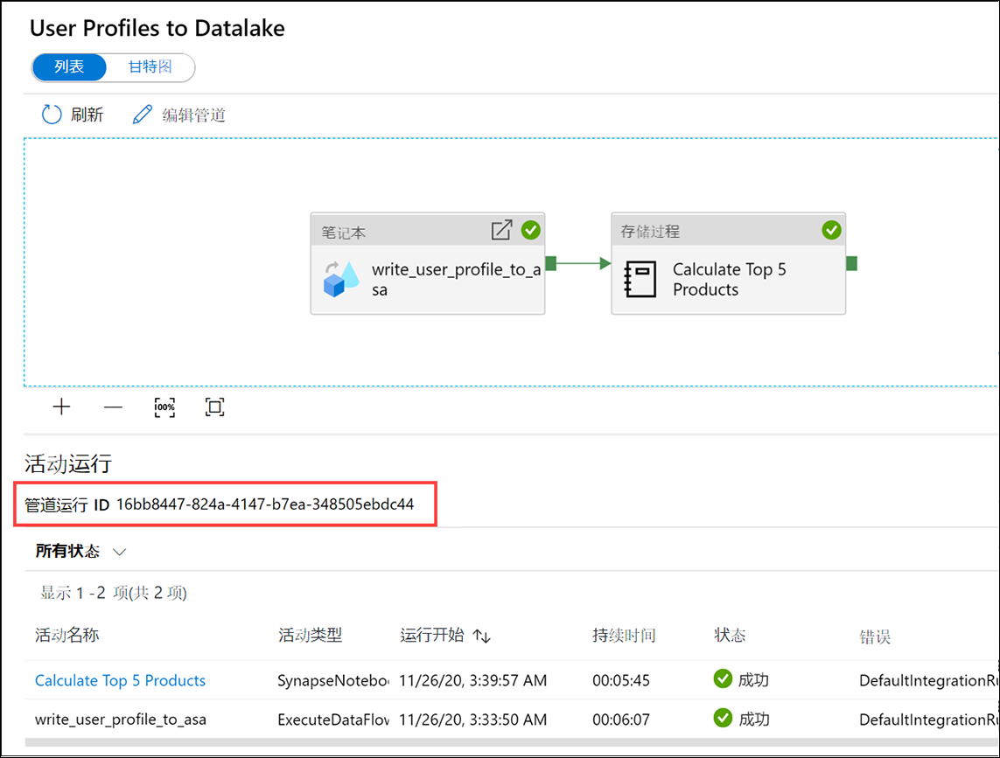

    这些值匹配是因为我们之前将管道运行 ID 传递给了笔记本活动上的 `runId` 参数。
