# 模块 10 - 使用 Azure Synapse 中的专用 SQL 池优化查询性能

在本模块中，学生将学习在 Azure Synapse Analytics 中使用专用 SQL 池时用于优化数据存储和处理的策略。学生将了解如何使用开发人员功能（例如开窗函数和 HyperLogLog 函数）、使用数据加载最佳做法，以及优化和提高查询性能。

在本模块中，学生将能够：

- 了解 Azure Synapse Analytics 的开发人员功能
- 优化 Azure Synapse Analytics 中的数据仓库查询性能
- 提高查询性能

## 实验室详细信息

- [模块 10 - 使用 Azure Synapse 中的专用 SQL 池优化查询性能](#module-10---optimize-query-performance-with-dedicated-sql-pools-in-azure-synapse)
  - [实验室详细信息](#lab-details)
  - [实验室设置和先决条件](#lab-setup-and-pre-requisites)
  - [练习 0：启动专用 SQL 池](#exercise-0-start-the-dedicated-sql-pool)
  - [练习 1：了解 Azure Synapse Analytics 的开发人员功能](#exercise-1-understanding-developer-features-of-azure-synapse-analytics)
    - [任务 1：创建表并加载数据](#task-1-create-tables-and-load-data)
    - [任务 2：使用窗口函数](#task-2-using-window-functions)
      - [任务 2.1：OVER 子句](#task-21-over-clause)
      - [任务 2.2：聚合函数](#task-22-aggregate-functions)
      - [任务 2.3：分析函数](#task-23-analytic-functions)
      - [任务 2.4：ROWS 子句](#task-24-rows-clause)
    - [任务 3：使用 HyperLogLog 函数进行近似执行](#task-3-approximate-execution-using-hyperloglog-functions)
  - [练习 2：在 Azure Synapse Analytics 中使用数据加载最佳做法](#exercise-2-using-data-loading-best-practices-in-azure-synapse-analytics)
    - [任务 1：实现工作负载管理](#task-1-implement-workload-management)
    - [任务 2：创建工作负载分类器以增加某些查询的重要性](#task-2-create-a-workload-classifier-to-add-importance-to-certain-queries)
    - [任务 3：通过工作负载隔离为特定工作负载预留资源](#task-3-reserve-resources-for-specific-workloads-through-workload-isolation)
  - [练习 3：优化 Azure Synapse Analytics 中的数据仓库查询性能](#exercise-3-optimizing-data-warehouse-query-performance-in-azure-synapse-analytics)
    - [任务 1：识别与表相关的性能问题](#task-1-identify-performance-issues-related-to-tables)
    - [任务 2：使用哈希分布和列存储索引优化表结构](#task-2-improve-table-structure-with-hash-distribution-and-columnstore-index)
    - [任务 4：使用分区进一步优化表结构](#task-4-improve-further-the-table-structure-with-partitioning)
      - [任务 4.1：表分布](#task-41-table-distributions)
      - [任务 4.2：索引](#task-42-indexes)
      - [任务 4.3：分区](#task-43-partitioning)
  - [练习 4：提高查询性能](#exercise-4-improve-query-performance)
    - [任务 1：使用具体化视图](#task-1-use-materialized-views)
    - [任务 2：使用结果集缓存](#task-2-use-result-set-caching)
    - [任务 3：创建和更新统计信息](#task-3-create-and-update-statistics)
    - [任务 4：创建和更新索引](#task-4-create-and-update-indexes)
    - [任务 5：有序聚集列存储索引](#task-5-ordered-clustered-columnstore-indexes)
  - [练习 5：清理](#exercise-5-cleanup)
    - [任务 1：暂停专用 SQL 池](#task-1-pause-the-dedicated-sql-pool)

## 实验室设置和先决条件

> **备注：** 如果**不**使用托管实验室环境，而是使用自己的 Azure 订阅，则仅完成`Lab setup and pre-requisites`步骤。否则，请跳转到练习 0。

**完成此模块的[实验室设置说明](https://github.com/solliancenet/microsoft-data-engineering-ilt-deploy/blob/main/setup/04/README.md)**。

请注意，以下模块使用相同的环境：

- [模块 4](labs/04/README.md)
- [模块 5](labs/05/README.md)
- [模块 7](labs/07/README.md)
- [模块 8](labs/08/README.md)
- [模块 9](labs/09/README.md)
- [模块 10](labs/10/README.md)
- [模块 11](labs/11/README.md)
- [模块 12](labs/12/README.md)
- [模块 13](labs/13/README.md)
- [模块 16](labs/16/README.md)

## 练习 0：启动专用 SQL 池

本实验室使用专用 SQL 池。第一步是确保它没有暂停。如果暂停，请按照以下说明启动它：

1. 打开 Synapse Studio (<https://web.azuresynapse.net/>)。

2. 选择 **“管理”** 中心。

    

3. 在左侧菜单中，选择 **“SQL 池”** **(1)**。如果专用 SQL 池已暂停，请将鼠标悬停在池名称上并选择 **“恢复”(2)**。

    

4. 出现提示时，选择 **“恢复”**。恢复池可能需要一到两分钟。

    

> **等待**专用 SQL 池恢复。

## 练习 1：了解 Azure Synapse Analytics 的开发人员功能

### 任务 1：创建表并加载数据

开始前，需新建一些表并加载数据。

1. 打开 Synapse Studio (<https://web.azuresynapse.net/>)。

2. 选择 **“开发”** 中心。

    

3. 在 **“开发”** 菜单中选择 “+”按钮 **(1)**，然后在上下文菜单中选择 **“SQL 脚本”(2)**。

    

4. 在工具栏菜单中，连接到 **“SQLPool01”** 数据库以执行该查询。

    

5. 在查询窗口中，将脚本替换为以下内容，以对 `wwi_security.Sale` 表中的数据使用 `OVER` 子句：

    ```sql
    IF OBJECT_ID(N'[dbo].[Category]', N'U') IS NOT NULL
    DROP TABLE [dbo].[Category]

    CREATE TABLE [dbo].[Category]
    ( 
        [ID] [float]  NOT NULL,
        [Category] [varchar](255)  NULL,
        [SubCategory] [varchar](255)  NULL
    )
    WITH
    (
        DISTRIBUTION = ROUND_ROBIN,
        CLUSTERED COLUMNSTORE INDEX
    )
    GO

    IF OBJECT_ID(N'[dbo].[Books]', N'U') IS NOT NULL
    DROP TABLE [dbo].[Books]

    CREATE TABLE [dbo].[Books]
    ( 
        [ID] [float]  NOT NULL,
        [BookListID] [float]  NULL,
        [Title] [varchar](255)  NULL,
        [Author] [varchar](255)  NULL,
        [Duration] [float]  NULL,
        [Image] [varchar](255)  NULL
    )
    WITH
    (
        DISTRIBUTION = ROUND_ROBIN,
        CLUSTERED COLUMNSTORE INDEX
    )
    GO

    IF OBJECT_ID(N'[dbo].[BookConsumption]', N'U') IS NOT NULL
    DROP TABLE [dbo].[BookConsumption]

    CREATE TABLE [dbo].[BookConsumption]
    ( 
        [BookID] [float]  NULL,
        [Clicks] [float]  NULL,
        [Downloads] [float]  NULL,
        [Time Spent] [float]  NULL,
        [Country] [varchar](255)  NULL
    )
    WITH
    (
        DISTRIBUTION = ROUND_ROBIN,
        CLUSTERED COLUMNSTORE INDEX
    )
    GO

    IF OBJECT_ID(N'[dbo].[BookList]', N'U') IS NOT NULL
    DROP TABLE [dbo].[BookList]

    CREATE TABLE [dbo].[BookList]
    ( 
        [ID] [float]  NOT NULL,
        [CategoryID] [float]  NULL,
        [BookList] [varchar](255)  NULL
    )
    WITH
    (
        DISTRIBUTION = ROUND_ROBIN,
        CLUSTERED COLUMNSTORE INDEX
    )
    GO

    COPY INTO Category 
    FROM 'https://solliancepublicdata.blob.core.windows.net/dataengineering/dp-203/books/Category.csv'
    WITH (
        FILE_TYPE = 'CSV',
        FIRSTROW = 2
    )
    GO

    COPY INTO Books 
    FROM 'https://solliancepublicdata.blob.core.windows.net/dataengineering/dp-203/books/Books.csv'
    WITH (
        FILE_TYPE = 'CSV',
        FIRSTROW = 2
    )
    GO

    COPY INTO BookConsumption 
    FROM 'https://solliancepublicdata.blob.core.windows.net/dataengineering/dp-203/books/BookConsumption.csv'
    WITH (
        FILE_TYPE = 'CSV',
        FIRSTROW = 2
    )
    GO

    COPY INTO BookList 
    FROM 'https://solliancepublicdata.blob.core.windows.net/dataengineering/dp-203/books/BookList.csv'
    WITH (
        FILE_TYPE = 'CSV',
        FIRSTROW = 2
    )
    GO
    ```

6. 在工具栏菜单中选择 **“运行”** 以执行 SQL 命令。

    

    几秒钟后应显示查询成功完成。

### 任务 2：使用窗口函数

Tailwind Traders 正在寻找更高效的销售数据分析方法，以避免依赖成本高昂的游标、子查询以及当前使用的其他过时方法。

你建议使用窗口函数对一组行执行计算。使用这些函数可将行组视为实体。

#### 任务 2.1：OVER 子句

**`OVER`** 子句是窗口函数的关键组件之一。该子句在应用关联的窗口函数前确定行集的分区和排序。也就是说，OVER 子句定义查询结果集内的窗口或用户指定的行集。然后，窗口函数将计算窗口中每一行的值。您可以将 OVER 子句与函数一起使用，以便计算各种聚合值，例如移动平均值、累积聚合、运行总计或每组结果的前 N 个结果。

1. 选择 **“开发”** 中心。

    

2. 在 **“开发”** 菜单中选择 “+”按钮 **(1)**，然后在上下文菜单中选择 **“SQL 脚本”(2)**。

    

3. 在工具栏菜单中，连接到 **“SQLPool01”** 数据库以执行该查询。

    

4. 在查询窗口中，将脚本替换为以下内容，以对 `wwi_security.Sale` 表中的数据使用 `OVER` 子句：

    ```sql
    SELECT
      ROW_NUMBER() OVER(PARTITION BY Region ORDER BY Quantity DESC) AS "Row Number",
      Product,
      Quantity,
      Region
    FROM wwi_security.Sale
    WHERE Quantity <> 0  
    ORDER BY Region;
    ```

5. 在工具栏菜单中选择 **“运行”** 以执行 SQL 命令。

    

    结合使用 `PARTITION BY` 和 `OVER` 子句 **(1)** 时，我们将查询结果集划分为分区。窗口函数分别应用于每个分区，并为每个分区重新启动计算。

    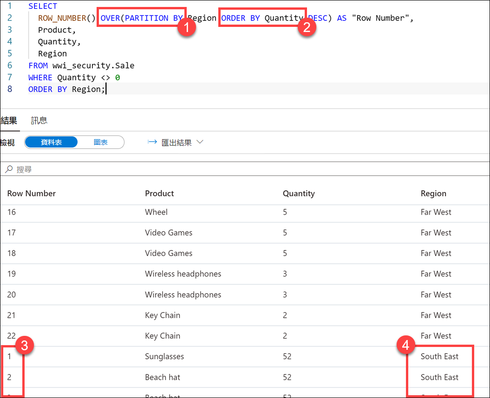

    执行的脚本结合使用 OVER 子句和 ROW_NUMBER 函数 **(1)** 来显示分区内各行的行号。在本例中，分区为 `Region` 列。在 OVER 子句中指定的 ORDER BY 子句 **(2)** 按 `Quantity` 列对每个分区中的行进行排序。SELECT 语句中的 ORDER BY 子句确定整个查询结果集的返回顺序。

    在结果视图中**向下滚动**，直到**行号**计数 **(3)** 从**其他区域 (4)** 重新开始。由于分区设置为 `Region`，因此区域发生更改时 `ROW_NUMBER` 会重置。基本上，我们按区域进行了分区，并按该区域中的行数标识了结果集。

#### 任务 2.2：聚合函数

接下来，我们将通过扩展使用 OVER 子句的查询在我们的窗口中使用聚合函数。

1. 在查询窗口中，将脚本替换为以下内容，以添加聚合函数：

    ```sql
    SELECT
      ROW_NUMBER() OVER(PARTITION BY Region ORDER BY Quantity DESC) AS "Row Number",
      Product,
      Quantity,
      SUM(Quantity) OVER(PARTITION BY Region) AS Total,  
      AVG(Quantity) OVER(PARTITION BY Region) AS Avg,  
      COUNT(Quantity) OVER(PARTITION BY Region) AS Count,  
      MIN(Quantity) OVER(PARTITION BY Region) AS Min,  
      MAX(Quantity) OVER(PARTITION BY Region) AS Max,
      Region
    FROM wwi_security.Sale
    WHERE Quantity <> 0  
    ORDER BY Region;
    ```

2. 在工具栏菜单中选择 **“运行”** 以执行 SQL 命令。

    

    在查询中，我们添加了 `SUM`、`AVG`、`COUNT`、`MIN` 和 `MAX` 聚合函数。使用 OVER 子句比使用子查询的效率高。

    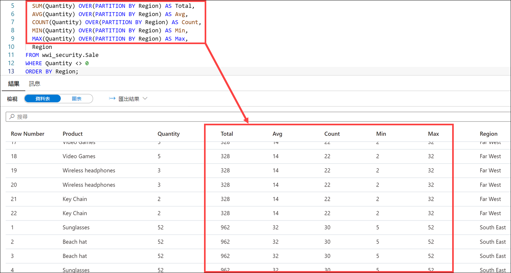

#### 任务 2.3：分析函数

分析函数基于一组行计算聚合值。但是，与聚合函数不同，分析函数可能针对每个组返回多行。可以使用分析函数来计算移动平均线、运行总计、百分比或一个组内的前 N 个结果。

Tailwind Traders 已从在线商店导入书籍销售数据，并希望按类别计算书籍下载百分比。

为此，你决定构建使用 `PERCENTILE_CONT` 和 `PERCENTILE_DISC` 函数的窗口函数。

1. 在查询窗口中，将脚本替换为以下内容，以添加聚合函数：

    ```sql
    -- PERCENTILE_CONT, PERCENTILE_DISC
    SELECT DISTINCT c.Category  
    ,PERCENTILE_CONT(0.5) WITHIN GROUP (ORDER BY bc.Downloads)
                          OVER (PARTITION BY Category) AS MedianCont  
    ,PERCENTILE_DISC(0.5) WITHIN GROUP (ORDER BY bc.Downloads)
                          OVER (PARTITION BY Category) AS MedianDisc  
    FROM dbo.Category AS c  
    INNER JOIN dbo.BookList AS bl
        ON bl.CategoryID = c.ID
    INNER JOIN dbo.BookConsumption AS bc  
        ON bc.BookID = bl.ID
    ORDER BY Category
    ```

2. 在工具栏菜单中选择 **“运行”** 以执行 SQL 命令。

    

    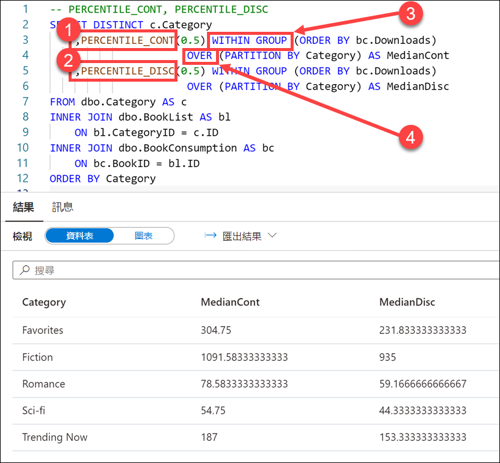

    在本查询中，我们使用 **PERCENTILE_CONT (1)** 和 **PERCENTILE_DISC (2)** 来查找各书籍类别的下载中位数。这些函数可能不会返回相同的值。PERCENTILE_CONT 内插适当的值，它在数据集中可能存在，也可能不存在，而 PERCENTILE_DISC 始终从数据集中返回实际值。具体而言，PERCENTILE_DISC 计算整个行集内或行集的非重复分区内已排序值的特定百分位数。

    > 传递到**百分位数函数（1 和 2）** 的 `0.5` 值计算下载的第 50 个百分位数或中位数。

    **WITHIN GROUP** 表达式 **(3)** 指定要排序的一系列值，并计算百分位数。只允许使用一个 ORDER BY 表达式，并且默认排序顺序为升序。

    **OVER** 子句 **(4)** 将 FROM 子句的结果集（本例中为 `Category`）划分为多个分区。百分位数函数应用于这些分区。

3. 在查询窗口中，将脚本替换为以下内容，以使用 LAG 分析函数：

    ```sql
    --LAG Function
    SELECT ProductId,
        [Hour],
        [HourSalesTotal],
        LAG(HourSalesTotal,1,0) OVER (ORDER BY [Hour]) AS PreviousHouseSalesTotal,
        [HourSalesTotal] - LAG(HourSalesTotal,1,0) OVER (ORDER BY [Hour]) AS Diff
    FROM ( 
        SELECT ProductId,
            [Hour],
            SUM(TotalAmount) AS HourSalesTotal
        FROM [wwi_perf].[Sale_Index]
        WHERE ProductId = 3848 AND [Hour] BETWEEN 8 AND 20
        GROUP BY ProductID, [Hour]) as HourTotals
    ```

    Tailwind Traders 想比较一种产品在一段时间内每小时的销售总额，并显示值的差异。

    为此，你要使用 LAG 分析函数。此函数访问相同结果集中先前行的数据，而不使用自联接。LAG 以当前行之前的给定物理偏移量来提供对行的访问。我们使用此分析函数来将当前行中的值与先前行中的值进行比较。

4. 在工具栏菜单中选择 **“运行”** 以执行 SQL 命令。

    

    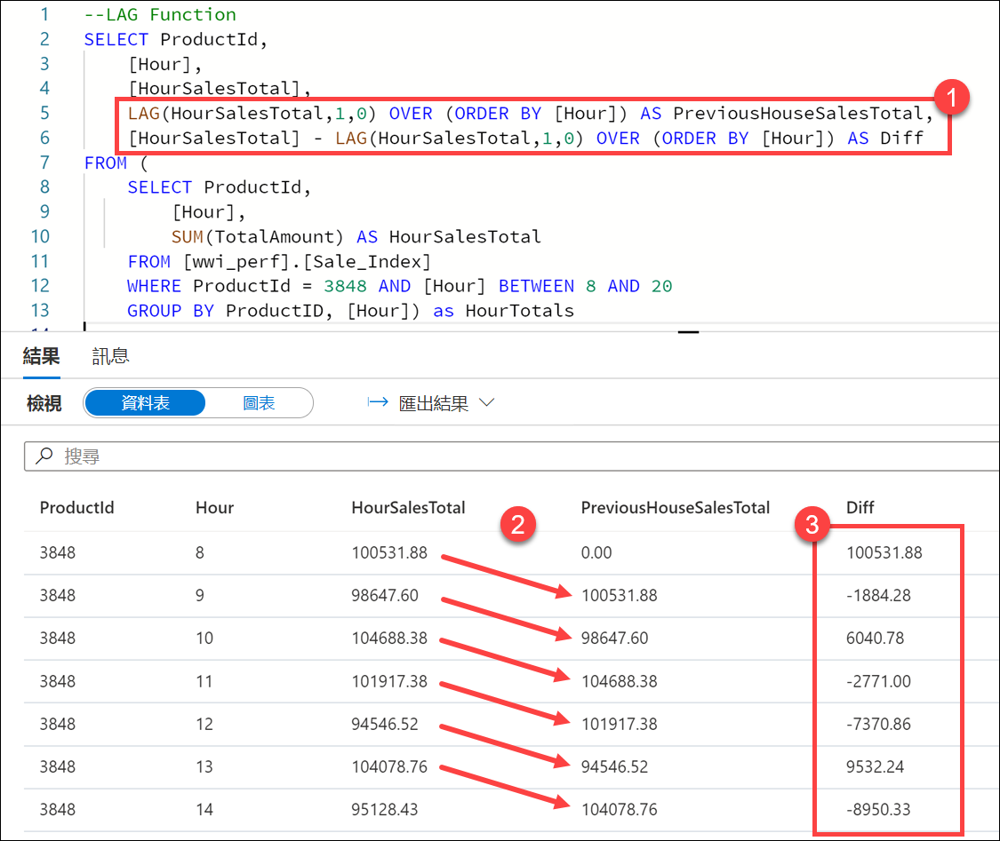

    在本查询中，我们使用 **LAG 函数 (1)** 返回特定产品在旺销时段 (8-20) **的销售额差异 (2)**。我们还计算了一行与另一行的销售额差异 **(3)**。请注意，因为第一行没有提供滞后值，所以将返回默认值零 (0)。

#### 任务 2.4：ROWS 子句

使用 ROWS 和 RANGE 子句，可通过在分区中指定起点和终点进一步限制分区中的行。这是通过按照逻辑关联或物理关联对当前行指定某一范围的行实现的。物理关联通过使用 ROWS 子句实现。

Tailwind Traders 希望按国家/地区分类找到下载量最低的书籍，同时按升序显示每个国家/地区中每本书的总下载次数。

为此，可以结合使用 ROWS 和 UNBOUNDED PRECEDING 来限制 `Country` 分区中的行，并指定窗口先显示分区的第一行。

1. 在查询窗口中，将脚本替换为以下内容，以添加聚合函数：

    ```sql
    -- ROWS UNBOUNDED PRECEDING
    SELECT DISTINCT bc.Country, b.Title AS Book, bc.Downloads
        ,FIRST_VALUE(b.Title) OVER (PARTITION BY Country  
            ORDER BY Downloads ASC ROWS UNBOUNDED PRECEDING) AS FewestDownloads
    FROM dbo.BookConsumption AS bc
    INNER JOIN dbo.Books AS b
        ON b.ID = bc.BookID
    ORDER BY Country, Downloads
    ```

2. 在工具栏菜单中选择 **“运行”** 以执行 SQL 命令。

    

    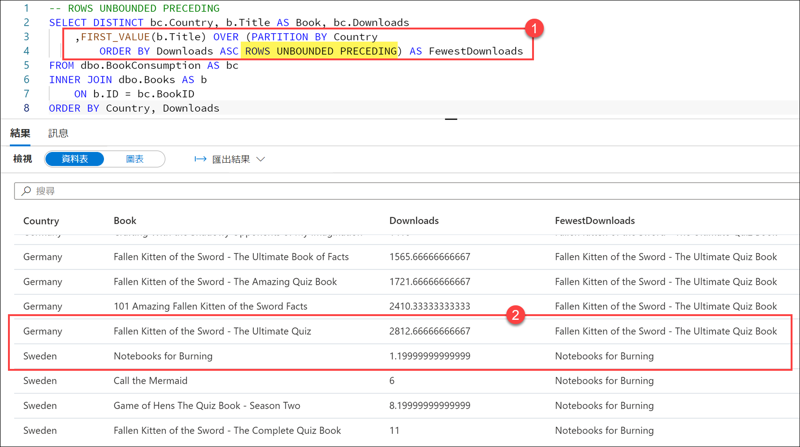

    在本查询中，我们使用 `FIRST_VALUE` 分析函数来检索下载次数最少的书籍的名称，如针对 `Country` 分区的 **`ROWS UNBOUNDED PRECEDING`** 子句所示 **(1)**。`UNBOUNDED PRECEDING` 选项将窗口设置为先显示分区的第一行，并给出分区内国家/地区下载次数最少的书籍的名称。

    在结果集中，可以滚动查看按国家/地区列出的书籍，并按下载次数的升序排序。这里可以看到德国的 `Fallen Kitten of the Sword - The Ultimate Quiz` 下载量最多，而 `Notebooks for Burning` 在瑞典的下载量最少 **(2)**。

### 任务 3：使用 HyperLogLog 函数进行近似执行

随着 Tailwind Traders 开始处理大型数据集，他们会遇到查询运行缓慢的问题。例如，若要在数据探索的早期阶段获取所有客户的明确计数，就会花费更多时间。如何才能加快查询速度？

你决定使用 HyperLogLog 进行近似执行，通过牺牲一点准确度来加快查询速度。这样的牺牲很适合 Tailwind Trader 目前的情况，因为他们只需要大概了解一下数据。

为了解他们的需求，我们首先对大型 `Sale_Heap` 表执行非重复计数，以查找非重复客户的计数。

1. 在查询窗口中，将脚本替换为以下内容：

    ```sql
    SELECT COUNT(DISTINCT CustomerId) from wwi_poc.Sale
    ```

2. 在工具栏菜单中选择 **“运行”** 以执行 SQL 命令。

    

    该查询的执行时间在 50 到 70 秒之间。这在意料之中，因为非重复计数是最难以优化的查询类型之一。

    结果应为 `1,000,000`。

3. 在查询窗口中，将脚本替换为以下内容，以使用 HyperLogLog 方法：

    ```sql
    SELECT APPROX_COUNT_DISTINCT(CustomerId) from wwi_poc.Sale
    ```

4. 在工具栏菜单中选择 **“运行”** 以执行 SQL 命令。

    

    该查询的执行时间应该更少。结果并不完全相同，例如，可能是 `1,001,619`。

    APPROX_COUNT_DISTINCT 返回一个结果，其真实平均基数的准**确率为 2%**。

    这意味着，如果 COUNT (DISTINCT) 返回 `1,000,000`，HyperLogLog 将返回 `999,736` 到 `1,016,234` 范围内的值。

## 练习 2：在 Azure Synapse Analytics 中使用数据加载最佳做法

### 任务 1：实现工作负载管理

运行混合工作负载会给繁忙的系统带来资源挑战。解决方案架构师会设法分离经典数据仓库活动（例如加载、转换和查询数据），以确保存在足够的资源来满足 SLA。

Azure Synapse 中的专用 SQL 池的工作负载管理包含三个高级概念：工作负载分类、工作负载重要性和工作负载隔离。通过这些功能，可以更好地控制工作负载如何使用系统资源。

工作负载重要性影响请求获取资源访问权限的顺序。在繁忙的系统上，重要性较高的请求具有优先访问资源的权限。重要性还可以确保按顺序访问锁定。

工作负载隔离为工作负载组预留资源。工作负载组中预留的资源专门为该工作负载组保留，以确保执行。与资源类非常类似，工作负载组还可以定义每个请求分配的资源量。工作负载组能够预留或限制一组请求可以消耗的资源量。最后，工作负载组是一种机制，用于将查询超时等规则应用到请求。

### 任务 2：创建工作负载分类器以增加某些查询的重要性

Tailwind Traders 询问你是否可以将 CEO 执行的查询标记为比其他查询更重要，以确保这些查询不会因数据加载过多或队列中存在其他工作负载而运行缓慢。你决定创建工作负载分类器并增加重要性来为 CEO 查询设定优先级。

1. 选择 **“开发”** 中心。

    

2. 在 **“开发”** 菜单中选择 **“+”** 按钮 **(1)**，然后在上下文菜单中选择 **“SQL 脚本”(2)**。

    

3. 在工具栏菜单中，连接到 **“SQLPool01”** 数据库以执行该查询。

    

4. 在查询窗口中，将脚本替换为以下内容，以确认当前没有以 `asa.sql.workload01`（表示组织的 CEO）或 `asa.sql.workload02`（表示处理项目的数据分析师）身份登录的用户正在运行的查询：

    ```sql
    --First, let's confirm that there are no queries currently being run by users logged in workload01 or workload02

    SELECT s.login_name, r.[Status], r.Importance, submit_time, 
    start_time ,s.session_id FROM sys.dm_pdw_exec_sessions s 
    JOIN sys.dm_pdw_exec_requests r ON s.session_id = r.session_id
    WHERE s.login_name IN ('asa.sql.workload01','asa.sql.workload02') and Importance
    is not NULL AND r.[status] in ('Running','Suspended') 
    --and submit_time>dateadd(minute,-2,getdate())
    ORDER BY submit_time ,s.login_name
    ```

5. 在工具栏菜单中选择 **“运行”** 以执行 SQL 命令。

    

    现在我们已经确认了没有正在运行的查询，接下来我们需要在系统中大量运行查询，看看 `asa.sql.workload01` 和 `asa.sql.workload02` 会发生什么。为此，我们将运行 Synapse Pipeline 来触发查询。

6. 选择 **“集成”** 中心。

    

7. 选择 **“实验室 08 - 执行数据分析师和 CEO 的查询”** 管道 **(1)**，这将运行/触发 `asa.sql.workload01` 和 `asa.sql.workload02` 查询。依次选择 **“添加触发器”(2)**、 **“立即触发”(3)**。在出现的对话框中选择 **“确定”**。

    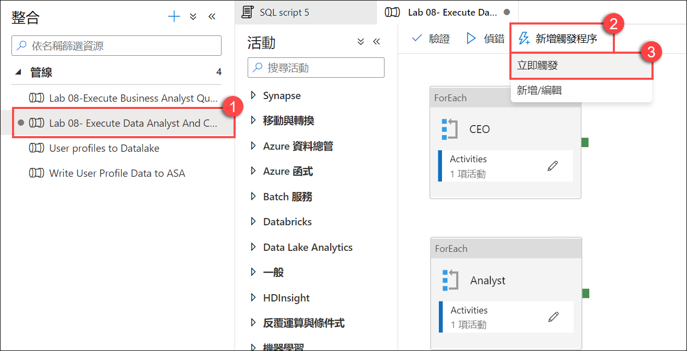

    > **备注**： 将该选项卡保持打开状态，因为将再次回到该管道。

8. 让我们看看，刚刚触发的所有查询在系统中发生了怎样的情况。在查询窗口中，将脚本替换为以下内容：

    ```sql
    SELECT s.login_name, r.[Status], r.Importance, submit_time, start_time ,s.session_id FROM sys.dm_pdw_exec_sessions s 
    JOIN sys.dm_pdw_exec_requests r ON s.session_id = r.session_id
    WHERE s.login_name IN ('asa.sql.workload01','asa.sql.workload02') and Importance
    is not NULL AND r.[status] in ('Running','Suspended') and submit_time>dateadd(minute,-2,getdate())
    ORDER BY submit_time ,status
    ```

9. 在工具栏菜单中选择 **“运行”** 以执行 SQL 命令。

    

    应会看到类似下面的输出：

    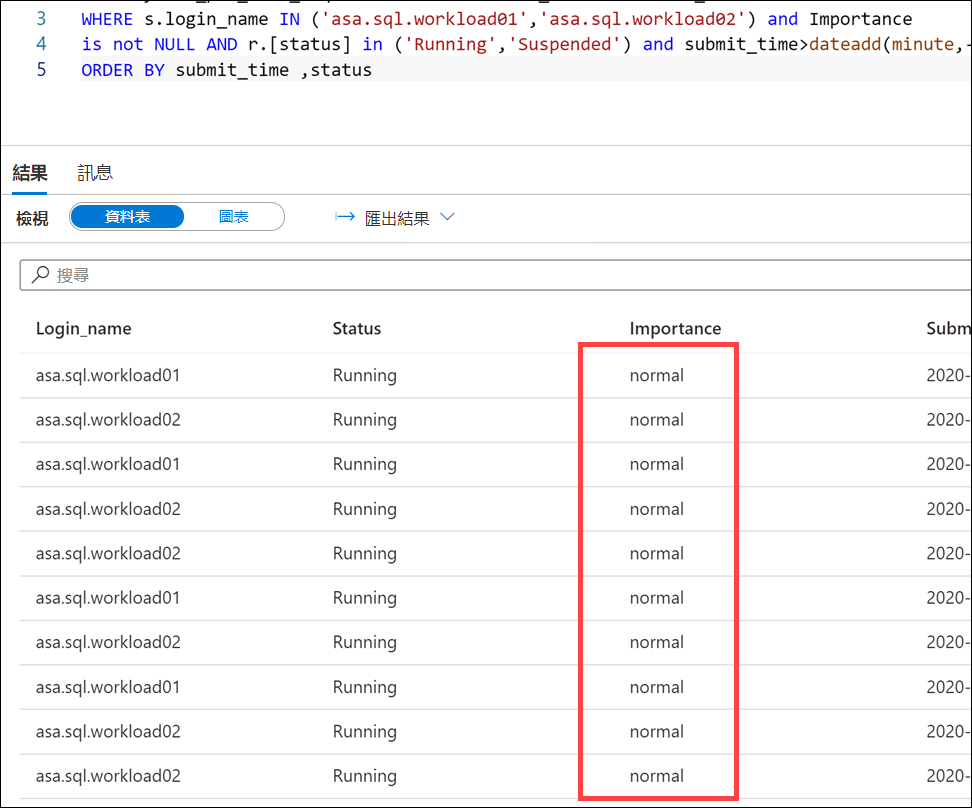

    > **备注**： 执行此查询可能耗时超过 1 分钟。如果耗时超过该时长，请取消查询并再次运行。

    请注意，所有查询的 **“重要性”** 级别均设为 **“常规”**。

10. 我们将通过实现**工作负载重要性**功能来设定 `asa.sql.workload01` 用户查询优先级。在查询窗口中，将脚本替换为以下内容：

    ```sql
    IF EXISTS (SELECT * FROM sys.workload_management_workload_classifiers WHERE name = 'CEO')
    BEGIN
        DROP WORKLOAD CLASSIFIER CEO;
    END
    CREATE WORKLOAD CLASSIFIER CEO
      WITH (WORKLOAD_GROUP = 'largerc'
      ,MEMBERNAME = 'asa.sql.workload01',IMPORTANCE = High);
    ```

    我们将要执行此脚本来新建名为 `CEO` 的**工作负载分类器**，该分类器使用 `largerc` 工作负载组并将查询的**重要性**级别设置为 **“高”**。

11. 在工具栏菜单中选择 **“运行”** 以执行 SQL 命令。

    

12. 我们再次在系统中大量运行查询，看看这次 `asa.sql.workload01` 和 `asa.sql.workload02` 查询会发生什么。为此，我们将运行 Synapse Pipeline 来触发查询。选择 `Integrate` 选项卡，**运行** **“实验室 08 - 执行数据分析师和 CEO 的查询”** 管道，这将运行/触发 `asa.sql.workload01` 和 `asa.sql.workload02` 查询。

13. 在查询窗口中，将脚本替换为以下内容，看看这次 `asa.sql.workload01` 查询会发生什么：

    ```sql
    SELECT s.login_name, r.[Status], r.Importance, submit_time, start_time ,s.session_id FROM sys.dm_pdw_exec_sessions s 
    JOIN sys.dm_pdw_exec_requests r ON s.session_id = r.session_id
    WHERE s.login_name IN ('asa.sql.workload01','asa.sql.workload02') and Importance
    is not NULL AND r.[status] in ('Running','Suspended') and submit_time>dateadd(minute,-2,getdate())
    ORDER BY submit_time ,status desc
    ```

14. 在工具栏菜单中选择 **“运行”** 以执行 SQL 命令。

    

    应会看到类似下面的输出：

    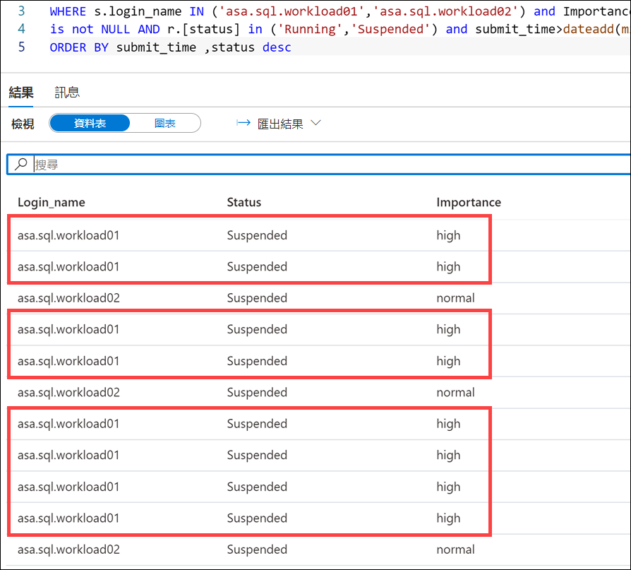

    请注意，`asa.sql.workload01` 用户执行的查询具有 **“高”** 重要性。

15. 选择 **“监视”** 中心。

    

16. 选择 **“管道运行”(1)**，然后为每个标记为 **“正在运行”(3)** 的实验室 08 管道选择 **“取消递归”(2)**。这将有助于加快其余任务的运行速度。

    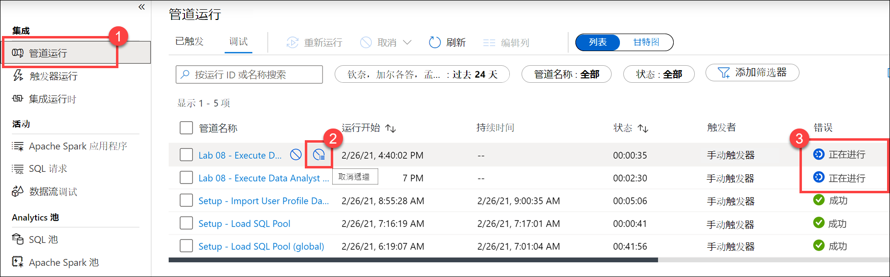

    > **请注意**： 即使这些管道活动中的任何一个失败，都没关系。其中的活动有 2 分钟的超时时间，因此不会中断本实验室期间运行的查询。

### 任务 3：通过工作负载隔离为特定工作负载预留资源

工作负载隔离意味着专门为工作负载组预留资源。工作负载组是一组请求的容器，是在系统上配置工作负载管理（包括工作负载隔离）的基础。一个简单的工作负载管理配置可以管理数据负载和用户查询。

如果没有工作负载隔离，请求在资源的共享池中操作。对共享池中资源的访问权限不能得到保证，按重要性分配。

考虑到 Tailwind Traders 的工作负载要求，你决定新建名为 `CEODemo` 的工作负载组，为 CEO 所执行查询预留资源。

首先，使用不同的参数进行试验。

1. 在查询窗口中，将脚本替换为以下内容：

    ```sql
    IF NOT EXISTS (SELECT * FROM sys.workload_management_workload_groups where name = 'CEODemo')
    BEGIN
        Create WORKLOAD GROUP CEODemo WITH  
        ( MIN_PERCENTAGE_RESOURCE = 50        -- integer value
        ,REQUEST_MIN_RESOURCE_GRANT_PERCENT = 25 --  
        ,CAP_PERCENTAGE_RESOURCE = 100
        )
    END
    ```

    该脚本创建名为 `CEODemo` 的工作负载组，以专为工作负载组预留资源。在本例中，将 `MIN_PERCENTAGE_RESOURCE` 设置为 50%，将 `REQUEST_MIN_RESOURCE_GRANT_PERCENT` 设置为 25% 的工作负载组可以保证 2 个并发。

    > **备注**： 执行此查询最多可能耗时 1 分钟。如果耗时超过该时长，请取消查询并再次运行。

2. 在工具栏菜单中选择 **“运行”** 以执行 SQL 命令。

    

3. 在查询窗口中，将脚本替换为以下内容，以创建名为 `CEODreamDemo` 的工作负载分类器，用于为传入请求分配工作负载组和重要性：

    ```sql
    IF NOT EXISTS (SELECT * FROM sys.workload_management_workload_classifiers where  name = 'CEODreamDemo')
    BEGIN
        Create Workload Classifier CEODreamDemo with
        ( Workload_Group ='CEODemo',MemberName='asa.sql.workload02',IMPORTANCE = BELOW_NORMAL);
    END
    ```

    此脚本通过新建的 `CEODreamDemo` 工作负载分类器为 `asa.sql.workload02` 用户将重要性设置为 **BELOW_NORMAL**。

4. 在工具栏菜单中选择 **“运行”** 以执行 SQL 命令。

    

5. 在查询窗口中，将脚本替换为以下内容，以确认 `asa.sql.workload02` 没有正在运行的活动查询（允许挂起的查询）：

    ```sql
    SELECT s.login_name, r.[Status], r.Importance, submit_time,
    start_time ,s.session_id FROM sys.dm_pdw_exec_sessions s
    JOIN sys.dm_pdw_exec_requests r ON s.session_id = r.session_id
    WHERE s.login_name IN ('asa.sql.workload02') and Importance
    is not NULL AND r.[status] in ('Running','Suspended')
    ORDER BY submit_time, status
    ```

    > **备注：** 如果仍有活动查询，请等待一两分钟。活动查询被配置为在两分钟后超时，因为取消管道并不总是取消查询。

6. 在工具栏菜单中选择 **“运行”** 以执行 SQL 命令。

    

7. 选择 **“集成”** 中心。

    

8. 选择 **“实验室 08 - 执行业务分析师的查询”** 管道 **(1)**，这将运行/触发 `asa.sql.workload02` 查询。依次选择 **“添加触发器”(2)**、 **“立即触发”(3)**。在出现的对话框中选择 **“确定”**。

    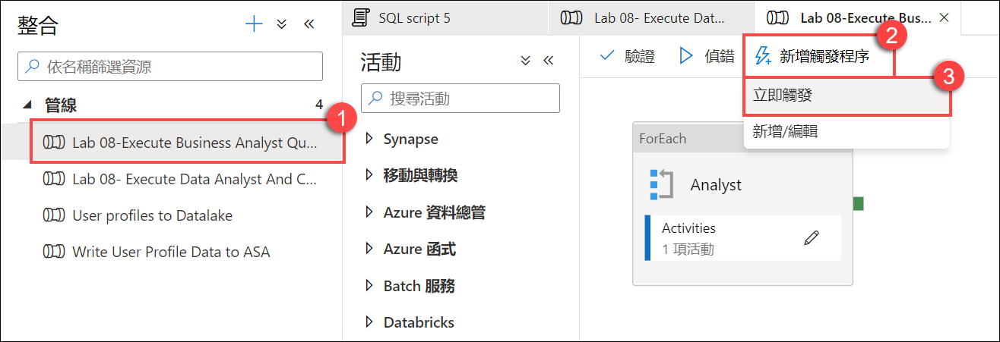

    > **备注**： 将该选项卡保持打开状态，因为将再次回到该管道。

9. 在查询窗口中，将脚本替换为以下内容，看看刚刚触发的所有 `asa.sql.workload02` 查询在系统中大量运行时会发生什么：

    ```sql
    SELECT s.login_name, r.[Status], r.Importance, submit_time,
    start_time ,s.session_id FROM sys.dm_pdw_exec_sessions s
    JOIN sys.dm_pdw_exec_requests r ON s.session_id = r.session_id
    WHERE s.login_name IN ('asa.sql.workload02') and Importance
    is not NULL AND r.[status] in ('Running','Suspended')
    ORDER BY submit_time, status
    ```

10. 在工具栏菜单中选择 **“运行”** 以执行 SQL 命令。

    

    你应会看到如下输出，其中显示每个会话的重要性设为 `below_normal`：

    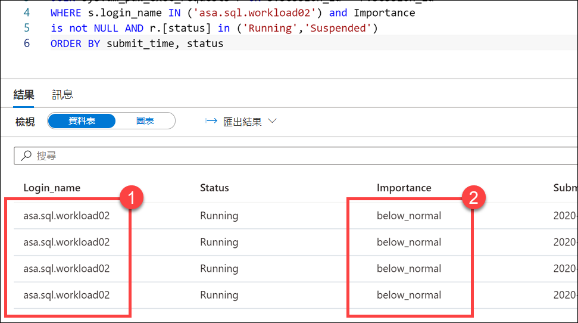

    请注意，正在运行的脚本由 `asa.sql.workload02` 用户 **(1)** 执行，且重要性级别为 **“below_normal”(2)**。我们已将业务分析师查询的重要性级别成功配置为比 CEO 查询低。我们还可以看到 `CEODreamDemo` 工作负载分类器按预期正常运行。

11. 选择 **“监视”** 中心。

    

12. 选择 **“管道运行”(1)**，然后为每个标记为 **“正在运行”(3)** 的实验室 08 管道选择 **“取消递归”(2)**。这将有助于加快其余任务的运行速度。

    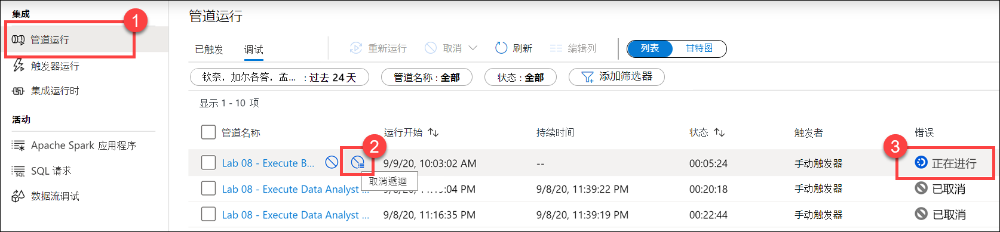

13. 返回至 **“开发”** 中心下的查询窗口。在查询窗口中，将脚本替换为以下内容，以便为每个请求设置 3.25% 的最低资源：

    ```sql
    IF  EXISTS (SELECT * FROM sys.workload_management_workload_classifiers where group_name = 'CEODemo')
    BEGIN
        Drop Workload Classifier CEODreamDemo
        DROP WORKLOAD GROUP CEODemo
    END
    --- Creates a workload group 'CEODemo'.
    Create  WORKLOAD GROUP CEODemo WITH  
    (
        MIN_PERCENTAGE_RESOURCE = 26 -- integer value
        ,REQUEST_MIN_RESOURCE_GRANT_PERCENT = 3.25 -- factor of 26 (guaranteed more than 4 concurrencies)
        ,CAP_PERCENTAGE_RESOURCE = 100
    )
    --- Creates a workload Classifier 'CEODreamDemo'.
    Create Workload Classifier CEODreamDemo with
    (Workload_Group ='CEODemo',MemberName='asa.sql.workload02',IMPORTANCE = BELOW_NORMAL);
    ```

    > **备注**： 如果该查询的运行时间超过 45 秒，请将其取消，然后再次运行。

    > **备注**： 配置工作负载限制隐式定义了最大的并发级别。将 CAP_PERCENTAGE_RESOURCE 设置为 60%，并将 REQUEST_MIN_RESOURCE_GRANT_PERCENT 设置为 1%，工作负载组最多允许 60 个并发级别。请考虑下面包含的方法来确定最大并发：
    > 
    > [Max Concurrency] = [CAP_PERCENTAGE_RESOURCE] / [REQUEST_MIN_RESOURCE_GRANT_PERCENT]

14. 在工具栏菜单中选择 **“运行”** 以执行 SQL 命令。

    

## 练习 3：优化 Azure Synapse Analytics 中的数据仓库查询性能

### 任务 1：识别与表相关的性能问题

1. 选择 **“开发”** 中心。

    

2. 在 **“开发”** 菜单中选择 **“+”** 按钮 **(1)**，然后在上下文菜单中选择 **“SQL 脚本”(2)**。

    

3. 在工具栏菜单中，连接到 **“SQLPool01”** 数据库以执行该查询。

    

4. 在查询窗口中，将脚本替换为以下内容，以计算堆表中的记录数：

    ```sql
    SELECT  
        COUNT_BIG(*)
    FROM
        [wwi_poc].[Sale]
    ```

5. 在工具栏菜单中选择 **“运行”** 以执行 SQL 命令。

    

    该脚本最多需要 **15 秒**来执行并返回表中的记录计数，约为 9.82 亿行。

    > 如果脚本在 45 秒后仍在运行，请单击“取消”。

    > **备注**： *请勿*提前执行此查询。如果这样做，后续执行过程中查询的运行速度可能会更快。

    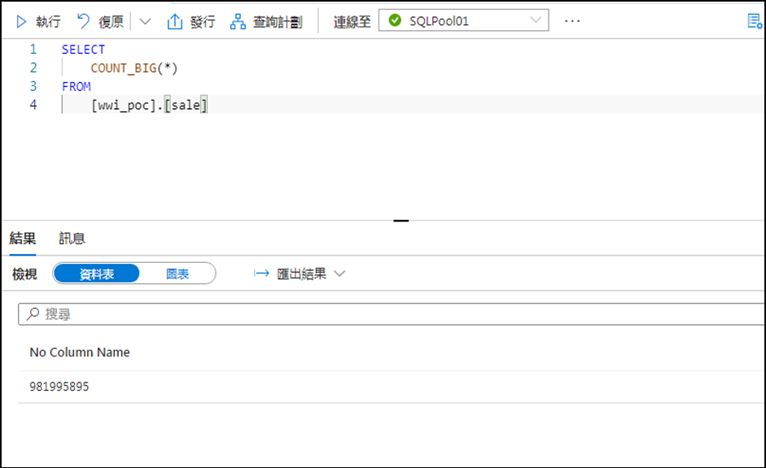

6. 在查询窗口中，将脚本替换为以下更复杂的语句：

    ```sql
    SELECT TOP 1000 * FROM
    (
        SELECT
            S.CustomerId
            ,SUM(S.TotalAmount) as TotalAmount
        FROM
            [wwi_poc].[Sale] S
        GROUP BY
            S.CustomerId
    ) T
    OPTION (LABEL = 'Lab: Heap')
    ```

7. 在工具栏菜单中选择 **“运行”** 以执行 SQL 命令。

    
  
    该脚本最多需要 **60 秒**来执行并返回结果。显然，`Sale_Heap` 表存在问题，导致性能下降。

    > 如果脚本在 90 秒后仍在运行，请单击“取消”。

    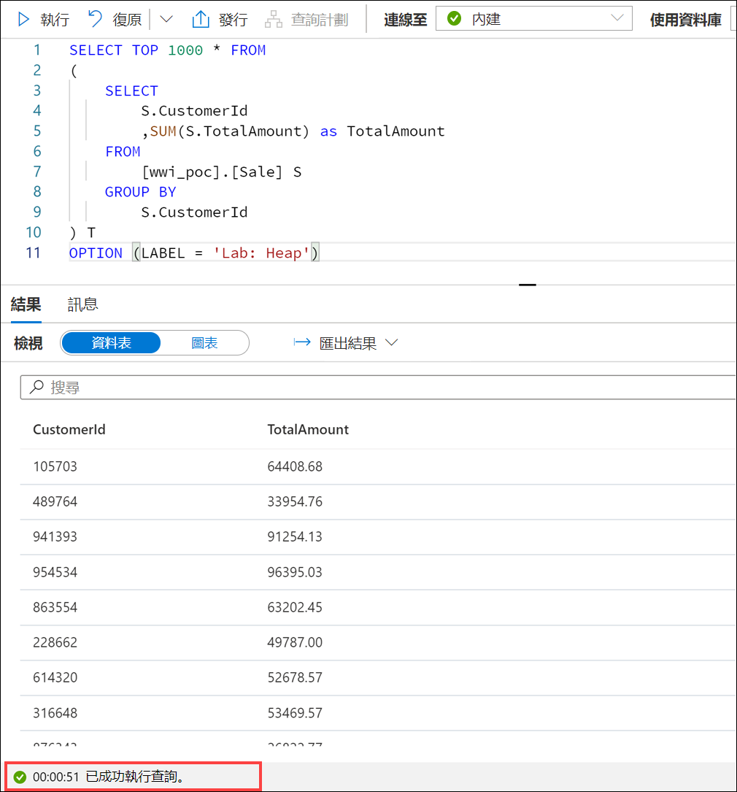

    > 请注意语句中使用的 OPTION 子句。当你想在 [sys.dm_pdw_exec_requests](https://docs.microsoft.com/sql/relational-databases/system-dynamic-management-views/sys-dm-pdw-exec-requests-transact-sql) DMV 中识别自己的查询时，这很好用。
    >
    >```sql
    >SELECT  *
    >FROM    sys.dm_pdw_exec_requests
    >WHERE   [label] = 'Lab: Heap';
    >```

8. 选择 **“数据”** 中心。

    

9. 展开 **“SQLPool01”** 数据库及其表列表。右键单击 **`wwi_poc.Sale` (1)**，选择 **“新建 SQL 脚本”(2)**，然后选择 **“CREATE”(3)**。

    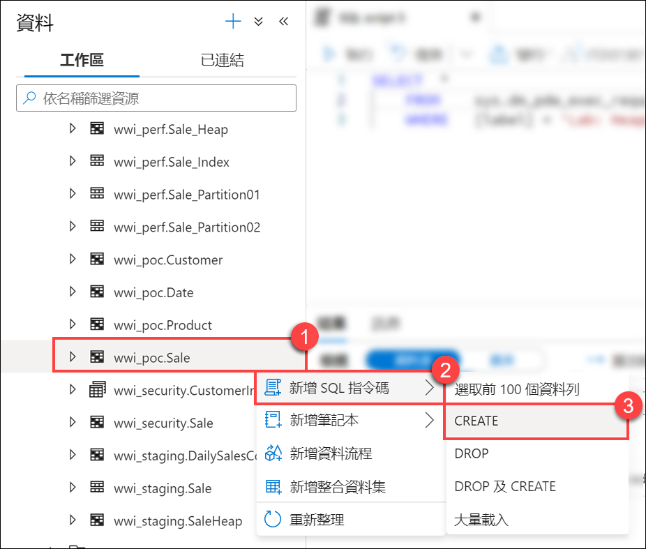

10. 查看用于创建表的脚本：

    ```sql
    CREATE TABLE [wwi_poc].[Sale]
    ( 
        [TransactionId] [uniqueidentifier]  NOT NULL,
        [CustomerId] [int]  NOT NULL,
        [ProductId] [smallint]  NOT NULL,
        [Quantity] [tinyint]  NOT NULL,
        [Price] [decimal](9,2)  NOT NULL,
        [TotalAmount] [decimal](9,2)  NOT NULL,
        [TransactionDateId] [int]  NOT NULL,
        [ProfitAmount] [decimal](9,2)  NOT NULL,
        [Hour] [tinyint]  NOT NULL,
        [Minute] [tinyint]  NOT NULL,
        [StoreId] [smallint]  NOT NULL
    )
    WITH
    (
        DISTRIBUTION = ROUND_ROBIN,
        HEAP
    )
    ```

    > **备注**： 请勿运行此脚*本*！该脚本仅用于展示该架构。

    你可以立即找出至少两个性能下降的原因：

    - `ROUND_ROBIN` 分布
    - 表的 `HEAP` 结构

    > **备注**
    >
    > 在这种情况下，如果我们寻求的是较短的查询响应时间，那么很快就能发现堆结构并不是一个好选择。但在某些情况下，使用堆表是不会对性能产生负面影响的，反而有助于提高性能。例如，我们想要将大量数据引入与专用 SQL 池关联的 SQL 数据库。

    如果我们详细审查查询计划，就能清楚地了解性能问题的根本原因：分布间数据移动。

11. 运行在第 2 步中运行的脚本，但这次在该脚本之前添加 `EXPLAIN WITH_RECOMMENDATIONS` 行：

    ```sql
    EXPLAIN WITH_RECOMMENDATIONS
    SELECT TOP 1000 * FROM
    (
        SELECT
            S.CustomerId
            ,SUM(S.TotalAmount) as TotalAmount
        FROM
            [wwi_poc].[Sale] S
        GROUP BY
            S.CustomerId
    ) T
    ```

    `EXPLAIN WITH_RECOMMENDATIONS` 子句返回 Azure Synapse Analytics SQL 语句的查询计划，且无需运行该语句。使用 EXPLAIN 预览需要数据移动的操作和查看查询操作的预计成本。默认情况下，你将获得 XML 格式的执行计划，该计划可导出为 CSV 或 JSON 等其他格式。**请勿**在工具栏中选择`Query Plan`，因为它将尝试下载查询计划并在 SQL Server Management Studio 中打开。

    查询应返回如下所示的内容：

    ```xml
    <data><row><explain><?xml version="1.0" encoding="utf-8"?>
    <dsql_query number_nodes="4" number_distributions="60" number_distributions_per_node="15">
    <sql>SELECT TOP 1000 * FROM
    (
        SELECT
            S.CustomerId
            ,SUM(S.TotalAmount) as TotalAmount
        FROM
            [wwi_poc].[Sale] S
        GROUP BY
            S.CustomerId
    ) T</sql>
    <materialized_view_candidates>
        <materialized_view_candidates with_constants="False">CREATE MATERIALIZED VIEW View1 WITH (DISTRIBUTION = HASH([Expr0])) AS
    SELECT [S].[CustomerId] AS [Expr0],
        SUM([S].[TotalAmount]) AS [Expr1]
    FROM [wwi_poc].[Sale] [S]
    GROUP BY [S].[CustomerId]</materialized_view_candidates>
    </materialized_view_candidates>
    <dsql_operations total_cost="4.0656044" total_number_operations="5">
        <dsql_operation operation_type="RND_ID">
        <identifier>TEMP_ID_56</identifier>
        </dsql_operation>
        <dsql_operation operation_type="ON">
        <location permanent="false" distribution="AllDistributions" />
        <sql_operations>
            <sql_operation type="statement">CREATE TABLE [qtabledb].[dbo].[TEMP_ID_56] ([CustomerId] INT NOT NULL, [col] DECIMAL(38, 2) NOT NULL ) WITH(DISTRIBUTED_MOVE_FILE='');</sql_operation>
        </sql_operations>
        </dsql_operation>
        <dsql_operation operation_type="SHUFFLE_MOVE">
        <operation_cost cost="4.0656044" accumulative_cost="4.0656044" average_rowsize="13" output_rows="78184.7" GroupNumber="11" />
        <source_statement>SELECT [T1_1].[CustomerId] AS [CustomerId], [T1_1].[col] AS [col] FROM (SELECT SUM([T2_1].[TotalAmount]) AS [col], [T2_1].[CustomerId] AS [CustomerId] FROM [SQLPool01].[wwi_poc].[Sale] AS T2_1 GROUP BY [T2_1].[CustomerId]) AS T1_1
    OPTION (MAXDOP 4, MIN_GRANT_PERCENT = [MIN_GRANT], DISTRIBUTED_MOVE(N''))</source_statement>
        <destination_table>[TEMP_ID_56]</destination_table>
        <shuffle_columns>CustomerId;</shuffle_columns>
        </dsql_operation>
        <dsql_operation operation_type="RETURN">
        <location distribution="AllDistributions" />
        <select>SELECT [T1_1].[CustomerId] AS [CustomerId], [T1_1].[col] AS [col] FROM (SELECT TOP (CAST ((1000) AS BIGINT)) SUM([T2_1].[col]) AS [col], [T2_1].[CustomerId] AS [CustomerId] FROM [qtabledb].[dbo].[TEMP_ID_56] AS T2_1 GROUP BY [T2_1].[CustomerId]) AS T1_1
    OPTION (MAXDOP 4, MIN_GRANT_PERCENT = [MIN_GRANT])</select>
        </dsql_operation>
        <dsql_operation operation_type="ON">
        <location permanent="false" distribution="AllDistributions" />
        <sql_operations>
            <sql_operation type="statement">DROP TABLE [qtabledb].[dbo].[TEMP_ID_56]</sql_operation>
        </sql_operations>
        </dsql_operation>
    </dsql_operations>
    </dsql_query></explain></row></data>
    ```

    请注意 MPP 系统内部布局的详细信息：

    `<dsql_query number_nodes="4" number_distributions="60" number_distributions_per_node="15">`

    此布局由当前的日期仓库单位 (DWU) 设置指定。在上述示例的设置中，我们在 `Dw2000c` 上运行，这意味着 4 个物理节点为 60 个分布提供服务，即每个物理节点 15 个分布。根据你自己的 DWU 设置，这些数字会有所不同。

    查询计划表示需要移动数据。这由 `SHUFFLE_MOVE` 分布式 SQL 操作表示。

    数据移动是指在执行查询期间，分布式表的各个部分移动到不同节点的操作。如果数据在目标节点上不可用（最常见的是表不共享分布键的情况），则必须执行数据移动。最常见的数据移动操作是无序的。在无序移动过程中，对于每个输入行，Synapse 都使用联接列计算哈希值，然后将该行发送到该哈希值所属的节点。联接的一端或两端都可以参与无序移动。下图展示的是在表 T1 和 T2 之间实现联接的无序移动，这两个表都没有分布在联接列 col2 上。

    

    接下来我们来深入探讨查询计划提供的详细信息，以了解当前方法中存在的一些问题。下表包含对查询计划中提到的每个操作的描述：

    操作 | 操作类型 | 描述
    ---|---|---
    1 | RND_ID | 标识将要创建的对象。在本例中为 `TEMP_ID_76` 内部表。
    2 | ON | 指定操作将发生的位置（节点或分布）。`AllDistributions` 表示将在 SQL 池的 60 个分布中的每一个分布上执行操作。操作将是 SQL 操作（通过 `<sql_operations>` 指定），该操作将创建 `TEMP_ID_76` 表。
    3 | SHUFFLE_MOVE | 无序移动列的列表仅包含 `CustomerId` 列（通过 `<shuffle_columns>` 指定）。值将分发到拥有哈希的分布，并本地保存到 `TEMP_ID_76` 表。操作将输出预估行数 41265.25 行（通过 `<operation_cost>` 指定）。根据上述章节，平均结果行大小为 13 字节。
    4 | RETURN | 将通过查询内部临时表 `TEMP_ID_76` 从所有分布（请参阅 `<location>`）中收集无序移动操作生成的数据。
    5 | ON | 将从所有分布中删除 `TEMP_ID_76`。

    显然，性能问题的根本原因如下：分布间的数据移动。这实际上是一个最简单的示例，展示的是需要进行无序移动的少量数据。可以想象，当经过无序移动后的行变大时，情况会变得多糟糕。

    你可以在[此处](https://docs.microsoft.com/zh-cn/sql/t-sql/queries/explain-transact-sql?view=azure-sqldw-latest)详细了解 EXPLAIN 语句生成的查询计划的结构。

12. 除 `EXPLAIN` 语句外，你还可以使用 `sys.dm_pdw_request_steps` DMV 了解计划的详细信息。

    查询 `sys.dm_pdw_exec_requests` DMW，以查找查询 ID（这适用于先前在第 6 步中执行的查询）：

    ```sql
    SELECT  
        *
    FROM    
        sys.dm_pdw_exec_requests
    WHERE   
        [label] = 'Lab: Heap'
    ```

    此外，结果包含查询 ID (`Request_id`)、标签和原始 SQL 语句：

    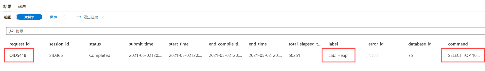

13. 使用查询 ID（在本例中为 `QID5418`，**替换为你的 ID**），即可立即研究查询的各个步骤：

    ```sql
    SELECT
       *
    FROM
        sys.dm_pdw_request_steps
    WHERE
        request_id = 'QID5418'
    ORDER BY
       step_index
    ```

    这些步骤（索引为 0 到 4）匹配查询计划中的操作 2 到 6。同样，问题也显而易见：索引为 2 的步骤描述分区间的数据移动操作。通过查看 `TOTAL_ELAPSED_TIME` 列可以清楚地发现本步骤占据了绝大部分查询时间。**记下步骤索引**，以供后续查询使用。

    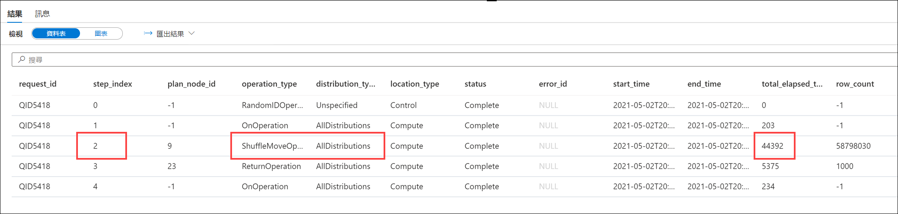

14. 使用以下 SQL 语句获取有关问题步骤的更多详细信息（将 `request_id` 和 `step_index` 替换为你的值）：

    ```sql
    SELECT
    *
    FROM
        sys.dm_pdw_sql_requests
    WHERE
        request_id = 'QID5418'
        AND step_index = 2
    ```

    该语句的结果提供了有关 SQL 池中每个分布上发生的情况的详细信息。

    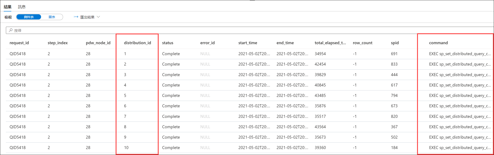

15. 最后，你可以使用以下 SQL 语句来研究分布式数据库上的数据移动（将 `request_id` 和 `step_index` 替换为你的值）：

    ```sql
    SELECT
        *
    FROM
        sys.dm_pdw_dms_workers
    WHERE
        request_id = 'QID5418'
        AND step_index = 2
    ORDER BY
        distribution_id
    ```

    该语句的结果提供了有关在每个分布中移动的数据的详细信息。`ROWS_PROCESSED` 列在此处特别有用，可用于预估执行查询时的数据移动量。

    

### 任务 2：使用哈希分布和列存储索引优化表结构

1. 选择 **“开发”** 中心。

    

2. 在 **“开发”** 菜单中选择 **“+”** 按钮 **(1)**，然后在上下文菜单中选择 **“SQL 脚本”(2)**。

    

3. 在工具栏菜单中，连接到 **“SQLPool01”** 数据库以执行该查询。

    

4. 在查询窗口中，将脚本替换为以下内容，以使用 CTAS (Create Table As Select) 创建表的优化版本：

     ```sql
    CREATE TABLE [wwi_perf].[Sale_Hash]
    WITH
    (
        DISTRIBUTION = HASH ( [CustomerId] ),
        CLUSTERED COLUMNSTORE INDEX
    )
    AS
    SELECT
        *
    FROM
        [wwi_poc].[Sale]
    ```

5. 在工具栏菜单中选择 **“运行”** 以执行 SQL 命令。

    

    查询将需要大约 **10 分钟**才能完成。在此过程中，请阅读其余的实验室说明，以熟悉内容。

    > **备注**
    >
    > CTAS 是可自定义程度更高的 SELECT...INTO 语句版本。
    > SELECT...INTO 不允许在操作过程中更改分布方法或索引类型。使用默认分布类型 ROUND_ROBIN 以及默认表结构 CLUSTERED COLUMNSTORE INDEX 创建新表。
    >
    > 但使用 CTAS 可以指定表数据的分布以及表结构类型。

6. 在查询窗口中，将脚本替换为以下内容，并查看性能的改善情况：

    ```sql
    SELECT TOP 1000 * FROM
    (
        SELECT
            S.CustomerId
            ,SUM(S.TotalAmount) as TotalAmount
        FROM
            [wwi_perf].[Sale_Hash] S
        GROUP BY
            S.CustomerId
    ) T
    ```

7. 在工具栏菜单中选择 **“运行”** 以执行 SQL 命令。

    

    与我们第一次对堆表运行脚本相比，针对新的哈希表的执行改善了性能。在本例中，查询执行时间大约为 8 秒。

    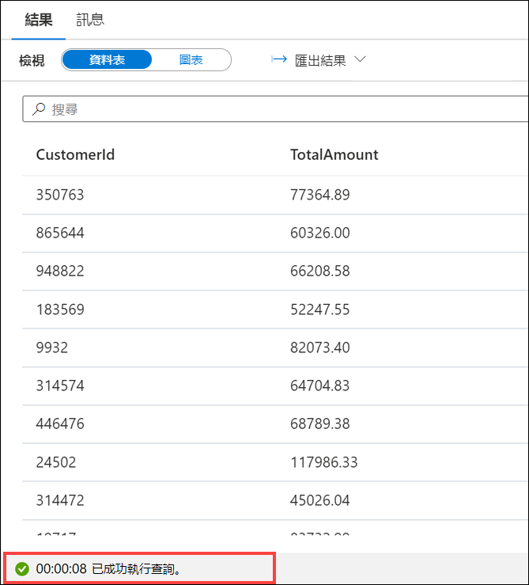

8. 再次运行以下 EXPLAIN 语句，以获取查询计划（请勿在工具栏中选择`Query Plan`，因为它将尝试下载查询计划并在 SQL Server Management Studio 中打开）：

    ```sql
    EXPLAIN
    SELECT TOP 1000 * FROM
    (
        SELECT
            S.CustomerId
            ,SUM(S.TotalAmount) as TotalAmount
        FROM
            [wwi_perf].[Sale_Hash] S
        GROUP BY
            S.CustomerId
    ) T
    ```

    生成的查询计划明显比上一个好得多，因为不再涉及分布间的数据移动。

    ```xml
    <data><row><explain><?xml version="1.0" encoding="utf-8"?>
    <dsql_query number_nodes="5" number_distributions="60" number_distributions_per_node="12">
    <sql>SELECT TOP 1000 * FROM
    (
        SELECT
            S.CustomerId
            ,SUM(S.TotalAmount) as TotalAmount
        FROM
            [wwi_perf].[Sale_Hash] S
        GROUP BY
            S.CustomerId
    ) T</sql>
    <dsql_operations total_cost="0" total_number_operations="1">
        <dsql_operation operation_type="RETURN">
        <location distribution="AllDistributions" />
        <select>SELECT [T1_1].[CustomerId] AS [CustomerId], [T1_1].[col] AS [col] FROM (SELECT TOP (CAST ((1000) AS BIGINT)) SUM([T2_1].[TotalAmount]) AS [col], [T2_1].[CustomerId] AS [CustomerId] FROM [SQLPool01].[wwi_perf].[Sale_Hash] AS T2_1 GROUP BY [T2_1].[CustomerId]) AS T1_1
    OPTION (MAXDOP 4)</select>
        </dsql_operation>
    </dsql_operations>
    </dsql_query></explain></row></data>
    ```

9. 尝试运行更复杂的查询并研究执行计划和执行步骤。以下是你可以使用的更复杂的查询示例：

    ```sql
    SELECT
        AVG(TotalProfit) as AvgMonthlyCustomerProfit
    FROM
    (
        SELECT
            S.CustomerId
            ,D.Year
            ,D.Month
            ,SUM(S.TotalAmount) as TotalAmount
            ,AVG(S.TotalAmount) as AvgAmount
            ,SUM(S.ProfitAmount) as TotalProfit
            ,AVG(S.ProfitAmount) as AvgProfit
        FROM
            [wwi_perf].[Sale_Partition01] S
            join [wwi].[Date] D on
                D.DateId = S.TransactionDateId
        GROUP BY
            S.CustomerId
            ,D.Year
            ,D.Month
    ) T
    ```

### 任务 4：使用分区进一步优化表结构

表分区可将数据分成更小的数据组。分区可能有利于数据维护和查询性能。分区是对二者都有利还是只对其中之一有利取决于数据加载方式，以及是否可以将同一个列用于两种目的，因为只能根据一个列来进行分区。

日期列通常非常适用于在分布级别对表进行分区。对于 Tailwind Trader 的销售数据，似乎非常适合基于 `TransactionDateId` 列进行分区。

专用 SQL 池已包含两个版本的 `Sale` 表，这两个表已使用 `TransactionDateId` 进行了分区。这两个表是 `[wwi_perf].[Sale_Partition01]` 和 `[wwi_perf].[Sale_Partition02]`。以下是用于创建这些表的 CTAS 查询。

1. 在查询窗口中，将脚本替换为以下 CTAS 查询，以创建分区表（**请勿**执行）：

    ```sql
    CREATE TABLE [wwi_perf].[Sale_Partition01]
    WITH
    (
      DISTRIBUTION = HASH ( [CustomerId] ),
      CLUSTERED COLUMNSTORE INDEX,
      PARTITION
      (
        [TransactionDateId] RANGE RIGHT FOR VALUES (
                20190101, 20190201, 20190301, 20190401, 20190501, 20190601, 20190701, 20190801, 20190901, 20191001, 20191101, 20191201)
      )
    )
    AS
    SELECT
      *
    FROM	
      [wwi_perf].[Sale_Heap]
    OPTION  (LABEL  = 'CTAS : Sale_Partition01')

    CREATE TABLE [wwi_perf].[Sale_Partition02]
    WITH
    (
      DISTRIBUTION = HASH ( [CustomerId] ),
      CLUSTERED COLUMNSTORE INDEX,
      PARTITION
      (
        [TransactionDateId] RANGE RIGHT FOR VALUES (
                20190101, 20190401, 20190701, 20191001)
      )
    )
    AS
    SELECT *
    FROM
        [wwi_perf].[Sale_Heap]
    OPTION  (LABEL  = 'CTAS : Sale_Partition02')
    ```

    > **备注**
    >
    > 这些查询已在专用 SQL 池上运行。**请勿**执行脚本。

请注意我们在这里使用的两种分区策略。第一种分区方案基于月份，第二种基于季度 **(3)**。


#### 任务 4.1：表分布

如你所见，两个分区表都是哈希分布 **(1)**。分布式表显示为单个表，但表中的行实际存储在 60 个分布中。这些行使用哈希或轮循机制算法进行分布。

分布类型如下：

- **轮循机制分布**： 在所有分布中随机均匀地分布表行。
- **哈希分布**： 通过使用确定性的哈希函数将每一行分配给一个分布，实现表行的跨计算节点分布。
- **复制**： 完整复制每个计算节点上提供的表。

哈希分布表通过使用确定性的哈希函数将每一行分配给一个分布，实现表行的跨计算节点分布。

由于相同的值始终哈希处理到相同的分布，因此，数据仓库本身就具有行位置方面的信息。

专用 SQL 池利用此信息可最大程度地减少查询期间的数据移动，从而提高查询性能。哈希分布表适用于星型架构中的大型事实数据表。它们可以包含大量行，但仍实现高性能。当然，用户应该了解一些设计注意事项，它们有助于获得分布式系统本应具有的性能。

*在以下情况下，考虑使用哈希分布表：*

- 磁盘上的表大小超过 2 GB。
- 对表进行频繁的插入、更新和删除操作。

#### 任务 4.2：索引

查看查询，并注意两个分区表均配置了**聚集列存储索引 (2)**。以下是可在专用 SQL 池中使用的各种类型的索引：

- **聚集列存储索引（默认主索引）**： 提供最高级别的数据压缩和最佳的全面查询性能。
- **聚集索引（主索引）**： 可高效查找一行或数行。
- **堆（主索引）**： 加载速度更快并且可以加载临时数据。最适合查找小型表。
- **非聚集索引（辅助索引）**： 支持在表中对多列进行排序，并且允许单个表中存在多个非聚集索引。非聚集索引可以在上述任意主索引上创建，并且可以更高效地查找查询。

默认情况下，如果未在表中指定任何索引选项，则专用 SQL 池将创建聚集列存储索引。聚集列存储表提供最高级别的数据压缩，以及最好的总体查询性能。一般而言，聚集列存储表优于聚集索引或堆表，并且通常是大型表的最佳选择。出于这些原因，在不确定如何编制表索引时，聚集列存储是最佳起点。

在某些情况下，聚集列存储可能不是很好的选择：

- 列存储表不支持 `varchar(max)`、`nvarchar(max)` 和 `varbinary(max)`。可以考虑使用堆或聚集索引。
- 对瞬态数据使用列存储表可能会降低效率。可以考虑使用堆，甚至临时表。
- 包含少于 1 亿行的小型表。可以考虑使用堆表。

#### 任务 4.3：分区

我们再次使用此查询以不同方式对两个表进行分区 **(3)**，确保可以评估性能差异并确定哪种分区策略从长期来看最佳。最终采用的策略取决于 Tailwind Trader 数据的各种因素。你可能会决定同时使用两种策略来优化查询性能，但这会导致数据存储以及数据管理的维护需求翻倍。

所有表类型都支持分区。

我们在查询 **(3)** 中使用的 **RANGE RIGHT** 选项用于时间分区。RANGE LEFT 用于数字分区。

分区的主要好处如下：

- 通过将范围限制为数据子集来提高加载和查询的效率和性能。
- 显著提高查询性能，其中针对分区键进行筛选可以消除不必要的扫描和 I/O（输入/输出操作）。

我们使用不同的分区策略创建两个表 **(3)** 的原因是想要使用正确的大小进行实验。

虽然可以使用分区来优化性能，但如果在创建表时使用过多分区，则在某些情况下可能会降低性能。对于我们在这里创建的聚集列存储表，尤其要考虑到这一点。若要使数据分区有益于性能，务必了解使用数据分区的时机，以及要创建的分区的数目。对于多少分区属于分区过多并没有简单的硬性规定，具体取决于数据，以及要同时加载到多少分区。一个成功的分区方案通常只有数十到数百的分区，没有数千个。

*补充信息*：

在聚集列存储表上创建分区时，请务必考虑每个分区可容纳的行数。对于聚集列存储表来说，若要进行最合适的压缩并获得最佳性能，则每个分布和分区至少需要 1 百万行。在创建分区之前，专用 SQL 池已将每个表细分到 60 个分布式数据库中。向表添加的任何分区都是基于在后台创建的分布。根据此示例，如果销售事实表包含 36 个月的分区，并假设专用 SQL 池有 60 个分布，则销售事实表每个月应包含 6000 万行，或者在填充所有月份时包含 21 亿行。如果表包含的行数少于每个分区行数的最小建议值，可考虑使用较少的分区，以增加每个分区的行数。

## 练习 4：提高查询性能

### 任务 1：使用具体化视图

与标准视图相反，具体化视图像表一样在专用 SQL 池中预先计算、存储和维护其数据。以下是标准视图和具体化视图之间的基本比较：

| 比较                     | 视图                                         | 具体化视图
|:-------------------------------|:---------------------------------------------|:-------------------------------------------------------------|
|视图定义                 | 存储在 Synapse Analytics 中。              | 存储在 Synapse Analytics 中。
|视图内容                    | 在每次使用视图时生成。   | 在视图创建期间，预处理并存储在 Synapse Analytics 中。随着数据添加到基础表中而更新。
|数据刷新                    | 始终更新                               | 始终更新
|从复杂查询检索视图数据的速度     | 慢                                         | 快  
|额外存储                   | 否                                           | 是
|语法                          | CREATE VIEW                                  | CREATE MATERIALIZED VIEW AS SELECT

1. 执行以下查询，以获取其大致执行用时：

    ```sql
    SELECT TOP 1000 * FROM
    (
        SELECT
            S.CustomerId
            ,D.Year
            ,D.Quarter
            ,SUM(S.TotalAmount) as TotalAmount
        FROM
            [wwi_perf].[Sale_Partition02] S
            join [wwi].[Date] D on
                S.TransactionDateId = D.DateId
        GROUP BY
            S.CustomerId
            ,D.Year
            ,D.Quarter
    ) T
    ```

2. 再执行以下查询（注意细微差别）：

    ```sql
    SELECT TOP 1000 * FROM
    (
        SELECT
            S.CustomerId
            ,D.Year
            ,D.Month
            ,SUM(S.ProfitAmount) as TotalProfit
        FROM
            [wwi_perf].[Sale_Partition02] S
            join [wwi].[Date] D on
                S.TransactionDateId = D.DateId
        GROUP BY
            S.CustomerId
            ,D.Year
            ,D.Month
    ) T
    ```

3. 创建可支持上述两种查询的具体化视图：

    ```sql
    CREATE MATERIALIZED VIEW
        wwi_perf.mvCustomerSales
    WITH
    (
        DISTRIBUTION = HASH( CustomerId )
    )
    AS
    SELECT
        S.CustomerId
        ,D.Year
        ,D.Quarter
        ,D.Month
        ,SUM(S.TotalAmount) as TotalAmount
        ,SUM(S.ProfitAmount) as TotalProfit
    FROM
        [wwi_perf].[Sale_Partition02] S
        join [wwi].[Date] D on
            S.TransactionDateId = D.DateId
    GROUP BY
        S.CustomerId
        ,D.Year
        ,D.Quarter
        ,D.Month
    ```

4. 运行以下查询，以获取预估的执行计划（请勿在工具栏中选择`Query Plan`，因为它将尝试下载查询计划并在 SQL Server Management Studio 中打开）：

    ```sql
    EXPLAIN
    SELECT TOP 1000 * FROM
    (
        SELECT
            S.CustomerId
            ,D.Year
            ,D.Quarter
            ,SUM(S.TotalAmount) as TotalAmount
        FROM
            [wwi_perf].[Sale_Partition02] S
            join [wwi].[Date] D on
                S.TransactionDateId = D.DateId
        GROUP BY
            S.CustomerId
            ,D.Year
            ,D.Quarter
    ) T
    ```

    生成的执行计划显示了如何使用新创建的具体化视图来优化执行。请注意 `<dsql_operations>` 元素中的 `FROM [SQLPool01].[wwi_perf].[mvCustomerSales]`。

    ```xml
    <?xml version="1.0" encoding="utf-8"?>
    <dsql_query number_nodes="5" number_distributions="60" number_distributions_per_node="12">
    <sql>SELECT TOP 1000 * FROM
    (
        SELECT
            S.CustomerId
            ,D.Year
            ,D.Quarter
            ,SUM(S.TotalAmount) as TotalAmount
        FROM
            [wwi_perf].[Sale_Partition02] S
            join [wwi].[Date] D on
                S.TransactionDateId = D.DateId
        GROUP BY
            S.CustomerId
            ,D.Year
            ,D.Quarter
    ) T</sql>
    <dsql_operations total_cost="0" total_number_operations="1">
        <dsql_operation operation_type="RETURN">
        <location distribution="AllDistributions" />
        <select>SELECT [T1_1].[CustomerId] AS [CustomerId], [T1_1].[Year] AS [Year], [T1_1].[Quarter] AS [Quarter], [T1_1].[col] AS [col] FROM (SELECT TOP (CAST ((1000) AS BIGINT)) [T2_1].[CustomerId] AS [CustomerId], [T2_1].[Year] AS [Year], [T2_1].[Quarter] AS [Quarter], [T2_1].[col1] AS [col] FROM (SELECT ISNULL([T3_1].[col1], CONVERT (BIGINT, 0, 0)) AS [col], [T3_1].[CustomerId] AS [CustomerId], [T3_1].[Year] AS [Year], [T3_1].[Quarter] AS [Quarter], [T3_1].[col] AS [col1] FROM (SELECT SUM([T4_1].[TotalAmount]) AS [col], SUM([T4_1].[cb]) AS [col1], [T4_1].[CustomerId] AS [CustomerId], [T4_1].[Year] AS [Year], [T4_1].[Quarter] AS [Quarter] FROM (SELECT [T5_1].[CustomerId] AS [CustomerId], [T5_1].[TotalAmount] AS [TotalAmount], [T5_1].[cb] AS [cb], [T5_1].[Quarter] AS [Quarter], [T5_1].[Year] AS [Year] FROM [SQLPool01].[wwi_perf].[mvCustomerSales] AS T5_1) AS T4_1 GROUP BY [T4_1].[CustomerId], [T4_1].[Year], [T4_1].[Quarter]) AS T3_1) AS T2_1 WHERE ([T2_1].[col] != CAST ((0) AS BIGINT))) AS T1_1
    OPTION (MAXDOP 6)</select>
        </dsql_operation>
    </dsql_operations>
    </dsql_query>
    ```

5. 再使用同一具体化视图优化第二个查询。获取其执行计划：

    ```sql
    EXPLAIN
    SELECT TOP 1000 * FROM
    (
        SELECT
            S.CustomerId
            ,D.Year
            ,D.Month
            ,SUM(S.ProfitAmount) as TotalProfit
        FROM
            [wwi_perf].[Sale_Partition02] S
            join [wwi].[Date] D on
                S.TransactionDateId = D.DateId
        GROUP BY
            S.CustomerId
            ,D.Year
            ,D.Month
    ) T
    ```

    生成的执行计划显示了如何使用同一具体化视图来优化执行：

    ```xml
    <?xml version="1.0" encoding="utf-8"?>
    <dsql_query number_nodes="5" number_distributions="60" number_distributions_per_node="12">
    <sql>SELECT TOP 1000 * FROM
    (
        SELECT
            S.CustomerId
            ,D.Year
            ,D.Month
            ,SUM(S.ProfitAmount) as TotalProfit
        FROM
            [wwi_perf].[Sale_Partition02] S
            join [wwi].[Date] D on
                S.TransactionDateId = D.DateId
        GROUP BY
            S.CustomerId
            ,D.Year
            ,D.Month
    ) T</sql>
    <dsql_operations total_cost="0" total_number_operations="1">
        <dsql_operation operation_type="RETURN">
        <location distribution="AllDistributions" />
        <select>SELECT [T1_1].[CustomerId] AS [CustomerId], [T1_1].[Year] AS [Year], [T1_1].[Month] AS [Month], [T1_1].[col] AS [col] FROM (SELECT TOP (CAST ((1000) AS BIGINT)) [T2_1].[CustomerId] AS [CustomerId], [T2_1].[Year] AS [Year], [T2_1].[Month] AS [Month], [T2_1].[col1] AS [col] FROM (SELECT ISNULL([T3_1].[col1], CONVERT (BIGINT, 0, 0)) AS [col], [T3_1].[CustomerId] AS [CustomerId], [T3_1].[Year] AS [Year], [T3_1].[Month] AS [Month], [T3_1].[col] AS [col1] FROM (SELECT SUM([T4_1].[TotalProfit]) AS [col], SUM([T4_1].[cb]) AS [col1], [T4_1].[CustomerId] AS [CustomerId], [T4_1].[Year] AS [Year], [T4_1].[Month] AS [Month] FROM (SELECT [T5_1].[CustomerId] AS [CustomerId], [T5_1].[TotalProfit] AS [TotalProfit], [T5_1].[cb] AS [cb], [T5_1].[Month] AS [Month], [T5_1].[Year] AS [Year] FROM [SQLPool01].[wwi_perf].[mvCustomerSales] AS T5_1) AS T4_1 GROUP BY [T4_1].[CustomerId], [T4_1].[Year], [T4_1].[Month]) AS T3_1) AS T2_1 WHERE ([T2_1].[col] != CAST ((0) AS BIGINT))) AS T1_1
    OPTION (MAXDOP 6)</select>
        </dsql_operation>
    </dsql_operations>
    </dsql_query>
    ```

    >**备注**
    >
    >即使两个查询具有不同的聚合级别，查询优化器也能够推断出具体化视图的使用情况。这是因为具体化视图涵盖两个聚合级别（`Quarter` 和 `Month`）以及两个聚合度量（`TotalAmount` 和 `ProfitAmount`）。

6. 检查具体化视图开销：

    ```sql
    DBCC PDW_SHOWMATERIALIZEDVIEWOVERHEAD ( 'wwi_perf.mvCustomerSales' )
    ```

    结果显示 `BASE_VIEW_ROWS` 等于 `TOTAL_ROWS`（因此 `OVERHEAD_RATIO` 为 1）。具体化视图与基本视图完全一致。如果基础数据发生变化，预计这种情况也会变化。

7. 更新具体化视图所基于的原始数据：

    ```sql
    UPDATE
        [wwi_perf].[Sale_Partition02]
    SET
        TotalAmount = TotalAmount * 1.01
        ,ProfitAmount = ProfitAmount * 1.01
    WHERE
        CustomerId BETWEEN 100 and 200
    ```

8. 再次检查具体化视图开销：

    ```sql
    DBCC PDW_SHOWMATERIALIZEDVIEWOVERHEAD ( 'wwi_perf.mvCustomerSales' )
    ```

    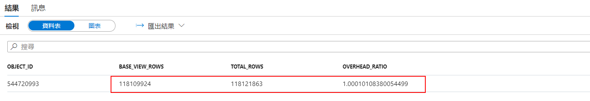

    此时具体化视图中存储了一个增量，这导致 `TOTAL_ROWS` 大于 `BASE_VIEW_ROWS`，`OVERHEAD_RATIO` 大于 1。

9. 重新生成具体化视图并检查开销比率是否回到 1：

    ```sql
    ALTER MATERIALIZED VIEW [wwi_perf].[mvCustomerSales] REBUILD

    DBCC PDW_SHOWMATERIALIZEDVIEWOVERHEAD ( 'wwi_perf.mvCustomerSales' )
    ```

    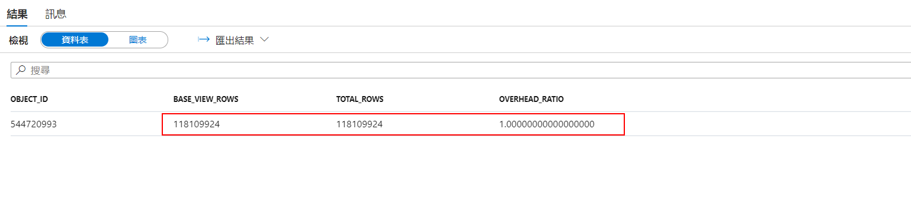

### 任务 2：使用结果集缓存

Tailwind Trader 的下游报告可供许多用户使用，这通常意味着针对不经常更改的数据重复执行相同的查询。他们可以执行哪些操作来提高这些查询类型的性能？基础数据发生变化时，该方法如何生效？

他们应考虑结果集缓存。

在专用的 Azure Synapse SQL 池存储中缓存查询结果。这使得对于不经常发生数据更改的表的重复查询的交互响应时间成为可能。

> 即使暂停专用 SQL 池并后续恢复，仍将永久保存结果集缓存。

基础表数据或查询代码发生变化时，查询缓存将失效并刷新。

基于可获取时间信息的最近最少使用的算法 (TLRU) 定期收回结果缓存。

1. 在查询窗口中，将脚本替换为以下内容，以检查当前专用 SQL 池中是否启用了结果集缓存：

    ```sql
    SELECT
        name
        ,is_result_set_caching_on
    FROM
        sys.databases
    ```

2. 在工具栏菜单中选择 **“运行”** 以执行 SQL 命令。

    

    查看查询的输出。 **“SQLPool01”** 的 `is_result_set_caching_on` 值是什么？在本例中，该值设为 `False`，这意味着当前禁用结果集缓存。

    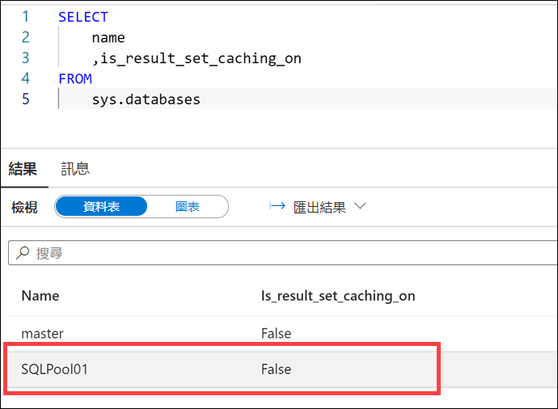

3. 在查询窗口中，将数据库更改为主数**据库 (1)**，然后将脚本 **(2)** 替换为以下内容，以激活结果集缓存：

    ```sql
    ALTER DATABASE SQLPool01
    SET RESULT_SET_CACHING ON
    ```

    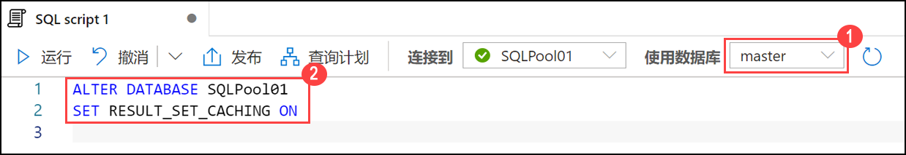

4. 在工具栏菜单中选择 **“运行”** 以执行 SQL 命令。

    

    > **重要提示**
    >
    > 用于创建结果集缓存和从缓存中检索数据的操作发生在专用 SQL 池实例的控制节点上。当结果集缓存处于打开状态时，运行返回大型结果集（例如，超过 1 GB）的查询可能会导致控制节点上带宽限制较高，并降低实例上的整体查询响应速度。这些查询通常在数据浏览或 ETL 操作过程中使用。若要避免对控制节点造成压力并导致性能问题，用户应在运行此类查询之前关闭数据库的结果集缓存。

5. 在工具栏菜单中连接到 **“SQLPool01”** 数据库，以执行下一查询。

    

6. 在查询窗口中，将脚本替换为以下查询并立即检查是否命中缓存：

    ```sql
    SELECT
        D.Year
        ,D.Quarter
        ,D.Month
        ,SUM(S.TotalAmount) as TotalAmount
        ,SUM(S.ProfitAmount) as TotalProfit
    FROM
        [wwi_perf].[Sale_Partition02] S
        join [wwi].[Date] D on
            S.TransactionDateId = D.DateId
    GROUP BY
        D.Year
        ,D.Quarter
        ,D.Month
    OPTION (LABEL = 'Lab: Result set caching')

    SELECT
        result_cache_hit
    FROM
        sys.dm_pdw_exec_requests
    WHERE
        request_id =
        (
            SELECT TOP 1
                request_id
            FROM
                sys.dm_pdw_exec_requests
            WHERE
                [label] = 'Lab: Result set caching'
            ORDER BY
                start_time desc
        )
    ```

7. 在工具栏菜单中选择 **“运行”** 以执行 SQL 命令。

    

    正如预期，结果为 **`False` (0)**。

    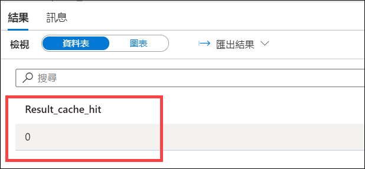

    不过，你可以确定运行查询时专用 SQL 池也缓存了结果集。

8. 在查询窗口中，将脚本替换为以下内容，以获取执行步骤：

    ```sql
    SELECT
        step_index
        ,operation_type
        ,location_type
        ,status
        ,total_elapsed_time
        ,command
    FROM
        sys.dm_pdw_request_steps
    WHERE
        request_id =
        (
            SELECT TOP 1
                request_id
            FROM
                sys.dm_pdw_exec_requests
            WHERE
                [label] = 'Lab: Result set caching'
            ORDER BY
                start_time desc
        )
    ```

9. 在工具栏菜单中选择 **“运行”** 以执行 SQL 命令。

    

    执行计划显示了如何生成结果集缓存：

    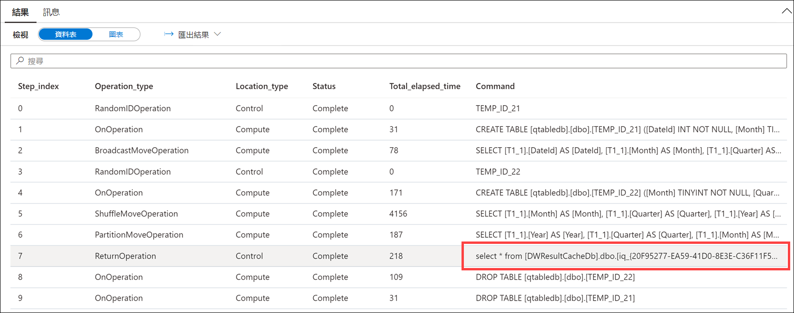

    你可以在用户会话级别控制结果集缓存的使用。

10. 在查询窗口中，将脚本替换为以下内容，以停用和激活结果缓存：

    ```sql  
    SET RESULT_SET_CACHING OFF

    SELECT
        D.Year
        ,D.Quarter
        ,D.Month
        ,SUM(S.TotalAmount) as TotalAmount
        ,SUM(S.ProfitAmount) as TotalProfit
    FROM
        [wwi_perf].[Sale_Partition02] S
        join [wwi].[Date] D on
            S.TransactionDateId = D.DateId
    GROUP BY
        D.Year
        ,D.Quarter
        ,D.Month
    OPTION (LABEL = 'Lab: Result set caching off')

    SET RESULT_SET_CACHING ON

    SELECT
        D.Year
        ,D.Quarter
        ,D.Month
        ,SUM(S.TotalAmount) as TotalAmount
        ,SUM(S.ProfitAmount) as TotalProfit
    FROM
        [wwi_perf].[Sale_Partition02] S
        join [wwi].[Date] D on
            S.TransactionDateId = D.DateId
    GROUP BY
        D.Year
        ,D.Quarter
        ,D.Month
    OPTION (LABEL = 'Lab: Result set caching on')

    SELECT TOP 2
        request_id
        ,[label]
        ,result_cache_hit
    FROM
        sys.dm_pdw_exec_requests
    WHERE
        [label] in ('Lab: Result set caching off', 'Lab: Result set caching on')
    ORDER BY
        start_time desc
    ```

11. 在工具栏菜单中选择 **“运行”** 以执行 SQL 命令。

    

    上述脚本中的 **`SET RESULT_SET_CACHING OFF`** 的结果在缓存命中测试结果中可见（`result_cache_hit` 列返回 `1` 表示缓存命中，`0` 表示缓存未命中，*负值*表示未使用结果集缓存。）：

    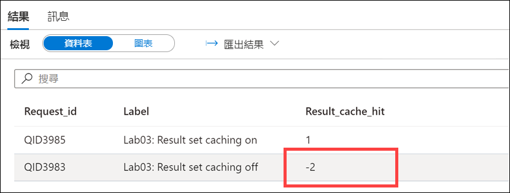

12. 在查询窗口中，将脚本替换为以下内容，以检查结果缓存使用的空间：

    ```sql
    DBCC SHOWRESULTCACHESPACEUSED
    ```

13. 在工具栏菜单中选择 **“运行”** 以执行 SQL 命令。

    

    查询结果中将显示预留的空间量、数据使用量、索引使用量、结果缓存未使用的空间量。

    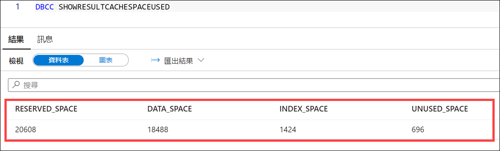

14. 在查询窗口中，将脚本替换为以下内容，以清除结果集缓存：

    ```sql
    DBCC DROPRESULTSETCACHE
    ```

15. 在工具栏菜单中选择 **“运行”** 以执行 SQL 命令。

    

16. 在查询窗口中，将数据库更改为主数**据库 (1)**，然后将脚本 **(2)** 替换为以下内容，以禁用结果集缓存：

    ```sql
    ALTER DATABASE SQLPool01
    SET RESULT_SET_CACHING OFF
    ```

    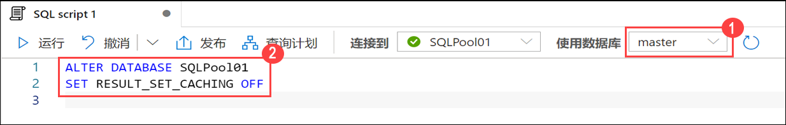

17. 在工具栏菜单中选择 **“运行”** 以执行 SQL 命令。

    

    > **备注**
    >
    > 确保在专用 SQL 池上禁用结果集缓存。如果不这样做，将对演示的其余部分产生负面影响，因为这会影响执行时间并导致无法实现多个即将进行的练习的目标。

    每个数据集的结果集缓存的最大大小为 1 TB。当基础查询数据更改时，缓存的结果将自动失效。

    缓存逐出由专用 SQL 池按照以下计划自动管理：

    - 如果尚未使用结果集或已失效，则每 48 小时执行一次。
    - 结果集缓存达到最大大小。

    用户可以使用以下选项之一手动清空整个结果集缓存：

    - 关闭数据库的结果集缓存功能
    - 连接到数据库时运行 DBCC DROPRESULTSETCACHE

    暂停数据库不会清空缓存的结果集。

### 任务 3：创建和更新统计信息

专用 SQL 池资源对数据了解得越多，执行查询的速度就越快。将数据加载到专用 SQL 池后，对查询优化而言最重要的操作之一就是收集有关数据的统计信息。

专用 SQL 池查询优化器是基于成本的优化器。此优化器会对各种查询计划的成本进行比较，并选择成本最低的计划。在大多数情况下，所选计划也是执行速度最快的计划。

例如，如果优化器预计筛选查询日期后将返回一行，它会选择某个计划。如果它预计所选日期将返回 1 百万行，就会返回另一个计划。

1. 检查统计信息是否设置为在数据库中自动创建：

    ```sql
    SELECT name, is_auto_create_stats_on
    FROM sys.databases
    ```

2. 查看自动创建的统计信息（将数据库改回专用 SQL 池）：

    ```sql
    SELECT
        *
    FROM
        sys.dm_pdw_exec_requests
    WHERE
        Command like 'CREATE STATISTICS%'
    ```

    请注意用于自动创建的统计信息的特殊名称模式：

    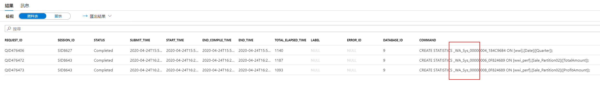

3. 检查是否为 `wwi_perf.Sale_Has` 表中的 `CustomerId` 创建了任何统计信息：

    ```sql
    DBCC SHOW_STATISTICS ('wwi_perf.Sale_Hash', CustomerId) WITH HISTOGRAM
    ```

    应收到一个错误，表示 `CustomerId` 的统计信息不存在。

4. 创建 `CustomerId` 的统计信息：

    ```sql
    CREATE STATISTICS Sale_Hash_CustomerId ON wwi_perf.Sale_Hash (CustomerId)
    ```

    显示新建的统计信息：

    ```sql
    DBCC SHOW_STATISTICS([wwi_perf.Sale_Hash], 'Sale_Hash_CustomerId')
    ```

    在结果窗格中，切换到 `Chart` 显示并配置如下属性：

    - **图表类型**：面积
    - **类别列**：RANGE_HI_KEY
    - **图例（系列）列**：RANGE_ROWS

    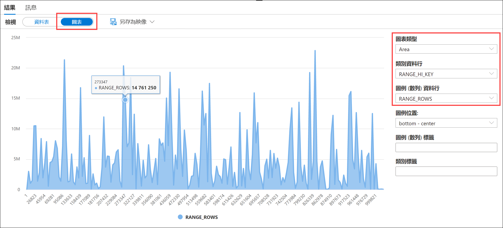

    现在即可查看为 `CustomerId` 列创建的统计信息。

    >**重要提示**
    >
    >SQL 池对数据了解得越多，其针对数据执行查询的速度就越快。将数据加载到 SQL 池后，对查询优化而言最重要的操作之一就是收集有关数据的统计信息。
    >
    >SQL 池查询优化器是基于成本的优化器。此优化器会对各种查询计划的成本进行比较，并选择成本最低的计划。在大多数情况下，所选计划也是执行速度最快的计划。
    >
    例如，如果优化器预计筛选查询日期后将返回一行，它会选择某个计划。如果它预计所选日期将返回 1 百万行，就会返回另一个计划。

### 任务 4：创建和更新索引

聚集列存储索引、堆与聚集和非聚集

需要快速检索单个行时，聚集索引可能优于聚集列存储索引。对于需要单个或极少数行查找才能极速执行的查询，请考虑使用聚集索引或非聚集辅助索引。使用聚集索引的缺点是只有在聚集索引列上使用高度可选筛选器的查询才可受益。要改善其他列中的筛选器，可将非聚集索引添加到其他列。但是，添加到表中的每个索引会增大空间和加载处理时间。

1. 使用 CCI 从表中检索有关单个客户的信息：

    ```sql
    SELECT
        *
    FROM
        [wwi_perf].[Sale_Hash]
    WHERE
        CustomerId = 500000
    ```

    记下执行时间。

2. 使用聚集索引从表中检索有关单个客户的信息：

    ```sql
    SELECT
        *
    FROM
        [wwi_perf].[Sale_Index]
    WHERE
        CustomerId = 500000
    ```

    执行时间与上述查询的执行时间差不多。在高选择性查询的特定场景中，聚集列存储索引相对于聚集索引没有明显优势。

3. 使用 CCI 从表中检索有关多个客户的信息：

    ```sql
    SELECT
        *
    FROM
        [wwi_perf].[Sale_Hash]
    WHERE
        CustomerId between 400000 and 400100
    ```

    使用聚集索引从表中检索相同的信息：

    ```sql
    SELECT
        *
    FROM
        [wwi_perf].[Sale_Index]
    WHERE
        CustomerId between 400000 and 400100
    ```

    多次运行这两个查询，以获得稳定的执行时间。正常情况下，你应该会发现，即使客户数量相对较少，CCI 表也会比聚集索引表产生更好的结果。

4. 现在在查询上添加一个额外条件，以引用 `StoreId` 列：

    ```sql
    SELECT
        *
    FROM
        [wwi_perf].[Sale_Index]
    WHERE
        CustomerId between 400000 and 400100
        and StoreId between 2000 and 4000
    ```

    记下执行时间。

5. 在 `StoreId` 列上创建非聚集索引：

    ```sql
    CREATE INDEX Store_Index on wwi_perf.Sale_Index (StoreId)
    ```

    索引的创建应在数分钟内完成。创建索引后，再次运行上一个查询。请注意新创建的非聚集索引对执行时间的优化。

    >**备注**
    >
    >在 `wwi_perf.Sale_Index` 上创建非聚集索引是基于已存在的聚集索引。作为额外练习，请尝试在 `wwi_perf.Sale_Hash` 表上创建相同类型的索引。是否能够对索引创建时间差进行说明？

### 任务 5：有序聚集列存储索引

默认情况下，对于未使用索引选项创建的每个表，内部组件（索引生成器）会在其中创建无序聚集列存储索引 (CCI)。每个列中的数据压缩到单独的 CCI 行组段中。每个段的值范围中都有元数据，因此查询执行期间不会从磁盘读取查询谓词范围之外的段。CCI 提供最高级别的数据压缩并缩小要读取的段，因此查询可以运行得更快。但由于索引生成器在将数据压缩为段之前不会对其进行排序，因此可能会出现值范围重叠的段，从而导致查询从磁盘读取更多的段并导致用时更长。

创建有序 CCI 时，Synapse SQL 引擎按顺序键对内存中的现有数据进行排序，然后索引生成器将其压缩成索引段。通过对数据进行排序，减少段重叠，使查询可以更高效地消除段，减少要从磁盘读取的段，从而提高性能。如果可以在内存中同时对所有数据进行排序，则可以避免段重叠。由于数据仓库中有大型表，因此这种情况并不经常发生。

借助有序 CCI，具有以下模式的查询通常可以运行得更快：

- 查询具有相等、不等或范围谓词
- 谓词列和有序 CCI 列相同。
- 谓词列的使用顺序与有序 CCI 列的列顺序相同。

1. 运行以下查询，以显示 `Sale_Hash` 表的段重叠：

    ```sql
    select
        OBJ.name as table_name
        ,COL.name as column_name
        ,NT.distribution_id
        ,NP.partition_id
        ,NP.rows as partition_rows
        ,NP.data_compression_desc
        ,NCSS.segment_id
        ,NCSS.version
        ,NCSS.min_data_id
        ,NCSS.max_data_id
        ,NCSS.row_count
    from
        sys.objects OBJ
        JOIN sys.columns as COL ON
            OBJ.object_id = COL.object_id
        JOIN sys.pdw_table_mappings TM ON
            OBJ.object_id = TM.object_id
        JOIN sys.pdw_nodes_tables as NT on
            TM.physical_name = NT.name
        JOIN sys.pdw_nodes_partitions NP on
            NT.object_id = NP.object_id
            and NT.pdw_node_id = NP.pdw_node_id
            and substring(TM.physical_name, 40, 10) = NP.distribution_id
        JOIN sys.pdw_nodes_column_store_segments NCSS on
            NP.partition_id = NCSS.partition_id
            and NP.distribution_id = NCSS.distribution_id
            and COL.column_id = NCSS.column_id
    where
        OBJ.name = 'Sale_Hash'
        and COL.name = 'CustomerId'
        and TM.physical_name  not like '%HdTable%'
    order by
        NT.distribution_id
    ```

    查询所涉及的表的简要描述如下：

    表名称 | 描述
    ---|---
    sys.objects | 数据库中的所有对象。筛选为仅匹配 `Sale_Hash` 表。
    sys.columns | 数据库中的所有列。筛选为仅匹配 `Sale_Hash` 表的 `CustomerId` 列。
    sys.pdw_table_mappings | 将每个表映射到物理节点和分布上的本地表。
    sys.pdw_nodes_tables | 包含有关每个分布中每个本地表的信息。
    sys.pdw_nodes_partitions | 包含有关每个分布中每个本地表的每个本地分区的信息。
    sys.pdw_nodes_column_store_segments | 包含有关每个分布中每个本地表的每个分区和分布列的每个 CCI 段的信息。筛选为仅匹配 `Sale_Hash` 表的 `CustomerId` 列。

    根据这些信息，查看结果：

    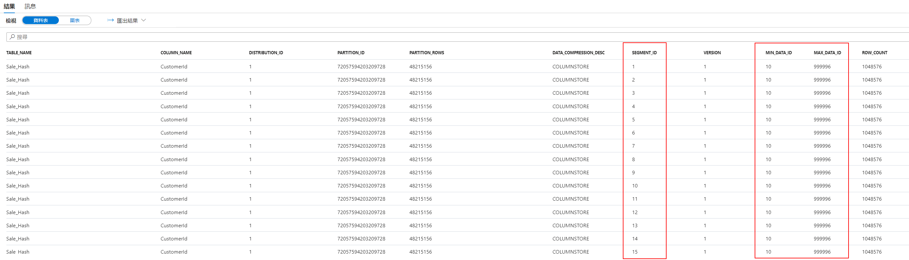

    浏览结果集并注意段之间的明显重叠。每对段之间的客户 ID 存在重叠（`CustomerId` 值从数据 1 到 1,000,000）。该 CCI 的段结构明显效率低下，会导致对存储进行大量不必要的读取。

2. 运行以下查询，以显示 `Sale_Hash_Ordered` 表的段重叠：

    ```sql
    select
        OBJ.name as table_name
        ,COL.name as column_name
        ,NT.distribution_id
        ,NP.partition_id
        ,NP.rows as partition_rows
        ,NP.data_compression_desc
        ,NCSS.segment_id
        ,NCSS.version
        ,NCSS.min_data_id
        ,NCSS.max_data_id
        ,NCSS.row_count
    from
        sys.objects OBJ
        JOIN sys.columns as COL ON
            OBJ.object_id = COL.object_id
        JOIN sys.pdw_table_mappings TM ON
            OBJ.object_id = TM.object_id
        JOIN sys.pdw_nodes_tables as NT on
            TM.physical_name = NT.name
        JOIN sys.pdw_nodes_partitions NP on
            NT.object_id = NP.object_id
            and NT.pdw_node_id = NP.pdw_node_id
            and substring(TM.physical_name, 40, 10) = NP.distribution_id
        JOIN sys.pdw_nodes_column_store_segments NCSS on
            NP.partition_id = NCSS.partition_id
            and NP.distribution_id = NCSS.distribution_id
            and COL.column_id = NCSS.column_id
    where
        OBJ.name = 'Sale_Hash_Ordered'
        and COL.name = 'CustomerId'
        and TM.physical_name  not like '%HdTable%'
    order by
        NT.distribution_id
    ```

    用于创建 `wwi_perf.Sale_Hash_Ordered` 表的 CTAS 如下（**请勿执行**）：

    ```sql
    CREATE TABLE [wwi_perf].[Sale_Hash_Ordered]
    WITH
    (
        DISTRIBUTION = HASH ( [CustomerId] ),
        CLUSTERED COLUMNSTORE INDEX ORDER( [CustomerId] )
    )
    AS
    SELECT
        *
    FROM
        [wwi_perf].[Sale_Heap]
    OPTION  (LABEL  = 'CTAS : Sale_Hash', MAXDOP 1)
    ```

    请注意，按 MAXDOP = 1 创建有序 CCI。用于创建有序 CCI 的每个线程处理数据子集并在本地对其进行排序。不会对由不同线程排序的数据进行全局排序。使用并行线程可以缩减创建有序 CCI 的时间，但相较于使用单个线程，会生成更多的重叠段。目前，仅在使用 CREATE TABLE AS SELECT 命令创建有序 CCI 表时支持 MAXDOP 选项。通过 CREATE INDEX 或 CREATE TABLE 命令创建有序 CCI 不支持 MAXDOP 选项。

    结果显示段之间的重叠显著减少：

    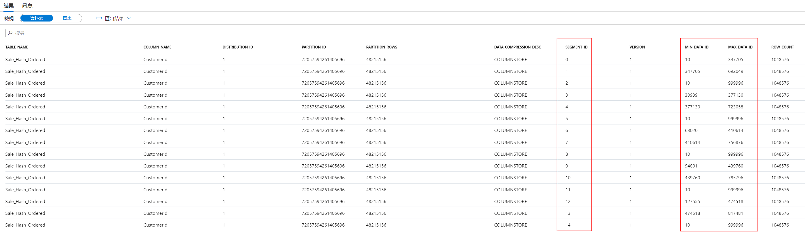

## 练习 5：清理

完成以下步骤，释放不再需要的资源。

### 任务 1：暂停专用 SQL 池

1. 打开 Synapse Studio (<https://web.azuresynapse.net/>)。

2. 选择 **“管理”** 中心。

    

3. 在左侧菜单中，选择 **“SQL 池” (1)**。将鼠标悬停在专用 SQL 池的名称上，并选择 **“暂停” (2)**。

    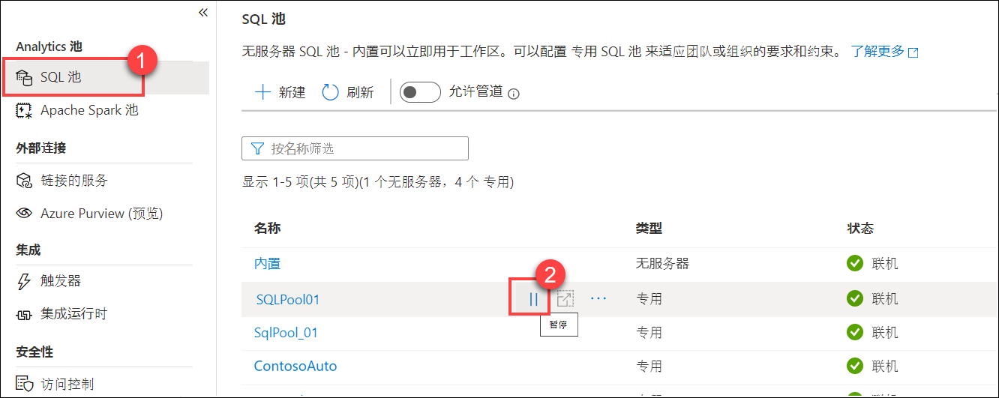

4. 出现提示时，选择 **“暂停”**。

    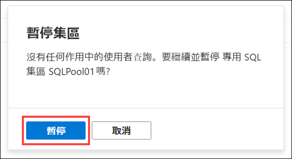
