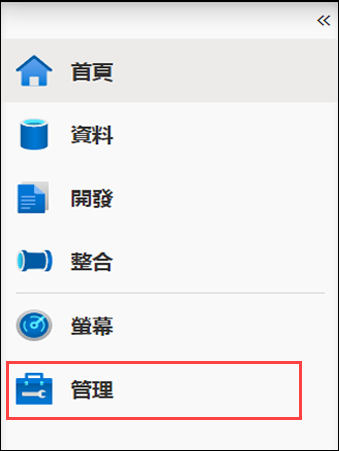
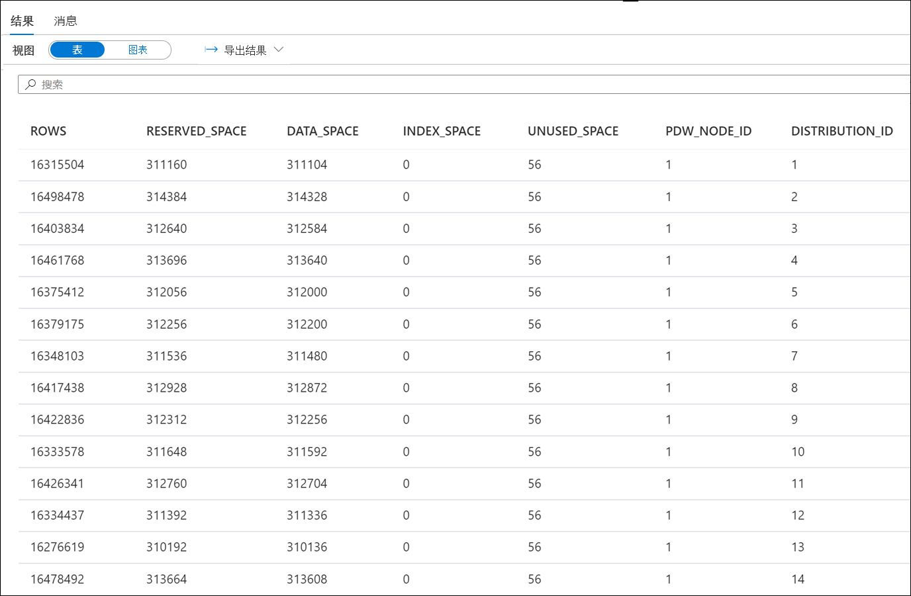
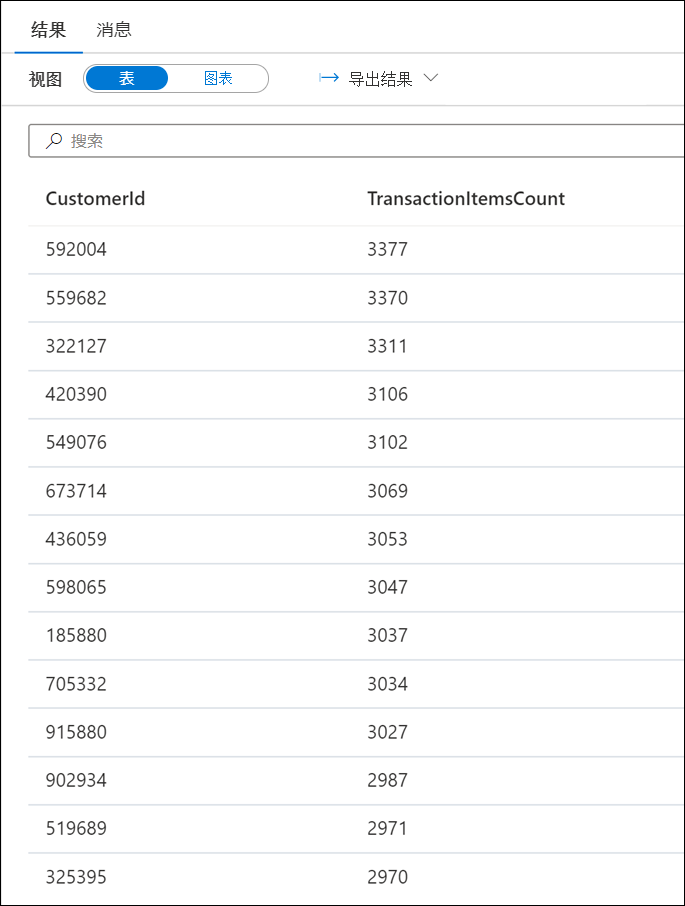
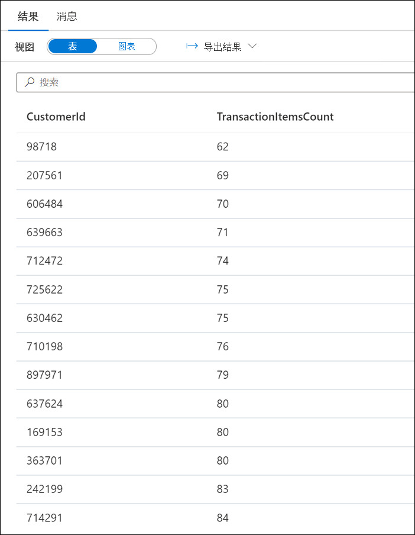
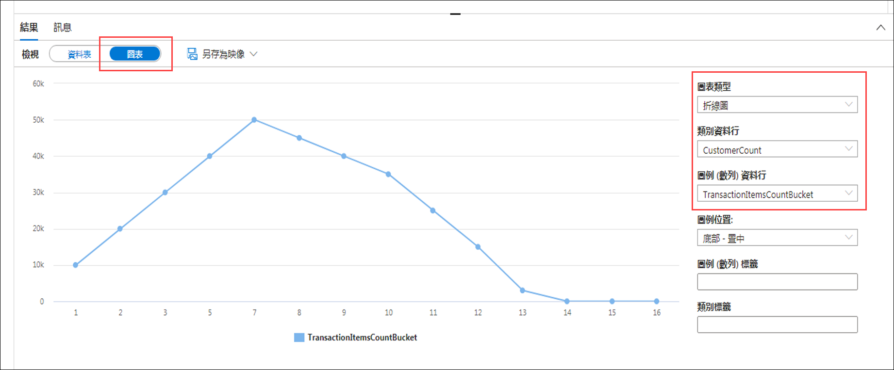
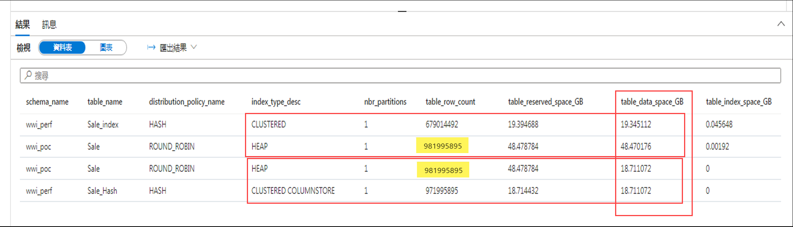
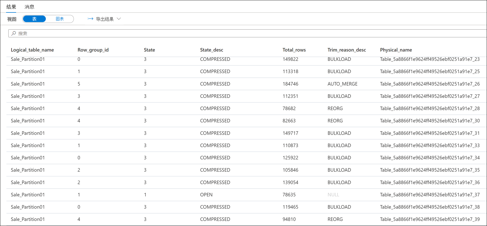
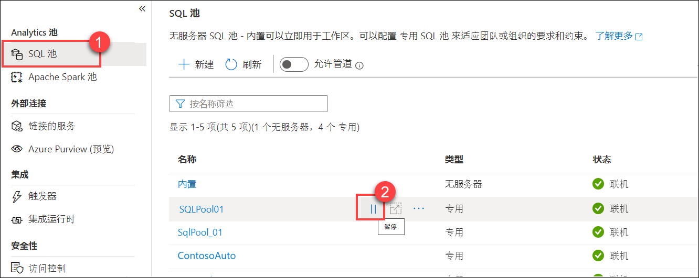
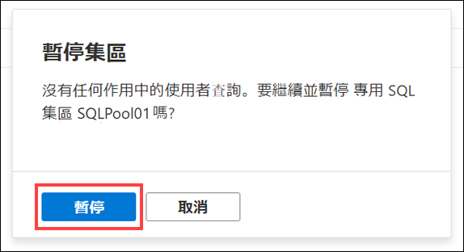

# 模块 11 - 分析和优化数据仓库存储

在本模块中，学生将了解如何分析和优化 Azure Synapse 专用 SQL 池的数据存储。学生将了解理解表空间使用情况和列存储存储空间细节的方法。接下来，学生将了解如何比较使用不同数据类型的不同表的存储要求。最后，学生将观察具体化视图在代替复杂查询时所产生的影响，并了解如何通过优化删除操作来避免大量的日志记录。

在本模块中，学生将能够：

- 检查倾斜数据和空间使用情况
- 了解列存储的存储细节
- 研究具体化视图的影响
- 探索最小日志记录操作的规则

## 实验室详细信息

- [模块 11 - 分析和优化数据仓库存储](#module-11---analyze-and-optimize-data-warehouse-storage)
  - [实验室详细信息](#lab-details)
  - [实验室设置和先决条件](#lab-setup-and-pre-requisites)
  - [练习 0：启动专用 SQL 池](#exercise-0-start-the-dedicated-sql-pool)
  - [练习 1 - 检查倾斜数据和空间使用情况](#exercise-1---check-for-skewed-data-and-space-usage)
    - [任务 1 - 分析表使用的空间](#task-1---analyze-the-space-used-by-tables)
    - [任务 2 - 使用更高级的方法了解表空间使用情况](#task-2---use-a-more-advanced-approach-to-understand-table-space-usage)
  - [练习 2 - 了解列存储的存储细节](#exercise-2---understand-column-store-storage-details)
    - [任务 1 - 创建列存储行组统计数据的视图](#task-1---create-view-for-column-store-row-group-stats)
    - [任务 2 - 探索列存储存储细节](#task-2---explore-column-store-storage-details)
  - [练习 3 - 研究错误选择列数据类型的影响](#exercise-3---study-the-impact-of-wrong-choices-for-column-data-types)
    - [任务 1 - 使用最佳列数据类型创建和填充表](#task-1---create-and-populate-tables-with-optimal-column-data-types)
    - [任务 2 - 使用次佳列数据类型创建和填充表](#task-2---create-and-populate-tables-with-sub-optimal-column-data-types)
    - [任务 3 - 比较存储要求](#task-3---compare-storage-requirements)
  - [练习 4 - 研究具体化视图的影响](#exercise-4---study-the-impact-of-materialized-views)
    - [任务 1 - 分析查询的执行计划](#task-1---analyze-the-execution-plan-of-a-query)
    - [任务 2 - 使用具体化视图改进查询的执行计划](#task-2---improve-the-execution-plan-of-the-query-with-a-materialized-view)
  - [练习 5 - 避免广泛的记录](#exercise-5---avoid-extensive-logging)
    - [任务 1 - 探索最小日志记录操作的规则](#task-1---explore-rules-for-minimally-logged-operations)
    - [任务 2 - 优化删除操作](#task-2---optimizing-a-delete-operation)
  - [练习 6：清理](#exercise-6-cleanup)
    - [任务 1：暂停专用 SQL 池](#task-1-pause-the-dedicated-sql-pool)

## 实验室设置和先决条件

> **备注：** 如果**不**使用托管实验室环境，而是使用自己的 Azure 订阅，则仅完成`Lab setup and pre-requisites`步骤。否则，请跳转到练习 0。

**完成此模块的[实验室设置说明](https://github.com/solliancenet/microsoft-data-engineering-ilt-deploy/blob/main/setup/04/README.md)**。

请注意，以下模块使用相同的环境：

- [模块 4](labs/04/README.md)
- [模块 5](labs/05/README.md)
- [模块 7](labs/07/README.md)
- [模块 8](labs/08/README.md)
- [模块 9](labs/09/README.md)
- [模块 10](labs/10/README.md)
- [模块 11](labs/11/README.md)
- [模块 12](labs/12/README.md)
- [模块 13](labs/13/README.md)
- [模块 16](labs/16/README.md)

## 练习 0：启动专用 SQL 池

本实验室使用专用 SQL 池。第一步是确保它没有暂停。如果暂停，请按照以下说明启动它：

1. 打开 Synapse Studio (<https://web.azuresynapse.net/>)。

2. 选择 **“管理”** 中心。

    

3. 在左侧菜单中，选择 **“SQL 池”** **(1)**。如果专用 SQL 池已暂停，请将鼠标悬停在池名称上并选择 **“恢复”(2)**。

    

4. 出现提示时，选择 **“恢复”**。恢复池可能需要一到两分钟。

    

> 恢复专用 SQL 池后，**请继续下一个练习**。

## 练习 1 - 检查倾斜数据和空间使用情况

### 任务 1 - 分析表使用的空间

1. 打开 Synapse Studio (<https://web.azuresynapse.net/>)。

2. 选择 **“开发”** 中心。

    

3. 在 **“开发”** 菜单中选择 **“+”** 按钮 **(1)**，然后在上下文菜单中选择 **“SQL 脚本”(2)**。

    

4. 在工具栏菜单中，连接到 **SQLPool01** 专用 SQL 池以及 **SQLPool01** 数据库。

    

5. 粘贴以下脚本，使用 CTAS (Create Table As Select) 创建哈希分布式簇状列存储索引 (CCI) 表（如果尚不存在）：

     ```sql
    IF OBJECT_ID(N'[wwi_perf].[Sale_Hash]', N'U') IS NULL
    BEGIN
        CREATE TABLE [wwi_perf].[Sale_Hash]
        WITH
        (
            DISTRIBUTION = HASH ( [CustomerId] ),
            CLUSTERED COLUMNSTORE INDEX
        )
        AS
        SELECT
            *
        FROM
            [wwi_poc].[Sale]
    END
    ```

6. 在工具栏菜单中选择 **“运行”** 以执行 SQL 命令。

    

    **如果表尚不存在**，查询将需要约 **10 分钟才**能完成。在此过程中，请阅读其余的实验室说明，以熟悉内容。

    > **备注**
    >
    > CTAS 是可自定义程度更高的 SELECT...INTO 语句版本。
    > SELECT...INTO 不允许在操作过程中更改分布方法或索引类型。使用默认分布类型 ROUND_ROBIN 以及默认表结构 CLUSTERED COLUMNSTORE INDEX 创建新表。
    >
    > 但使用 CTAS 可以指定表数据的分布以及表结构类型。

7. 在查询窗口中，将脚本替换为以下数据库控制台命令 (DBCC)：

    ```sql
    DBCC PDW_SHOWSPACEUSED('wwi_perf.Sale_Hash');
    ```

    

8. 分析每个分布的行数。这些数字应尽量均匀。可通过结果了解到行在分布中平均分布。让我们深入了解此分析。使用以下查询找到具有最多销售交易项的客户：

    ```sql
    SELECT TOP 1000
        CustomerId,
        count(*) as TransactionItemsCount
    FROM
        [wwi_perf].[Sale_Hash]
    GROUP BY
        CustomerId
    ORDER BY
        count(*) DESC
    ```

    

    现在找到具有最少销售交易项的客户：

    ```sql
    SELECT TOP 1000
        CustomerId,
        count(*) as TransactionItemsCount
    FROM
        [wwi_perf].[Sale_Hash]
    GROUP BY
        CustomerId
    ORDER BY
        count(*) ASC
    ```

    

    请注意，在我们的环境中，交易项的最大数目为 3,377，最小数目为 62。

    现在，让我们找到每客户交易项计数的分布。运行以下查询：

    ```sql
    SELECT
        T.TransactionItemsCountBucket
        ,count(*) as CustomersCount
    FROM
        (
            SELECT
                CustomerId,
                (count(*) - 62) / 100 as TransactionItemsCountBucket
            FROM
                [wwi_perf].[Sale_Hash]
            GROUP BY
                CustomerId
        ) T
    GROUP BY
        T.TransactionItemsCountBucket
    ORDER BY
        T.TransactionItemsCountBucket
    ```

    在 `Results` 窗格中，切换到 `Chart` 视图，进行如下配置（查看右侧设置的选项）：

    

    此直方图没有过多探讨数学和统计方面，而是显示了`Sale_Hash`表的数据分布几乎没有偏斜的原因。如果你还没有理解，那么可以这样说我们谈论的原因是每客户交易项计数的准正态分布。

### 任务 2 - 使用更高级的方法了解表空间使用情况

1. 运行以下脚本来创建 `vTableSizes` 视图：

    ```sql
    CREATE VIEW [wwi_perf].[vTableSizes]
    AS
    WITH base
    AS
    (
    SELECT
        GETDATE()                                                              AS  [execution_time]
        , DB_NAME()                                                            AS  [database_name]
        , s.name                                                               AS  [schema_name]
        , t.name                                                               AS  [table_name]
        , QUOTENAME(s.name)+'.'+QUOTENAME(t.name)                              AS  [two_part_name]
        , nt.[name]                                                            AS  [node_table_name]
        , ROW_NUMBER() OVER(PARTITION BY nt.[name] ORDER BY (SELECT NULL))     AS  [node_table_name_seq]
        , tp.[distribution_policy_desc]                                        AS  [distribution_policy_name]
        , c.[name]                                                             AS  [distribution_column]
        , nt.[distribution_id]                                                 AS  [distribution_id]
        , i.[type]                                                             AS  [index_type]
        , i.[type_desc]                                                        AS  [index_type_desc]
        , nt.[pdw_node_id]                                                     AS  [pdw_node_id]
        , pn.[type]                                                            AS  [pdw_node_type]
        , pn.[name]                                                            AS  [pdw_node_name]
        , di.name                                                              AS  [dist_name]
        , di.position                                                          AS  [dist_position]
        , nps.[partition_number]                                               AS  [partition_nmbr]
        , nps.[reserved_page_count]                                            AS  [reserved_space_page_count]
        , nps.[reserved_page_count] - nps.[used_page_count]                    AS  [unused_space_page_count]
        , nps.[in_row_data_page_count]
            + nps.[row_overflow_used_page_count]
            + nps.[lob_used_page_count]                                        AS  [data_space_page_count]
        , nps.[reserved_page_count]
        - (nps.[reserved_page_count] - nps.[used_page_count])
        - ([in_row_data_page_count]
                + [row_overflow_used_page_count]+[lob_used_page_count])        AS  [index_space_page_count]
        , nps.[row_count]                                                      AS  [row_count]
    FROM
        sys.schemas s
    INNER JOIN sys.tables t
        ON s.[schema_id] = t.[schema_id]
    INNER JOIN sys.indexes i
        ON  t.[object_id] = i.[object_id]
        AND i.[index_id] <= 1
    INNER JOIN sys.pdw_table_distribution_properties tp
        ON t.[object_id] = tp.[object_id]
    INNER JOIN sys.pdw_table_mappings tm
        ON t.[object_id] = tm.[object_id]
    INNER JOIN sys.pdw_nodes_tables nt
        ON tm.[physical_name] = nt.[name]
    INNER JOIN sys.dm_pdw_nodes pn
        ON  nt.[pdw_node_id] = pn.[pdw_node_id]
    INNER JOIN sys.pdw_distributions di
        ON  nt.[distribution_id] = di.[distribution_id]
    INNER JOIN sys.dm_pdw_nodes_db_partition_stats nps
        ON nt.[object_id] = nps.[object_id]
        AND nt.[pdw_node_id] = nps.[pdw_node_id]
        AND nt.[distribution_id] = nps.[distribution_id]
    LEFT OUTER JOIN (select * from sys.pdw_column_distribution_properties where distribution_ordinal = 1) cdp
        ON t.[object_id] = cdp.[object_id]
    LEFT OUTER JOIN sys.columns c
        ON cdp.[object_id] = c.[object_id]
        AND cdp.[column_id] = c.[column_id]
    WHERE pn.[type] = 'COMPUTE'
    )
    , size
    AS
    (
    SELECT
    [execution_time]
    ,  [database_name]
    ,  [schema_name]
    ,  [table_name]
    ,  [two_part_name]
    ,  [node_table_name]
    ,  [node_table_name_seq]
    ,  [distribution_policy_name]
    ,  [distribution_column]
    ,  [distribution_id]
    ,  [index_type]
    ,  [index_type_desc]
    ,  [pdw_node_id]
    ,  [pdw_node_type]
    ,  [pdw_node_name]
    ,  [dist_name]
    ,  [dist_position]
    ,  [partition_nmbr]
    ,  [reserved_space_page_count]
    ,  [unused_space_page_count]
    ,  [data_space_page_count]
    ,  [index_space_page_count]
    ,  [row_count]
    ,  ([reserved_space_page_count] * 8.0)                                 AS [reserved_space_KB]
    ,  ([reserved_space_page_count] * 8.0)/1000                            AS [reserved_space_MB]
    ,  ([reserved_space_page_count] * 8.0)/1000000                         AS [reserved_space_GB]
    ,  ([reserved_space_page_count] * 8.0)/1000000000                      AS [reserved_space_TB]
    ,  ([unused_space_page_count]   * 8.0)                                 AS [unused_space_KB]
    ,  ([unused_space_page_count]   * 8.0)/1000                            AS [unused_space_MB]
    ,  ([unused_space_page_count]   * 8.0)/1000000                         AS [unused_space_GB]
    ,  ([unused_space_page_count]   * 8.0)/1000000000                      AS [unused_space_TB]
    ,  ([data_space_page_count]     * 8.0)                                 AS [data_space_KB]
    ,  ([data_space_page_count]     * 8.0)/1000                            AS [data_space_MB]
    ,  ([data_space_page_count]     * 8.0)/1000000                         AS [data_space_GB]
    ,  ([data_space_page_count]     * 8.0)/1000000000                      AS [data_space_TB]
    ,  ([index_space_page_count]  * 8.0)                                   AS [index_space_KB]
    ,  ([index_space_page_count]  * 8.0)/1000                              AS [index_space_MB]
    ,  ([index_space_page_count]  * 8.0)/1000000                           AS [index_space_GB]
    ,  ([index_space_page_count]  * 8.0)/1000000000                        AS [index_space_TB]
    FROM base
    )
    SELECT *
    FROM size
    ```

    请花点时间分析以上脚本。你在前一个实验室中已经遇到了其中一些表。以下是对表和查询中涉及的 DMV 的简短描述：

    表名称 | 描述
    ---|---
    sys.schemas | 数据库中的所有架构。
    sys.tables | 数据库中的所有表。
    sys.indexes | 数据库中的所有索引。
    sys.columns | 数据库中的所有列。
    sys.pdw_table_mappings | 将每个表映射到物理节点和分布上的本地表。
    sys.pdw_nodes_tables | 包含有关每个分布中每个本地表的信息。
    sys.pdw_table_distribution_properties | 保留表的分布信息（表具有的分布类型）。
    sys.pdw_column_distribution_properties | 保留列的分布信息。经过筛选以仅包括用于分布父表的列 (`distribution_ordinal` = 1)。
    sys.pdw_distributions |  保留有关 SQL 池的分布的信息。
    sys.dm_pdw_nodes | 保留有关 SQL 池的节点的信息。经过筛选以仅包括计算节点 (`type` = `COMPUTE`)。
    sys.dm_pdw_nodes_db_partition_stats | 返回当前数据库中每个分区的页和行计数信息。

2. 运行以下脚本以查看有关 `wwi_perf` 架构和 `[wwi_poc].[Sale]` （用作 `Sale_Hash` 表的源）表中的表结构的详细信息：

    ```sql
    SELECT
        schema_name
    ,    table_name
    ,    distribution_policy_name
    ,      distribution_column
    ,    index_type_desc
    ,    COUNT(distinct partition_nmbr) as nbr_partitions
    ,    SUM(row_count)                 as table_row_count
    ,    SUM(reserved_space_GB)         as table_reserved_space_GB
    ,    SUM(data_space_GB)             as table_data_space_GB
    ,    SUM(index_space_GB)            as table_index_space_GB
    ,    SUM(unused_space_GB)           as table_unused_space_GB
    FROM
        [wwi_perf].[vTableSizes]
    WHERE
        schema_name = 'wwi_perf' OR (schema_name = 'wwi_poc' AND table_name = 'sale')
    GROUP BY
        database_name
    ,    schema_name
    ,    table_name
    ,    distribution_policy_name
    ,      distribution_column
    ,    index_type_desc
    ORDER BY
        table_reserved_space_GB desc
    ```

    分析结果：

    

    请注意 `CLUSTERED COLUMNSTORE` 和 `HEAP` 或 `CLUSTERED` 表使用的空间之间的显著差别。这清晰地表现出列存储索引具有的显著优势。**记下行数**。

## 练习 2 - 了解列存储的存储细节

### 任务 1 - 创建列存储行组统计数据的视图

1. 运行以下查询，创建 `vColumnStoreRowGroupStats`：

    ```sql
    create view [wwi_perf].[vColumnStoreRowGroupStats]
    as
    with cte
    as
    (
    select   tb.[name]                    AS [logical_table_name]
    ,        rg.[row_group_id]            AS [row_group_id]
    ,        rg.[state]                   AS [state]
    ,        rg.[state_desc]              AS [state_desc]
    ,        rg.[total_rows]              AS [total_rows]
    ,        rg.[trim_reason_desc]        AS trim_reason_desc
    ,        mp.[physical_name]           AS physical_name
    FROM    sys.[schemas] sm
    JOIN    sys.[tables] tb               ON  sm.[schema_id]          = tb.[schema_id]
    JOIN    sys.[pdw_table_mappings] mp   ON  tb.[object_id]          = mp.[object_id]
    JOIN    sys.[pdw_nodes_tables] nt     ON  nt.[name]               = mp.[physical_name]
    JOIN    sys.[dm_pdw_nodes_db_column_store_row_group_physical_stats] rg      ON  rg.[object_id]     = nt.[object_id]
                                                                                AND rg.[pdw_node_id]   = nt.[pdw_node_id]
                                            AND rg.[distribution_id]    = nt.[distribution_id]
    )
    select *
    from cte;
    ```

    在此查询中，我们使用`sys.dm_pdw_nodes_db_column_store_row_group_physical_stats`DMV，它提供有关当前数据库中所有列存储索引的当前行组级别信息。

    `state_desc`列提供有关行组状态的有用信息：

    名称 | 描述
    ---|---
    `INVISIBLE` | 被压缩的行组。
    `OPEN` | 接受新行的差异存储行组。请务必记住，开放的行组仍采用行存储格式，并且尚未压缩成列存储格式。
    `CLOSED` | 包含最大数量行且等待元组移动程序进程将其压缩到列存储的差异存储行组。
    `COMPRESSED` | 使用列存储压缩且存储在列存储中的行组。
    `TOMBSTONE` | 之前在差异存储中的已不再使用的行组。

    `trim_reason_desc` 列描述触发 `COMPRESSED` 行组以包含少于最大数目行的原因：

    名称 | 描述
    ---|---
    `UNKNOWN_UPGRADED_FROM_PREVIOUS_VERSION` | 从 SQL Server 之前版本升级时发生。
    `NO_TRIM` | 未修剪行组。行组已压缩，最多为 1,048,476 行。如果关闭差异行组后删除一部分行，则行数可能更少。
    `BULKLOAD` | 大容量加载批大小限制了行数。你应在优化数据加载时关注这一点，因为这指示加载过程中资源消耗情况。
    `REORG` | REORG 命令中的强制压缩。
    `DICTIONARY_SIZE` | 字典大小过大，以致于无法压缩所有行。
    `MEMORY_LIMITATION` | 没有可用于压缩所有行的足够内存。
    `RESIDUAL_ROW_GROUP` | 在索引构建操作期间行数小于一百万的最后行组中关闭。

### 任务 2 - 探索列存储存储细节

1. 使用以下查询探索`Sale_Partition01`表的列存储的统计信息：

    ```sql
    SELECT
        *
    FROM
        [wwi_perf].[vColumnStoreRowGroupStats]
    WHERE
        Logical_Table_Name = 'Sale_Partition01'
    ```

2. 探索查询的结果：

    

    浏览结果并获得行组统计信息的概述。注意一些行组的 `COMPRESSED` 和 `OPEN` 状态。

3. 使用同一查询探索 `Sale_Hash_Ordered` 表的列存储的统计信息：

    ```sql
    SELECT
        *
    FROM
        [wwi_perf].[vColumnStoreRowGroupStats]
    WHERE
        Logical_Table_Name = 'Sale_Hash_Ordered'
    ```

4. 探索查询的结果：

    

    与上一个的行组状态显著不同。这突出显示了有序的 CCI 的潜在优势。

## 练习 3 - 研究错误选择列数据类型的影响

### 任务 1 - 使用最佳列数据类型创建和填充表

使用以下查询创建两个表（`Sale_Hash_Projection` 和 `Sale_Hash_Projection2`），其中包含 `Sale_Hash_Ordered` 的部分列：

```sql
CREATE TABLE [wwi_perf].[Sale_Hash_Projection]
WITH
(
	DISTRIBUTION = HASH ( [CustomerId] ),
	HEAP
)
AS
SELECT
	[CustomerId]
	,[ProductId]
	,[Quantity]
FROM
	[wwi_perf].[Sale_Hash_Ordered]

CREATE TABLE [wwi_perf].[Sale_Hash_Projection2]
WITH
(
	DISTRIBUTION = HASH ( [CustomerId] ),
	CLUSTERED COLUMNSTORE INDEX
)
AS
SELECT
	[CustomerId]
	,[ProductId]
	,[Quantity]
FROM
	[wwi_perf].[Sale_Hash_Ordered]
```

> 此查询应在四分钟内完成执行。在此过程中，请阅读其余的实验室说明，以熟悉内容。

### 任务 2 - 使用次佳列数据类型创建和填充表

使用以下查询创建两个其他表（`Sale_Hash_Projection_Big` 和 `Sale_Hash_Projection_Big2`），它们具有相同的列，但具有不同的 (sub_optimal) 数据类型：

```sql
CREATE TABLE [wwi_perf].[Sale_Hash_Projection_Big]
WITH
(
	DISTRIBUTION = HASH ( [CustomerId] ),
	HEAP
)
AS
SELECT
	[CustomerId]
	,CAST([ProductId] as bigint) as [ProductId]
	,CAST([Quantity] as bigint) as [Quantity]
FROM
	[wwi_perf].[Sale_Hash_Ordered]

CREATE TABLE [wwi_perf].[Sale_Hash_Projection_Big2]
WITH
(
	DISTRIBUTION = HASH ( [CustomerId] ),
	CLUSTERED COLUMNSTORE INDEX
)
AS
SELECT
	[CustomerId]
	,CAST([ProductId] as bigint) as [ProductId]
	,CAST([Quantity] as bigint) as [Quantity]
FROM
	[wwi_perf].[Sale_Hash_Ordered]
```

> 此查询应在大约相同的时间内完成执行。此查询运行时，继续阅读实验室说明。

### 任务 3 - 比较存储要求

1. 验证四个表具有相同数量的行（每个表应有 339,507,246 行）：

    ```sql
    SELECT 'Sale_Hash_Projection', COUNT_BIG(*) FROM [wwi_perf].[Sale_Hash_Projection]
    UNION
    SELECT 'Sale_Hash_Projection2', COUNT_BIG(*) FROM [wwi_perf].[Sale_Hash_Projection2]
    UNION
    SELECT 'Sale_Hash_Projection_Big', COUNT_BIG(*) FROM [wwi_perf].[Sale_Hash_Projection_Big]
    UNION
    SELECT 'Sale_Hash_Projection_Big2', COUNT_BIG(*) FROM [wwi_perf].[Sale_Hash_Projection_Big2]
    ```

2. 运行以下查询以比较三个表的存储要求：

    ```sql
    SELECT
        table_name
    ,    distribution_policy_name
    ,      distribution_column
    ,    index_type_desc
    ,    COUNT(distinct partition_nmbr) as nbr_partitions
    ,    SUM(row_count)                 as table_row_count
    ,    SUM(reserved_space_GB)         as table_reserved_space_GB
    ,    SUM(data_space_GB)             as table_data_space_GB
    ,    SUM(index_space_GB)            as table_index_space_GB
    ,    SUM(unused_space_GB)           as table_unused_space_GB
    FROM
        [wwi_perf].[vTableSizes]
    WHERE
        schema_name = 'wwi_perf'
        and table_name in ('Sale_Hash_Projection', 'Sale_Hash_Projection2',
            'Sale_Hash_Projection_Big', 'Sale_Hash_Projection_Big2')
    GROUP BY
        database_name
    ,    schema_name
    ,    table_name
    ,    distribution_policy_name
    ,      distribution_column
    ,    index_type_desc
    ORDER BY
        table_data_space_GB desc
    ```

3. 分析结果：

    对于数量较少的行（约 3.4 亿），可以看到 `BIGINT` 列类型与 `SMALLINT` 和 `TINYINT` 导致的一些空间差异。
    
    在此实验室之外的试验中，我们在加载了 29 亿行之后运行了同一查询，结果更加显著。从该试验中得出的两个重要结论是：

    - 对于 `HEAP` 表，使用 `BIGINT` 而不是 `SMALLINT`（对于 `ProductId`）和 `TINYINT`（对于 `QUANTITY`）的存储影响是约 1 GB (0.8941 GB)。我们在这里只探讨两个列以及中等数量的行（29 亿）。
    - 即使对于 `CLUSTERED COLUMNSTORE` 表（压缩将抵消一些差异），仍存在 12.7 MB 的差异。

最大限度减小数据类型大小可缩短行长度，获得更好的查询性能。使用适用于数据的最小数据类型：

- 避免使用较大默认长度定义字符列。例如，如果最长的值是 25 个字符，则将列定义为 VARCHAR(25)。
- 当仅需要 VARCHAR 时请避免使用 [NVARCHAR][NVARCHAR]
- 尽可能使用 NVARCHAR(4000) 或 VARCHAR(8000)，而非 NVARCHAR(MAX) 或 VARCHAR(MAX)。

>**备注**
>
如果使用 PolyBase 外部表来加载 SQL 池表，则定义的表行长度不能超过 1 MB。当数据长度可变的行超过 1 MB 时，可使用 BCP 而不是 PolyBase 加载行。

## 练习 4 - 研究具体化视图的影响

### 任务 1 - 分析查询的执行计划

1. 再次运行查询，找到每客户交易项计数的每个存储桶中的客户数目：

    ```sql
    SELECT
        T.TransactionItemsCountBucket
        ,count(*) as CustomersCount
    FROM
        (
            SELECT
                CustomerId,
                (count(*) - 184) / 100 as TransactionItemsCountBucket
            FROM
                [wwi_perf].[Sale_Hash]
            GROUP BY
                CustomerId
        ) T
    GROUP BY
        T.TransactionItemsCountBucket
    ORDER BY
        T.TransactionItemsCountBucket
    ```

2. 通过添加支持以计算第一个每客户交易项数桶的下边距来改进查询：

    ```sql
    SELECT
        T.TransactionItemsCountBucket
        ,count(*) as CustomersCount
    FROM
        (
            SELECT
                CustomerId,
                (
                    COUNT(*) -
                    (
                        SELECT
                            MIN(TransactionItemsCount)
                        FROM
                        (
                            SELECT
                                COUNT(*) as TransactionItemsCount
                            FROM
                                [wwi_perf].[Sale_Hash]
                            GROUP BY
                                CustomerId
                        ) X
                    )
                ) / 100 as TransactionItemsCountBucket
            FROM
                [wwi_perf].[Sale_Hash]
            GROUP BY
                CustomerId
        ) T
    GROUP BY
        T.TransactionItemsCountBucket
    ORDER BY
        T.TransactionItemsCountBucket
    ```

### 任务 2 - 使用具体化视图改进查询的执行计划

1. 使用 `EXPLAIN` 指令（另请注意 `WITH_RECOMMENDATIONS` 选项）运行查询

    ```sql
    EXPLAIN WITH_RECOMMENDATIONS
    SELECT
        T.TransactionItemsCountBucket
        ,count(*) as CustomersCount
    FROM
        (
            SELECT
                CustomerId,
                (
                    COUNT(*) - 
                    (
                        SELECT 
                            MIN(TransactionItemsCount)
                        FROM 
                        (
                            SELECT 
                                COUNT(*) as TransactionItemsCount
                            FROM 
                                [wwi_perf].[Sale_Hash] 
                            GROUP BY 
                                CustomerId 
                        ) X 
                    )
                ) / 100 as TransactionItemsCountBucket
            FROM
                [wwi_perf].[Sale_Hash]
            GROUP BY
                CustomerId
        ) T
    GROUP BY
        T.TransactionItemsCountBucket
    ORDER BY
        T.TransactionItemsCountBucket
    ```

2. 分析生成的执行计划。仔细阅读 `<materialized_view_candidates>` 部分，该部分建议可创建的可能的具体化视图以改进查询性能。

    ```xml
    <?xml version="1.0" encoding="utf-8"?>
    <dsql_query number_nodes="5" number_distributions="60" number_distributions_per_node="12">
    <sql>SELECT
        T.TransactionItemsCountBucket
        ,count(*) as CustomersCount
    FROM
        (
            SELECT
                CustomerId,
                (
                    COUNT(*) -
                    (
                        SELECT
                            MIN(TransactionItemsCount)
                        FROM
                        (
                            SELECT
                                COUNT(*) as TransactionItemsCount
                            FROM
                                [wwi_perf].[Sale_Hash]
                            GROUP BY
                                CustomerId
                        ) X
                    )
                ) / 100 as TransactionItemsCountBucket
            FROM
                [wwi_perf].[Sale_Hash]
            GROUP BY
                CustomerId
        ) T
    GROUP BY
        T.TransactionItemsCountBucket
    ORDER BY
        T.TransactionItemsCountBucket</sql>
    <materialized_view_candidates>
        <materialized_view_candidates with_constants="False">CREATE MATERIALIZED VIEW View1 WITH (DISTRIBUTION = HASH([Expr0])) AS
    SELECT [SQLPool01].[wwi_perf].[Sale_Hash].[CustomerId] AS [Expr0],
        COUNT(*) AS [Expr1]
    FROM [wwi_perf].[Sale_Hash]
    GROUP BY [SQLPool01].[wwi_perf].[Sale_Hash].[CustomerId]</materialized_view_candidates>
    </materialized_view_candidates>
    <dsql_operations total_cost="0.0242811172881356" total_number_operations="9">
        <dsql_operation operation_type="RND_ID">
        <identifier>TEMP_ID_99</identifier>
        </dsql_operation>
        <dsql_operation operation_type="ON">
        <location permanent="false" distribution="AllComputeNodes" />
        <sql_operations>
            <sql_operation type="statement">CREATE TABLE [qtabledb].[dbo].[TEMP_ID_99] ([col] INT ) WITH(DISTRIBUTED_MOVE_FILE='');</sql_operation>
        </sql_operations>
        </dsql_operation>
        <dsql_operation operation_type="BROADCAST_MOVE">
        <operation_cost cost="0.00096" accumulative_cost="0.00096" average_rowsize="4" output_rows="1" GroupNumber="69" />
        <source_statement>SELECT [T1_1].[col] AS [col] FROM (SELECT MIN([T2_1].[col]) AS [col] FROM (SELECT COUNT(CAST ((0) AS INT)) AS [col], 0 AS [col1] FROM [SQLPool01].[wwi_perf].[Sale_Hash] AS T3_1 GROUP BY [T3_1].[CustomerId]) AS T2_1 GROUP BY [T2_1].[col1]) AS T1_1
    OPTION (MAXDOP 6, MIN_GRANT_PERCENT = [MIN_GRANT], DISTRIBUTED_MOVE(N''))</source_statement>
        <destination_table>[TEMP_ID_99]</destination_table>
        </dsql_operation>
        <dsql_operation operation_type="RND_ID">
        <identifier>TEMP_ID_100</identifier>
        </dsql_operation>
        <dsql_operation operation_type="ON">
        <location permanent="false" distribution="AllDistributions" />
        <sql_operations>
            <sql_operation type="statement">CREATE TABLE [qtabledb].[dbo].[TEMP_ID_100] ([col] INT, [col1] BIGINT ) WITH(DISTRIBUTED_MOVE_FILE='');</sql_operation>
        </sql_operations>
        </dsql_operation>
        <dsql_operation operation_type="SHUFFLE_MOVE">
        <operation_cost cost="0.0233211172881356" accumulative_cost="0.0242811172881356" average_rowsize="12" output_rows="95.5518" GroupNumber="75" />
        <source_statement>SELECT [T1_1].[col1] AS [col], [T1_1].[col] AS [col1] FROM (SELECT COUNT_BIG(CAST ((0) AS INT)) AS [col], [T2_1].[col] AS [col1] FROM (SELECT (([T3_2].[col] - [T3_1].[col]) / CAST ((100) AS INT)) AS [col] FROM (SELECT MIN([T4_1].[col]) AS [col] FROM [qtabledb].[dbo].[TEMP_ID_99] AS T4_1) AS T3_1 INNER JOIN
    (SELECT COUNT(CAST ((0) AS INT)) AS [col] FROM [SQLPool01].[wwi_perf].[Sale_Hash] AS T4_1 GROUP BY [T4_1].[CustomerId]) AS T3_2
    ON (0 = 0)) AS T2_1 GROUP BY [T2_1].[col]) AS T1_1
    OPTION (MAXDOP 6, MIN_GRANT_PERCENT = [MIN_GRANT], DISTRIBUTED_MOVE(N''))</source_statement>
        <destination_table>[TEMP_ID_100]</destination_table>
        <shuffle_columns>col;</shuffle_columns>
        </dsql_operation>
        <dsql_operation operation_type="RETURN">
        <location distribution="AllDistributions" />
        <select>SELECT [T1_1].[col1] AS [col], [T1_1].[col] AS [col1] FROM (SELECT CONVERT (INT, [T2_1].[col], 0) AS [col], [T2_1].[col1] AS [col1] FROM (SELECT ISNULL([T3_1].[col], CONVERT (BIGINT, 0, 0)) AS [col], [T3_1].[col1] AS [col1] FROM (SELECT SUM([T4_1].[col1]) AS [col], [T4_1].[col] AS [col1] FROM [qtabledb].[dbo].[TEMP_ID_100] AS T4_1 GROUP BY [T4_1].[col]) AS T3_1) AS T2_1) AS T1_1 ORDER BY [T1_1].[col1] ASC
    OPTION (MAXDOP 6, MIN_GRANT_PERCENT = [MIN_GRANT])</select>
        </dsql_operation>
        <dsql_operation operation_type="ON">
        <location permanent="false" distribution="AllDistributions" />
        <sql_operations>
            <sql_operation type="statement">DROP TABLE [qtabledb].[dbo].[TEMP_ID_100]</sql_operation>
        </sql_operations>
        </dsql_operation>
        <dsql_operation operation_type="ON">
        <location permanent="false" distribution="AllComputeNodes" />
        <sql_operations>
            <sql_operation type="statement">DROP TABLE [qtabledb].[dbo].[TEMP_ID_99]</sql_operation>
        </sql_operations>
        </dsql_operation>
    </dsql_operations>
    </dsql_query>
    ```

3. 创建建议的具体化视图：

    ```sql
    CREATE MATERIALIZED VIEW
        mvTransactionItemsCounts
    WITH
    (
        DISTRIBUTION = HASH([CustomerId])
    )
    AS
    SELECT
        CustomerId
        ,COUNT(*) AS ItemsCount
    FROM
        [wwi_perf].[Sale_Hash]
    GROUP BY
        CustomerId
    ```

4. 再次查看执行计划：

    ```sql
    EXPLAIN WITH_RECOMMENDATIONS
    SELECT
        T.TransactionItemsCountBucket
        ,count(*) as CustomersCount
    FROM
        (
            SELECT
                CustomerId,
                (
                    COUNT(*) - 
                    (
                        SELECT 
                            MIN(TransactionItemsCount)
                        FROM 
                        (
                            SELECT 
                                COUNT(*) as TransactionItemsCount
                            FROM 
                                [wwi_perf].[Sale_Hash] 
                            GROUP BY 
                                CustomerId 
                        ) X 
                    )
                ) / 100 as TransactionItemsCountBucket
            FROM
                [wwi_perf].[Sale_Hash]
            GROUP BY
                CustomerId
        ) T
    GROUP BY
        T.TransactionItemsCountBucket
    ORDER BY
        T.TransactionItemsCountBucket
    ```

    生成的执行计划指示 `mvTransactionItemsCounts`（`BROADCAST_MOVE` 分布式 SQL 操作）具体化视图的使用，这可改进查询执行时间：

    ```xml
    <?xml version="1.0" encoding="utf-8"?>
    <dsql_query number_nodes="5" number_distributions="60" number_distributions_per_node="12">
    <sql>SELECT
        T.TransactionItemsCountBucket
        ,count(*) as CustomersCount
    FROM
        (
            SELECT
                CustomerId,
                (
                    COUNT(*) -
                    (
                        SELECT
                            MIN(TransactionItemsCount)
                        FROM
                        (
                            SELECT
                                COUNT(*) as TransactionItemsCount
                            FROM
                                [wwi_perf].[Sale_Hash]
                            GROUP BY
                                CustomerId
                        ) X
                    )
                ) / 100 as TransactionItemsCountBucket
            FROM
                [wwi_perf].[Sale_Hash]
            GROUP BY
                CustomerId
        ) T
    GROUP BY
        T.TransactionItemsCountBucket
    ORDER BY
        T.TransactionItemsCountBucket</sql>
    <materialized_view_candidates>
        <materialized_view_candidates with_constants="False">CREATE MATERIALIZED VIEW View1 WITH (DISTRIBUTION = HASH([Expr0])) AS
    SELECT [SQLPool01].[wwi_perf].[Sale_Hash].[CustomerId] AS [Expr0],
        COUNT(*) AS [Expr1]
    FROM [wwi_perf].[Sale_Hash]
    GROUP BY [SQLPool01].[wwi_perf].[Sale_Hash].[CustomerId]</materialized_view_candidates>
    </materialized_view_candidates>
    <dsql_operations total_cost="0.0242811172881356" total_number_operations="9">
        <dsql_operation operation_type="RND_ID">
        <identifier>TEMP_ID_111</identifier>
        </dsql_operation>
        <dsql_operation operation_type="ON">
        <location permanent="false" distribution="AllComputeNodes" />
        <sql_operations>
            <sql_operation type="statement">CREATE TABLE [qtabledb].[dbo].[TEMP_ID_111] ([col] INT ) WITH(DISTRIBUTED_MOVE_FILE='');</sql_operation>
        </sql_operations>
        </dsql_operation>
        <dsql_operation operation_type="BROADCAST_MOVE">
        <operation_cost cost="0.00096" accumulative_cost="0.00096" average_rowsize="4" output_rows="1" GroupNumber="134" />
        <source_statement>SELECT [T1_1].[col] AS [col] FROM (SELECT MIN([T2_1].[col]) AS [col] FROM (SELECT CONVERT (INT, [T3_1].[col], 0) AS [col], 0 AS [col1] FROM (SELECT ISNULL([T4_1].[col], CONVERT (BIGINT, 0, 0)) AS [col] FROM (SELECT SUM([T5_1].[ItemsCount]) AS [col] FROM (SELECT [T6_1].[CustomerId] AS [CustomerId], [T6_1].[ItemsCount] AS [ItemsCount] FROM [SQLPool01].[dbo].[mvTransactionItemsCounts] AS T6_1) AS T5_1 GROUP BY [T5_1].[CustomerId]) AS T4_1) AS T3_1 WHERE ([T3_1].[col] != CAST ((0) AS BIGINT))) AS T2_1 GROUP BY [T2_1].[col1]) AS T1_1
    OPTION (MAXDOP 6, MIN_GRANT_PERCENT = [MIN_GRANT], DISTRIBUTED_MOVE(N''))</source_statement>
        <destination_table>[TEMP_ID_111]</destination_table>
        </dsql_operation>
        <dsql_operation operation_type="RND_ID">
        <identifier>TEMP_ID_112</identifier>
        </dsql_operation>
        <dsql_operation operation_type="ON">
        <location permanent="false" distribution="AllDistributions" />
        <sql_operations>
            <sql_operation type="statement">CREATE TABLE [qtabledb].[dbo].[TEMP_ID_112] ([col] INT, [col1] BIGINT ) WITH(DISTRIBUTED_MOVE_FILE='');</sql_operation>
        </sql_operations>
        </dsql_operation>
        <dsql_operation operation_type="SHUFFLE_MOVE">
        <operation_cost cost="0.0233211172881356" accumulative_cost="0.0242811172881356" average_rowsize="12" output_rows="95.5518" GroupNumber="140" />
        <source_statement>SELECT [T1_1].[col1] AS [col], [T1_1].[col] AS [col1] FROM (SELECT COUNT_BIG(CAST ((0) AS INT)) AS [col], [T2_1].[col] AS [col1] FROM (SELECT (([T3_2].[col] - [T3_1].[col]) / CAST ((100) AS INT)) AS [col] FROM (SELECT MIN([T4_1].[col]) AS [col] FROM [qtabledb].[dbo].[TEMP_ID_111] AS T4_1) AS T3_1 INNER JOIN
    (SELECT CONVERT (INT, [T4_1].[col], 0) AS [col] FROM (SELECT ISNULL([T5_1].[col], CONVERT (BIGINT, 0, 0)) AS [col] FROM (SELECT SUM([T6_1].[ItemsCount]) AS [col] FROM (SELECT [T7_1].[CustomerId] AS [CustomerId], [T7_1].[ItemsCount] AS [ItemsCount] FROM [SQLPool01].[dbo].[mvTransactionItemsCounts] AS T7_1) AS T6_1 GROUP BY [T6_1].[CustomerId]) AS T5_1) AS T4_1 WHERE ([T4_1].[col] != CAST ((0) AS BIGINT))) AS T3_2
    ON (0 = 0)) AS T2_1 GROUP BY [T2_1].[col]) AS T1_1
    OPTION (MAXDOP 6, MIN_GRANT_PERCENT = [MIN_GRANT], DISTRIBUTED_MOVE(N''))</source_statement>
        <destination_table>[TEMP_ID_112]</destination_table>
        <shuffle_columns>col;</shuffle_columns>
        </dsql_operation>
        <dsql_operation operation_type="RETURN">
        <location distribution="AllDistributions" />
        <select>SELECT [T1_1].[col1] AS [col], [T1_1].[col] AS [col1] FROM (SELECT CONVERT (INT, [T2_1].[col], 0) AS [col], [T2_1].[col1] AS [col1] FROM (SELECT ISNULL([T3_1].[col], CONVERT (BIGINT, 0, 0)) AS [col], [T3_1].[col1] AS [col1] FROM (SELECT SUM([T4_1].[col1]) AS [col], [T4_1].[col] AS [col1] FROM [qtabledb].[dbo].[TEMP_ID_112] AS T4_1 GROUP BY [T4_1].[col]) AS T3_1) AS T2_1) AS T1_1 ORDER BY [T1_1].[col1] ASC
    OPTION (MAXDOP 6, MIN_GRANT_PERCENT = [MIN_GRANT])</select>
        </dsql_operation>
        <dsql_operation operation_type="ON">
        <location permanent="false" distribution="AllDistributions" />
        <sql_operations>
            <sql_operation type="statement">DROP TABLE [qtabledb].[dbo].[TEMP_ID_112]</sql_operation>
        </sql_operations>
        </dsql_operation>
        <dsql_operation operation_type="ON">
        <location permanent="false" distribution="AllComputeNodes" />
        <sql_operations>
            <sql_operation type="statement">DROP TABLE [qtabledb].[dbo].[TEMP_ID_111]</sql_operation>
        </sql_operations>
        </dsql_operation>
    </dsql_operations>
    </dsql_query>
    ```

## 练习 5 - 避免广泛的记录

### 任务 1 - 探索最小日志记录操作的规则

以下操作可以实现最少记录：

- CREATE TABLE AS SELECT (CTAS)
- INSERT..SELECT
- CREATE INDEX
- ALTER INDEX REBUILD
- DROP INDEX
- TRUNCATE TABLE
- DROP TABLE
- ALTER TABLE SWITCH PARTITION

**带批量加载的最少日志记录**
  
CTAS 和 INSERT...SELECT 都是批量加载操作。但两者都受目标表定义影响，并且取决于加载方案。下表说明了什么时候批量操作是完整记录的或最少记录的：  

| 主索引 | 加载方案 | 日志记录模式 |
| --- | --- | --- |
| 堆 |任何 |**最小的** |
| 聚集索引 |空目标表 |**最小的** |
| 聚集索引 |加载的行不与目标中现有页面重叠 |**最小的** |
| 聚集索引 |加载的行与目标中现有页面重叠 |完全 |
| 聚集列存储索引 |批大小 >= 102,400/每分区对齐的分布区 |**最小的** |
| 聚集列存储索引 |批大小 < 102,400/每分区对齐的分布区 |完全 |

值得注意的是，任何更新辅助或非聚集索引的写入都将始终是完整记录的操作。

> **重要提示**
> 
> Synapse Analytics SQL 池有 60 个分布区。因此，假设所有行均匀分布且处于单个分区中，批在写入到聚集列存储索引时会需有 6,144,000 行（或更多）要按最少记录的方式记入日志。如果对表进行分区且正插入的行跨越分区边界，则每个分区边界都需 6,144,000 行，假定数据分布很均匀。每个分布区的每个分区各自必须超过 102,400 行的阈值，从而使插入以最少记录的方式记录到分布区中。

将数据加载到含聚集索引的非空表通常可以包含完整记录和最少记录的行的组合。聚集索引是页面的平衡树 (b-tree)。如果正写入的页面已包含其他事务中的行，则这些写入操作会被完整记录。但如果该页面为空，则写入到该页面会按最少记录的方式记录。

### 任务 2 - 优化删除操作

1. 使用以下查询查看 ID 小于 900000 的客户的交易项的数目：

    ```sql
    SELECT
        COUNT_BIG(*) as TransactionItemsCount
    FROM
        [wwi_perf].[Sale_Hash]
    WHERE
        CustomerId < 900000
    ```

2. 实现最小记录方法以删除 ID 小于 900000 的客户的交易项。使用以下 CTAS 查询隔离应保留的交易项：

    ```sql
    CREATE TABLE [wwi_perf].[Sale_Hash_v2]
    WITH
    (
        DISTRIBUTION = ROUND_ROBIN,
        HEAP
    )
    AS
    SELECT
        *
    FROM
        [wwi_perf].[Sale_Hash]
    WHERE
        CustomerId >= 900000
    ```

    查询应在大约 90 秒内执行。若要完成该过程，还需首先删除原始的 `Sale_Hash` 表，然后将 `Sale_Hash_v2` 重命名为 `Sale_Hash`。

3. 将前一个操作与经典删除作比较：

    ```sql
    DELETE
        [wwi_perf].[Sale_Hash]
    WHERE
        CustomerId < 900000
    ```

    >**备注**
    >
    >查询可能运行较长时间（>12 分钟）。如果时间显著超过运行前一个 CTAS 查询的时间，可以将其取消（因为你已经看到基于 CTAS 的方法的好处）。

## 练习 6：清理

完成以下步骤，释放不再需要的资源。

### 任务 1：暂停专用 SQL 池

1. 打开 Synapse Studio (<https://web.azuresynapse.net/>)。

2. 选择 **“管理”** 中心。

    

3. 在左侧菜单中，选择 **“SQL 池” (1)**。将鼠标悬停在专用 SQL 池的名称上，并选择 **“暂停” (2)**。

    

4. 出现提示时，选择 **“暂停”**。

    
