# 模块 16 - 使用 Power BI 与 Azure Synapse Analytics 的集成生成报表

在此模块中，学生将了解如何将 Power BI 与其 Synapse 工作区集成以在 Power BI 中构建报表。学生将在 Synapse Studio 中创建新的数据源和 Power BI 报表。然后学生将了解如何使用具体化视图和结果集缓存来改进查询性能。最后，学生将通过无服务器 SQL 池探索 Data Lake 并针对 Power BI 中的数据创建可视化效果。

在本模块中，学生将能够：

- 集成 Synapse 工作区和 Power BI
- 优化与 Power BI 的集成
- 通过具体化视图和结果集缓存来改进查询性能
- 通过 SQL 无服务器可视化数据并创建 Power BI 报表

## 实验室详细信息

- [模块 16 - 使用 Power BI 与 Azure Synapse Analytics 的集成生成报表](#module-16---build-reports-using-power-bi-integration-with-azure-synapse-analytics)
  - [实验室详细信息](#lab-details)
  - [整个实验室的资源命名](#resource-naming-throughout-this-lab)
  - [实验室设置和先决条件](#lab-setup-and-pre-requisites)
  - [练习 0：启动专用 SQL 池](#exercise-0-start-the-dedicated-sql-pool)
  - [练习 1：Power BI 和 Synapse 工作区集成](#exercise-1-power-bi-and-synapse-workspace-integration)
    - [任务 1：登录 Power BI](#task-1-login-to-power-bi)
    - [任务 2：创建 Power BI 工作区](#task-2-create-a-power-bi-workspace)
    - [任务 3：从 Synapse 连接到 Power BI](#task-3-connect-to-power-bi-from-synapse)
    - [任务 4：探索 Synapse Studio 中的 Power BI 链接服务](#task-4-explore-the-power-bi-linked-service-in-synapse-studio)
    - [任务 5：创建新的数据源以在 Power BI Desktop 中使用](#task-5-create-a-new-datasource-to-use-in-power-bi-desktop)
    - [任务 6：在 Synapse Studio 中创建新的 Power BI 报表](#task-6-create-a-new-power-bi-report-in-synapse-studio)
  - [练习 2：优化与 Power BI 的集成](#exercise-2-optimizing-integration-with-power-bi)
    - [任务 1：了解 Power BI 优化选项](#task-1-explore-power-bi-optimization-options)
    - [任务 2：利用具体化视图提高性能](#task-2-improve-performance-with-materialized-views)
    - [任务 3：通过结果集缓存提高性能](#task-3-improve-performance-with-result-set-caching)
  - [练习 3：通过 SQL 无服务器可视化数据](#exercise-3-visualize-data-with-sql-serverless)
    - [任务 1：了解 SQL 无服务器的数据湖](#task-1-explore-the-data-lake-with-sql-serverless)
    - [任务 2：通过 SQL 无服务器可视化数据并创建 Power BI 报表](#task-2-visualize-data-with-sql-serverless-and-create-a-power-bi-report)

## 整个实验室的资源命名

对于本指南的其余部分，以下术语将用于各种与 ASA 相关的资源（请确保将它们替换为实际的名称和值）

| Azure Synapse Analytics 资源  | 指代内容 |
| --- | --- |
| 工作区/工作区名称 | `Workspace` |
| Power BI 工作区名称 | `Synapse 01` |
| SQL 池 | `SqlPool01` |
| 实验室架构名称 | `pbi` |

## 实验室设置和先决条件

> **备注：** 如果**不**使用托管实验室环境，而是使用自己的 Azure 订阅，则仅完成`Lab setup and pre-requisites`步骤。否则，请跳转到练习 0。

在实验室计算机或 VM 上安装 [Power BI Desktop](https://www.microsoft.com/download/details.aspx?id=58494)。

**完成此模块的[实验室设置说明](https://github.com/solliancenet/microsoft-data-engineering-ilt-deploy/blob/main/setup/04/README.md)**。

请注意，以下模块使用相同的环境：

- [模块 4](labs/04/README.md)
- [模块 5](labs/05/README.md)
- [模块 7](labs/07/README.md)
- [模块 8](labs/08/README.md)
- [模块 9](labs/09/README.md)
- [模块 10](labs/10/README.md)
- [模块 11](labs/11/README.md)
- [模块 12](labs/12/README.md)
- [模块 13](labs/13/README.md)
- [模块 16](labs/16/README.md)

## 练习 0：启动专用 SQL 池

本实验室使用专用 SQL 池。第一步是确保它没有暂停。如果暂停，请按照以下说明启动它：

1. 打开 Synapse Studio (<https://web.azuresynapse.net/>)。

2. 选择 **“管理”** 中心。

    

3. 在左侧菜单中，选择 **“SQL 池”** **(1)**。如果专用 SQL 池已暂停，请将鼠标悬停在池名称上并选择 **“恢复”(2)**。

    

4. 出现提示时，选择 **“恢复”**。恢复池可能需要一到两分钟。

    

> 恢复专用 SQL 池后，**请继续下一个练习**。

## 练习 1：Power BI 和 Synapse 工作区集成

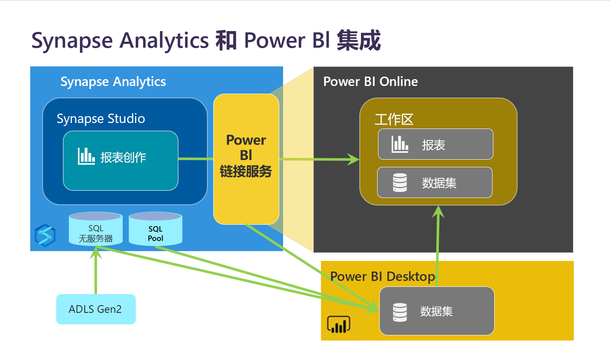

### 任务 1：登录 Power BI

1. 从新的浏览器选项卡，导航到 <https://powerbi.microsoft.com/>。

2. 使用用于登录 Azure 的帐户登录，方法是选择右上角的 **“登录”** 链接。

3. 如果这是你第一次登录此帐户，请使用默认选项完成设置向导。

### 任务 2：创建 Power BI 工作区

1. 选择 **“工作区”**，然后选择 **“创建工作区”**。

    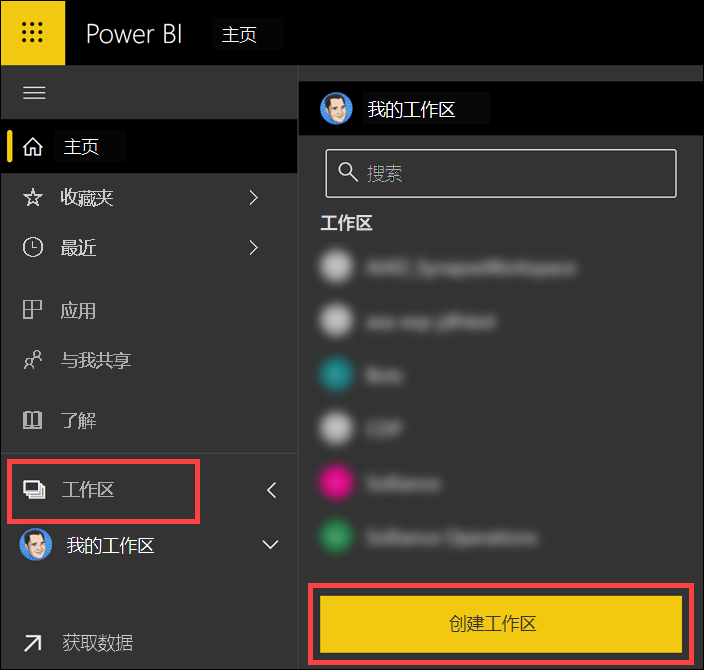

2. 如果系统提示升级到 Power BI Pro，选择 **“免费试用”**。

    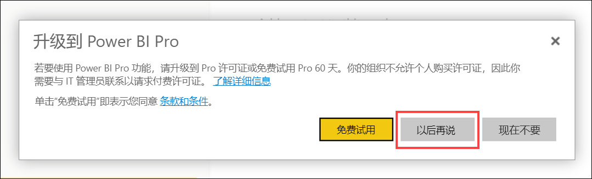

    选择 **“确定”**，以确认 Pro 订阅。

    

3. 将名称设置为 **“synapse-training”**，然后选择 **“保存”**。如果收到消息 `synapse-training` 不可用，请追加你的姓名首字母或其他字符，确保工作区名称在组织中的唯一性。

    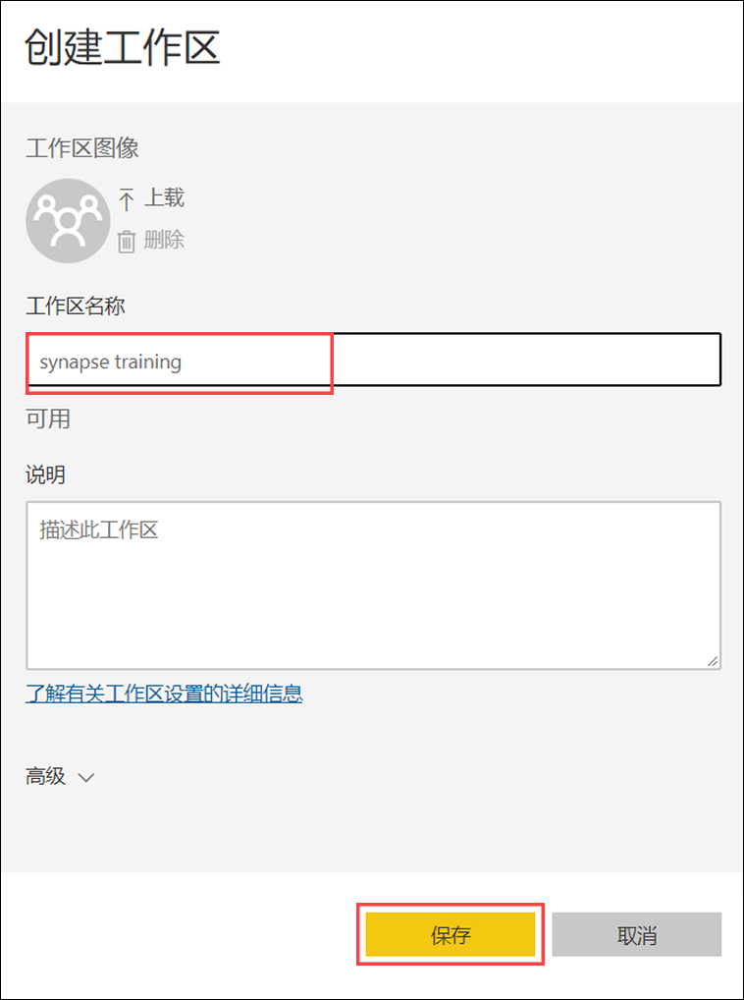

### 任务 3：从 Synapse 连接到 Power BI

1. 打开 Synapse Studio (<https://web.azuresynapse.net/>)，然后导航到 **“管理中心”**。

    

2. 选择左侧菜单上的 **“链接服务”**，然后选择 **“+ 新建”**。

    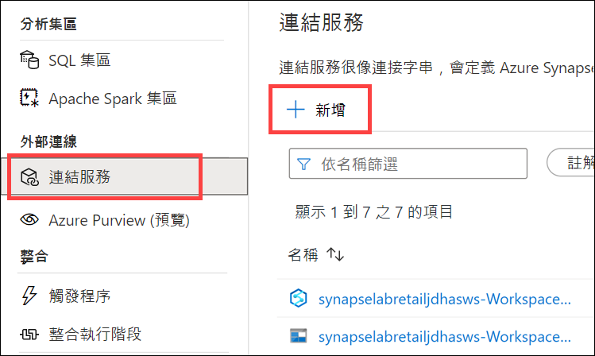

3. 选择 **“Power BI”**，然后选择 **“继续”**。

    

4. 在“数据集属性”表单中，完成以下内容：

    | 字段                          | 值                                              |
    | ------------------------------ | ------------------------------------------         |
    | 名称 | _输入 `handson_powerbi`_ |
    | 工作区名称 | _选择 `synapse-training`_ |

    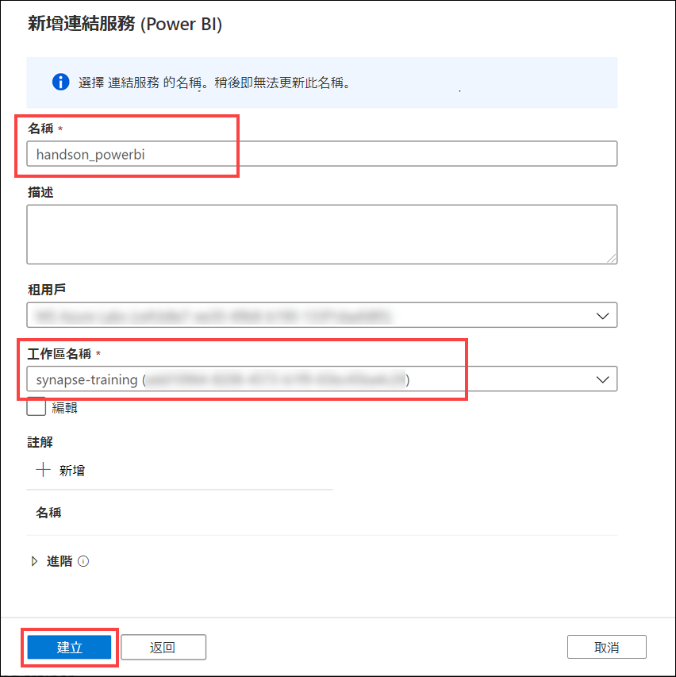

5. 选择 **“创建”**。

6. 选择 **“发布全部”**，然后选择 **“发布”**。

    

### 任务 4：探索 Synapse Studio 中的 Power BI 链接服务

1. 在 [**Azure Synapse Studio**](<https://web.azuresynapse.net/>) 中，使用左侧菜单选项导航到 **“开发”** 中心。

    

2. 展开`Power BI`，展开`handson_powerbi`，并观察到你可直接从 Synapse Studio 访问 Power BI 数据集和报表。

    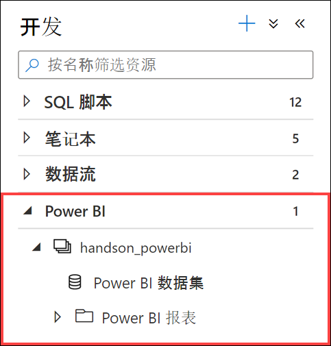

    可以在 **“开发”** 选项卡顶部选择 **“+”** 来创建新报表。可以通过选择报表名称修改现有报表。所有保存的更改都将写回到 Power BI 工作区。

### 任务 5：创建新的数据源以在 Power BI Desktop 中使用

1. 在 **“Power BI”** 下的 Power BI 关联工作区，选择 **“Power BI 数据集”**。

2. 从“使用次数靠前的操作”菜单中选择 **“新建 Power BI 数据集”**。

    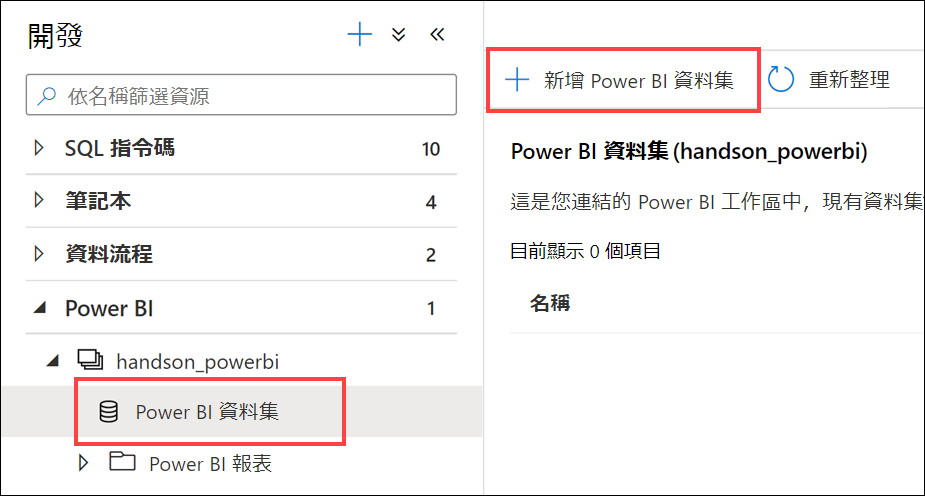

3. 选择 **“开始”** 并确保环境计算机上已安装 Power BI Desktop。

    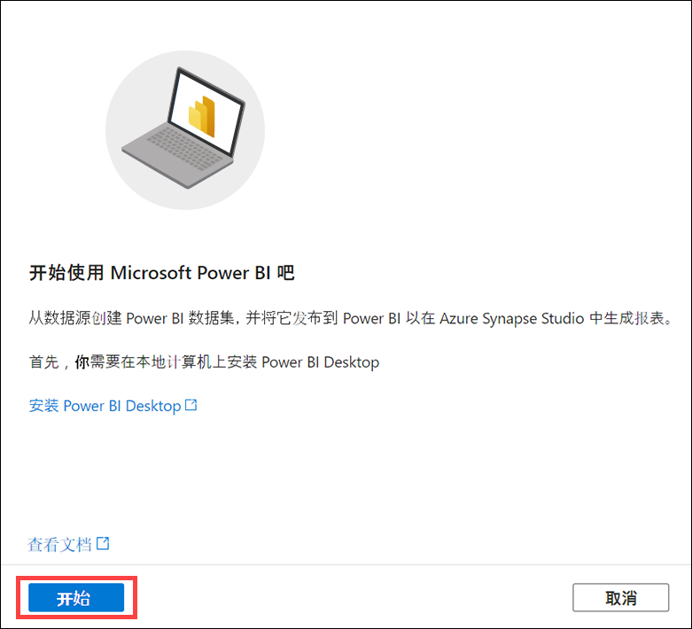

4. 选择 **“SQLPool01”**，然后选择 **“继续”**。

    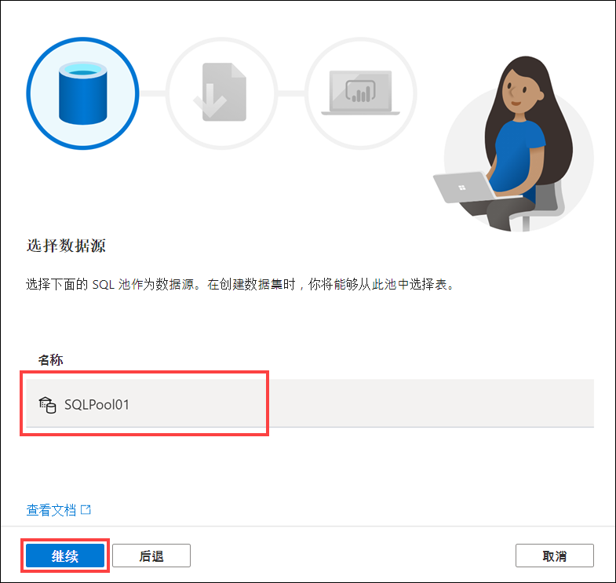

5. 接下来，选择 **“下载”**，下载`.pbids`文件。

    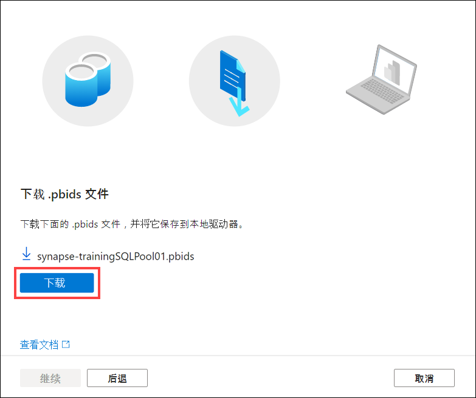

6. 选择 **“继续”**，然后选择 **“关闭并刷新”** 以关闭“发布”对话框。

### 任务 6：在 Synapse Studio 中创建新的 Power BI 报表

1. 在 [**Azure Synapse Studio**](<https://web.azuresynapse.net/>)中，从左侧菜单中选择 **“开发”**。

    

2. 选择 **“+”**，然后选择 **“SQL 脚本”**。

    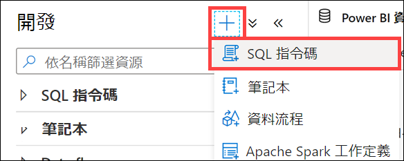

3. 连接到 **SQLPool01**，然后执行以下查询以获得执行时间的近似值（可能为约 1 分钟）。这将是我们用于在此练习稍后创建的 Power BI 报表中引入数据的查询。

    ```sql
    SELECT count(*) FROM
    (
        SELECT
            FS.CustomerID
            ,P.Seasonality
            ,D.Year
            ,D.Quarter
            ,D.Month
            ,avg(FS.TotalAmount) as AvgTotalAmount
            ,avg(FS.ProfitAmount) as AvgProfitAmount
            ,sum(FS.TotalAmount) as TotalAmount
            ,sum(FS.ProfitAmount) as ProfitAmount
        FROM
            wwi.SaleSmall FS
            JOIN wwi.Product P ON P.ProductId = FS.ProductId
            JOIN wwi.Date D ON FS.TransactionDateId = D.DateId
        GROUP BY
            FS.CustomerID
            ,P.Seasonality
            ,D.Year
            ,D.Quarter
            ,D.Month
    ) T
    ```

    应会看到查询结果 194683820。

    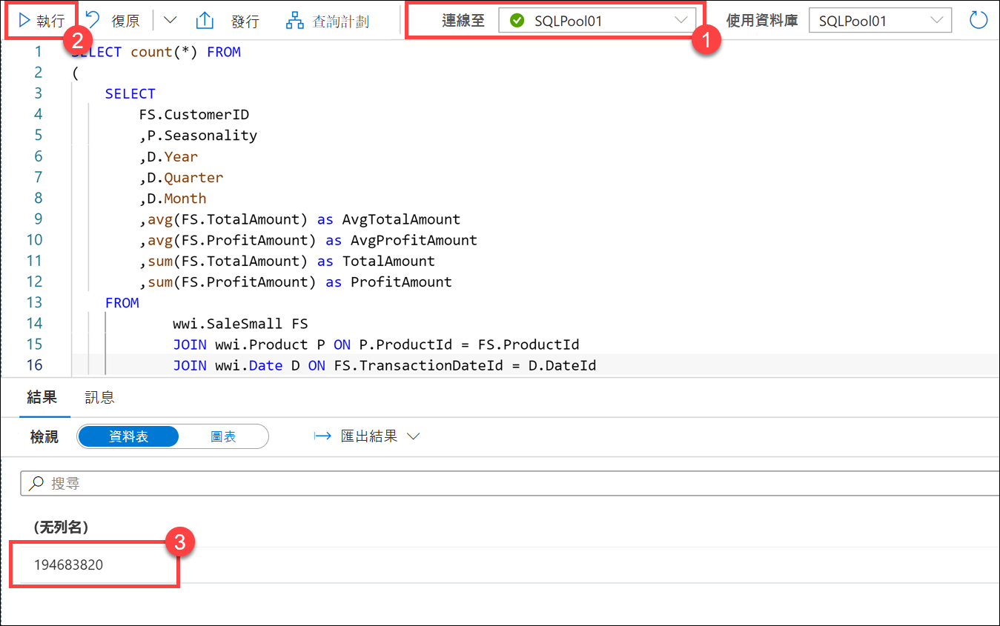

4. 要连接到数据源，打开 Power BI Desktop 中已下载的 .pbids 文件。选择左侧的 **“Microsoft 帐户”** 选项，选择 **“登录”** （使用你用于连接到 Synapse 工作区的相同凭据），然后单击 **“连接”**。

    

5. 在“导航器”对话框中，右键单击根数据库节点，选择 **“转换数据”**。

    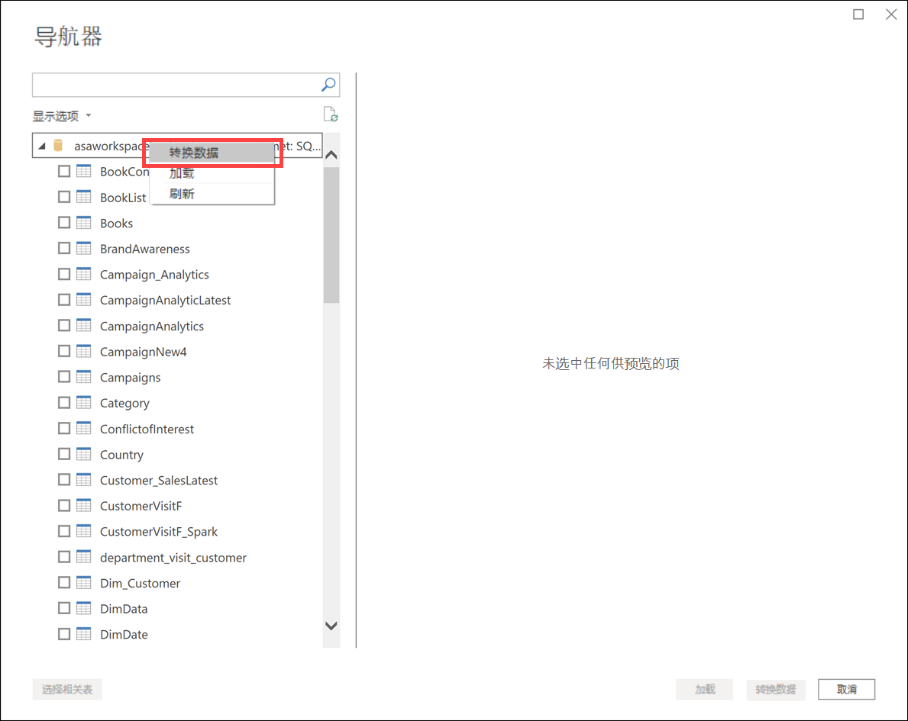

6. 选择“连接设置”对话框中的 **“DirectQuery”** 选项，因为我们的目的不是将数据副本引入 Power BI，而是能够在处理报表可视化时查询数据源。单击 **“确定”** 并在配置连接时等待几秒钟。

    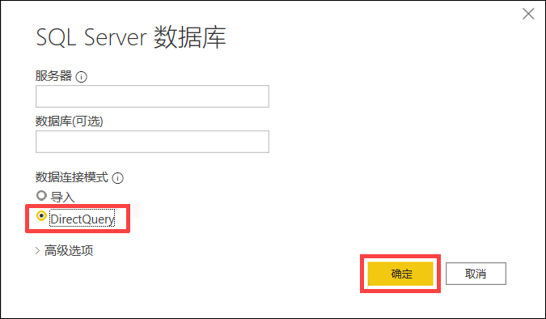

7. 在 Power Query 编辑器中，打开查询中 **“源”**步骤的“设置”页面。展开 **“高级选项”** 部分，粘贴以下查询并单击 **“确定”**。

    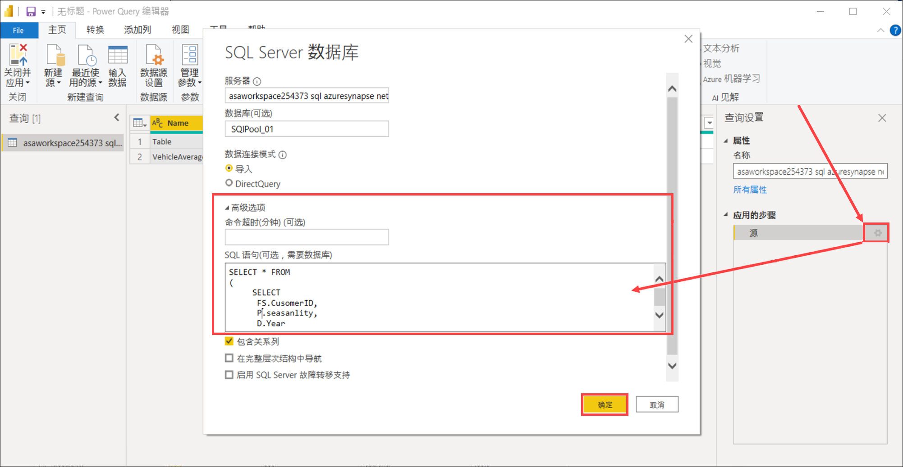

    ```sql
    SELECT * FROM
    (
        SELECT
            FS.CustomerID
            ,P.Seasonality
            ,D.Year
            ,D.Quarter
            ,D.Month
            ,avg(FS.TotalAmount) as AvgTotalAmount
            ,avg(FS.ProfitAmount) as AvgProfitAmount
            ,sum(FS.TotalAmount) as TotalAmount
            ,sum(FS.ProfitAmount) as ProfitAmount
        FROM
            wwi.SaleSmall FS
            JOIN wwi.Product P ON P.ProductId = FS.ProductId
            JOIN wwi.Date D ON FS.TransactionDateId = D.DateId
        GROUP BY
            FS.CustomerID
            ,P.Seasonality
            ,D.Year
            ,D.Quarter
            ,D.Month
    ) T
    ```

    > 请注意此步骤将花至少 40-60 秒才能执行完毕，因为它直接在 Synapse SQL 池连接上提交查询。

8. 在编辑器窗口的左上角上选择 **“关闭并应用”**，应用查询并在“Power BI 设计器”窗口中提取初始架构。

    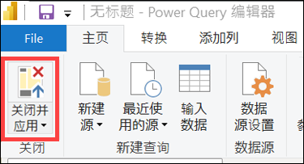

9. 返回 Power BI 报表编辑器，展开右侧的 **“可视化”** 菜单，然后选择 **“折线图和堆积柱形图”** 可视化。

    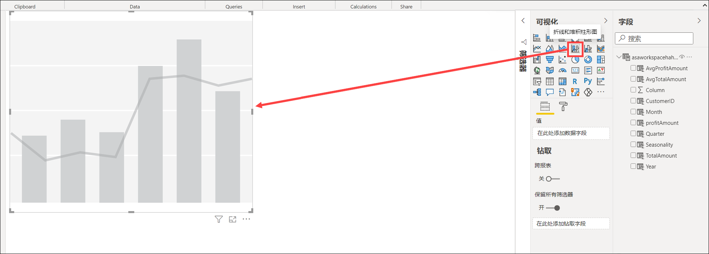

10. 选择新创建的图表以展开其属性窗格。使用展开的 **“字段”** 菜单，配置可视化，如下所示：

     - **共享轴**：`年份`、`季度`
     - **列系列**：`季节性`
     - **列值**：`总金额`
     - **行值**：`利润金额`

    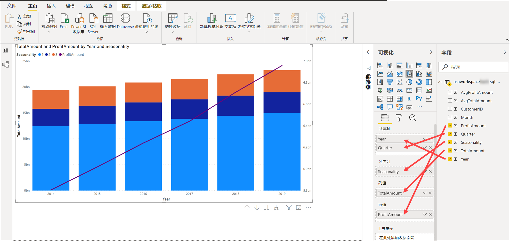

    > 可视化呈现需要约 40-60 秒，因为 Synapse 专用 SQL 池上的实时查询执行。

11. 可以检查在 Power BI Desktop 应用程序中配置可视化时执行的查询。切换回 Synapse Studio，然后从左侧菜单中选择 **“监视”** 中心。

    

12. 在 **“活动”** 部分下，打开 **“SQL 请求”** 监视器。 请确保在池筛选器中选择“SQLPool01”，因为默认情况下选择 **“内置”**。

    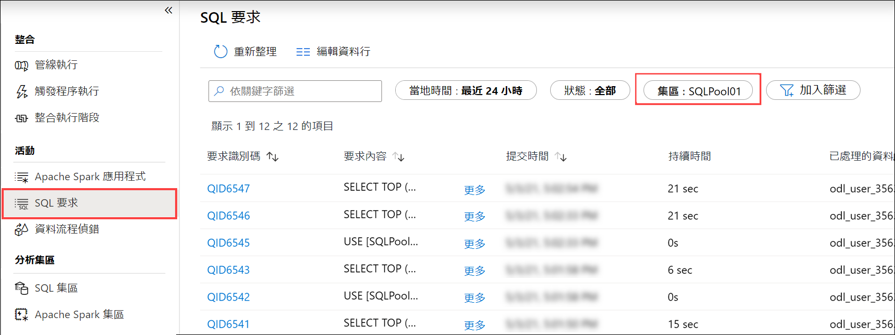

13. 确定记录中频率最高的请求中的可视化后的查询，并观察持续时间（即约 20-30 秒）。选择请求上的 **“更多”**，查看通过 Power BI Desktop 提交的实际查询。

    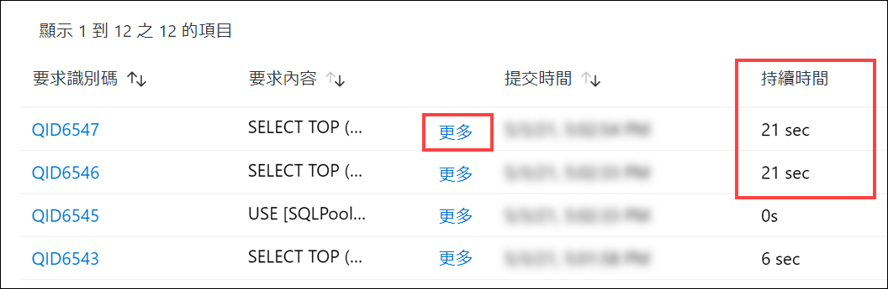

    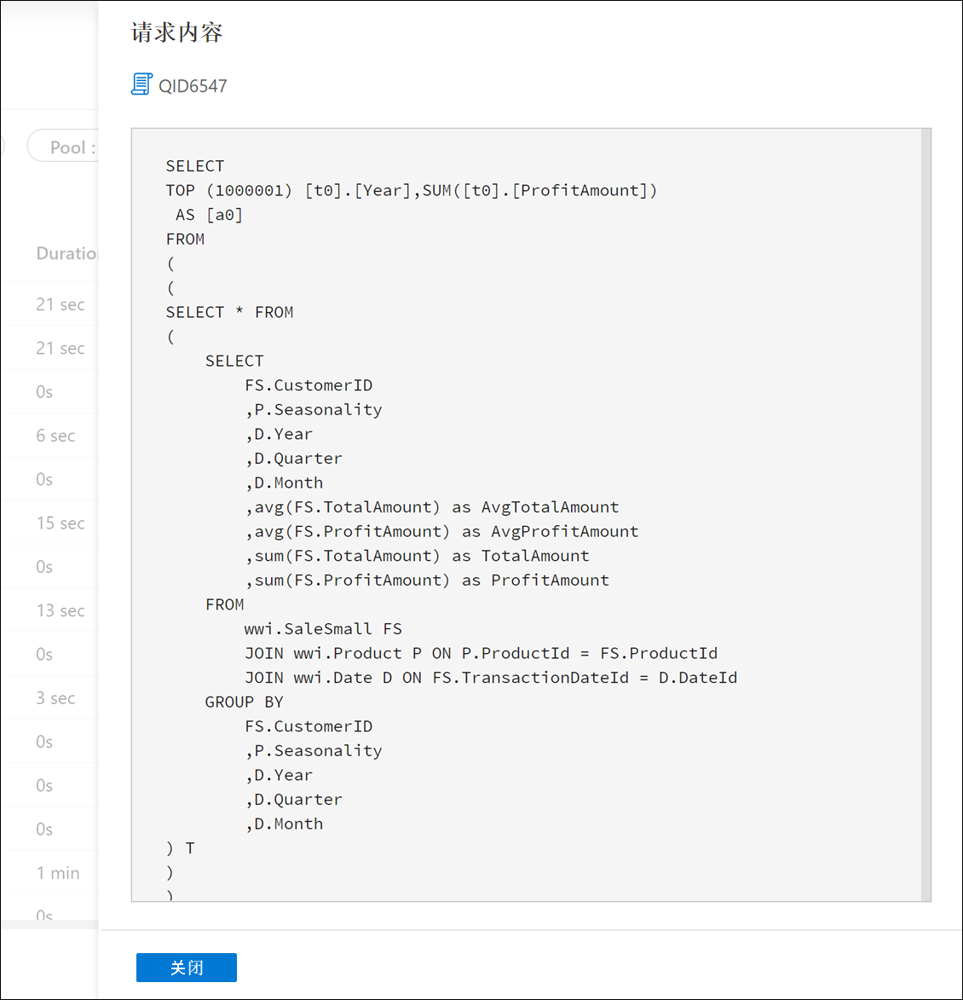

14. 切换回 Power BI Desktop 应用程序，然后单击左上角的 **“保存”**。

    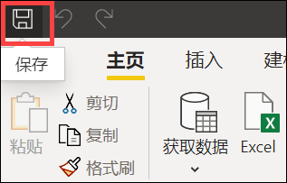

15. 指定文件名称（例如`synapse-lab`），然后单击 **“保存”**

    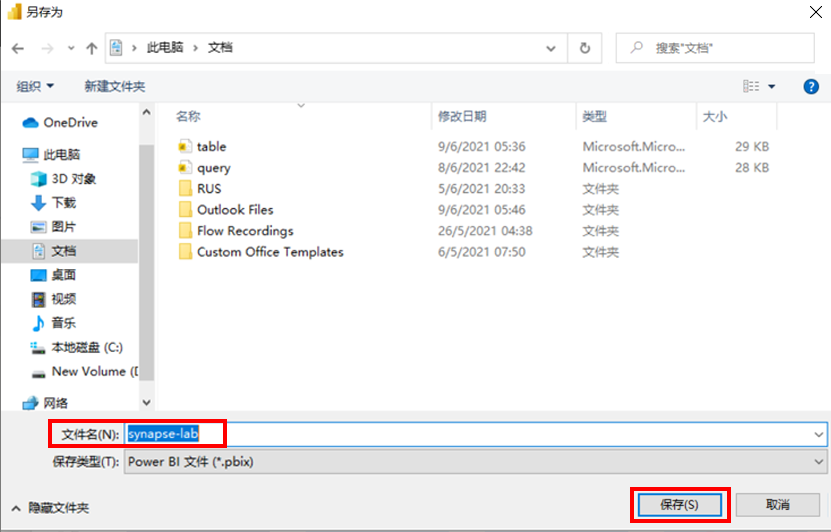

16. 单击已保存报表上方的 **“发布”**。 确保在 Power BI Desktop 中，你已使用在 Power BI 门户和 Synapse Studio 中使用的同一帐户登录。可以从窗口的右上角切换到恰当的帐户。

    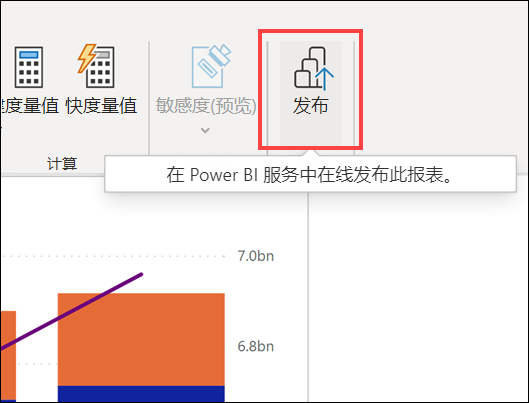

    如果当前未登录到 Power BI Desktop，系统将提示你输入电子邮件地址。使用用于连接到此实验室中的 Azure 门户和 Synapse Studio 的帐户凭据。

    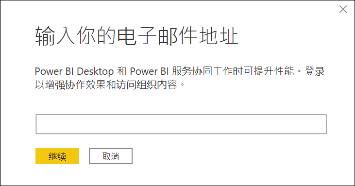

    根据提示登录到你的帐户。

17. 在 **“发布到 Power BI”** 对话框中，选择链接到 Synapse 的工作区（例如 **“synapse-training”**），然后单击 **“选择”**。

    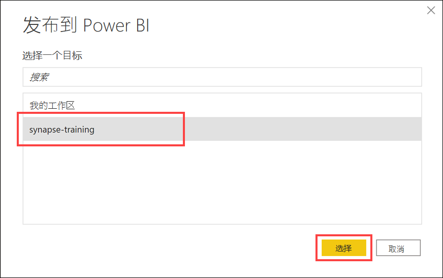

18. 等待发布操作成功完成。

    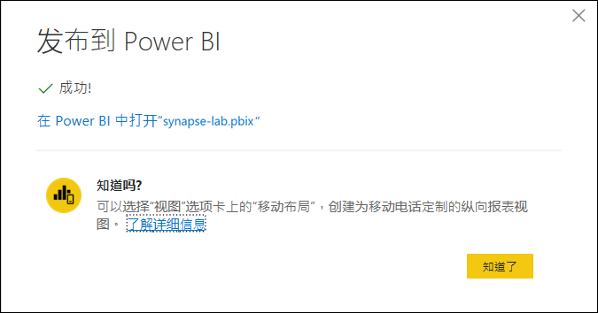

19. 切换回 Power BI 服务，或在新浏览器选项卡中导航到 Power BI 服务（如果之前将其关闭）(<https://powerbi.microsoft.com/>)。

20. 选择你之前创建的 **synapse-training** 工作区。 如果你已将它打开，刷新页面以查看新的报表和数据集。

    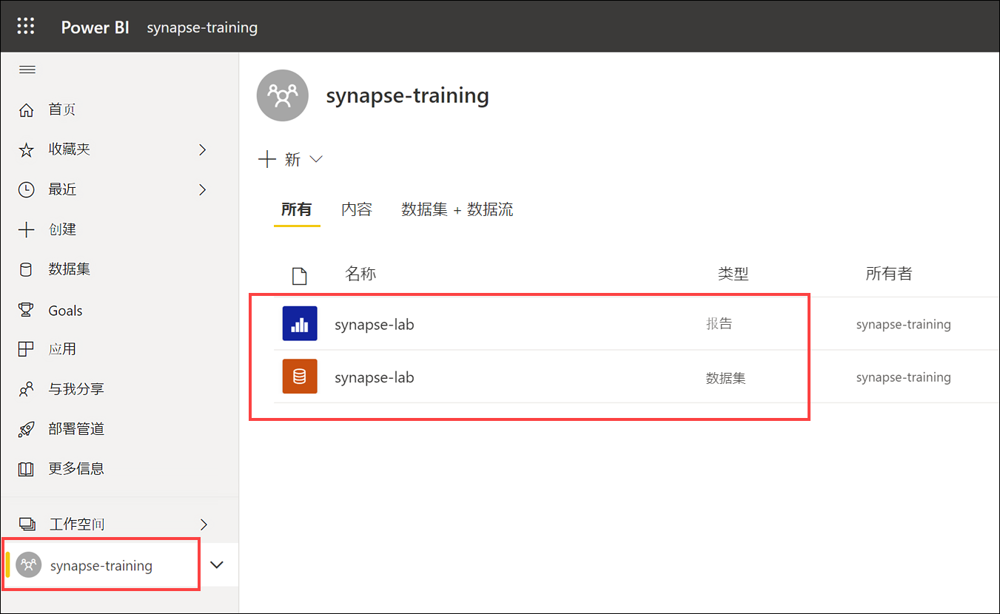

21. 选择页面右上角的 **“设置”** 齿轮图标，然后选择 **“设置”**。如果没看到齿轮图标，需要选择省略号 (...) 查看菜单项。

    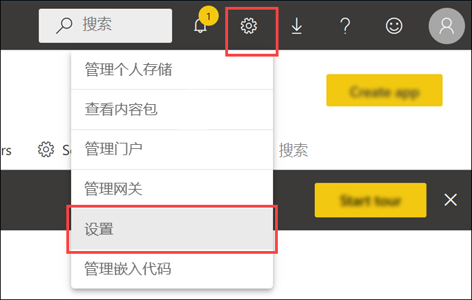

22. 选择 **“数据集”** 选项卡。如果看到 `Data source credentials` 下的错误消息（即“无法刷新数据源，因为凭据无效”），请选择 **“编辑凭据”**。显示此部分可能需要花费几秒钟。

    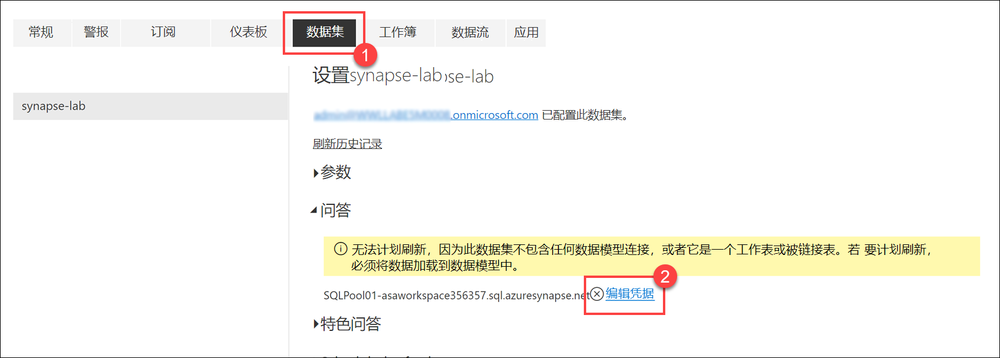

23. 在显示的对话框中，选择 **OAuth2** 身份验证方法，然后选择 **“登录”**。如果出现系统提示，输入凭据。

    

24. 现在你应该能够看到 Synapse Studio 中发布的此报表。切换回 Synapse Studio，选择 **“开发”** 中心，刷新 Power BI 报表节点。

    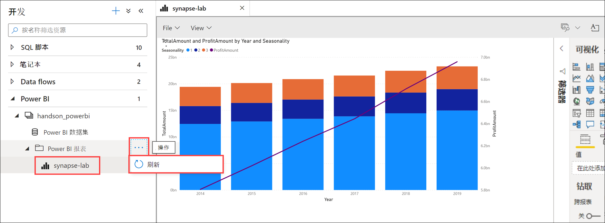

## 练习 2：优化与 Power BI 的集成

### 任务 1：了解 Power BI 优化选项

让我们回顾在 Azure Synapse Analytics 中集成 Power BI 报表时的性能优化选项，在其中，我们可以稍后在此练习中展示结果集缓存和具体化视图选项的使用。

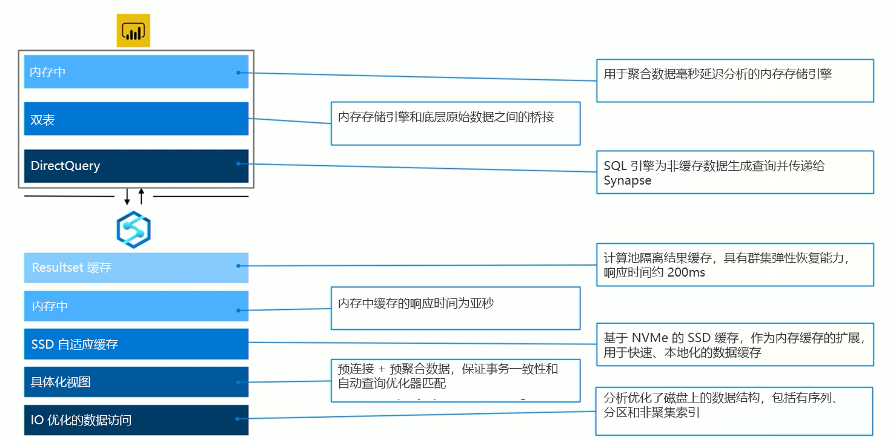

### 任务 2：利用具体化视图提高性能

1. 在 [**Azure Synapse Studio**](<https://web.azuresynapse.net/>)中，从左侧菜单中选择 **“开发”**。

    

2. 选择 **“+”**，然后选择 **“SQL 脚本”**。

    

3. 连接到 **“SQLPool01”**，然后执行以下查询以获取预计的执行计划并观察操作的总成本和数量：

    ```sql
    EXPLAIN
    SELECT * FROM
    (
        SELECT
        FS.CustomerID
        ,P.Seasonality
        ,D.Year
        ,D.Quarter
        ,D.Month
        ,avg(FS.TotalAmount) as AvgTotalAmount
        ,avg(FS.ProfitAmount) as AvgProfitAmount
        ,sum(FS.TotalAmount) as TotalAmount
        ,sum(FS.ProfitAmount) as ProfitAmount
    FROM
        wwi.SaleSmall FS
        JOIN wwi.Product P ON P.ProductId = FS.ProductId
        JOIN wwi.Date D ON FS.TransactionDateId = D.DateId
    GROUP BY
        FS.CustomerID
        ,P.Seasonality
        ,D.Year
        ,D.Quarter
        ,D.Month
    ) T
    ```

4. 结果应如下所示：

    ```xml
    <?xml version="1.0" encoding="utf-8"?>
    <dsql_query number_nodes="1" number_distributions="60" number_distributions_per_node="60">
        <sql>SELECT count(*) FROM
    (
        SELECT
        FS.CustomerID
        ,P.Seasonality
        ,D.Year
        ,D.Quarter
        ,D.Month
        ,avg(FS.TotalAmount) as AvgTotalAmount
        ,avg(FS.ProfitAmount) as AvgProfitAmount
        ,sum(FS.TotalAmount) as TotalAmount
        ,sum(FS.ProfitAmount) as ProfitAmount
    FROM
        wwi.SaleSmall FS
        JOIN wwi.Product P ON P.ProductId = FS.ProductId
        JOIN wwi.Date D ON FS.TransactionDateId = D.DateId
    GROUP BY
        FS.CustomerID
        ,P.Seasonality
        ,D.Year
        ,D.Quarter
        ,D.Month
    ) T</sql>
        <dsql_operations total_cost="10.61376" total_number_operations="12">
    ```

5. 将查询替换为以下内容以创建可支持以上查询的具体化视图：

    ```sql
    IF EXISTS(select * FROM sys.views where name = 'mvCustomerSales')
        DROP VIEW wwi_perf.mvCustomerSales
        GO

    CREATE MATERIALIZED VIEW
        wwi_perf.mvCustomerSales
    WITH
    (
        DISTRIBUTION = HASH( CustomerId )
    )
    AS
    SELECT
        FS.CustomerID
        ,P.Seasonality
        ,D.Year
        ,D.Quarter
        ,D.Month
        ,avg(FS.TotalAmount) as AvgTotalAmount
        ,avg(FS.ProfitAmount) as AvgProfitAmount
        ,sum(FS.TotalAmount) as TotalAmount
        ,sum(FS.ProfitAmount) as ProfitAmount
    FROM
        wwi.SaleSmall FS
        JOIN wwi.Product P ON P.ProductId = FS.ProductId
        JOIN wwi.Date D ON FS.TransactionDateId = D.DateId
    GROUP BY
        FS.CustomerID
        ,P.Seasonality
        ,D.Year
        ,D.Quarter
        ,D.Month
    GO
    ```

    > 此查询需要 60 到 150 秒来完成。
    >
    > 我们先删除此视图（如果此视图存在），以免它在前面的实验室中已存在。

6. 运行以下查询，检查它是否命中已创建的具体化视图。

    ```sql
    EXPLAIN
    SELECT * FROM
    (
        SELECT
        FS.CustomerID
        ,P.Seasonality
        ,D.Year
        ,D.Quarter
        ,D.Month
        ,avg(FS.TotalAmount) as AvgTotalAmount
        ,avg(FS.ProfitAmount) as AvgProfitAmount
        ,sum(FS.TotalAmount) as TotalAmount
        ,sum(FS.ProfitAmount) as ProfitAmount
    FROM
        wwi.SaleSmall FS
        JOIN wwi.Product P ON P.ProductId = FS.ProductId
        JOIN wwi.Date D ON FS.TransactionDateId = D.DateId
    GROUP BY
        FS.CustomerID
        ,P.Seasonality
        ,D.Year
        ,D.Quarter
        ,D.Month
    ) T
    ```

7. 切换回 Power BI Desktop 报表，然后单击报表上方的 **“刷新”** 按钮以提交查询。查询优化器应使用新的具体化视图。

    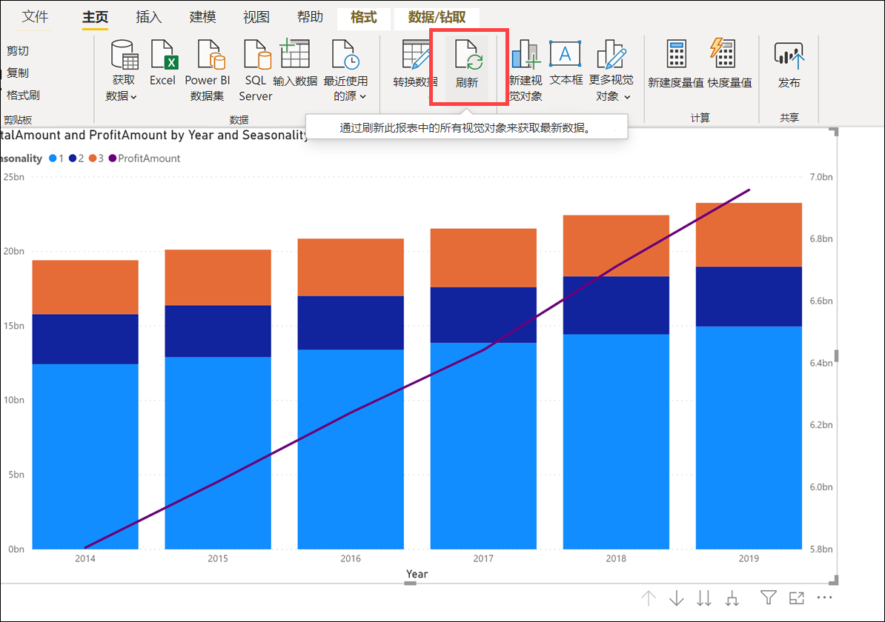

    > 请注意与以前相比数据刷新现在只需几秒钟。

8. 再次查看 Synapse Studio 的监视中心中“SQL 请求”下查询的持续时间。请注意使用新的具体化视图的 Power BI 查询运行快得多（持续时间约 10 秒）

    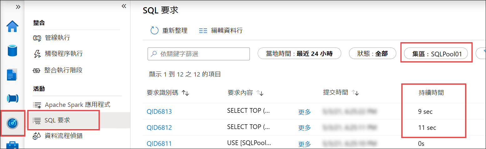

### 任务 3：通过结果集缓存提高性能

1. 在 [**Azure Synapse Studio**](<https://web.azuresynapse.net/>)中，从左侧菜单中选择 **“开发”**。

    

2. 选择 **“+”**，然后选择 **“SQL 脚本”**。

    

3. 连接到 **“SQLPool01”**，然后执行以下查询，检查当前 SQL 池中是否已启用结果集缓存：

    ```sql
    SELECT
        name
        ,is_result_set_caching_on
    FROM
        sys.databases
    ```

4. 如果针对`SQLPool01`返回 `False`，请执行以下查询以激活它（需要在`主`数据库上运行它）：

    ```sql
    ALTER DATABASE [SQLPool01]
    SET RESULT_SET_CACHING ON
    ```

    连接到 **SQLPool01**，使用**主**数据库：

    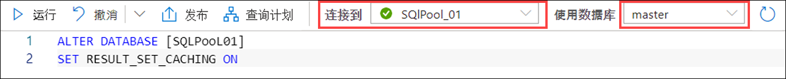

    > 此过程需要几分钟时间完成。在运行过程中，请继续阅读，熟悉剩下的实验室内容。
    
    >**重要提示**
    >
    >用于创建结果集缓存和从缓存中检索数据的操作发生在 Synapse SQL 池实例的控制节点上。当结果集缓存处于打开状态时，运行返回大型结果集（例如，超过 1 GB）的查询可能会导致控制节点上带宽限制较高，并降低实例上的整体查询响应速度。这些查询通常在数据浏览或 ETL 操作过程中使用。若要避免对控制节点造成压力并导致性能问题，用户应在运行此类查询之前关闭数据库的结果集缓存。

5. 然后返回 Power BI Desktop 报表并点击 **“刷新”** 按钮以再次提交查询。

    

6. 数据刷新后，点击 **“再次刷新”**，确保我们命中结果集缓存。

7. 在 Synapse Studio 的“监视中心 - SQL 请求”页面中再次查看查询的持续时间。请注意现在它几乎即时运行（持续时间 = 0 秒）。

    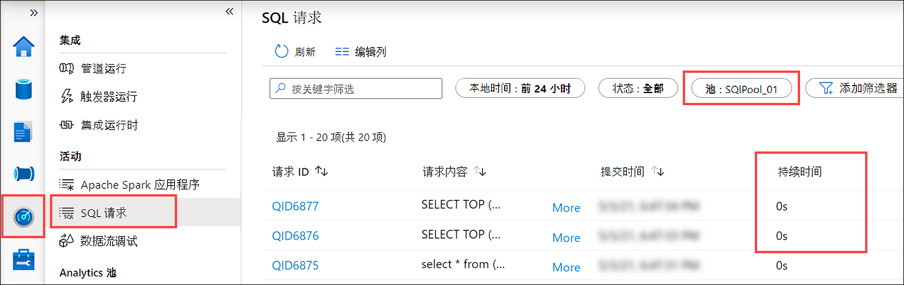

8. 返回 SQL 脚本（或创建新脚本，如果已将其关闭），在主数据库上运行以下内容，同时连接到专用 SQL 池以关闭结果集缓存：

    ```sql
    ALTER DATABASE [SQLPool01]
    SET RESULT_SET_CACHING OFF
    ```

    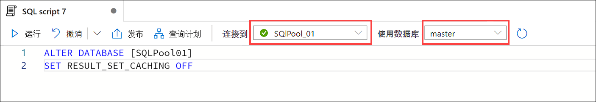

## 练习 3：通过 SQL 无服务器可视化数据


### 任务 1：了解 SQL 无服务器的数据湖

首先，让我们通过了解将用于可视化的数据源准备 Power BI 报表。在此练习中，我们将使用来自 Synapse 工作区的按需 SQL 实例。

1. 在 [Azure Synapse Studio](https://web.azuresynapse.net) 中，导航到 **“数据”** 中心。

    

2. 选择 **“链接”** 选项卡。在 **“Azure Data Lake Storage Gen2”** 组下，选择主 Data Lake（第一个节点） **(2)**，选择 **wwi-02** 容器 **(3)**。导航到 **`wwi-02/sale-small/Year=2019/Quarter=Q1/Month=1/Day=20190101`(4)**。右键单击 Parquet 文件 **(5)**，选择 **“新建 SQL 脚本”(6)**，然后选择 **“前 100 行”(7)**。

    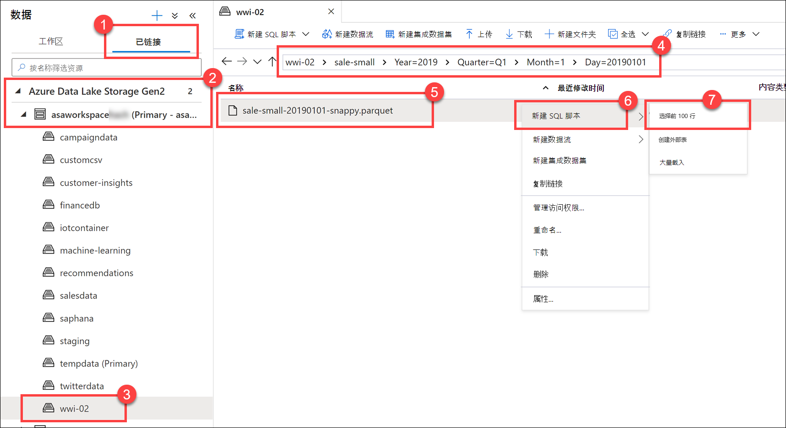

3. 运行生成的脚本以预览存储在 Parquet 文件中的数据。

    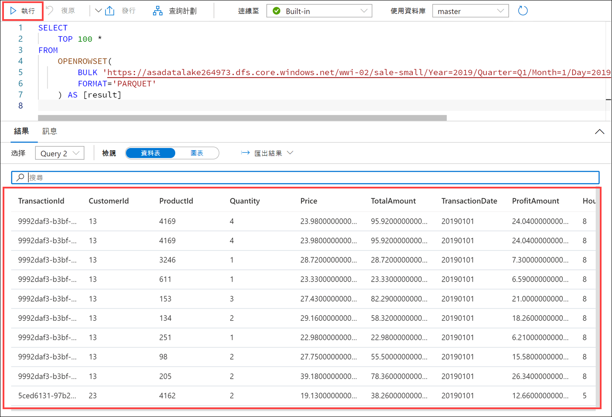

4. **复制**查询中主数据湖存储帐户的名称并将其保存在记事本或相似的文本编辑器中。下一步需要用到此值。

    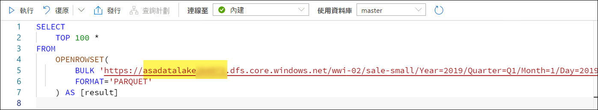

5. 现在让我们准备接下来要在 Power BI 报表中使用的查询。查询将提取总金额以及给定月的每日利润。让我们以 2019 年 1 月为例。请注意文件路径的通配符的使用，它将引用对应于一个月的所有文件。在按需 SQL 实例上粘贴并运行以下查询，将 **`YOUR_STORAGE_ACCOUNT_NAME`** **替换**为你在上方复制的存储帐户的名称：

    ```sql
    DROP DATABASE IF EXISTS demo;
    GO

    CREATE DATABASE demo;
    GO

    USE demo;
    GO

    CREATE VIEW [2019Q1Sales] AS
    SELECT
        SUBSTRING(result.filename(), 12, 4) as Year
        ,SUBSTRING(result.filename(), 16, 2) as Month
        ,SUBSTRING(result.filename(), 18, 2) as Day
        ,SUM(TotalAmount) as TotalAmount
        ,SUM(ProfitAmount) as ProfitAmount
        ,COUNT(*) as TransactionsCount
    FROM
        OPENROWSET(
            BULK 'https://YOUR_STORAGE_ACCOUNT_NAME.dfs.core.windows.net/wwi-02/sale-small/Year=2019/Quarter=Q1/Month=1/*/*.parquet',
            FORMAT='PARQUET'
        ) AS [result]
    GROUP BY
        [result].filename()
    GO
    ```

    应会看到如下所示的查询输出：

    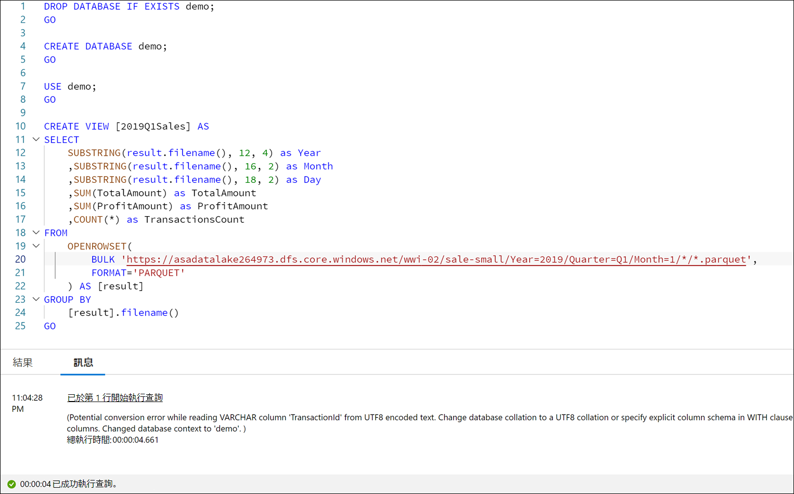

6. 将查询替换为以下内容以从创建的新视图中选择：

    ```sql
    USE demo;

    SELECT TOP (100) [Year]
    ,[Month]
    ,[Day]
    ,[TotalAmount]
    ,[ProfitAmount]
    ,[TransactionsCount]
    FROM [dbo].[2019Q1Sales]
    ```

    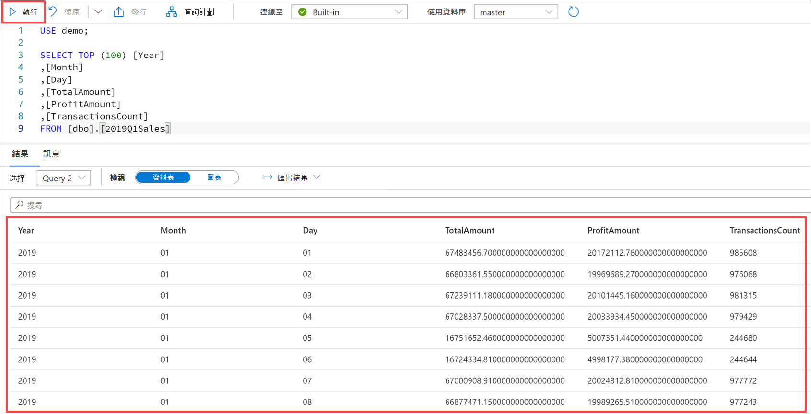

7. 导航到左侧菜单中的 **“数据”** 中心。

    

8. 选择 **“工作区”** 选项卡 **(1)**，右键单击 **“数据库”** 组，选择 **“刷新”** 以更新数据库列表。展开“数据库”组，展开你创建的新的 **“演示（按需 SQL）”** 数据库 **(2)**。应该看到“视图”组 **(3)** 中列出的 **dbo.2019Q1Sales** 视图。

    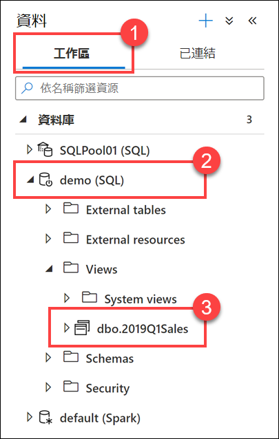

    > **备注**
    >
    > Synapse 无服务器 SQL 数据库仅用于查看元数据，而不用于实际数据。

### 任务 2：通过 SQL 无服务器可视化数据并创建 Power BI 报表

1. 在 [Azure 门户](https://portal.azure.com)中，导航到 Synapse 工作区。在 **“概述”** 选项卡中，**复制**无服务器 SQL 终结点：

    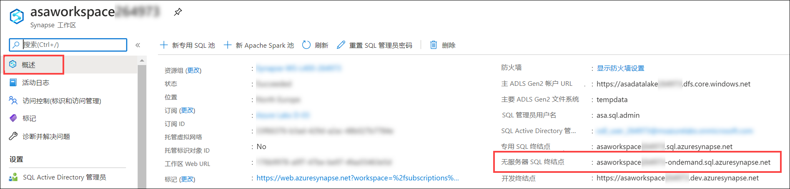

2. 切换回 Power BI Desktop。创建新报表，然后单击 **“获取数据”**。

    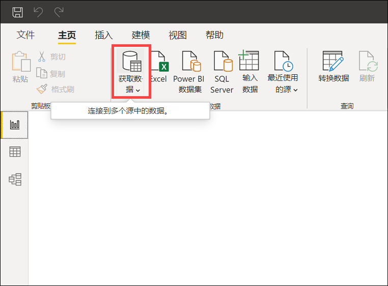

3. 选择左侧菜单上的 **“Azure”**，然后选择 **“Azure Synapse Analytics (SQL DW)”**。最后单击 **“连接”**：

    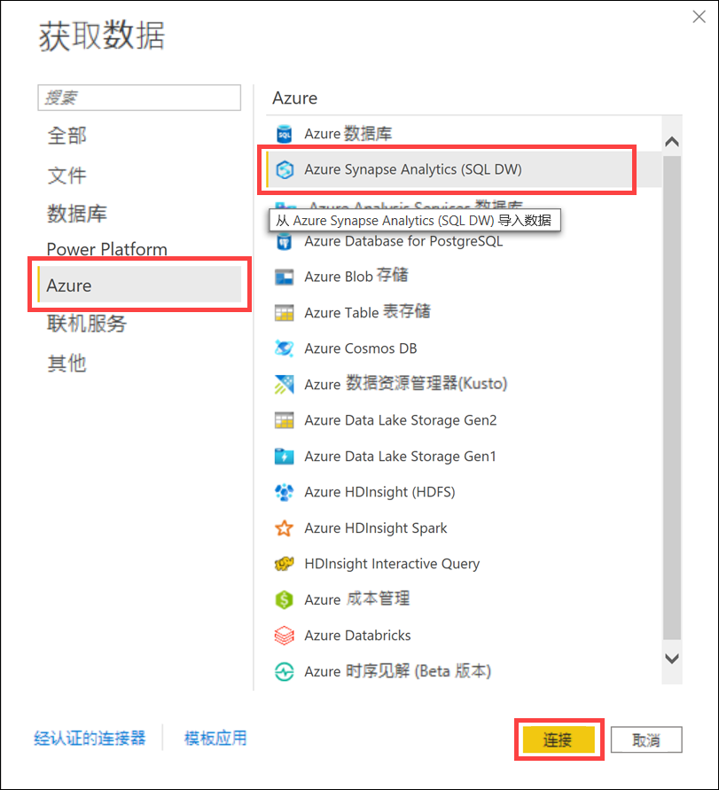

4. 将第一步中确定的无服务器 SQL 终结点的终结点粘贴到 **“服务器”** 字段 **(1)**，针对 **“数据库”(2)** 输入 **`演示`**，选择 **“DirectQuery”(3)**，然后**将以下查询粘贴到 (4)** “SQL Server 数据库”对话框的展开的 **“高级选项”** 部分。最后，单击 **“确定”(5)**。

    ```sql
    SELECT TOP (100) [Year]
    ,[Month]
    ,[Day]
    ,[TotalAmount]
    ,[ProfitAmount]
    ,[TransactionsCount]
    FROM [dbo].[2019Q1Sales]
    ```

    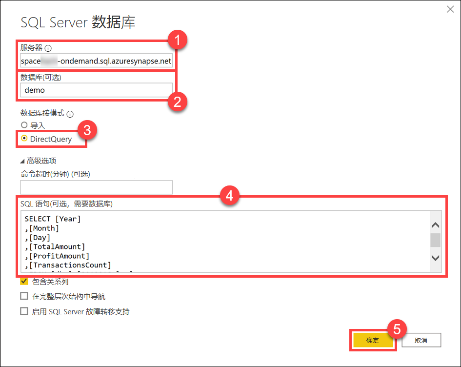

5. （如果出现提示）选择左侧的 **“Microsoft 帐户”** 选项，选择 **“登录”** （使用你用于连接到 Synapse 工作区的相同凭据），然后单击 **“连接”**。

    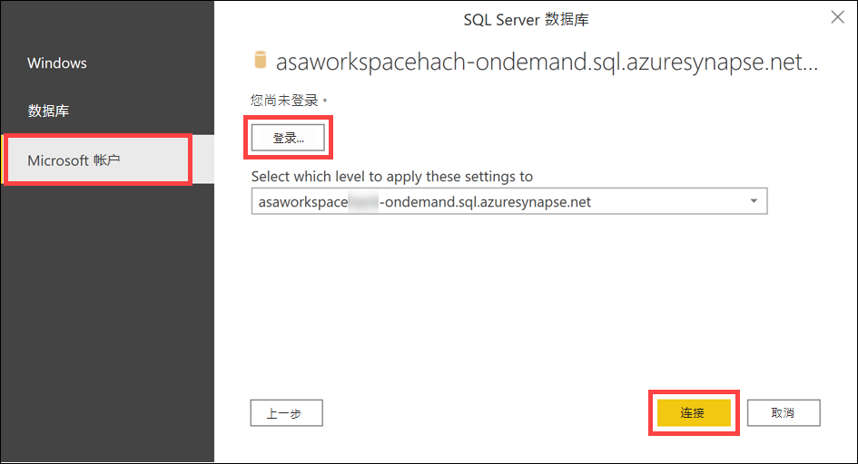

6. 在“预览数据”窗口中选择 **“加载”**，等待配置连接。

    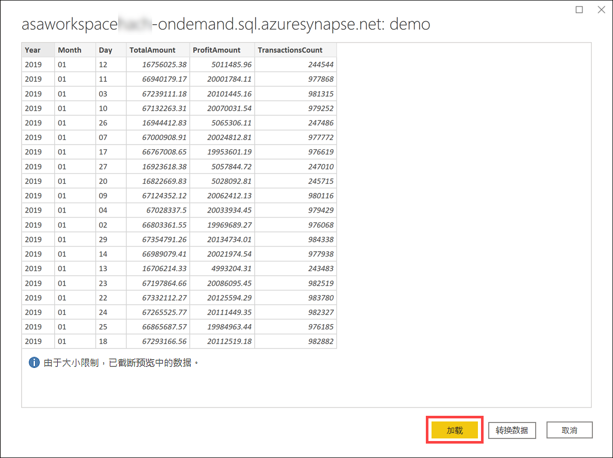

7. 加载数据后，从 **“可视化”** 菜单中选择 **“折线图”**。

    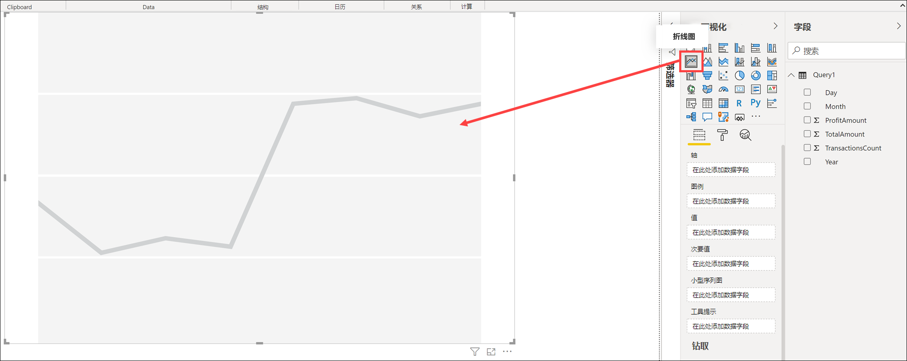

8. 选择折线图可视化，并将其配置为以下内容，以显示每日“利润”、“金额”和“交易数”：

    - **轴**： `Day`
    - **值**：`ProfitAmount`、`TotalAmount`
    - **次要值**： `TransactionsCount`

    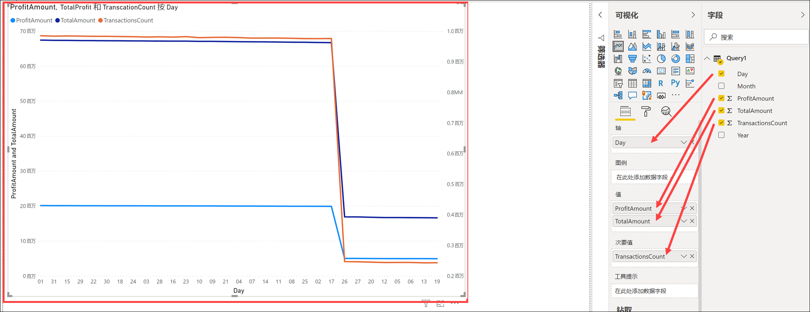

9. 选择折线图可视化并将其配置为根据交易日按升序排序。为此，选择图表可视化旁的 **“更多选项”**。

    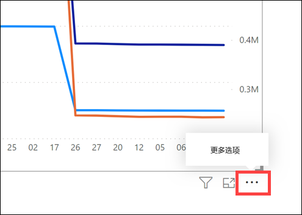

    选择 **“按升序排序”**。

    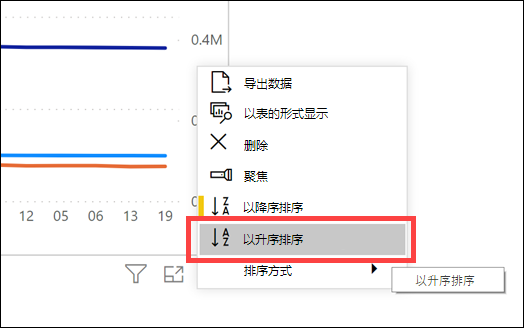

    再次选择图表可视化旁的 **“更多选项”**。

    

    依次选择 **“排序依据”**、 **“日”**。

    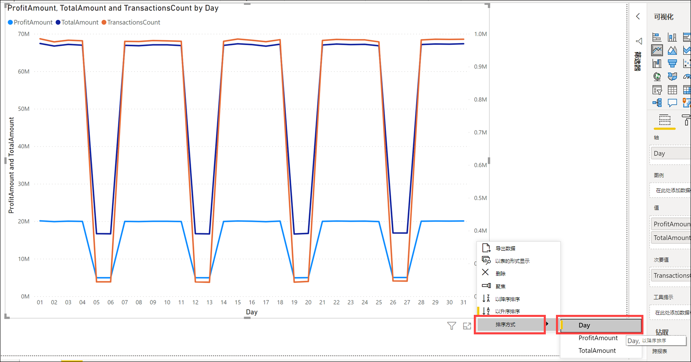

10. 单击左上角的 **“保存”**。

    

11. 指定文件名称（例如 `synapse-sql-serverless`），然后单击 **“保存”**

    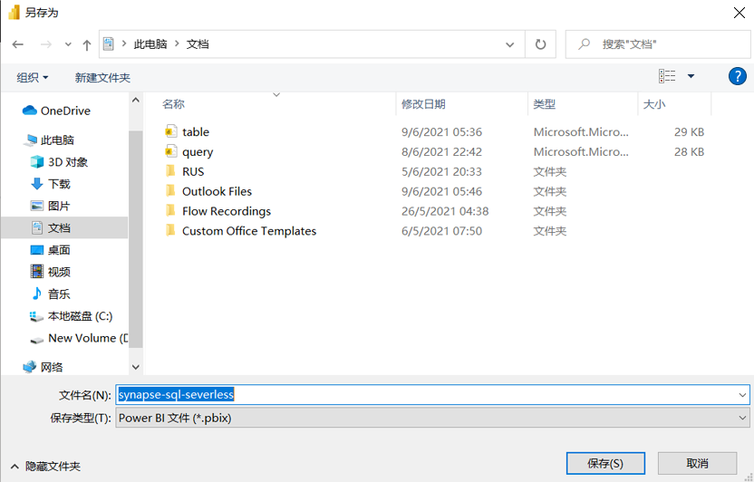

12. 单击已保存报表上方的 **“发布”**。 确保在 Power BI Desktop 中，你已使用在 Power BI 门户和 Synapse Studio 中使用的同一帐户登录。可以从窗口的右上角切换到恰当的帐户。在 **“发布到 Power BI”** 对话框中，选择链接到 Synapse 的工作区（例如 **“synapse-training”**），然后单击 **“选择”**。

    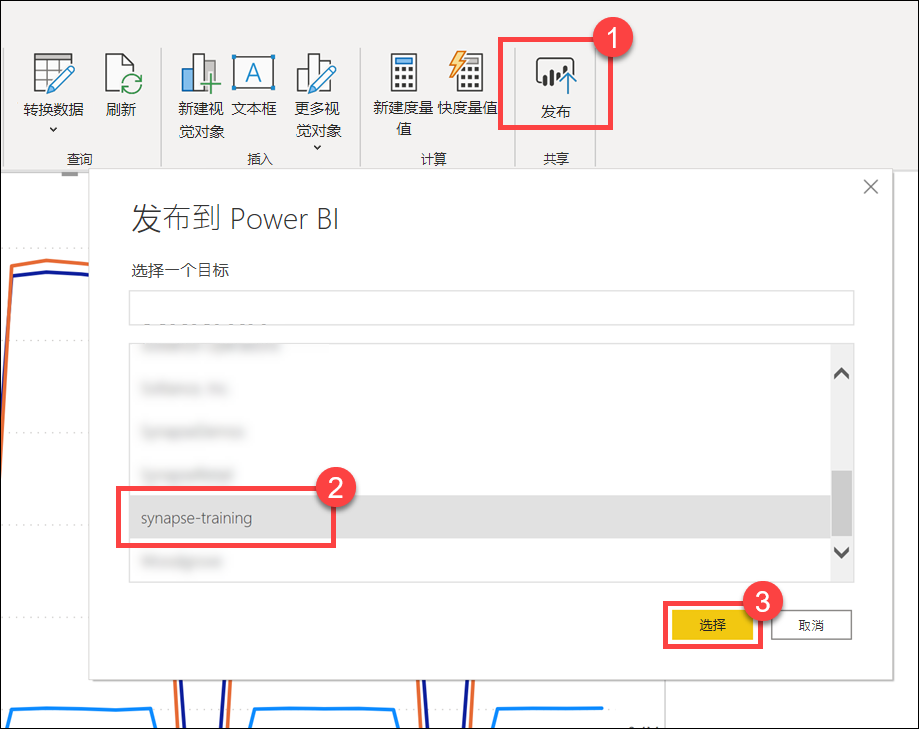

13. 等待发布操作成功完成。

    


14. 切换回 Power BI 服务，或在新浏览器选项卡中导航到 Power BI 服务（如果之前将其关闭）(<https://powerbi.microsoft.com/>)。

15. 选择你之前创建的 **synapse-training** 工作区。如果你已将它打开，刷新页面以查看新的报表和数据集。

    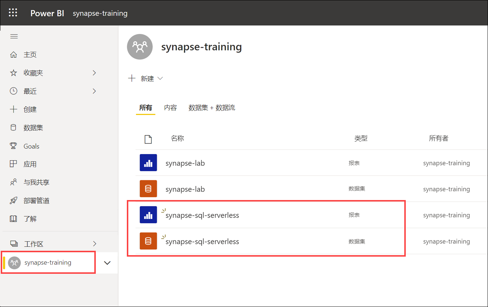

16. 选择页面右上角的 **“设置”** 齿轮图标，然后选择 **“设置”**。如果没看到齿轮图标，需要选择省略号 (...) 查看菜单项。

    

17. 选择 **“数据集”** 选项卡 **(1)**，然后选择 **“synapse-sql-serverless”** 数据集 **(2)**。如果看到`Data source credentials`下的错误消息（即“无法刷新数据源，因为凭据无效”），请选择 **“编辑凭据”(3)**。显示此部分可能需要花费几秒钟。

    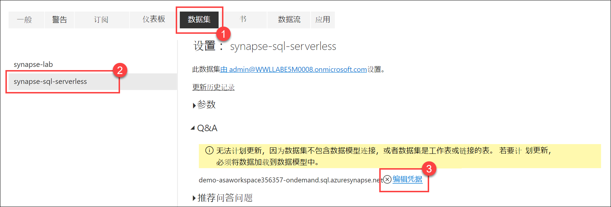

18. 在显示的对话框中，选择 OAuth2 身份验证方法，然后选择“登录”。如果出现系统提示，输入凭据。

    

19. 在 [Azure Synapse Studio](https://web.azuresynapse.net) 中，导航到 **“开发”** 中心。

    

20. 展开 Power BI 组，展开 Power BI 链接服务（例如`handson_powerbi`），右键单击 **“Power BI 报表”**，然后选择 **“刷新”** 来更新报表列表。应看到此实验室中创建的两个 Power BI 报表（`synapse-lab`和`synapse-sql-serverless`）。

    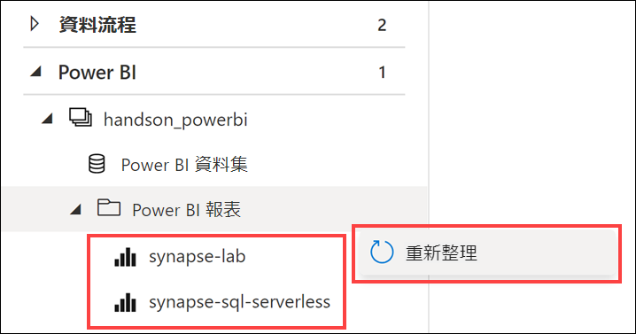

21. 选择 **`synapse-lab`** 报表。 可在 Synapse Studio 中直接查看和编辑报表！

    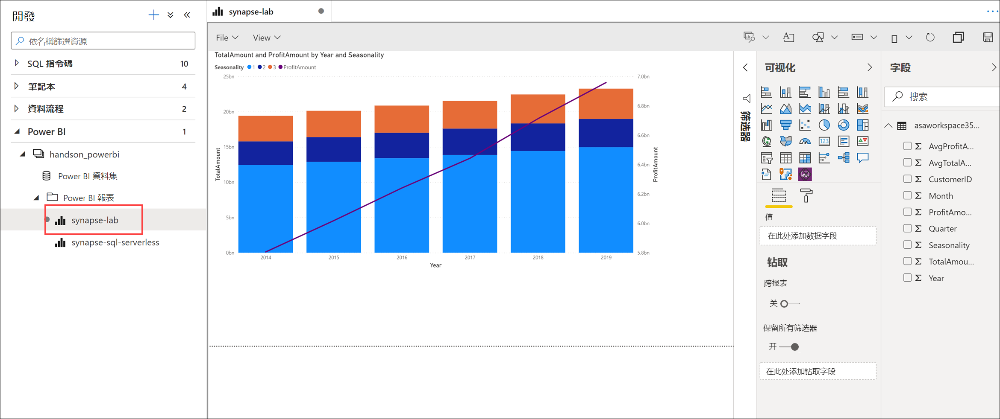

22. 选择 **`synapse-sql-serverless`** 报表。应也能够查看和编辑此报表。

    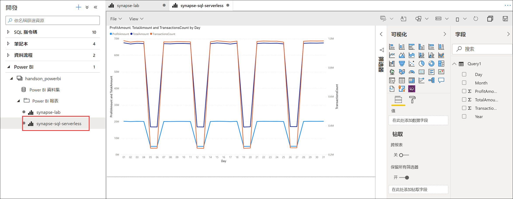
