# 模块 17 - 在 Azure Synapse Analytics 中执行集成的机器学习过程

本实验室演示 Azure Synapse Analytics 中集成的端到端 Azure 机器学习和 Azure 认知服务体验。你将了解如何使用链接服务将 Azure Synapse Analytics 工作区连接到 Azure 机器学习工作区，然后触发自动化 ML 试验来使用 Spark 表中的数据。还将了解如何使用 Azure 机器学习或 Azure 认知服务中经过训练的模型来扩充 SQL 池表中的数据，然后使用 Power BI 提供预测结果。

完成实验室后，你将了解以 Azure Synapse Analytics 与 Azure 机器学习的集成为基础构建的端到端机器学习过程的主要步骤。

## 实验室详细信息

- [模块 17 - 在 Azure Synapse Analytics 中执行集成的机器学习过程](#module-17---perform-integrated-machine-learning-processes-in-azure-synapse-analytics)
  - [实验室详细信息](#lab-details)
  - [先决条件](#pre-requisites)
  - [动手实验室准备工作](#before-the-hands-on-lab)
    - [任务 1：创建并配置 Azure Synapse Analytics 工作区](#task-1-create-and-configure-the-azure-synapse-analytics-workspace)
    - [任务 2：为本实验室创建并配置其他资源](#task-2-create-and-configure-additional-resources-for-this-lab)
  - [练习 0：启动专用 SQL 池](#exercise-0-start-the-dedicated-sql-pool)
  - [练习 1：创建 Azure 机器学习链接服务](#exercise-1-create-an-azure-machine-learning-linked-service)
    - [任务 1：在 Synapse Studio 中创建并配置 Azure 机器学习链接服务](#task-1-create-and-configure-an-azure-machine-learning-linked-service-in-synapse-studio)
    - [任务 2：在 Synapse Studio 中探索 Azure 机器学习集成功能](#task-2-explore-azure-machine-learning-integration-features-in-synapse-studio)
  - [练习 2：触发使用 Spark 表中的数据的自动 ML 试验](#exercise-2-trigger-an-auto-ml-experiment-using-data-from-a-spark-table)
    - [任务 1：在 Spark 表上触发回归自动 ML 试验](#task-1-trigger-a-regression-auto-ml-experiment-on-a-spark-table)
    - [任务 2：在 Azure 机器学习工作区工作区中查看实验室详细信息](#task-2-view-experiment-details-in-azure-machine-learning-workspace)
  - [练习 3：使用经过训练的模型扩充数据](#exercise-3-enrich-data-using-trained-models)
    - [任务 1：使用 Azure 机器学习中经过训练的模型扩充 SQL 池表中的数据](#task-1-enrich-data-in-a-sql-pool-table-using-a-trained-model-from-azure-machine-learning)
    - [任务 2：使用 Azure 认知服务中经过训练的模型扩充 Spark 表中的数据](#task-2-enrich-data-in-a-spark-table-using-a-trained-model-from-azure-cognitive-services)
    - [任务 3：在 Synapse 管道中集成基于机器学习的扩充过程](#task-3-integrate-a-machine-learning-based-enrichment-procedure-in-a-synapse-pipeline)
  - [练习 4：使用 Power BI 提供预测结果](#exercise-4-serve-prediction-results-using-power-bi)
    - [任务 1：在 Power BI 报表中显示预测结果](#task-1-display-prediction-results-in-a-power-bi-report)
  - [练习 5：清理](#exercise-5-cleanup)
    - [任务 1：暂停专用 SQL 池](#task-1-pause-the-dedicated-sql-pool)
  - [资源](#resources)

## 先决条件

在实验室计算机或 VM 上安装 [Power BI Desktop](https://www.microsoft.com/download/details.aspx?id=58494)。

## 动手实验室准备工作

> **备注：** 如果**不**使用托管实验室环境，而使用你自己的 Azure 订阅，则仅完成`Before the hands-on lab`步骤。否则，请跳转到练习 0。

在分步完成此实验室中的练习之前，请确保你已正确配置了 Azure Synapse Analytics 工作区。执行以下步骤以配置工作区。

### 任务 1：创建并配置 Azure Synapse Analytics 工作区

>**备注**
>
>如果在运行该存储库中提供的另一个实验室时已经创建并配置了 Synapse Analytics 工作区，则不得再次执行此任务，并且可以继续执行下一个任务。实验室设计为共享 Synapse Analytics 工作区，因此只需要创建一次该工作区。

**如果不使用托管实验室环境**，请按照[部署 Azure Synapse Analytics 工作区](https://github.com/solliancenet/microsoft-data-engineering-ilt-deploy/blob/main/setup/17/asa-workspace-deploy.md)中的说明创建并配置工作区。

### 任务 2：为本实验室创建并配置其他资源

**如果未使用托管实验室环境**，请按照[为实验室 01 部署资源](https://github.com/solliancenet/microsoft-data-engineering-ilt-deploy/blob/main/setup/17/lab-01-deploy.md)中的说明，为本实验室部署其他资源。部署完成后，便可以继续本实验室中的练习。

## 练习 0：启动专用 SQL 池

本实验室使用专用 SQL 池。第一步是确保它没有暂停。如果暂停，请按照以下说明启动它：

1. 打开 Synapse Studio (<https://web.azuresynapse.net/>)。

2. 选择 **“管理”** 中心。

    

3. 在左侧菜单中，选择 **“SQL 池”** **(1)**。如果专用 SQL 池已暂停，请将鼠标悬停在池名称上并选择 **“恢复”(2)**。

    

4. 出现提示时，选择 **“恢复”**。恢复池可能需要一到两分钟。

    

> 恢复专用 SQL 池后，**请继续下一个练习**。

## 练习 1：创建 Azure 机器学习链接服务

在此练习中，你将在 Synapse Studio 中创建并配置 Azure 机器学习链接服务。链接服务可用后，可在 Synapse Studio 中探索 Azure 机器学习集成功能。

### 任务 1：在 Synapse Studio 中创建并配置 Azure 机器学习链接服务

Synapse Analytics 链接服务使用服务主体向 Azure 机器学习进行身份验证。服务主体基于名为 `Azure Synapse Analytics GA Labs` 的 Azure Active Directory 应用程序，并已通过部署过程创建完毕。还创建了与服务主体关联的机密，并将其保存在 Azure Key Vault 实例中的 `ASA-GA-LABS` 名称下。

>**备注**
>
>在此存储库提供的实验室中，Azure AD 应用程序用于单个 Azure AD 租户，这意味着该应用程序仅有一个与其关联的服务主体。因此，Azure AD 应用程序和服务主体这两个术语可以互换使用。有关 Azure AD 应用程序和安全主体的详细说明，请参阅 [Azure Active Directory 中的应用程序对象和服务主体对象](https://docs.microsoft.com/azure/active-directory/develop/app-objects-and-service-principals)。

1. 要查看服务主体，请打开 Azure 门户并导航到 Azure Active Directory 实例。选择 `App registrations` 部分后，应可在 `Owned applications` 选项卡下看到 `Azure Synapse Analytics GA Labs SUFFIX`（其中的 `SUFFIX` 是在实验室部署期间使用的唯一后缀）应用程序。

    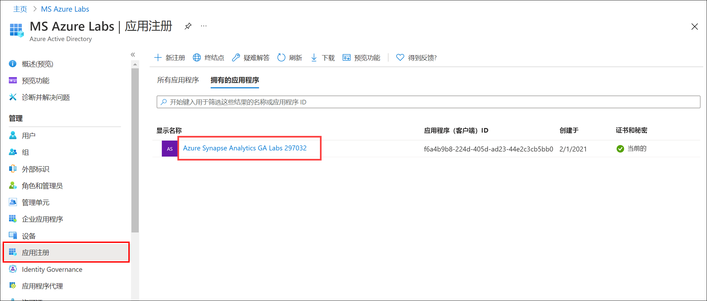

2. 选择应用程序以查看其属性，并复制 `Application (client) ID` 属性的值（稍后需要使用该值来配置链接服务）。

    

3. 要查看机密，请打开 Azure 门户并导航到已在资源组中创建的 Azure Key Vault 实例。选择 `Secrets` 部分后，应可看到 `ASA-GA-LABS` 机密：

    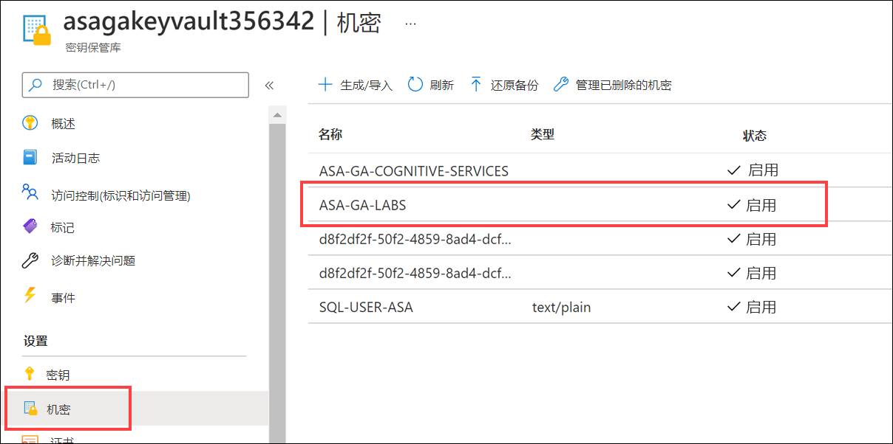

4. 首先，你需要确保服务主体有权使用 Azure 机器学习工作区。打开 Azure 门户并导航到已在资源组中创建的 Azure 机器学习工作区。选择左侧的 `Access control (IAM)` 部分，然后选择 `+ Add` 和 `Add role assignment`。在 `Add role assignment` 对话框中，依次选择 `Contributor` 角色、`Azure Synapse Analytics GA Labs SUFFIX`（其中 `SUFFIX` 是在实验室部署期间使用的唯一后缀）服务主体和 `Save`。

    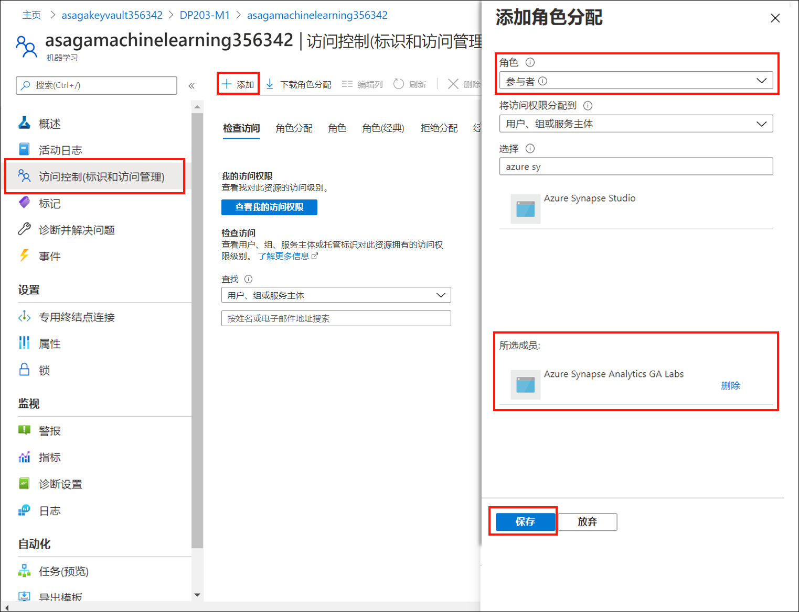

    你现在已准备好创建 Azure 机器学习链接服务。

1. 打开 Synapse Studio (<https://web.azuresynapse.net/>)。

2. 选择 **“管理”** 中心。

    

3. 选择 `Linked services`，然后选择 `+ New`。在 `New linked service` 对话框的搜索字段中输入 `Azure Machine Learning`。选择 `Azure Machine Learning` 选项，然后选择 `Continue`。

    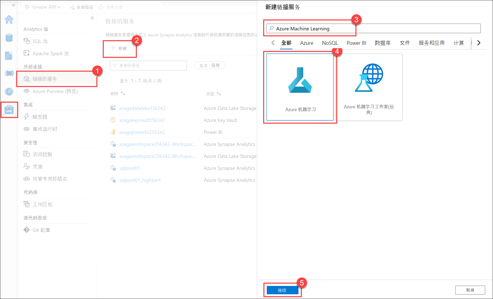

4. 在 `New linked service (Azure Machine Learning)` 对话框中，提供以下属性：

   - 名称：输入 `asagamachinelearning01`。
   - Azure 订阅：确保选择包含你的资源组的 Azure 订阅。
   - Azure 机器学习工作区名称：确保选择 Azure 机器学习工作区。
   - 请注意系统填充 `Tenant identifier` 的方式。
   - 服务主体 ID：输入之前复制的应用程序客户端 ID。
   - 选择 `Azure Key Vault` 选项。
   - AKV 链接服务：确保已选择 Azure Key Vault 服务。
   - 机密名称：输入 `ASA-GA-LABS`。

    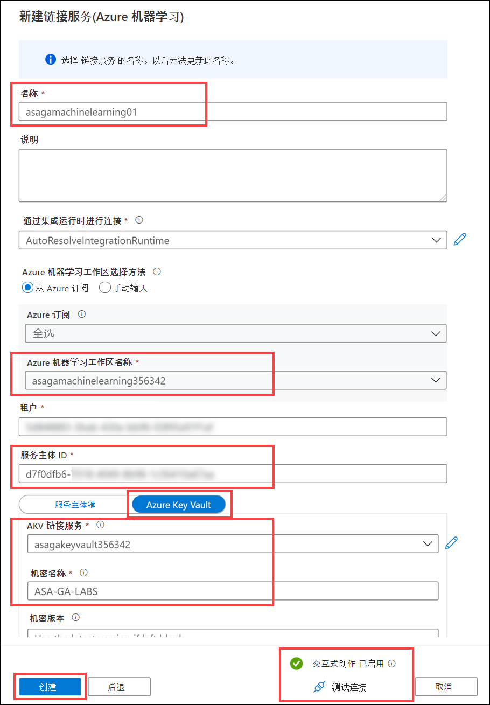

5. 接下来，选择 `Test connection` 以确保所有设置均正确，然后选择 `Create`。现在将在 Synapse Analytics 工作区中创建 Azure 机器学习链接服务。

    >**重要提示**
    >
    >直到将链接服务发布到工作区后，才算完成创建链接服务。请注意 Azure 机器学习链接服务旁的指示器。要发布链接服务，请选择 `Publish all`，然后选择 `Publish`。

    

### 任务 2：在 Synapse Studio 中探索 Azure 机器学习集成功能

首先，我们需要创建 Spark 表作为机器学习模型训练过程的起点。

1. 选择 **“数据”** 中心。

    

2. 选择 **“链接”** 选项卡

3. 在 `Azure Data Lake Storage Gen 2` 主帐户中，选择 `wwi-02` 文件系统，然后选择 `wwi-02\sale-small\Year=2019\Quarter=Q4\Month=12\Day=20191201` 下的 `sale-small-20191201-snappy.parquet` 文件。右键单击文件，然后选择 `New notebook -> New Spark table`。

    

4. 将 Spark 群集附加到笔记本，并确保将语言设置为 `PySpark (Python)`。

    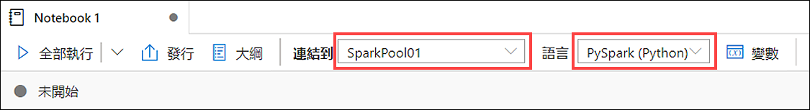

5. 将笔记本单元格的内容替换为以下代码，然后运行该单元格：

    ```python
    import pyspark.sql.functions as f

    df = spark.read.load('abfss://wwi-02@<data_lake_account_name>.dfs.core.windows.net/sale-small/Year=2019/Quarter=Q4/Month=12/*/*.parquet',
        format='parquet')
    df_consolidated = df.groupBy('ProductId', 'TransactionDate', 'Hour').agg(f.sum('Quantity').alias('TotalQuantity'))
    df_consolidated.write.mode("overwrite").saveAsTable("default.SaleConsolidated")
    ```

    >**备注**：
    >
    >将 `<data_lake_account_name>` 替换为 Synapse Analytics 主数据湖帐户的实际名称。

    该代码采用 2019 年 12 月可用的所有数据，在 `ProductId`、`TransactionDate` 和 `Hour` 级别聚合这些数据，计算出售出的产品总量 `TotalQuantity`。结果随后另存为名为 `SaleConsolidated` 的 Spark 表。若要查看 `Data` 中心包含的表，请展开 `Workspace` 部分中的 `default (Spark)` 数据库。你的表将显示在 `Tables` 文件夹中。选择表名称右边的三个点，查看上下文菜单中的 `Machine Learning` 选项。

    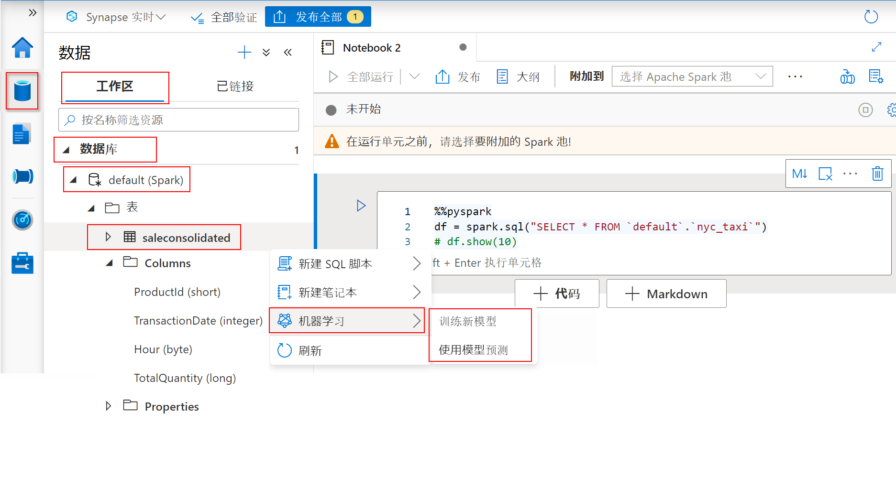

    `Machine Learning` 部分中提供了以下选项：

    - 使用新模型进行扩充：使你能够启动 AutoML 试验以训练新模型。
    - 使用现有模型进行扩充：使你能够使用现有 Azure 认知服务模型。

## 练习 2：触发使用 Spark 表中的数据的自动 ML 试验

在此练习中，你将触发自动 ML 试验的执行，并在 Azure 机器学习工作室中查看其进度。

### 任务 1：在 Spark 表上触发回归自动 ML 试验

1. 要触发新 AutoML 试验的执行，请选择 `Data` 中心，然后选择 `saleconsolidated` Spark 表右侧的 `...` 区域，以激活上下文菜单。

    

2. 从上下文菜单中，选择 `Enrich with new model`。

    

    通过 `Enrich with new model` 对话框，可以设置 Azure 机器学习试验的属性。请按照如下所示提供值：

    - **Azure 机器学习工作区**： 保持不变，应自动填充有 Azure 机器学习工作区名称。
    - **试验名称**： 保持不变，会自动建议一个名称。
    - **最佳模型名称**： 保持不变，会自动建议一个名称。保存此名称，以便稍后在 Azure 机器学习工作室中标识模型。
    - **目标列**： 选择 `TotalQuantity(long)` - 这是你要预测的功能。
    - **Spark 池**： 保持不变，应自动填充有 Spark 池名称。

    

    注意 Apache Spark 配置详细信息：

    - 要使用的执行程序数
    - 执行程序大小

3. 选择 `Continue`，以继续配置自动 ML 试验。

4. 接下来，将选择模型类型。在本例中，将选择 `Regression`，因为我们尝试预测连续数值。选择模型类型后，请选择 `Continue` 以继续。

    

5. 在 `配置回归模型` 对话框中，请按如下所示提供值：

   - **主要指标**： 保持不变，默认情况下建议使用 `Spearman correlation`。
   - **训练作业时间(小时)**： 设置为 0.25，以强制训练过程在 15 分钟后完成。
   - **最大并发迭代数**： 保持不变。
   - **ONNX 模型兼容性**： 设置为 `Enable` - 这非常重要，因为 Synapse Studio 集成试验当前仅支持 ONNX 模型。

6. 设置好所有值后，请选择 `Create run` 以继续。

    

    提交运行时，将弹出一条通知，指示你等待自动 ML 运行提交完毕。可通过选择屏幕右上部分的 `Notifications` 图标查看通知状态。

    

    成功提交运行后，将收到另一条通知，通知你自动 ML 试验运行的实际开始时间。

    

    >**备注**
    >
    >在`Create run` 选项旁，你可能注意到了`Open in notebook option`。通过选择此选项，你可以查看用于提交自动化 ML 运行的实际 Python 代码。作为练习，尝试重新执行此任务中的所有步骤，但不是选择`Create run`，而是`Open in notebook`。应会显示如下所示的笔记本：
    >
    >
    >
    >花费片刻时间通读所生成的代码。

### 任务 2：在 Azure 机器学习工作区工作区中查看实验室详细信息

1. 若要查看刚启动的试验运行，请打开 Azure 门户，选择资源组，然后选择资源组中的 Azure 机器学习工作区。

    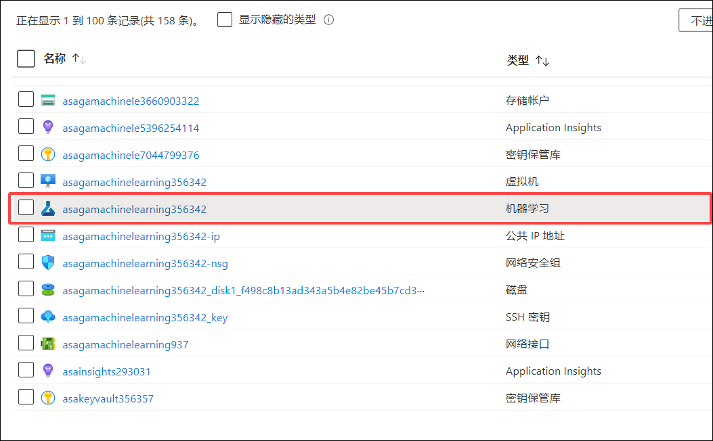

2. 找到并选择 `Launch studio` 按钮，以启动 Azure 机器学习工作室。

    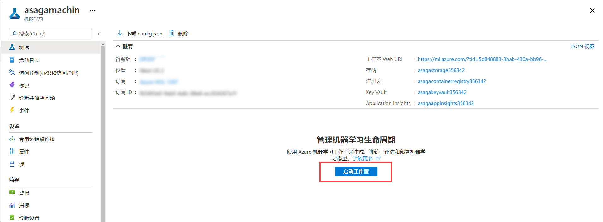

3. 在 Azure 机器学习工作室中，选择左侧的 `Automated ML` 部分，然后标识刚刚启动的试验运行。请注意试验名称、`Running status` 和 `local` 计算目标。

    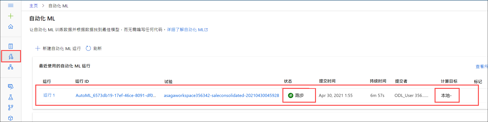

    你之所以看到计算目标是 `local`，是因为你正在 Synapse Analytics 内的 Spark 池上运行 AutoML 试验。从 Azure 机器学习的角度来看，你不是在 Azure 机器学习的计算资源上运行试验，而是在“本地”计算资源上运行。

4. 选择你的运行，然后选择 `Models` 选项卡，查看由该运行构建的模型的当前列表。模型按指标值（即本例中的  `Spearman correlation`）的降序排列，最佳模型排在首位。

    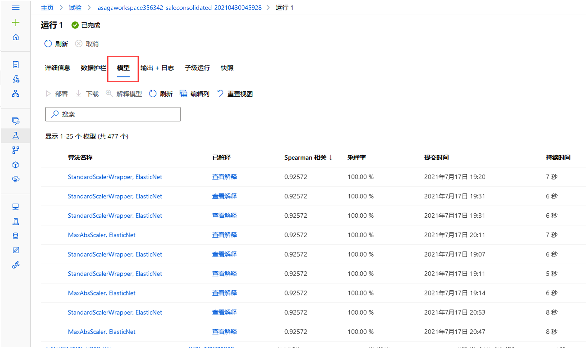

5. 选择最佳模型（列表中的第一个），然后单击 `View Explanations`，打开 `Explanations (preview)`选项卡以查看模型说明。

6. 选择 **“聚合特征重要性”** 选项卡。现在可看到输入功能的全局重要性。对于你的模型，对预测值影响最大的特征是 `ProductId`。

    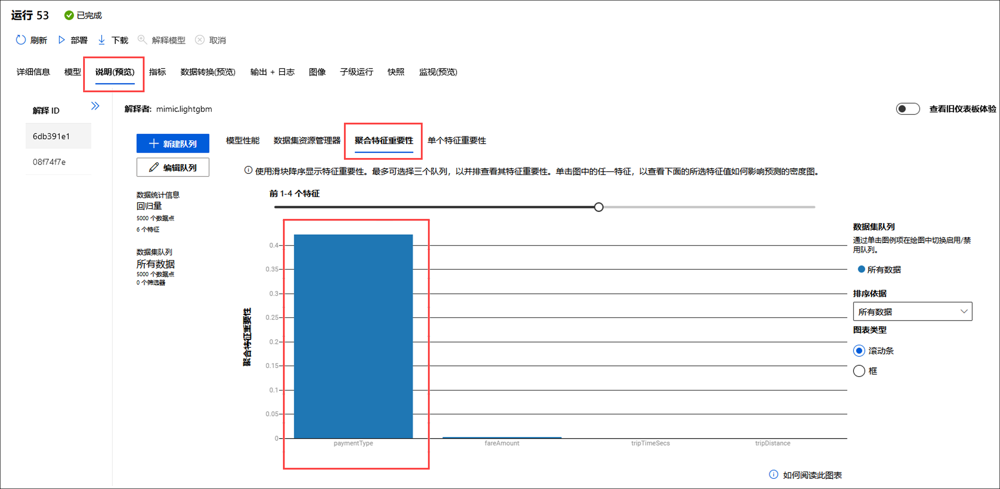

7. 接下来，选择 Azure 机器学习工作室中左侧的 `Models` 部分，查看向 Azure 机器学习注册的最佳模型。这可让你稍后在本实验室中引用该模型。

    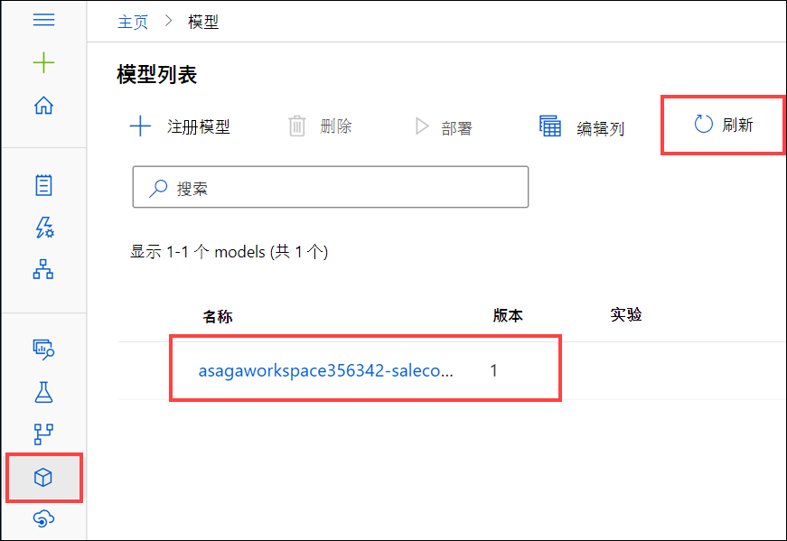

## 练习 3：使用经过训练的模型扩充数据

在此练习中，你将使用经过训练的现有模型对数据执行预测。任务 1 使用 Azure 机器学习服务中经过训练的模型，而任务 2 使用 Azure 认知服务中经过训练的模型。最后，需要将在任务 1 中创建的预测存储过程纳入 Synapse 管道中。

### 任务 1：使用 Azure 机器学习中经过训练的模型扩充 SQL 池表中的数据

1. 切换回 Synapse Studio，然后选择 **“数据”** 中心。

    

2. 选择 `Workspace` 选项卡，然后找到 `SQLPool01 (SQL)` 数据库（`Databases` 下）中的 `wwi.ProductQuantityForecast` 表。通过从表名称的右侧选择 `...` 来激活上下文菜单，然后选择 `New SQL script > Select TOP 100 rows`。该表包含以下列：

- **ProductId**：我们要预测的产品的标识符
- **TransactionDate**：我们要预测的未来日期
- **Hour**：我们要预测的未来日期的小时时间
- **TotalQuantity**：我们要预测的特定产品、天和小时的值。

    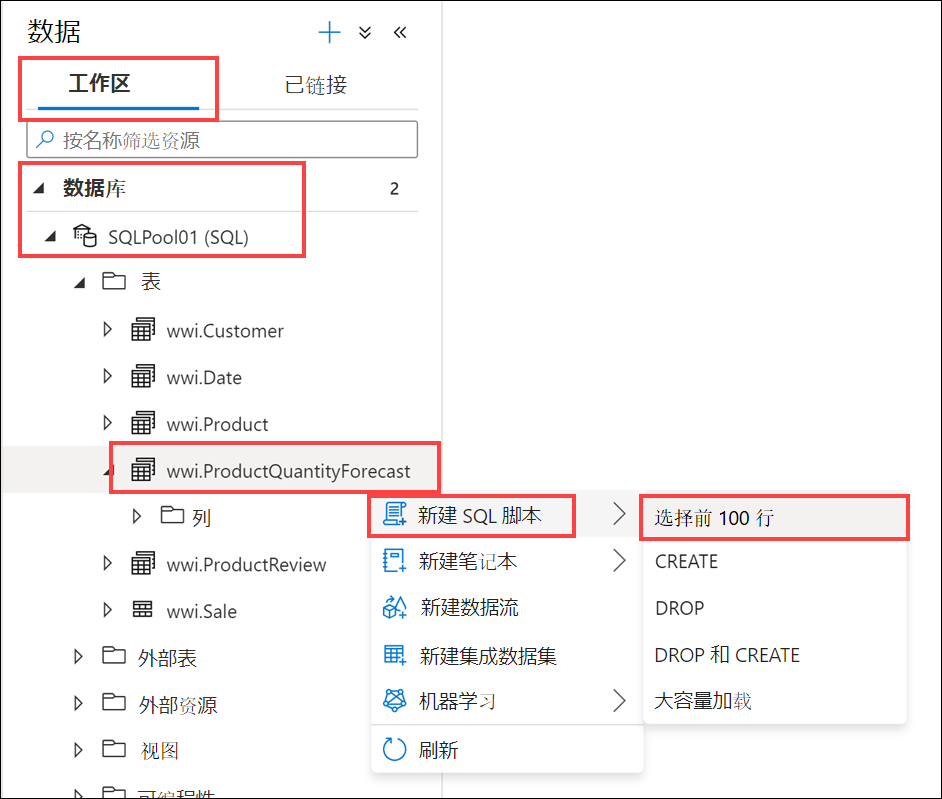

    > 请注意 `TotalQuantity` 在所有行中都为零，因为这是我们希望得到的预测值的占位符。

3. 要使用刚才在 Azure 机器学习中训练的模型，请激活 `wwi.ProductQuantityForecast` 的上下文菜单，然后选择 `Machine Learning > Enrich with existing model`。

    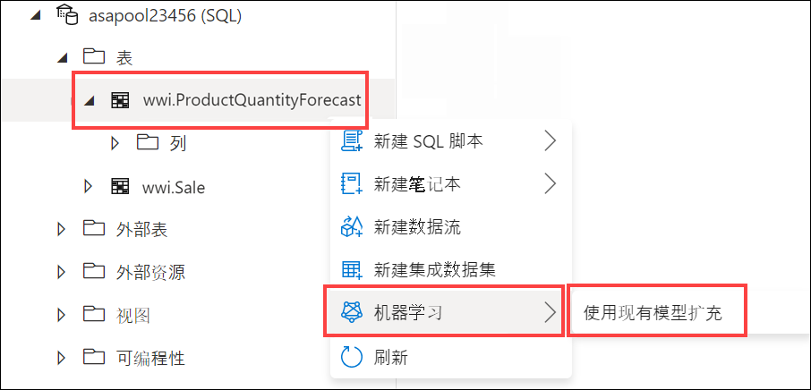

4. 这将打开 `Enrich with existing model` 对话框，你可在该对话框中选择你的模型。选择最近的模型，然后选择 `Continue`。

    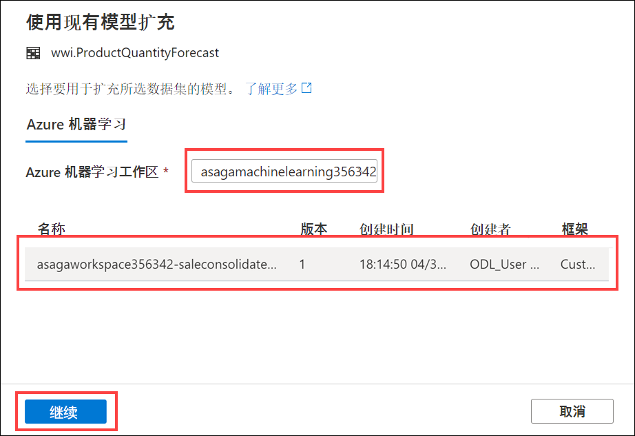

5. 接下来，你将管理输入和输出列映射。由于列名称来自目标表，且该表用于模型训练匹配，因此可保留默认建议的所有映射。选择 `继续` 以继续。

    

6. 最后一步向你展示用于为将执行预测的存储过程和将存储模型的序列化形式的表命名的选项。提供以下值：

   - **存储过程名称**： `[wwi].[ForecastProductQuantity]`
   - **选择目标表**：`Create new`
   - **新建表**： `[wwi].[Model]`

    选择 **“部署模型 + 打开脚本”**，将模型部署到 SQL 池中。

    

7. 从为你创建的新 SQL 脚本中，复制模型的 ID：

    

8. 生成的 T-SQL 代码将仅返回预测的结果，而不实际保存它们。要将预测结果直接保存到 `[wwi].[ProductQuantityForecast]` 表中，请将生成的代码替换为以下内容，然后执行脚本（在替换 `<your_model_id>` 后）：

    ```sql
    CREATE PROC [wwi].[ForecastProductQuantity] AS
    BEGIN

    SELECT
        CAST([ProductId] AS [bigint]) AS [ProductId],
        CAST([TransactionDate] AS [bigint]) AS [TransactionDate],
        CAST([Hour] AS [bigint]) AS [Hour]
    INTO #ProductQuantityForecast
    FROM [wwi].[ProductQuantityForecast]
    WHERE TotalQuantity = 0;

    SELECT
        ProductId
        ,TransactionDate
        ,Hour
        ,CAST(variable_out1 as INT) as TotalQuantity
    INTO
        #Pred
    FROM PREDICT (MODEL = (SELECT [model] FROM wwi.Model WHERE [ID] = '<your_model_id>'),
                DATA = #ProductQuantityForecast,
                RUNTIME = ONNX) WITH ([variable_out1] [real])

    MERGE [wwi].[ProductQuantityForecast] AS target  
        USING (select * from #Pred) AS source (ProductId, TransactionDate, Hour, TotalQuantity)  
    ON (target.ProductId = source.ProductId and target.TransactionDate = source.TransactionDate and target.Hour = source.Hour)  
        WHEN MATCHED THEN
            UPDATE SET target.TotalQuantity = source.TotalQuantity;
    END
    GO
    ```

    在以上代码中，确保将 `<your_model_id>` 替换为模型的实际 ID（在上一步中复制的 ID）。

    >**备注**：
    >
    >我们的存储过程版本使用 `MERGE` 命令在 `wwi.ProductQuantityForecast` 表中就地更新 `TotalQuantity` 字段的值。`MERGE` 命令最近已添加到 Azure Synapse Analytics。有关更多详细信息，请参阅 [Azure Synapse Analytics 的新 MERGE 命令](https://azure.microsoft.com/updates/new-merge-command-for-azure-synapse-analytics/)。

9. 现在，你已准备好对 `TotalQuantity` 列执行预测。替换 SQL 脚本，并运行以下语句：

    ```sql
    EXEC
        wwi.ForecastProductQuantity
    SELECT
        *
    FROM
        wwi.ProductQuantityForecast
    ```

    请注意 `TotalQuantity` 列中的值如何从零更改为非零预测值：

    

### 任务 2：使用 Azure 认知服务中经过训练的模型扩充 Spark 表中的数据

首先，我们需要创建 Spark 表作为认知服务模型的输入。

1. 选择 **“数据”** 中心。

    

2. 选择 `Linked` 选项卡。在 `Azure Data Lake Storage Gen 2` 主帐户中，选择 `wwi-02` 文件系统，然后选择 `wwi-02\sale-small-product-reviews` 下的 `ProductReviews.csv` 文件。右键单击文件，然后选择 `New notebook -> New Spark table`。

    

3. 将 Apache Spark 池附加到笔记本，确保 `PySpark (Python)` 是已选定的语言。

    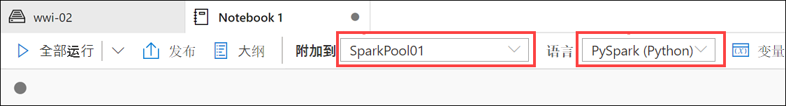

4. 将笔记本单元格的内容替换为以下代码，然后运行该单元格：

    ```python
    %%pyspark
    df = spark.read.load('abfss://wwi-02@<data_lake_account_name>.dfs.core.windows.net/sale-small-product-reviews/ProductReviews.csv', format='csv'
    ,header=True
    )
    df.write.mode("overwrite").saveAsTable("default.ProductReview")
    ```

    >**备注**：
    >
    >将 `<data_lake_account_name>` 替换为 Synapse Analytics 主数据湖帐户的实际名称。

5. 若要查看 `Data` 中心包含的表，请展开 `Workspace` 部分中的 `default (Spark)` 数据库。 **Productreview** 表将显示在 `Tables` 文件夹中。选择表名称右边的三个点，查看上下文菜单中的 `Machine Learning` 选项，然后选择 `Machine Learning > Enrich with existing model`。

    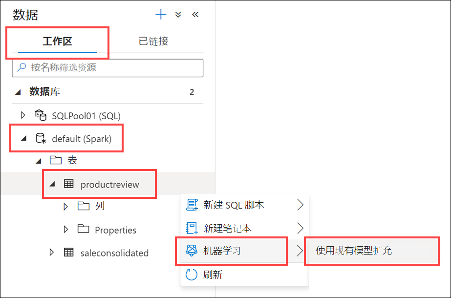

6. 在 `Enrich with existing model` 选项卡中，选择 `Azure Cognitive Services` 下的 `Text Analytics - Sentiment Analysis`，然后选择 `Continue`。

    

7. 接下来，请按照如下所示提供值：

   - **Azure 订阅**：选择资源组的 Azure 订阅。
   - **认知服务帐户**：选择已在资源组中预配的认知服务帐户。名称应为 `asagacognitiveservices<unique_suffix>`，其中 `<unique_suffix>` 在部署 Synapse Analytics 工作区时提供的唯一后缀。
   - **Azure Key Vault 链接服务**：选择已在 Synapse Analytics 工作区中预配的 Azure Key Vault 链接服务。名称应为 `asagakeyvault<unique_suffix>`，其中 `<unique_suffix>` 在部署 Synapse Analytics 工作区时提供的唯一后缀。
   - **机密名称**：输入 `ASA-GA-COGNITIVE-SERVICES`（包含指定认知服务帐户的密钥的机密名称）。

8. 选择 `继续` 以继续执行后续步骤。

    

9. 接下来，请按照如下所示提供值：

   - **语言**：请选择 `English`。
   - **文本列**：选择 `ReviewText (string)`

10. 选择 `打开笔记本`，查看生成的代码。

    >**备注**：
    >
    >通过运行笔记本单元格创建 `ProductReview` Spark 表时，便在笔记本上启动了 Spark 会话。使用 Synapse Analytics 工作区上的默认设置无法启动与该笔记本并行运行的新笔记本。
    需要将包含到认知服务集成代码的两个单元格的内容复制到该笔记本中，并在已启动的 Spark 会话上运行这些代码。复制这两个单元格后，应看到如下所示的屏幕：
    >
    >

    >**备注**：
    >要运行 Synapse Studio 生成的笔记本而不复制其单元格，可以使用 `Monitor` 中心的 `Apache Spark applications` 部分，你可在其中查看和取消正在运行的 Spark 会话。有关更多详细信息，请参阅[使用 Synapse Studio 监视 Apache Spark 应用程序](https://docs.microsoft.com/azure/synapse-analytics/monitoring/apache-spark-applications)。在本实验室中，我们使用了复制单元格的方法来避免花费额外的时间来取消正在运行的 Spark 会话和在此之后启动新会话。

    运行笔记本中的单元格 2 和 3，以获取数据的情绪分析结果。

    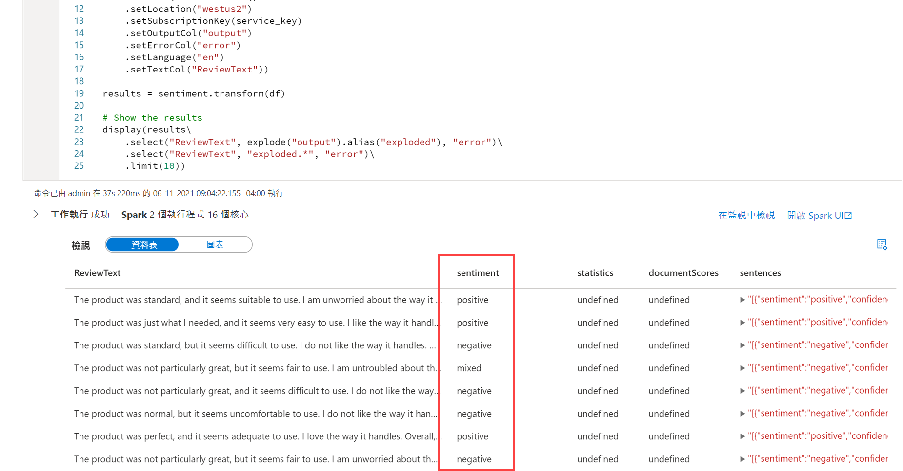

### 任务 3：在 Synapse 管道中集成基于机器学习的扩充过程

1. 选择 **“集成”** 中心。

    

2. 选择 **“+”**，然后选择 **“管道”**，以创建新的 Synapse 管道。

    

3. 在属性窗格中输入 `Product Quantity Forecast` 作为管道的名称，然后选择 **“属性”** 按钮以关闭窗格。

    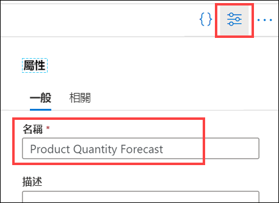

4. 在 `Move & transform` 部分中，添加 `Copy data` 活动，并将其命名为 `Import forecast requests`。

    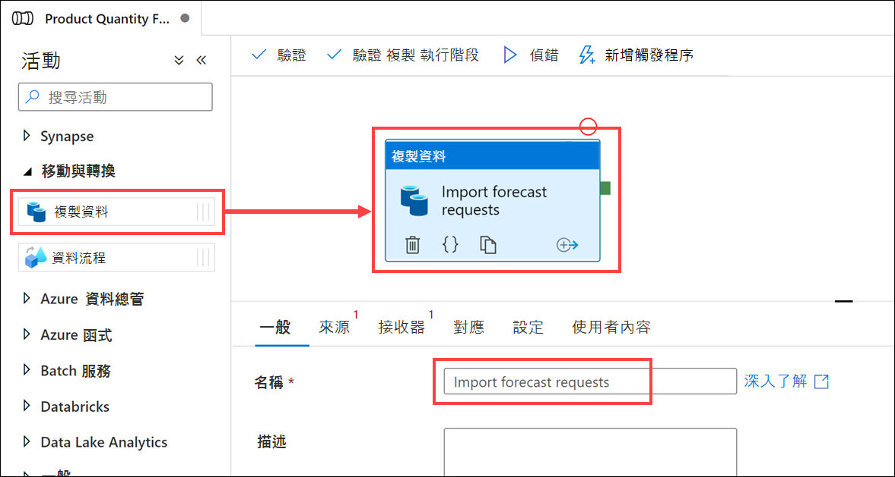

5. 在复制活动属性的 `Source` 部分中提供以下值：

   - **源数据集**：选择 `wwi02_sale_small_product_quantity_forecast_adls` 数据集。
   - **文件路径类型**：选择 `Wildcard file path`
   - **通配符路径**：在第一个文本框中输入 `sale-small-product-quantity-forecast`，在第二个文本框中输入 `*.csv`。

    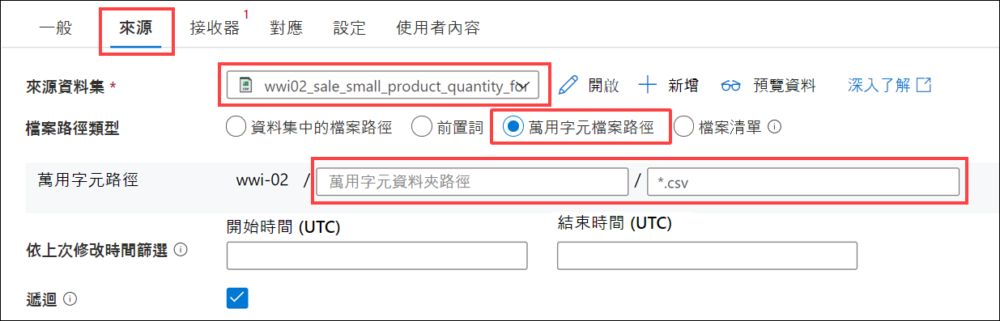

6. 在复制活动属性的 `Sink` 部分中提供以下值：

   - **接收器数据集**：选择 `wwi02_sale_small_product_quantity_forecast_asa` 数据集。

    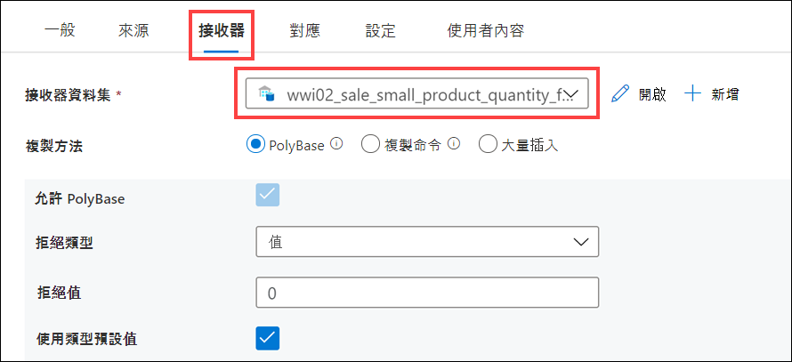

7. 在复制活动属性的 `Mapping` 部分，选择 `Import schemas`，查看源和接收器之间的字段映射。

    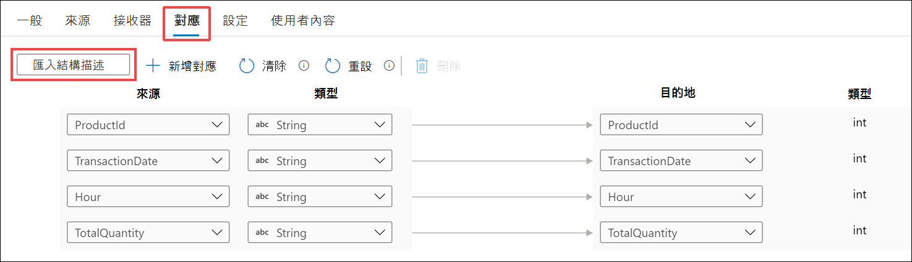

8. 在复制活动属性的 `Settings` 部分中提供以下值：

   - **启用暂存**：选择此选项。
   - **暂存帐户链接服务**：选择 `asagadatalake<unique_suffix>` 链接服务（其中 `<unique_suffix>` 是在部署 Synapse Analytics 工作区时提供的唯一后缀）。
   - **存储路径**：输入 `staging`。

    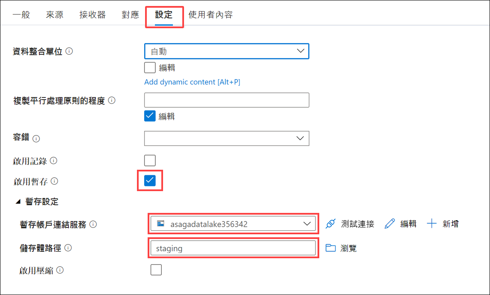

9. 在 `Synapse` 部分中，添加 `SQL pool stored procedure` 活动，并将其命名为 `Forecast product quantities`。连接这两个管道活动，确保存储过程在数据导入后运行。

    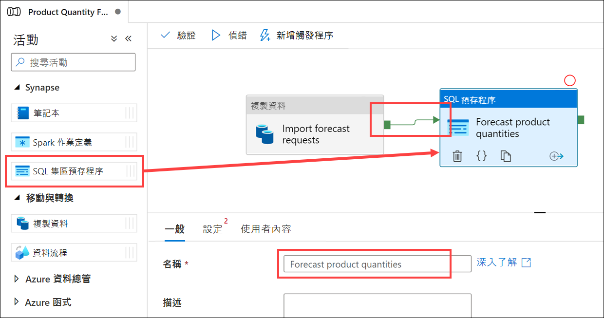

10. 在存储过程活动属性的 `Settings` 部分中提供以下值：

    - **Azure Synapse 专用 SQL 池**： 选择专用 SQL 池（例如 `SQLPool01`）。
    - **存储过程名称**：选择 `[wwi].[ForecastProductQuantity]`。

    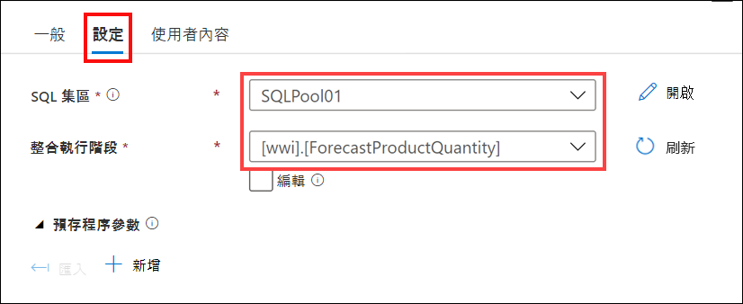

11. 选择 **“调试”**，确保管道正常运行。

    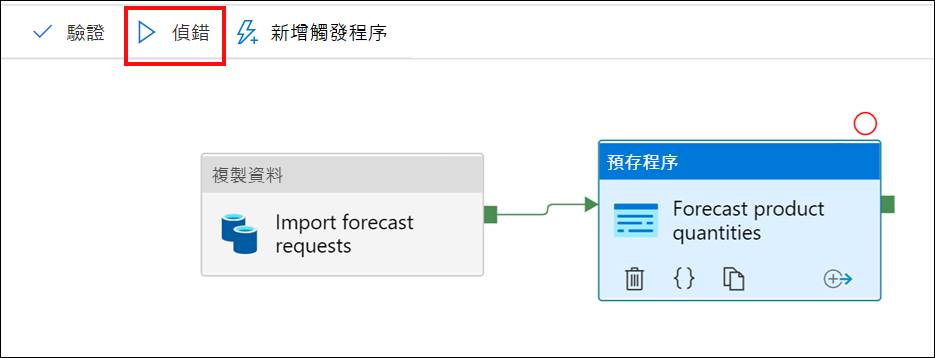

    管道的 **“输出”** 选项卡将显示调试状态。请等到两个活动的状态都为 `Succeeded`。

    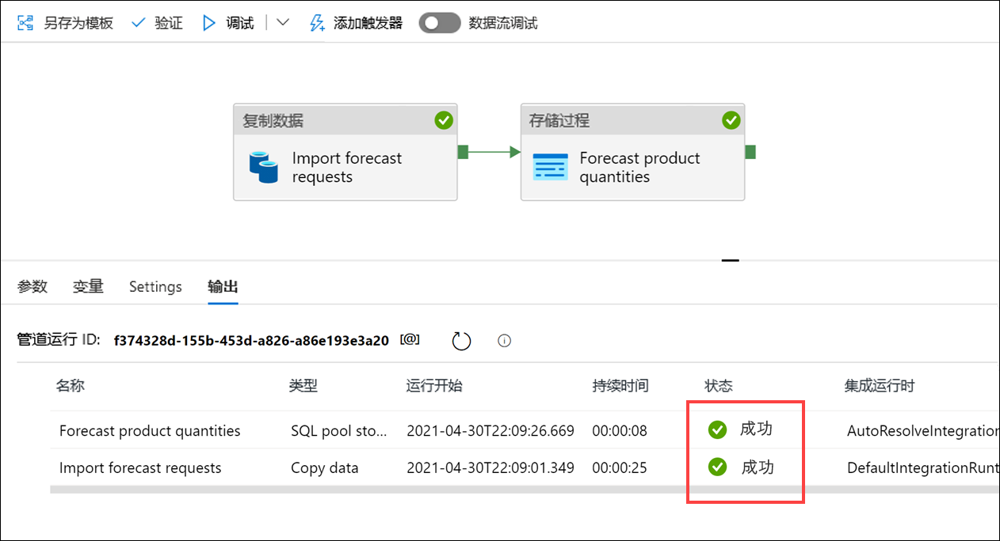

12. 选择 **“全部发布”**，然后选择 **“发布”** 以发布管道。

13. 选择 **“开发”** 中心。

    

14. 选择 **“+”**，然后选择 **“SQL 脚本”**。

    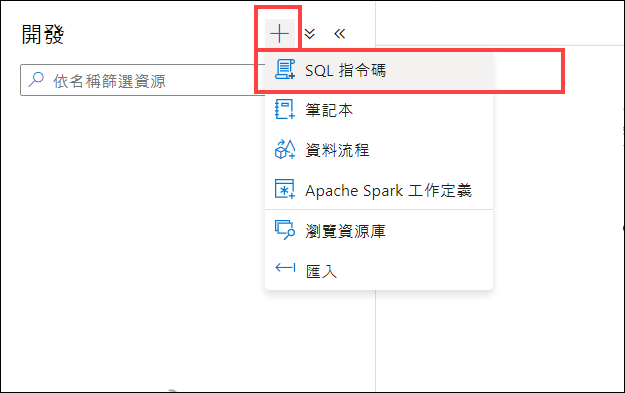

15. 连接到专用 SQL 池，然后执行以下脚本：

    ```sql
    SELECT  
        *
    FROM
        wwi.ProductQuantityForecast
    ```

    现在应可在结果中看到 Hour 的预测值为 11（对应于管道导入的行）：

    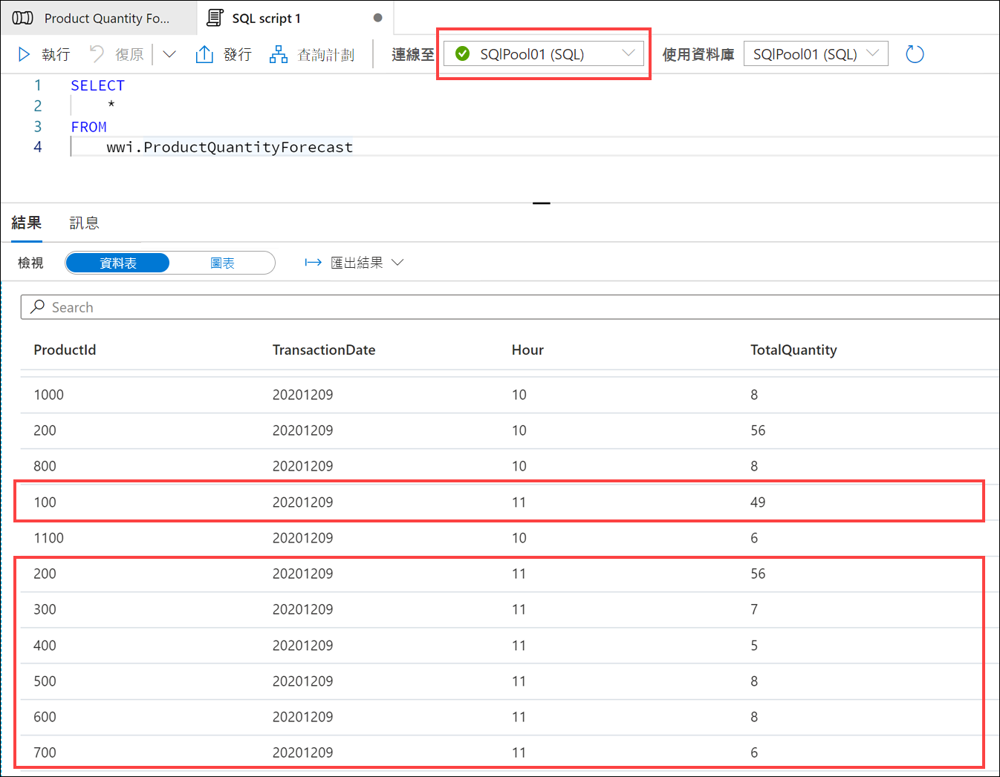

## 练习 4：使用 Power BI 提供预测结果

在此练习中，你将在 Power BI 报表中查看预测结果。还将通过新输入数据触发预测管道，并在 Power BI 报表中查看更新的数量。

### 任务 1：在 Power BI 报表中显示预测结果

首先，向 Power BI 发布简单的产品数量预测报表。

1. 从 GitHub 存储库中下载 `ProductQuantityForecast.pbix` 文件：[ProductQuantityForecast.pbix](ProductQuantityForecast.pbix)（在 GitHub 页上选择 `Download`）。

2. 使用 Power BI Desktop 打开该文件（忽略关于缺少凭据的警告）。此外，如果首先提示你更新凭据，请忽略该消息并关闭弹出窗口，无需更新连接信息。

3. 在报表的 `Home` 部分，选择 **“转换数据”**。

    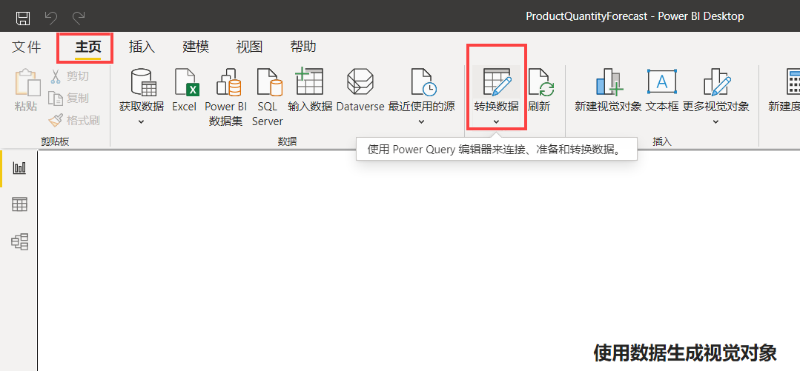

4. 在 `ProductQuantityForecast` 查询的 `APPLIED STEPS` 列表中，选择 `Source` 条目的 **“齿轮图标”**。

    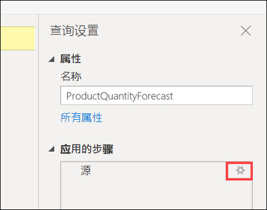

5. 将服务器的名称更改为 `asagaworkspace<unique_suffix>.sql.azuresynapse.net`（其中 `<unique_suffix>` 是 Synapse Analytics 工作区的唯一后缀），然后选择 **“确定”**。

    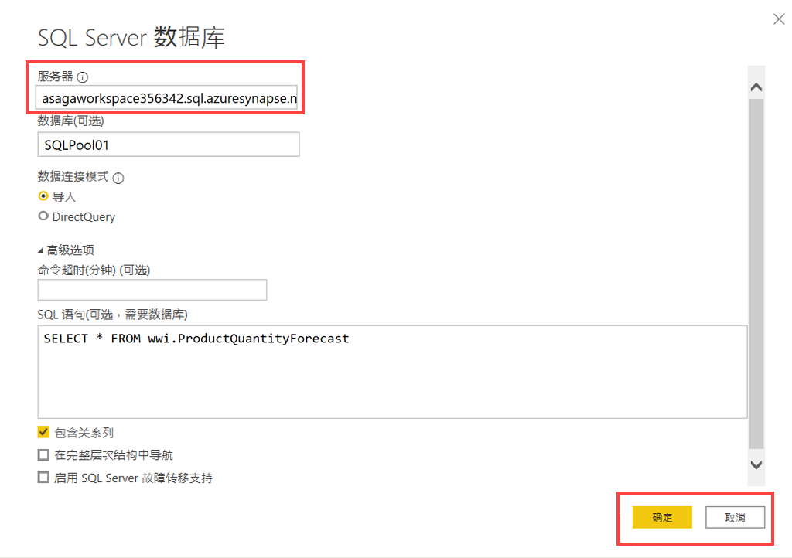

6. 凭据窗口随即弹出，提示你输入凭据以便连接到 Synapse Analytics SQL 池（如果没有弹出该窗口，请依次选择功能区上的 `Data source settings`、你的数据源、`Edit Permissions...` 和 `Credentials` 下的 `Edit...`）。

7. 在凭据窗口中，选择 `Microsoft account`，然后选择 `Sign in`。请使用你的 Power BI 帐户进行登录。

    

8. 登录后，请选择 **“连接”**，以建立到专用 SQL 池的连接。

    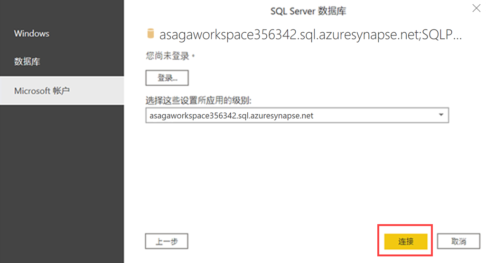

9. 关闭所有打开的弹出窗口，然后选择 **“关闭并应用”**。

    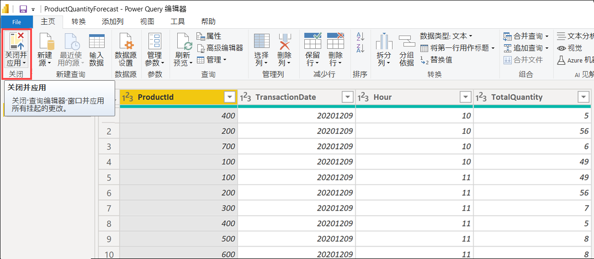

10. 加载报表后，选择功能区上的 **“发布”**。当系统提示选择是否保存更改时，请选择 **“保存”**。

    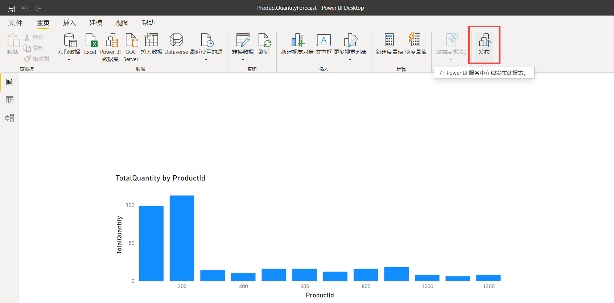

11. 出现提示时，输入用于本实验室的 Azure 帐户的电子邮件地址，然后选择 **“继续”**。出现提示时，输入密码，或从列表中选择用户。

    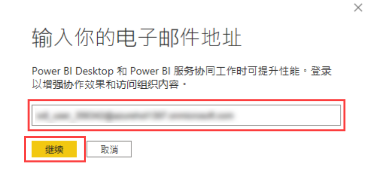

12. 选择为本实验室创建的 Synapse Analytics Power BI Pro 工作区，然后选择 **“保存”**。

    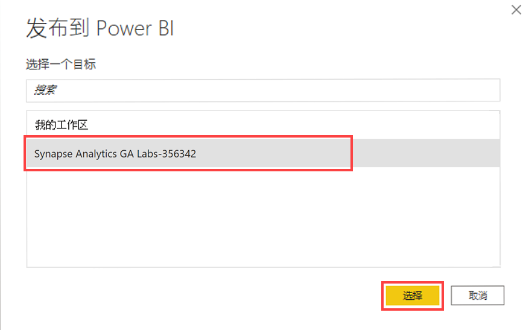

    等待发布成功。

    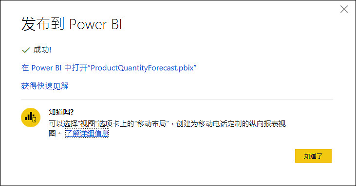

13. 在新的 Web 浏览器标签页中，导航到 <https://powerbi.com>。

14. 出现提示时，选择 **“登录”**，然后输入用于本实验室的 Azure 凭据。

15. 选择左侧菜单栏上的 **“工作区”**，然后选择为本实验室创建的 Synapse Analytics Power BI 工作区。这是你刚才发布到的同一个工作区。

    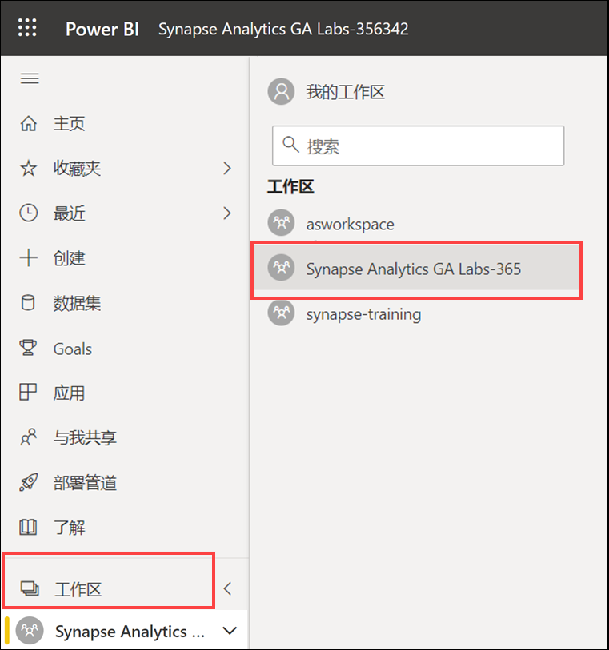

16. 在最顶部的菜单中选择 **“设置”**，然后选择 **“设置”**。

    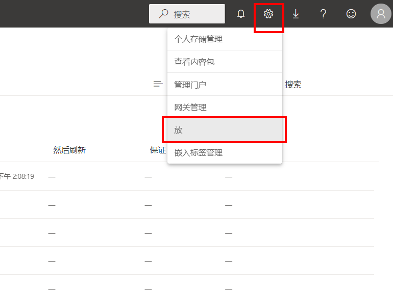

17. 选择 **“数据库”** 选项卡，然后选择 **“编辑凭据”**。

    

18. 选择 `Authentication method` 下的 **“OAuth2”**，然后选择 **“登录”**。出现提示时，请输入凭据。

    

19. 要查看报表的结果，请切换回 Synapse Studio。

20. 选择左侧的 `Develop` 中心。

    

21. 展开 `Power BI` 部分，然后从工作区的 `Power BI reports` 部分下选择 `ProductQuantityForecast` 报表。

    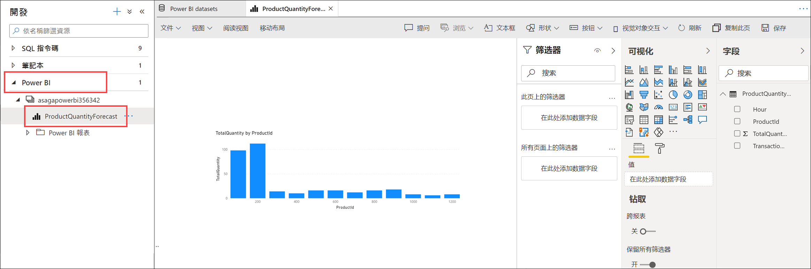

<!-- ### 任务 2：使用基于事件的触发器触发管道

1. 在 Synapse Studio 中，选择左侧的 **“集成”** 中心。

    

2. 打开 `Product Quantity Forecast` 管道。选择 **“+ 添加触发器”**，然后选择 **“新建/编辑”**。

    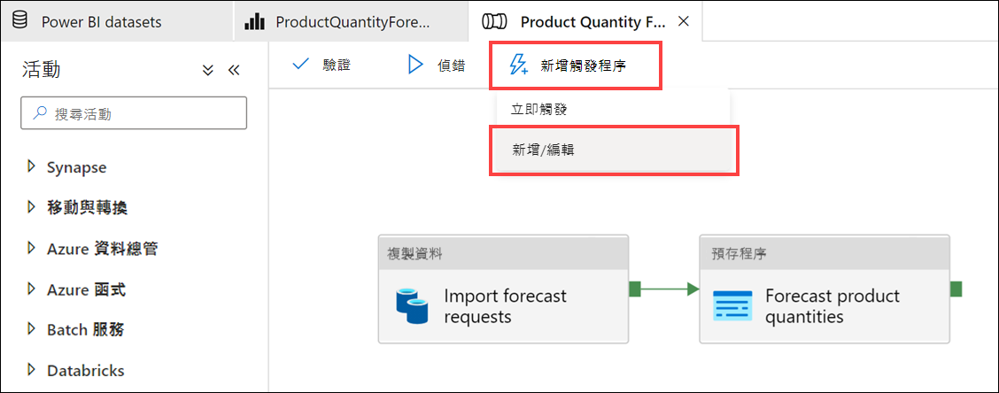

3. 在 `Add triggers` 对话框中，选择 **“选择触发器...”**，然后选择 **“+ 新建”**。

    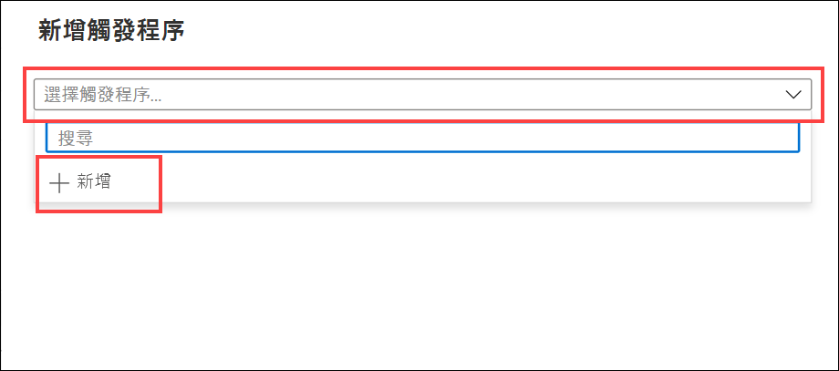

4. 在 `New trigger` 窗口中提供以下值：

   - **名称**：输入 `New data trigger`。
   - **类型**：选择 `Storage events`。
   - **Azure 订阅**：确保已选择正确的 Azure 订阅（包含你的资源组的 Azure 订阅）。
   - **存储帐户名称**：选择 `asagadatalake<uniqu_prefix>` 帐户（其中 `<unique_suffix>` 是 Synapse Analytics 工作区的唯一后缀）。
   - **容器名称**：选择 `wwi-02`。
   - **Blob 路径开头**： 输入 `sale-small-product-quantity-forecast/ProductQuantity`。
   - **事件**：选择 `Blob created`。

   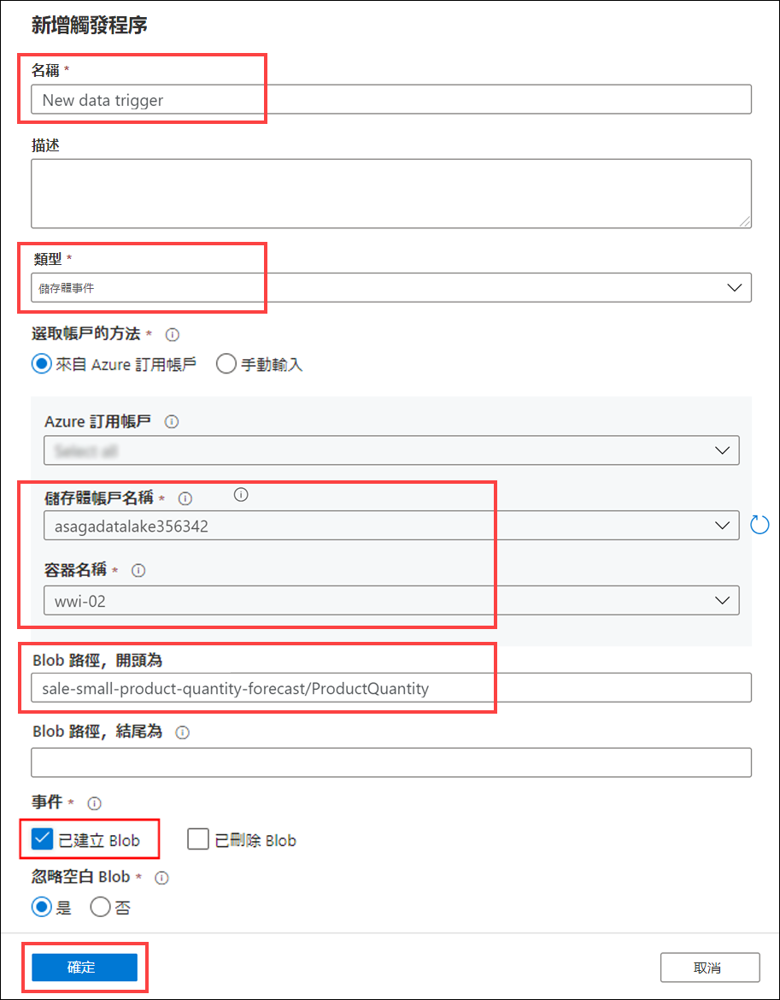

5. 选择 **“继续”** 以创建触发器，然后在 `Data preview` 对话框中再次选择 `Continue`，然后 `OK` 择两次 `OK` 以保存触发器。

    

6. 在 Synapse Studio 中，选择 `Publish all`，然后选择 `Publish` 以发布所有更改。

7. 从 https://solliancepublicdata.blob.core.windows.net/wwi-02/sale-small-product-quantity-forecast/ProductQuantity-20201209-12.csv 下载 `ProductQuantity-20201209-12.csv` 文件。

8. 在 Synapse Studio 中，选择左侧的 `Data` 中心，导航到 `Linked` 部分的主数据湖帐户，然后打开 `wwi-02 > sale-small-product-quantity-forecast` 路径。删除现有 `ProductQuantity-20201209-11.csv` 文件，然后上传 `ProductQuantity-20201209-12.csv` 文件。这将触发 `Product Quantity Forecast` 管道，从 CSV 文件导入预测请求，并运行预测存储过程。

9. 在 Synapse Studio 中，选择左侧的 `Monitor` 中心，然后选择 `Trigger runs`，以查看最新激活的管道运行。完成管道后，在 Synapse Studio 中刷新 Power BI 报表，以查看更新后的数据。 -->

## 练习 5：清理

完成以下步骤，释放不再需要的资源。

### 任务 1：暂停专用 SQL 池

1. 打开 Synapse Studio (<https://web.azuresynapse.net/>)。

2. 选择 **“管理”** 中心。

    

3. 在左侧菜单中，选择 **“SQL 池” (1)**。将鼠标悬停在专用 SQL 池的名称上，并选择 **“暂停” (2)**。

    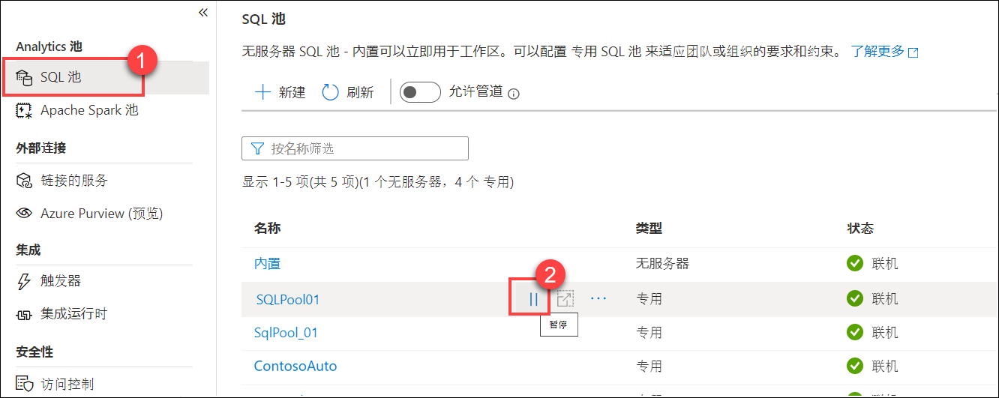

4. 出现提示时，选择 **“暂停”**。

    

## 资源

请使用以下资源详细了解本实验室中涵盖的主题：

- [快速入门：在 Synapse 中创建新的 Azure 机器学习链接服务](https://docs.microsoft.com/azure/synapse-analytics/machine-learning/quickstart-integrate-azure-machine-learning)
- [教程：用于专用 SQL 池的机器学习模型评分向导](https://docs.microsoft.com/azure/synapse-analytics/machine-learning/tutorial-sql-pool-model-scoring-wizard)
